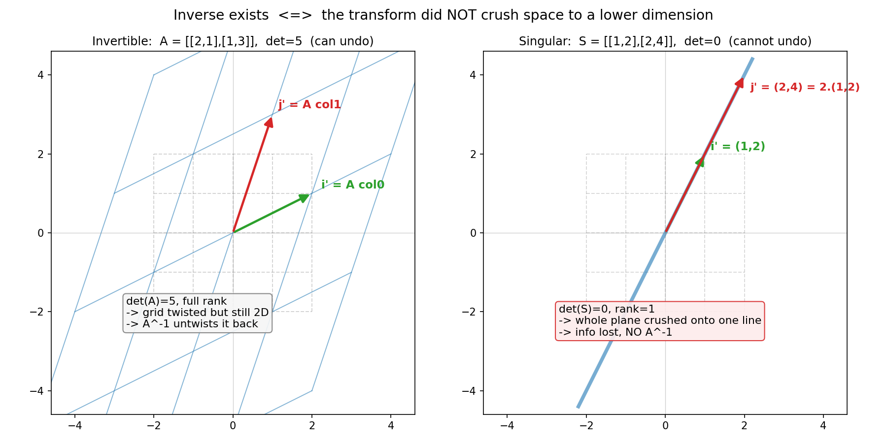

# 第 7 章 · 逆矩阵:这次揉捏,能不能撤销

> **核心问题**:一次揉捏做完之后,能不能"原路退回",把空间揉回它本来的样子?能撤销的,叫**可逆(invertible)**;不能撤销的,叫**奇异(singular)**。可逆这件事,不是代数上的巧,而是几何上一个朴素到不能再朴素的条件——**这次揉捏,有没有把空间压扁**。没压扁,信息全在,就能原路退回;压扁了,信息丢失,就再也回不去。
>
> 这一章还要认识一类最本分的角色:**初等矩阵(elementary matrix)**——每一次"最基本的单步揉捏"(换两行、把一行乘个倍数、把一行加到另一行),都对应一个初等矩阵。而任何可逆矩阵,都能被拆成一串初等矩阵的接龙。这给了"可逆"第二条判据,也给了我们一把**算逆**的利器(高斯消元)。
>
> **读完本章你会明白**:
> - 逆矩阵 `A⁻¹` 几何上到底在干什么——它是把被揉歪的网格**揉回方格**的那个"撤销键";代数上 `AA⁻¹ = A⁻¹A = I`。
> - 为什么"可逆 ⟺ 没压扁"——压扁意味着多个点被揉到了**同一个**点(多对一),信息丢失,撤销时无从判断该退回哪个,于是不可逆。这是"可逆 ⟺ 满秩 ⟺ det≠0"三句话能划等号的**几何根源**。
> - 为什么 `(AB)⁻¹ = B⁻¹A⁻¹`(倒序撤销)——像穿衣服"先穿的后脱",因为撤销必须**严格反向**。
> - 初等矩阵是什么——"最基本的一步揉捏";任何可逆矩阵 = 一串初等矩阵的接龙;高斯消元就是"把一个矩阵拆成基本揉捏"的过程。

> **如果一读觉得太难**:先只记住三件事——① `A⁻¹` 是 `A` 的撤销键,`AA⁻¹=I` 就是"揉过去再退回 = 什么都没做";② 能不能撤销,只看一件事:**A 有没有把空间压扁**(压扁了就回不去);③ 多个揉捏接龙的撤销要**倒着来**:`(AB)⁻¹ = B⁻¹A⁻¹`。三条钉死,本章就够本了。

---

## 章首·一句话点破

第 6 章结尾,我们留了那句话:

> 这次揉捏,能不能原路撤销?把空间揉回原样?能撤销的,叫可逆;不能撤销的,永远回不去。

一句话点破这一整章:

> **逆矩阵,是这次揉捏的"撤销键"——它把被揉歪的网格揉回方格。但这个撤销键存在的前提,是这次揉捏没有把空间压扁:压扁了,信息丢失,多对一,你无从判断该退回哪个点,于是不可逆。能撤销 ⟺ 没压扁,这就是全部。**

这句话是**结论**。本章倒过来拆:先看清"撤销键"在几何上长什么样,再挖"为什么压扁了就撤销不了"这个几何根源,接着把多个撤销的顺序问题(倒序)讲透,最后落到"任何可逆矩阵都能拆成一串基本揉捏"这条给计算铺路的结论。

---

## 一、撤销键:把被揉歪的网格揉回方格

第 1 章我们立了"矩阵 = 揉捏"这块地基,第 6 章把单次揉捏推到了"多次接龙"。现在问一个最自然的问题:**既然能揉,能不能"反着揉"——让一切复原?**

### 什么叫"复原"

> **比喻**:想象你把一张画满方格的橡皮膜揉歪了(比如沿 x 方向剪切、再放大一点)。现在你想找一个"反方向的动作",把这张歪掉的膜**原样揉回**那个最初的方格。这个"反方向的动作",就是逆矩阵 `A⁻¹`。

关键在于,这个"反方向动作"本身也是一次揉捏(也是线性变换)。所以它也有自己的说明书——也是一张矩阵。我们管这张矩阵叫 `A` 的**逆(inverse)**,记作 `A⁻¹`(读"A inverse")。

它满足什么?回到第 6 章"接龙"的语言:`A` 把空间揉歪,`A⁻¹` 把它揉回。**先揉歪、再揉回,等于什么都没做;先揉回、再揉歪,也等于什么都没做。** "什么都没做"的矩阵,叫**单位矩阵 `I`**(第 6 章见过,网格纹丝不动)。于是:

```
   A · A⁻¹  =  I          先 A 揉歪,  再 A⁻¹ 揉回  ->  等于没动
   A⁻¹ · A  =  I          先 A⁻¹ 揉回, 再 A 揉歪   ->  等于没动
```

这两条,就是逆矩阵的**定义**。

> **钉死这件事**:`A⁻¹` 是 `A` 的撤销键。`AA⁻¹ = A⁻¹A = I`——揉过去再退回,等于什么都没做。**注意这次它两边都能交换**(`AA⁻¹ = A⁻¹A`),这是少数几个矩阵能交换的情形——因为 `A` 和它的撤销键,本来就是"同一个动作的正反面",谁先谁后,合起来都是零操作。

### 几何上:把歪网格揉回方格

> **所以这样看**:`A⁻¹` 不是凭空冒出来的另一张数表,它的**几何使命**就是"把 `A` 揪歪的网格,原样揪回方格"。

举个具体例子。设:

```
       ┌       ┐
   A = │ 2  1 │       i 被搬到 (2,1),  j 被搬到 (1,3)
       │ 1  3 │
       └       ┘
```

`A` 这个揉捏,把方格扭成了一个**平行四边形网格**(还是二维的,没压扁——这一节先不碰压扁)。我们要找的 `A⁻¹`,就是把这张扭过的网格**揪回方格**的那个动作。numpy 一算:

```
   A⁻¹ = [[ 0.6, -0.2],
           [-0.2,  0.4]]
```

验证它是不是"撤销键":拿它和 `A` 乘,应当得到 `I`:

```
   A · A⁻¹ = [[2,1],[1,3]] · [[0.6,-0.2],[-0.2,0.4]]
            = [[2·0.6+1·(-0.2), 2·(-0.2)+1·0.4], [1·0.6+3·(-0.2), 1·(-0.2)+3·0.4]]
            = [[1, 0], [0, 1]]  =  I   ✓
```

揉歪再揉回,果然等于没动。**`A⁻¹` 的两列 `(0.6,-0.2)` 和 `(-0.2,0.4)`,就是"为了把歪网格揪回方格,i 和 j 这两根基向量必须各自被搬到哪"的地址。** 这就是逆矩阵的几何真身——和所有矩阵一样,它也是"基向量被搬去哪"的说明书,只不过这次搬的方向,恰好抵消 `A`。

> **不这样看会怎样**:如果你把 `A⁻¹` 当成"一张和 `A` 形状差不多、靠某种代数技巧(伴随矩阵、行列式)算出来的数表",那你永远只会在算式层面打转,既不知道它为什么这样算,也算完了心里没底。可一旦你把它看成"撤销键",那它的存在与否、它的长相,全都成了几何问题——下一节你会看到,正是因为"撤销"这件事在几何上有时根本做不到,逆矩阵才有时根本不存在。

---

## 二、可逆的几何条件:这次揉捏,有没有把空间压扁

这是本章的硬骨头,也是"会算不懂"的人最容易翻车的地方。

教材告诉你:"方阵可逆,当且仅当行列式不等于 0。" 你把这条背得滚瓜烂熟,做题也对。但**为什么是 det≠0?det=0 时,逆矩阵为什么不存在?它是不存在,还是只是"算不出来"?**

答案是:**它在几何上根本不存在,因为这次揉捏把空间压扁了,信息丢失,撤销无从谈起。** 行列式等于 0,只是这件事的一个数字信号。这一节,我们把"压扁 ⟹ 不可逆"这条因果链,一节一节挖到底。

### 先把直觉摆正:压扁了,就多对一

> **比喻**:拿一根棍子,把一张方格橡皮膜**整体往一条线上压**——所有竖向的格子被抹平,整个平面被压成一根一维的线。这种"从二维面被压成一维线"的动作,就叫**压扁(降维)**。

压扁有一个致命后果:**多个点,被压到了同一个点。** 想象膜上原本有两个点 `(1, 2)` 和 `(1, 5)`——它们 y 不同,x 相同。现在一个"只保留 x 坐标"的压扁变换,会把它们俩**都**送到 `(1, 0)`。**两个不同的输入,同一个输出。** 这种"多对一",是压扁的铁证。

而撤销要做什么?——给定一个输出,要还原出它**原本的**输入。可现在 `(1, 0)` 这个点,是从 `(1, 2)` 来的、还是从 `(1, 5)` 来的?**你无从判断。** 信息在压扁的那一刻就丢了。一个"多对一"的映射,**在数学上根本构造不出逆**——你没法为一个输出指定唯一的输入。

> **钉死这件事(可逆 ⟺ 没压扁的几何根源)**:逆矩阵要存在,这次揉捏必须是"一对一"的——每个输入送到唯一的输出,每个输出也对应唯一的输入。**压扁打破了"一对一",变成"多对一",于是逆不存在。** 这不是算不出来,是几何上根本不可能。

### 一个血淋淋的例子:秩 1 的 2×2 矩阵

看下面这张图,左是可逆变换,右是被压扁的变换。



**盯着右图看**。`S = [[1,2],[2,4]]` 这个揉捏,它的两列是 `(1,2)` 和 `(2,4)`——而 `(2,4) = 2·(1,2)`,**两根基向量被揉到了同一条线上**。这意味着整个平面,被揉完之后,所有的点都挤在这条 `y=2x` 的直线上。**二维面,被压成了一维线。**

现在任意拿一个点,比如 `(5, 10)`(它在这条线上)。它是从哪来的?可能来自 `(1, 2)`(原始坐标),也可能来自 `(2, 4)`、`(0, 0)`、`(100, 200)`……**无穷多个原始点,都被 `S` 压到了这条线上的某个位置,你无法区分。** 撤销时,你拿什么退回?退回哪一个?

numpy 验证给你看:`np.linalg.inv(S)` 直接抛错 `Singular matrix`(奇异矩阵)。**不是"算不出近似解",是"这个逆根本不存在"。** `det(S) = 0`,`rank(S) = 1`(满秩应是 2),两条数字信号都告诉你:压扁了。

### 三个判据,为什么能划等号

教材里那三条——**可逆 ⟺ 满秩 ⟺ det≠0**——你背得出来,但未必知道它们为什么能划等号。现在从"压扁"这一个几何事实出发,它们全部串起来了:

- **压扁 ⟺ 秩不满**:秩(第 10 章正式讲)是"揉捏后空间还剩几维"。满秩 2×2 = 揉完还是二维面;秩 1 = 揉成一维线;秩 0 = 揍成一个点。**压扁,就是秩从 2 掉到了 1 或 0,即不满秩。** 所以"可逆 ⟺ 满秩"。
- **压扁 ⟺ det=0**:行列式(第 9 章正式讲)是"揉捏后面积的缩放比"。方格面积从 1 揉成 0,意味着这个平行四边形**退化成了一条线**——即压扁。所以"压扁 ⟺ det=0",于是"可逆 ⟺ det≠0"。
- **没压扁 ⟺ 一对一 ⟺ 可逆**:没压扁,每个点送到唯一的新点,每个新点也只对应一个旧点——这就是"一对一",撤销就能唯一地退回。

> **钉死(本章最核心的一句话)**:可逆、满秩、det≠0,这三件事之所以能划等号,是因为它们**从三个角度描述同一个几何事实——这次揉捏没有把空间压扁**。可逆 = 能撤销 = 一对一;满秩 = 揉完维度没掉;det≠0 = 揉完面积没归零。**三个数字判据,一个几何根源:没压扁。**

> **(P3 回扣,一句话带过)**:第 9 章(行列式)、第 10 章(秩)会正式把 det 和秩拆开讲透。本章你只需记住:它们都是"压扁与否"的不同度量。别在 det=0 不可逆上多花笔墨——根子在这里。

### 那非方阵呢(顺手澄清一个误区)

有人会问:一个 2×3 的矩阵(把三维空间揉到二维平面),它"压扁了"吗?它可逆吗?

**它确实压扁了**(三维到二维,维度掉了),但更要紧的是——**逆矩阵这个概念,对方阵才有意义**。因为 `A⁻¹` 要满足 `AA⁻¹ = I` 和 `A⁻¹A = I`,而 `I` 必须是方的;一个 2×3 的 `A`,它的"撤销"严格说不是 `A⁻¹`,而要分两个不同的概念:**右逆**(把二维结果拉回三维,但不唯一)和**左逆**(不存在——三维已被压成二维、信息丢了,没法还原成三维单位阵)——这些是第 11 章(四个子空间)和第 19 章(SVD)的内容。本章我们只谈**方阵**的逆。一句话:非方阵谈不上 `A⁻¹`,因为它天生就改变了维度。

---

## 三、多个撤销:倒序,像穿衣服"先穿的后脱"

第 6 章我们讲了"接龙":`A·B` 是先 B 后 A。现在接龙做完了,要撤销——怎么撤?

> **比喻**:穿衣服。早上你**先穿内衣、再穿衬衫、最后穿外套**。晚上脱衣服,你得**倒过来:先脱外套、再脱衬衫、最后脱内衣**。绝不可能先脱内衣——它在最里头,脱不下来。

接龙的撤销,一模一样。如果总揉捏是 `A·B`(先 B 后 A),那撤销它,必须**严格反向**:先撤销 A、再撤销 B。翻译成矩阵语言:

```
   (A·B)⁻¹  =  B⁻¹ · A⁻¹
```

**注意顺序翻了**:`AB` 是先 B 后 A,但 `(AB)⁻¹` 是 `B⁻¹A⁻¹`(先 `A⁻¹` 后 `B⁻¹`)。这就是"倒序撤销"。

### 为什么必须倒序(几何妙解)

回到第 6 章那句钉死的话:**后一个动作,是在前一个动作改过的空间上执行的。** 撤销时,这个先后依赖**反过来咬住你**:

- `AB` 是先 B 后 A:A 抓的是 B 改过的空间。
- 撤销时,你必须**先撤掉 A**(最外层、最后做的那个),才能回到 B 改过的空间;**再撤掉 B**,才能回到原始空间。

如果反过来——先撤 B——会发生什么?B 撤销要的是"B 改过的空间",可现在空间是 `AB` 共同改过的,B 撤销的那个动作,抓错了地基,**根本对不上**。就像你没法在穿着外套的时候脱内衣一样。

> **钉死(倒序撤销的几何根源)**:`(AB)⁻¹ = B⁻¹A⁻¹`,因为撤销必须**严格反向**地一层层剥。最外层的动作最后做的,撤销时最先撤;最里层的动作最先做的,撤销时最后撤。**这和穿衣服、装套娃、洋葱剥皮是同一件事——后进先出。**

拿数字验一下,踏实。设 `A = [[2,1],[1,3]]`,`B = [[1,1],[0,1]]`(剪切):

```
   AB = [[2,1],[1,3]] · [[1,1],[0,1]] = [[2, 3], [1, 4]],  det(AB) = 5
   (AB)⁻¹ = (1/5) · [[4,-3],[-1,2]] = [[0.8,-0.6],[-0.2,0.4]]

   B⁻¹ = [[1,-1],[0,1]]   (剪切的逆 = 反向剪切)
   A⁻¹ = [[0.6,-0.2],[-0.2,0.4]]
   B⁻¹ · A⁻¹ = [[1,-1],[0,1]] · [[0.6,-0.2],[-0.2,0.4]]
             = [[0.6-(-0.2), -0.2-0.4], [-0.2, 0.4]]
             = [[0.8, -0.6], [-0.2, 0.4]]   ✓  正好是 (AB)⁻¹
```

`(AB)⁻¹ = B⁻¹A⁻¹`,铁证。numpy 一行 `np.linalg.inv(A@B)` 和 `np.linalg.inv(B) @ np.linalg.inv(A)` 完全相等。

> **(深度一笔,串到第 9 章)**:把"倒序撤销"和"行列式"放一起,有个漂亮的推论。`det(AB) = det(A)·det(B)`——两次揉捏的面积胀缩,是各自胀缩的乘积。现在让 `B = A⁻¹`:`AA⁻¹ = I`,而 `det(I) = 1`,于是 `det(A)·det(A⁻¹) = 1`,即 **`det(A⁻¹) = 1/det(A)`**。**撤销键的"面积缩放比",是原揉捏缩放比的倒数**——揉胀了 5 倍,撤销就缩回 1/5。几何上严丝合缝。这条,第 9 章行列式会正式收。

---

## 四、初等矩阵:最基本的一步揉捏

讲完"撤销键"和"压扁",我们认识一类最本分的角色——它既是"可逆"的最小单元,也是**算逆矩阵**的钥匙:**初等矩阵(elementary matrix)**。

### 三种"最基本的单步揉捏"

回忆你做线性方程组时那三种"初等行变换":

1. **交换两行**(`R1 ↔ R2`)。
2. **把某一行乘一个非零倍数**(`R1 ← c·R1`)。
3. **把某一行加到另一行上**(`R1 ← R1 + k·R2`)。

这三种操作,你以为是"在数表上做体操"。可**每一种,都是一个矩阵**——而且都是一个**可逆的、最简单的线性变换**。它们就是"最基本的单步揉捏",叫**初等矩阵**。

> **比喻**:初等矩阵是揉捏世界的"原子"。任何复杂的揉捏,都能被拆成一连串这种最简单的单步动作——就像任何化学反应,都能拆成一连串最基本的原子重组。

三种初等矩阵(以 2×2 为例),你立刻就能"看见":

**① 交换两行** `E_swap = [[0,1],[1,0]]`——把 i 和 j 对调(整个空间沿 y=x 这条线翻转一下)。它的逆?**还是它自己**——再翻一次就回来了。`E_swap · E_swap = I`。

**② 把某行乘 c 倍** `E_scale = [[c,0],[0,1]]`——沿 x 方向拉长(或压缩)c 倍。它的逆是 `[[1/c,0],[0,1]]`——**沿 x 缩回 1/c**。

**③ 把一行加到另一行** `E_shear = [[1,k],[0,1]]`——沿 x 方向剪切 k 格(第 6 章见过)。它的逆是 `[[1,-k],[0,1]]`——**反向剪切 k 格**。

> **钉死(初等矩阵 = 最基本的一步揉捏)**:每一个初等行变换,都等价于"左乘一个初等矩阵"。而每一个初等矩阵,**都是一个可逆的、最简单的线性变换**——它的逆,就是把这一步"反着做"(再交换一次、除回去、反向剪)。

### 为什么初等矩阵的逆那么好算

注意上面三件事有个共同点:**初等矩阵的逆,几乎不用算,一眼就能写出来**——交换的逆是自己,缩放的逆是除回去,剪切的逆是反着剪。

> **所以这样看**:初等矩阵之所以"本分",不仅因为它简单,还因为**它的撤销键同样简单**。这就给了我们一把算任意可逆矩阵的逆的钥匙——下一节。

### 高斯消元:把一个矩阵拆成一串基本揉捏

现在,把第 6 章"接龙"和本章"初等矩阵"合起来,会浮出一个深刻的结论:

> **任何可逆矩阵,都能写成"一串初等矩阵的接龙"。**

为什么?因为高斯消元。你做线性方程组时,把一个矩阵 `A` 通过初等行变换,一步步化成单位矩阵 `I`:

```
   A  --(E1)-->  ···  --(Ek)-->  I
```

每一步 `--(Ei)-->`,就是左乘一个初等矩阵 `Ei`。所以整个过程是:

```
   Ek · ··· · E2 · E1 · A  =  I
```

把这个等式两边同时"撤销"那些 `E`(用它们的逆,倒着乘回去),就得到:

```
   A  =  E1⁻¹ · E2⁻¹ · ··· · Ek⁻¹
```

**也就是说,`A` 本身,就是一串(初等矩阵的逆)的接龙。** 而"初等矩阵的逆还是初等矩阵",所以:**任何可逆矩阵 = 一串初等矩阵的接龙。**

> **钉死(可逆的第二条几何判据)**:可逆矩阵,就是"能用一串基本揉捏(初等矩阵)拼出来"的矩阵。每一步基本揉捏都可逆,它们的接龙自然也可逆——倒着一个个撤销即可。**这给了"可逆"第二条路径:不是去算 det,而是去试"能不能用初等行变换把它化成 I"。能,就可逆;中途某一步卡住(出现全零行),就压扁了,不可逆。**

这条判据,也是**算逆矩阵的标准算法**:`[A | I]` 一起做初等行变换,把左边化成 `I` 时,右边就自动变成了 `A⁻¹`。原理就是上面这个等式——你对 `A` 做的所有 `Ei`,同时作用在了右边的 `I` 上,所以右边变成了 `Ek · ··· · E1 · I = A⁻¹`。**高斯消元求逆,本质是"把 A 拆成一串基本揉捏,然后倒着把每个基本揉捏的撤销键接龙起来"。**

> **(一句回扣)**:你看,这一节把第 6 章(接龙)和本章(撤销键)缝合了起来——**初等矩阵是接龙的最小单元,而求逆就是把这些最小单元倒着撤销**。线代的概念,从来不是孤立的。

---

## 计算佐证:拿张纸,亲手验一遍撤销键

这一节用纸笔 + numpy,把本章三个核心(逆的定义、压扁不可逆、倒序撤销)全验一遍。**不求难,只求你亲手摸一次"算式 = 几何"。**

### 1. 手算一个简单逆,验证 `AA⁻¹ = I`

取 `M = [[4,7],[2,6]]`。2×2 矩阵求逆有个口诀——**"主对角交换、副对角取负、整体除以行列式"**:

```
   det(M) = 4·6 - 7·2 = 24 - 14 = 10   (≠ 0,可逆)
   M⁻¹ = (1/10) · [[6, -7], [-2, 4]]
        = [[0.6, -0.7], [-0.2, 0.4]]
```

验证:

```
   M · M⁻¹ = [[4,7],[2,6]] · [[0.6,-0.7],[-0.2,0.4]]
            = [[4·0.6+7·(-0.2), 4·(-0.7)+7·0.4], [2·0.6+6·(-0.2), 2·(-0.7)+6·0.4]]
            = [[2.4-1.4, -2.8+2.8], [1.2-1.2, -1.4+2.4]]
            = [[1, 0], [0, 1]]  =  I   ✓
```

> **那个口诀的来历**(顺手点破,别死背):它就是 `M⁻¹ = (1/det) · adj(M)`——`adj(M)`(伴随矩阵)是"代数余子式"排成的表,对 2×2 恰好就是"主对角交换、副对角取负"。**几何上,除以 det 是把"缩放比"撤销(adj 那部分是旋转/剪切的撤销)**。第 9 章行列式会把这个 `1/det` 的来历讲透。

### 2. 验证"压扁了,逆不存在"

取奇异矩阵 `S = [[1,2],[2,4]]`:

```
   det(S) = 1·4 - 2·2 = 0
   rank(S) = 1   (两行成比例,第二行 = 2 × 第一行)
```

按口诀套 `M⁻¹ = (1/det)·adj`——**det=0,1/0 无意义**,逆算不出来。这不是"算式崩了",是几何上**逆根本不存在**:整个平面被压成 `y=2x` 一条线,无穷多个点挤到一起,撤销无从退回。

### 3. 验证倒序撤销 `(AB)⁻¹ = B⁻¹A⁻¹`

`A = [[2,1],[1,3]]`,`B = [[1,1],[0,1]]`(剪切)。用前面算好的 `A⁻¹=[[0.6,-0.2],[-0.2,0.4]]`,`B⁻¹=[[1,-1],[0,1]]`:

```
   AB = [[2,1],[1,3]] · [[1,1],[0,1]] = [[2,3],[1,4]],  det(AB)=5
   (AB)⁻¹ = (1/5)·[[4,-3],[-1,2]] = [[0.8,-0.6],[-0.2,0.4]]

   B⁻¹ · A⁻¹ = [[1,-1],[0,1]] · [[0.6,-0.2],[-0.2,0.4]]
             = [[0.8,-0.6],[-0.2,0.4]]   ✓
```

两边都是 `[[0.8,-0.6],[-0.2,0.4]]`。**倒序撤销成立**——因为它几何上就是"先脱外套(A)、再脱衬衫(B)"。

### 4. numpy:亲眼核对四件事

```python
import numpy as np
np.set_printoptions(precision=3, suppress=True)

A = np.array([[2., 1.], [1., 3.]])
B = np.array([[1., 1.], [0., 1.]])      # shear

# (1) inverse exists, A @ A^-1 = I
Ai = np.linalg.inv(A)
print("A^-1 ="); print(Ai)                      # [[ 0.6 -0.2] [-0.2 0.4]]
print("A @ A^-1 = I?"); print(A @ Ai)           # [[1. 0.] [0. 1.]]
print("A^-1 @ A = I?"); print(Ai @ A)           # [[1. 0.] [0. 1.]]

# (2) singular matrix: det=0, rank<full -> inv raises
S = np.array([[1., 2.], [2., 4.]])
print("det(S) =", np.linalg.det(S))             # 0.0
print("rank(S) =", np.linalg.matrix_rank(S))    # 1
try:
    np.linalg.inv(S)
except np.linalg.LinAlgError as e:
    print("inv(S) raises:", e)                  # Singular matrix

# (3) reverse-order: (AB)^-1 = B^-1 A^-1
AB_inv = np.linalg.inv(A @ B)
Binv_Ainv = np.linalg.inv(B) @ np.linalg.inv(A)
print("(AB)^-1 == B^-1 A^-1?", np.allclose(AB_inv, Binv_Ainv))   # True

# (4) elementary matrices and their inverses
E_swap  = np.array([[0., 1.], [1., 0.]])
E_scale = np.array([[3., 0.], [0., 1.]])        # scale row 1 by 3
E_shear = np.array([[1., 2.], [0., 1.]])        # R1 <- R1 + 2 R2
print("swap is its own inverse?", np.allclose(np.linalg.inv(E_swap), E_swap))   # True
print("scale^-1 =", np.linalg.inv(E_scale))     # [[1/3 0] [0 1]]
print("shear^-1 =", np.linalg.inv(E_shear))     # [[1 -2] [0 1]]

# (5) bonus: det(A^-1) = 1/det(A)
print("det(A^-1) =", np.linalg.det(Ai), " 1/det(A) =", 1/np.linalg.det(A))   # both 0.2
```

跑一遍,亲手看见:**`A@A⁻¹=I` 严丝合缝;`inv(S)` 直接抛 `Singular matrix`;`(AB)⁻¹` 和 `B⁻¹A⁻¹` 完全相等;三种初等矩阵的逆,一眼可写。** 这就是"撤销键"的全部算术证据。

---

## 章末小结

### 用"橡皮膜"比喻回顾本章

第 6 章结尾,我们问"这次揉捏,能不能原路撤销"。这一章,把"撤销键"一笔一笔讲清了:

1. **逆矩阵 `A⁻¹` 是 `A` 的撤销键**。它把被揉歪的网格揉回方格。`AA⁻¹ = A⁻¹A = I`——揉过去再退回,等于什么都没做。**注意它两边都能交换**,因为 `A` 和它的撤销键是"同一动作的正反面",谁先谁后合起来都是零操作。
2. **可逆的几何条件:没把空间压扁**。压扁 ⟹ 多对一 ⟹ 信息丢失 ⟹ 撤销无从退回 ⟹ 逆不存在。**可逆 ⟺ 满秩 ⟺ det≠0** 三条能划等号,因为它们都指向同一个几何事实——这次揉捏没把二维面揉成一维线(没降维)。
3. **多个撤销要倒序:`(AB)⁻¹ = B⁻¹A⁻¹`**。像穿衣服"先穿的后脱"——最外层最后做的,撤销时最先撤。根源是"后一个动作在前一个改过的空间上执行",撤销时这个先后依赖反过来咬住你。
4. **初等矩阵 = 最基本的一步揉捏**(交换 / 缩放 / 剪切)。任何可逆矩阵 = 一串初等矩阵的接龙(高斯消元证明)。这给了可逆第二条判据(能化成 `I` 就可逆),也给了算逆的标准算法(`[A|I]` 化简)。
5. **(深度)** `det(A⁻¹) = 1/det(A)`——撤销键的面积缩放比,是原揉捏缩放比的倒数。揉胀 5 倍,撤销缩回 1/5。几何严丝合缝。

### 本章在全书主线中的位置

记住本书的主线:**一切线代概念,都是"空间被揉捏"这件事的某个侧面。**

这一章,是"揉捏"的**撤销键**侧面。第 6 章把"一次揉捏"推到了"多次接龙",本章问的是接龙最自然的一个后续——**能不能倒带**。而答案竟然出奇地朴素:**能不能倒带,只看一件事——这次接龙,有没有把空间压扁。** 压扁是几何事件,可逆是它的代数翻译,det 和秩是它的两个度量信号。

- 第 9 章(行列式)会把"det=0 ⟺ 压扁"正式拆透——det 是面积缩放比,0 就是面积归零(退化成线)。
- 第 10 章(秩)会把"满秩 ⟺ 没降维"正式拆透——秩是揉捏后空间还剩几维。
- 第 11 章(四个子空间)会画出"压扁"的完整画像:哪些点被揉到一起(列空间)、哪些点被揉回原点(零空间)。**那里是"可逆"几何图景的高潮**——逆存在的条件,会变成"零空间只有原点一个点"。
- 第 13 章(对角化)用到 `A = PDP⁻¹`——`P⁻¹` 是这里的逆;第 18 章(基变换)的相似矩阵 `P⁻¹AP`,核心也是这个撤销键。

**没有本章把"撤销键"和"压扁 ⟹ 不可逆"讲透,后面相似变换、对角化、SVD 全没有立足点。** 本章是第 2 篇《矩阵即变换》从"揉捏的代数"走向"揉捏的可逆性"的关键一环。

### 五个"为什么"清单

如果你只能记五件事,记这五件:

1. **逆矩阵是什么**:`A` 的撤销键,把被揉歪的网格揉回方格。`AA⁻¹ = A⁻¹A = I`——揉过去再退回等于没做。**两边都能交换**,因为 `A` 和 `A⁻¹` 是同一动作的正反面。
2. **为什么压扁了就不可逆**:压扁 ⟹ 多对一(多个点挤到同一个点)⟹ 信息丢失 ⟹ 撤销时无从判断退回哪个 ⟹ 逆不存在。**可逆 ⟺ 满秩 ⟺ det≠0**,三条划等号,因为它们都指向"没压扁"这一个几何事实。
3. **为什么 `(AB)⁻¹ = B⁻¹A⁻¹`**:撤销必须严格反向——后做的先撤(像脱衣服先脱外套)。根源是"后一个动作在前一个改过的空间上执行",撤销时先后依赖反过来咬住你。
4. **初等矩阵是什么**:三种最基本的单步揉捏(交换 / 缩放 / 剪切),每个都对应一种初等行变换,每个的逆都一眼可写。**任何可逆矩阵 = 一串初等矩阵的接龙**(高斯消元证明)。
5. **算逆的两条路**:2×2 用口诀 `M⁻¹ = (1/det)·adj`("主换、副负、除 det");一般矩阵用高斯消元 `[A|I] → [I|A⁻¹]`——本质都是"把 A 拆成基本揉捏,再倒着撤销"。**det=0 时两条路都走不通,因为逆根本不存在。**

### 想继续深入,该往哪钻

- **看动画**:3Blue1Brown《线性代数的本质》"Inverse matrices, column space and null space"一集。它把"撤销键"和"压扁 ⟹ 不可逆"画成橡皮膜动画——本章文字没接住的,动画一定接得住。
- **亲手玩撤销**:上面的 numpy 代码,自己造一个可逆矩阵,算它的逆,验 `A@A⁻¹=I`;再造一个奇异矩阵(让两行成比例),看 `inv` 怎么抛错。改一晚上,你对"压扁 ⟹ 不可逆"会有肌肉记忆。
- **尝一口"撤销的代价"**:取 `A = [[1,1],[0,1e-10]]`(近似奇异,det 极小但不为 0)。算 `A⁻¹`,你会看到它的元素**大得吓人**。**几何上:这个揉捏把空间几乎压扁,撤销时要把"快被压没的维度"猛地撑回来,所以逆的元素巨大——这就是"数值上近似不可逆"的根源**,也是数值线代里"条件数(condition number)"的几何本质。这条线,会在第 11 章(四个子空间)和第 19 章(SVD)正式收。

---

> 撤销键立住了:`A⁻¹` 是 `A` 的反方向揉捏,`AA⁻¹=I`;能撤销 ⟺ 没压扁;多个撤销要倒序。可"揉捏"这出戏里,除了"能不能撤销",还有几类**长得特别规整**的揉捏——对称的、正交的、对角的——它们各自的撤销键有什么特别的性质(比如正交矩阵的逆就是它的转置,撤销 = 转回去)?翻开 **第 8 章 · 特殊矩阵速写**——你会发现,这几类"长得好看"的矩阵,各自是一种几何上特别干净的揉捏,而它们的逆,也都干净得像一句话。
