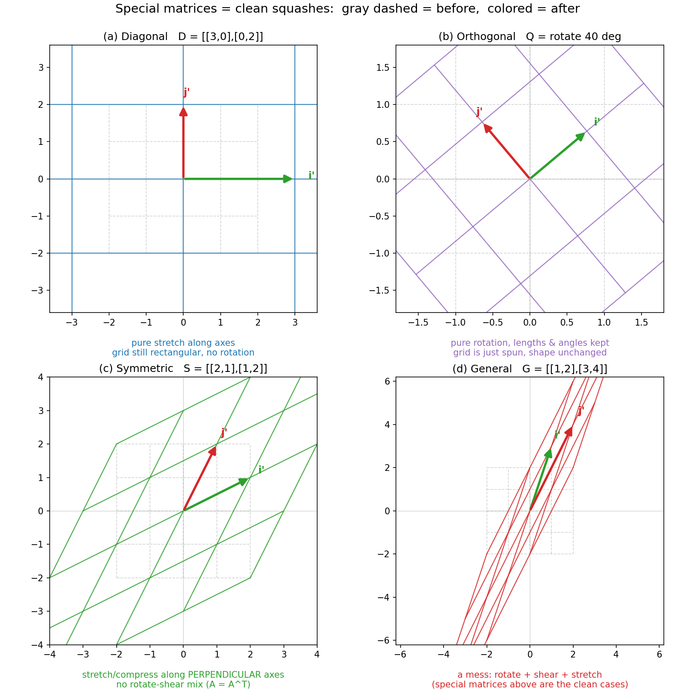

# 第 8 章 · 特殊矩阵速写:它们各是怎样的揉捏

> **核心问题**:第 7 章我们刚讲完"逆矩阵 = 揉捏的撤销键",顺手点了一句——**有几类矩阵,它们的撤销特别简单、几何也特别干净。** 这一章就专门把这几类矩阵揪出来:**对角矩阵、正交矩阵、对称矩阵**——它们各自对应着怎样一种"揉捏"?为什么它们在所有矩阵里显得格外规整、格外好处理?
>
> 这是第 2 篇《矩阵即变换》的收尾章。我们不再讲新机制,而是回头速写几张"特别漂亮的揉捏"的肖像——你会发现,前面那些抽象定义(`A=Aᵀ`、`QᵀQ=I`),每一条背后都藏着一个你能一眼看穿的几何动作。
>
> **读完本章你会明白**:
> - **对角矩阵**(只有对角线有数)是**最简单的一类揉捏**:沿坐标轴的纯拉伸,不转、不剪、不歪。它的逆、它的幂,都"各管各的"——好算到几乎是白送。
> - **正交矩阵**(列向量两两正交且都是单位长)是**最规整的一类揉捏**:纯旋转(或旋转加反射),保持一切长度和角度不变。最美的性质是——**它的逆就是它的转置** `Q⁻¹ = Qᵀ`,撤销一个旋转只需反过来转。
> - **对称矩阵**(`A=Aᵀ`)是**最协调的一类揉捏**:它把空间沿**互相垂直**的方向拉压,没有"歪斜旋转"的成分。本章只给这个直觉(它还有更深的优美性质,留给第 14 章)。
> - 以及一句话串起来:**对角=最简(纯拉伸),正交=最规整(纯旋转保长),对称=最协调(正交拉压)**——它们都是"特别干净的揉捏"。

> **如果一读觉得太多**:先只记住三件事——① 对角阵 = 沿轴纯拉伸,逆就是对角元取倒数;② 正交阵 = 纯旋转,逆 = 转置 `Q⁻¹ = Qᵀ`(这是本章最值钱的一句);③ 对称阵 `A=Aᵀ` 的几何是"沿垂直方向拉压、没有歪斜成分"。三条钉死,本章就够本了。

---

## 章首·一句话点破

第 7 章结尾,我们留了那句话:

> 有几类特殊矩阵,它们的"撤销"和几何,都简单到近乎白送。

一句话点破这一整章:

> **普通的矩阵,揉捏空间时又转、又剪、又拉——一团乱麻。但对角、正交、对称这三类矩阵,每一类都自我设了规矩,只允许"某一种干净的动作":对角只许沿轴拉,正交只许转不许拉,对称只许沿垂直方向拉压。规矩越严,几何越清,撤销越省事——所以它们才"特别"。**

这句话是**结论**,不是理由。本章倒过来拆:一类一类看,先看它在橡皮膜上干什么,再看它的算式为什么因此变得干净。每类**点到为止**——本章是"速写",不是"深挖"(那些真正深的性质,比如对称矩阵的实特征值、正交特征向量,是第 14 章的事,那时你才学过特征值)。

---

## 一、对角矩阵:沿坐标轴的纯拉伸

先出场的是最老实的一类:**对角矩阵(diagonal matrix)**。

它长这样——只有从左上到右下的那条主对角线上有数,其余全是 0:

```
       ┌       ┐
       │ 3  0 │
   D = │ 0  2 │
       └       ┘
```

按第 5 章那把铁律"矩阵的每一列 = 一根基向量的新去向"来读它的两列:

- 第一列 `(3, 0)`:i 被搬到了 `(3, 0)`——**还在 x 轴上,只是被拉长了 3 倍**。
- 第二列 `(0, 2)`:j 被搬到了 `(0, 2)`——**还在 y 轴上,只是被拉长了 2 倍**。

> **比喻**:对角矩阵,就是**伸出两只手,分别捏住橡皮膜的 x 方向和 y 方向,各自往外拽**——x 方向拽长 3 倍,y 方向拽长 2 倍。整个网格被拉成了"宽 3、高 2"的矩形格子,但**横竖线条依然横竖,没有一根线被拽歪**。

### 不这样看会怎样

如果你把对角矩阵只当成"一个对角线上有数的数表",那它的所有好处你都看不见:

- 你不知道它的逆为什么"就是对角元取个倒数";
- 你不知道它的幂 `Dⁿ` 为什么"就是对角元各自乘 n 次";
- 更要命的是,等将来碰到"对角化"(第 13 章)——把一个普通矩阵想办法变成对角阵——你会完全不懂图什么。**图的就是对角阵这股"各管各、不搅在一起"的清爽劲。**

### 所以这样看:对角阵 = 两个方向各自独立地拉伸,互不干扰

关键就在那个 **0**。对角线之外的 0,意味着:**x 方向的拉伸,完全不碰 y 方向;y 方向的拉伸,也完全不碰 x 方向。** 两个方向像两条平行车道,各开各的,谁也不挤谁。

> **钉死这件事**:对角矩阵 = **沿坐标轴的纯拉伸**,x 管 x、y 管 y,方向不混。正因为"不混",它的所有运算都能**拆成两个独立的一维小运算**——这是它一切简单性的根源。

#### 三个白送的好处

因为"各管各",对角矩阵几乎什么事都好算到不用动脑:

**① 求逆 = 对角元取倒数。**

```
   D   = [[3, 0],[0, 2]]        拉伸:x3、y2
   D⁻¹ = [[1/3, 0],[0, 1/2]]    撤销:x缩到1/3、y缩到1/2
```

撤销一个"x 拉 3 倍"的动作,当然就是"x 缩到 1/3"——每个方向自己撤销自己。numpy 验:`inv(D)` 正是 `[[0.333, 0],[0, 0.5]]`。

**② 求幂 = 对角元各自乘 n 次。**

```
   D² = [[3², 0],[0, 2²]] = [[9, 0],[0, 4]]      x方向连拉2次(3×3)、y方向连拉2次(2×2)
   D³ = [[27, 0],[0, 8]]                          3³ 和 2³
```

连拉 n 次,当然就是"拉 n 次那个倍数"——`3ⁿ` 和 `2ⁿ`。numpy 验:`matrix_power(D,3)` 正是 `[[27, 0],[0, 8]]`。

**③ 乘另一个对角阵 = 对角元对应相乘。**

两个"各管各的"拉伸接龙,还是"各管各的"——`[[3,0],[0,2]]` 接 `[[2,0],[0,4]]` = `[[6,0],[0,8]]`。x 方向 3×2=6,y 方向 2×4=8。

> **(深度一眼)** 对角阵还有一个隐藏的好处,先种下,第 13 章收:**任意一个"足够好"的方阵,只要换一副合适的基(换一副眼镜看同一个揉捏),都能变成对角阵**。也就是说,**再乱的揉捏,换对了视角,本质都是"沿某些方向各自拉伸"**。对角阵不是特例,它是"剥掉旋转和歪斜之后,揉捏的真身"。这,就是"对角化"的全部动机。

---

## 二、正交矩阵:纯旋转,长度角度一个都不动

第二类,是全书最美的一类矩阵——**正交矩阵(orthogonal matrix)**。

它的定义听起来很数学:列向量两两正交(互相垂直),而且每个列向量的长度都是 1。换句话说,它的列是一组**互相垂直的单位向量**。代数上等价于一个干净到极致的条件:

```
   Qᵀ Q  =  I         (Q 的转置 乘 Q,等于单位矩阵)
```

光看这个 `QᵀQ = I` 你可能无感。我们翻译成几何——它的列是什么意思?

> **比喻**:正交矩阵的每一列,是一根基向量被搬去的新位置。而"列两两正交 + 都是单位长",意思是——**搬完之后,新的 i' 和新的 j',依然像原来的 i、j 一样:互相垂直,且各自长度还是 1。**

这才是关键。原来 i、j 是两根"垂直的、各长 1"的尺子;正交矩阵揉完,i'、j' 还是"垂直的、各长 1"的尺子——**只是整体转了个方向**。一把尺子,形状没变,只是被拧了个角度。

> **钉死这件事**:正交矩阵 = **纯旋转(或旋转加反射),没有一丝拉伸**。它把空间整体转个方向,但**每一根箭头的长度、每一对箭头之间的角度,原封不动**。它是"只转不拉"的揉捏。

### 旋转还是反射:看行列式

正交矩阵分两种,看行列式就能分辨:

- `det(Q) = +1`:纯**旋转**(rotation)。比如逆时针转 90° 的 `[[0,-1],[1,0]]`,或转 40° 的旋转矩阵。
- `det(Q) = -1`:**旋转加一次反射**(reflection)。比如 `[[0,1],[1,0]]`(把 x 轴和 y 轴对调,相当于沿 45° 线翻一面),它依然守"长度角度不变",但把空间镜像翻转了。

两种都叫正交矩阵。本章重点讲旋转那种(det=+1),因为它最直观;你只需知道"det=-1 的那种多了一次翻面"即可。

### 最美的性质:正交矩阵的逆,就是它的转置

这是本章最值钱的一句话,也是回扣第 7 章逆矩阵的高光时刻:

> **对正交矩阵 `Q`,它的逆 `Q⁻¹` 等于它的转置 `Qᵀ`。** 即 `Q⁻¹ = Qᵀ`。

为什么?几何上一目了然:

- `Q` 是"转某个角度 θ"。
- 撤销它,就是"反过来转 θ"——也就是"转 -θ"。
- 而把旋转矩阵的角度取负,**恰好就等于把矩阵转置**(沿主对角线翻一下)。

**旋转的撤销 = 反着转,反着转 = 转置。** 三件事在几何上是同一件事。

> **不这样看会怎样**:对一般矩阵,求逆是个苦差事——要算伴随矩阵、除以行列式,手算一个 3×3 的逆能算半天。可对正交矩阵,**"求逆"变成了"把矩阵沿主对角线翻一下"——零计算、零成本**。不知道这条,你拿到一个旋转矩阵还在吭哧吭哧算逆,白白浪费力气。

代数上也对得上。正交矩阵的定义是 `QᵀQ = I`,而逆矩阵的定义是"`Q⁻¹` 是那个使 `Q⁻¹Q = I` 的矩阵"。两个一比——**让 `Qᵀ` 去当 `Q⁻¹`,正好满足定义**。所以 `Qᵀ` 就是 `Q⁻¹`,天造地设。

而且更进一步:既然 `QᵀQ = I`,两边也都是正交矩阵(`Q` 是,`Qᵀ` 也是),所以**反过来 `QQᵀ = I` 也成立**——这意味着 `Q` 不但从右边看可逆(右逆 = `Qᵀ`),从左边看也可逆(左逆也是 `Qᵀ`)。numpy 验:对一个 40° 旋转矩阵,`Q.T @ Q` 是 `I`,`Q @ Q.T` 也是 `I`,一字不差。

> **钉死(本章最该带走的一句)**:`Q⁻¹ = Qᵀ`。**正交矩阵的逆,免费用转置就能拿到**——因为旋转的撤销就是反着转,而反着转的矩阵恰好就是转置。这是线代里"几何直通算式"最漂亮的一个例子。**回扣第 7 章:逆矩阵是撤销键;而对正交矩阵,这个撤销键是现成的、不要钱的。**

---

## 三、对称矩阵:沿垂直方向的拉压,没有歪斜旋转的成分

第三类,**对称矩阵(symmetric matrix)**。定义朴素到让人意外:

```
   A  =  Aᵀ         (矩阵等于它自己的转置)
```

也就是,沿主对角线翻一下,矩阵不变。具体看一个:

```
       ┌       ┐
       │ 2  1 │        左下角的 1,等于右上角的 1
   S = │ 1  2 │        左上和右下的 2 各自分守对角线
       └       ┘
```

沿主对角线(从左上 2 到右下 2 那条线)对折,上下两半重合——这就是"对称"的字面意思。

### 但它的几何是什么:沿垂直方向拉压

光看"`A=Aᵀ`"这个代数条件,你看不出它在揉捏什么。我们问那个该问的问题:

> **一个对称矩阵,在橡皮膜上,是怎样的揉捏?它和非对称矩阵的动作,差在哪?**

答案需要一个本章只点一下、第 14 章才深挖的事实:

> **比喻**:对称矩阵揉捏空间的方式是——**存在着两根互相垂直的方向,空间只沿这两根方向各自被拉或被压,而不会发生"边转边歪"那种拧毛巾式的混合动作。**

对比一下就清楚了:

- **对称矩阵 `S = [[2,1],[1,2]]`**:它确实同时拉了 x、y 两个方向,还把 x 往 y 上扯了一点、把 y 往 x 上扯了一点(那两个 1)。但这种"扯"是**对称的、协调的**——总存在某两根垂直的轴(不是 x、y 轴,而是斜着的某两根),沿那两根轴看,空间是**纯粹地被拉长/压短,没有旋转、没有剪切的纠缠**。
- **非对称的一般矩阵 `G = [[1,2],[3,4]]`**:它的揉捏里**既有拉伸、又有歪斜、又有旋转**,三种成分搅成一团,你找不到"空间只沿某根轴纯拉伸"的简单视角。

> **钉死**:对称矩阵 `A=Aᵀ` 的几何,是**"沿互相垂直的方向拉压"**——它有内在的协调性,不像一般矩阵那样把转、剪、拉搅在一起。本章你只需记住这个直觉:**对称 = 揉捏里没有"歪斜旋转"的杂质,只留下"正交方向上的纯拉压"。**

### 不这样看会怎样

如果你只记得"`A=Aᵀ` 叫对称矩阵",却不知道它几何上干净在哪,那:

- 你看不懂为什么数值算法、物理方程、统计学里,对称矩阵到处出现还总被偏爱——**因为它的几何最协调,处理起来最省事**。
- 你也接不住第 14 章那个全书最优雅的定理:**对称矩阵一定有实数特征值,而且特征向量互相正交**。那个定理的几何,正是本节点下的"对称矩阵沿垂直方向拉压"——特征向量,就是那两根"只被拉、不被转"的垂直轴。

> **(预告,本章不展开)** 对称矩阵真正深的优美,在第 14 章:**它的特征值全是实数,它的特征向量可以选成两两正交的**。换句话说,**对称矩阵总可以换一副"正交的基"来看,在那副基下它就是纯拉伸(变成对角阵)**——把本章三类的精华(对称 + 正交 + 对角)一次串起来。现在你还没学特征值,先记住"对称 = 沿垂直方向协调地拉压"这个直觉,第 14 章它会兑现成最美的定理。

---

## 四、把三类串起来:都是"特别干净的揉捏"

三章看下来,你发现一件事:**这三类矩阵,各自砍掉了揉捏里的一种"杂质"。**

| 矩阵类型 | 代数条件 | 砍掉了什么杂质 | 留下的干净动作 |
|---------|---------|--------------|--------------|
| 对角矩阵 | 非对角元全 0 | 砍掉"转"和"歪斜" | 沿**坐标轴**纯拉伸 |
| 正交矩阵 | `QᵀQ = I` | 砍掉"拉伸" | 纯**旋转**(保长保角) |
| 对称矩阵 | `A = Aᵀ` | 砍掉"歪斜旋转的混合" | 沿**垂直方向**纯拉压 |

> **钉死(一句话串三章)**:**对角 = 最简(沿轴纯拉伸),正交 = 最规整(纯旋转保长),对称 = 最协调(正交拉压)**。它们都是"规矩越严、几何越清"的典范——普通矩阵把转、剪、拉搅成一团,而这三类各自只许一种干净的动作。

而且它们还有漂亮的交叉关系:

- **既对角又对称**:几乎所有对角矩阵天然就对称(`Dᵀ = D`,因为非对角元是 0,翻一下还是 0)。
- **既正交又对称**:比如 `[[0,1],[1,0]]`(沿 45° 翻面)——它既是正交阵(列垂直、单位长),又是对称阵(`A=Aᵀ`)。它的几何是"沿某根轴翻一面",既不拉伸(正交)、又没有歪斜(对称)。
- **最理想的一类**:既对角、又正交——那只能是单位阵 `I`(或它的某些变形),因为"沿轴纯拉伸"+"保长"逼出"每个方向拉 1 倍",也就是什么都不做。

> 下图把四类揉捏画在一起对比:灰虚线 = 原始方格,彩色实线 = 揉捏后。**(a) 对角阵**:网格被拉成"宽 3 高 2"的矩形,横竖线条依然横竖;**(b) 正交阵(旋转 40°)**:整个方格被整体转了个方向,但形状一点没变(还是同样大小的正方形);**(c) 对称阵**:网格变形成菱形,但你能感觉到它"沿某两根斜着的垂直轴在拉压",没有拧歪的成分;**(d) 一般矩阵**:作为对比,网格被揉得歪七扭八,转、剪、拉全混在一起。**盯着 (b) 看——正交阵的方格只是转了,面积、形状、横竖夹角,全没变。这就是"纯旋转保长"的字面意思。**



---

## 计算佐证:拿纸笔和 numpy,亲手摸这三类

这一节用纸笔 + numpy,把三类矩阵的招牌性质各验一遍。**不求难,只求你亲眼看见"算式 = 几何"。**

### 1. 对角阵:逆 = 对角元取倒数,幂 = 对角元各自乘

`D = [[3,0],[0,2]]`。

**纸笔算逆**(回忆第 7 章,2×2 矩阵 `[[a,b],[c,d]]` 的逆是 `1/(ad-bc) · [[d,-b],[-c,a]]`):

```
   det(D) = 3·2 - 0·0 = 6
   D⁻¹ = 1/6 · [[2, -0],[-0, 3]] = [[2/6, 0],[0, 3/6]] = [[1/3, 0],[0, 1/2]]
```

**正是"对角元取倒数"**。再验幂:

```
   D² = D·D = [[3·3, 0],[0, 2·2]] = [[9, 0],[0, 4]]
   D³ = D²·D = [[9·3, 0],[0, 4·2]] = [[27, 0],[0, 8]]
```

**正是"对角元各自乘 n 次"**——3 的立方 27、2 的立方 8。numpy 一行 `matrix_power(D,3)` 直接给出 `[[27,0],[0,8]]`。

### 2. 正交阵:QᵀQ = I,QQᵀ = I,逆 = 转置

取 40° 旋转矩阵(本章开头核对过 `cos40° ≈ 0.766`、`sin40° ≈ 0.643`):

```
       ┌                      ┐
       │  cos40°   -sin40°    │     ≈   ┌ 0.766  -0.643 ┐
   Q = │  sin40°    cos40°    │         │ 0.643   0.766 │
       └                      ┘         └               ┘
```

**先验证它是正交的**:看两列。第一列 `(0.766, 0.643)` 长度 = `√(0.766² + 0.643²) = √(0.587 + 0.413) = √1 = 1`;第二列 `(-0.643, 0.766)` 长度也是 1。两列点积:`0.766·(-0.643) + 0.643·0.766 = 0`——**互相垂直**。所以满足正交矩阵的定义。

**再验证 QᵀQ = I**(把 Q 沿主对角线翻一下,得 `Qᵀ`,然后乘 Q):

```
   Qᵀ = [[ 0.766, 0.643],[-0.643, 0.766]]
   Qᵀ·Q  ->  [[1, 0],[0, 1]]  =  I      ✓
```

手算第 (0,0) 项:`0.766·0.766 + 0.643·0.643 = 0.587 + 0.413 = 1`。第 (0,1) 项:`0.766·(-0.643) + 0.643·0.766 = 0`。**正好是单位阵。**

**进而逆 = 转置**:既然 `QᵀQ = I`,而逆的定义就是"使 `Q⁻¹Q = I` 的那个矩阵",那 `Qᵀ` 直接就是 `Q⁻¹`。`np.linalg.inv(Q)` 算出来的,和 `Q.T` 完全相同。**免费用转置求逆,一分钱不花。**

**长度守恒**(正交阵保长):取 `v = (1.5, 1.0)`,长度 `|v| = √(2.25+1) = √3.25 ≈ 1.803`。`Q·v` 后再算长度——还是 `1.803`,一丝不差(对照:对角阵 `D·v` 长度变成了 `4.924`,被拉伸了)。**正交阵不改变任何箭头的长度,这正是"纯旋转"的硬证据。**

### 3. 对称阵:A == Aᵀ

`S = [[2,1],[1,2]]`。

```
   S  = [[2, 1],[1, 2]]
   Sᵀ = [[2, 1],[1, 2]]     (沿主对角线翻,上下三角对换)
   S == Sᵀ  ✓
```

对称性一眼可见——左下角的 1 等于右上角的 1。numpy 里 `np.allclose(S, S.T)` 返回 `True`。

对照一般矩阵 `G = [[1,2],[3,4]]`:

```
   G  = [[1, 2],[3, 4]]
   Gᵀ = [[1, 3],[2, 4]]     左下 3 ≠ 右上 2
   G == Gᵀ  ✗   (不对称)
```

`np.allclose(G, G.T)` 返回 `False`。**对称与否,转置一下比一比就知道。**

### 4. numpy:一次性核对三类

```python
import numpy as np
np.set_printoptions(precision=4, suppress=True)

# ---- Diagonal ----
D = np.array([[3., 0.], [0., 2.]])
print("D^-1 =", np.linalg.inv(D))                 # [[0.333 0.] [0. 0.5]]  各取倒数
print("D^3  =", np.linalg.matrix_power(D, 3))     # [[27. 0.] [0. 8.]]      各自立方

# ---- Orthogonal (rotation 40 deg) ----
th = np.deg2rad(40)
Q = np.array([[np.cos(th), -np.sin(th)],
              [np.sin(th),  np.cos(th)]])
print("Q.T @ Q ="); print(Q.T @ Q)                # I
print("Q @ Q.T ="); print(Q @ Q.T)                # also I  (left inverse == right inverse)
print("Q^-1 == Q.T ?", np.allclose(np.linalg.inv(Q), Q.T))   # True
print("det(Q) =", round(np.linalg.det(Q), 4))     # 1.0  -> pure rotation
v = np.array([1.5, 1.0])
print("|v| =", round(np.linalg.norm(v), 4),
      "|Qv| =", round(np.linalg.norm(Q @ v), 4))  # equal -> length preserved

# reflection orthogonal (det = -1)
Q2 = np.array([[0., 1.], [1., 0.]])
print("Q2.T @ Q2 ="); print(Q2.T @ Q2)            # I  (still orthogonal)
print("det(Q2) =", round(np.linalg.det(Q2), 4))   # -1.0  -> rotation + reflection

# ---- Symmetric ----
S = np.array([[2., 1.], [1., 2.]])
print("S == S.T ?", np.allclose(S, S.T))           # True
G = np.array([[1., 2.], [3., 4.]])
print("G == G.T ?", np.allclose(G, G.T))           # False (not symmetric)
```

跑一遍,你会亲眼看见三件事:**对角阵的逆/幂"各管各";正交阵 `Q.T@Q` 是 `I`、逆就是转置、且长度守恒;对称阵转置等于自己。** 这就是"特殊矩阵"的全部算术证据——它们的"特殊",全是某个干净几何性质的代数面孔。

---

## 章末小结

### 用"橡皮膜"比喻回顾本章

第 7 章结尾,我们说"有几类矩阵,撤销和几何都简单到白送"。这一章,把这三类揪出来一一速写:

1. **对角矩阵 = 沿坐标轴的纯拉伸**。非对角元全是 0,意味着"x 管 x、y 管 y",两个方向互不干扰。所以它的**逆 = 对角元取倒数**(各自撤销各自的拉伸),**幂 = 对角元各自乘 n 次**(各自连拉 n 次)。它是最简单的一类揉捏——也是第 13 章"对角化"想方设法把一般矩阵变成的目标。
2. **正交矩阵 = 纯旋转(或旋转加反射),保长保角**。它的列是两两垂直的单位向量,代数条件 `QᵀQ = I`。最美的性质:**逆 = 转置** `Q⁻¹ = Qᵀ`——因为旋转的撤销就是反着转,而反着转的矩阵恰好是转置。**回扣第 7 章:对正交矩阵,撤销键是现成的、不要钱的。**
3. **对称矩阵 `A=Aᵀ` = 沿互相垂直的方向协调地拉压**。它没有"歪斜旋转"的杂质,只沿某些正交方向纯拉伸。本章只给这个直觉;它还有更深的优美(实特征值、正交特征向量),留到第 14 章。
4. **三类串起来**:对角=最简(沿轴纯拉伸),正交=最规整(纯旋转保长),对称=最协调(正交拉压)。**它们都是"规矩越严、几何越清"的典范,而一般矩阵是把转、剪、拉搅在一起的"乱揉"。**

### 本章在全书主线中的位置

记住本书的主线:**一切线代概念,都是"空间被揉捏"这件事的某个侧面。**

这一章,是"揉捏"的**特殊形态**侧面——专门看几类"特别干净、规整"的揉捏。第 5 章我们讲了揉捏的全貌(列=新基、非方阵跨维),第 6 章讲了揉捏的接龙(矩阵乘法),第 7 章讲了揉捏的撤销(逆矩阵);本章收束第 2 篇,把镜头对准"揉捏的几种特殊长相",让你看见:**那些吓人的代数条件(`A=Aᵀ`、`QᵀQ=I`),每一条都是某个清澈几何动作的速记。**

而这一章埋下的种子,会在后面几篇陆续发芽:

- **第 9 章(行列式)**:对角阵的行列式 = 对角元相乘(因为面积缩放 = 各方向拉伸的乘积);正交阵的行列式 = ±1(因为旋转不改变面积,只可能因为反射翻个号);对称阵的行列式也有干净的性质。
- **第 12~13 章(特征值、对角化)**:对角阵的特征值就是对角元本身(因为它的列就是"只被拉伸的方向");对角化的目标,就是把一般矩阵变成对角阵——本章"对角=最简"的直觉,是那里的全部动机。
- **第 14 章(对称矩阵的优美)**:兑现本章的预告——对称矩阵的实特征值、正交特征向量,以及"对称矩阵总能在正交基下变成对角阵"。

**第 2 篇到此收束。** 从第 5 章到第 8 章,我们把"矩阵即变换"这件事讲完了全貌:怎么记(列=新基)、怎么跨维度(非方阵)、怎么接龙(乘法)、怎么撤销(逆矩阵)、以及哪几类特别干净(本章)。你已经能"看见"任何一个方阵在揉捏什么、能不能撤销、属于哪种规整形态。**至此,"揉捏"这出戏的演员表和动作谱,都齐了。**

### 五个"为什么"清单

如果你只能记五件事,记这五件:

1. **对角矩阵是什么揉捏**:沿坐标轴的纯拉伸,x 管 x、y 管 y,不转不歪。逆 = 对角元取倒数,幂 = 对角元各自乘 n 次。**"各管各"是它一切简单的根源。**
2. **正交矩阵是什么揉捏**:纯旋转(或旋转加反射),保长保角,不拉伸。代数条件 `QᵀQ = I`(列两两垂直且单位长)。det=+1 是纯旋转,det=-1 多一次反射。
3. **正交矩阵的逆为什么是转置**:`Q⁻¹ = Qᵀ`。因为旋转的撤销 = 反着转,反着转的矩阵恰好就是转置。**这是本章最该带走的一句,也是回扣第 7 章逆矩阵的高光。**
4. **对称矩阵是什么揉捏**:沿互相垂直的方向协调地拉压,没有歪斜旋转的杂质。代数条件 `A=Aᵀ`。它的深层优美(实特征值、正交特征向量)留给第 14 章。
5. **三类怎么串**:对角=最简(沿轴拉伸),正交=最规整(纯旋转保长),对称=最协调(正交拉压)。都是"规矩严、几何清"的干净揉捏;一般矩阵则是转剪拉搅在一起的乱揉。

### 想继续深入,该往哪钻

- **看动画**:3Blue1Brown《线性代数的本质》里关于"正交矩阵 = 旋转""对称矩阵"的片段。尤其推荐盯着一个旋转矩阵的动画看——你会亲眼看见"方格只是转了个方向,面积形状纹丝不动",那就是"正交 = 保长"的字面意思。
- **亲手玩三类矩阵**:上面的 numpy 代码,自己造几个对角阵、旋转阵、对称阵,分别 `np.linalg.inv` 看它们的逆长什么样。**你会惊叹:正交阵的逆,真的就是把它翻一下(转置);对角阵的逆,真的就是每个对角元取个倒数。** 改一晚上,这三类矩阵的"长相"会刻进你的肌肉记忆。
- **尝一口"对称的深水"**:造一个对称阵 `S = [[2,1],[1,2]]`,用 `np.linalg.eig(S)` 算它的特征值和特征向量——你会发现特征值是实数,特征向量是垂直的。**这就是第 14 章的预告片。** 现在你看不懂没关系,记住"对称阵有这种干净",第 14 章回头收。

---

> 第 2 篇收束:你已经能"看见"任何方阵在揉捏什么、能不能撤销、属于哪种规整形态。可还差最后一个最自然的追问——**这次揉捏,到底把空间揉胀了多少、揉瘪了没有?** 这个问题需要给"揉捏"装上一把尺子,量它的面积(或体积)缩放比。那把尺子,叫**行列式**。翻开 **第 9 章 · 行列式:揉捏后,空间胀缩了多少倍**——你会发现,那个让你算到头秃的行列式,不过是橡皮膜面积的一个缩放比;而本章三类特殊矩阵的行列式,各自都干净得像一句口诀(对角阵=对角元相乘,正交阵=±1)。
