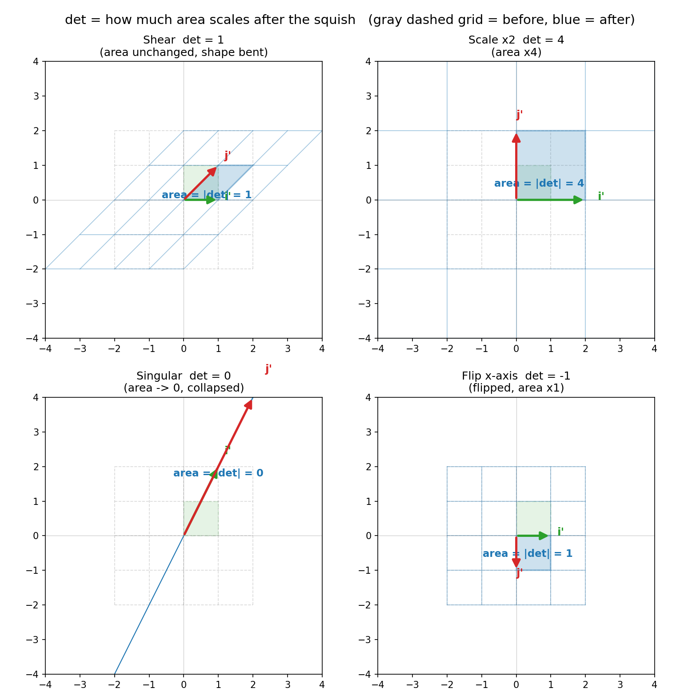
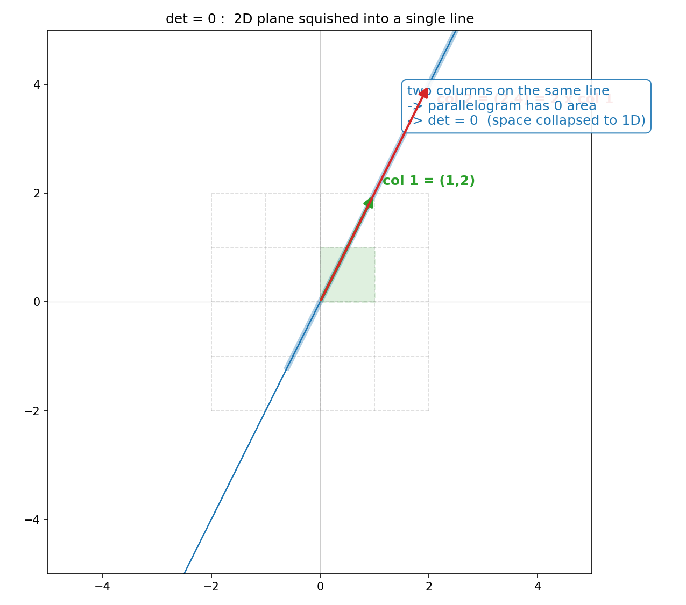

# 第 9 章 · 行列式:胀缩了多少倍

> **核心问题**:第 1 章我们说矩阵是在"揉捏空间"。可这次揉捏到底有多"猛"——它把空间的面积(或体积)放大了几倍、还是缩小了?有没有把空间**揉瘪**(压成更低维)?还有,为什么算出来的那个行列式有时是负数?
>
> 这一章我们给"揉捏"装上一把**面积刻度尺**:盯着橡皮膜上一个单位小方块,看它被揉捏后变成了多大的平行四边形。**这个"变大了多少倍",就是行列式。** 那个让你算到头秃的 `ad − bc`,不过是这把尺子上的一个读数。
>
> **读完本章你会明白**:
> - 行列式(determinant)到底在量什么:**这次揉捏,把面积(2D)/体积(3D)胀缩了几倍**——绝对值是倍数,正负号是"有没有把膜翻个面"。
> - 那个 `ad − bc` 的公式不是天上掉下来的,它就是"以矩阵两列为边的平行四边形的有向面积",你能自己从几何把它推出来。
> - 为什么 **det = 0** 是线代里最关键的一个判据:它意味着空间被**压扁降维**了(2D 面退化成一条线),信息丢了,**揉不回去了**(不可逆)。
> - 行列式的几条好性质(`det(AB) = det(A)·det(B)` 等)全是"两次揉捏面积相乘"这种大白话。

---

## 章首·一句话点破

第 1 章结尾我们预告过一句话:**行列式 = 揉捏后面积的缩放比,det=0 意味着空间被压扁。** 当时只是埋个种子,这一章把它彻底拆开。

一句话点破:

> **行列式,是这次揉捏的"面积刻度":你盯着单位正方形,看它被揉成了多大的平行四边形——面积涨了几倍,|det| 就是几。而 det 的正负,告诉你这次揉捏有没有顺手把膜"翻个面"(镜像)。det=0,则是整张膜被压扁成一条线,面积归零,再也揉不回去。**

这句话是**结论**。我们倒过来拆:先盯住面积,看那个倍数怎么冒出来;再追问"为什么有正负";最后落到那个吓人的 `ad − bc` 公式上,你会发现它不过是面积的另一种写法。

> **如果一读觉得太难**:先只记住三件事——
> ① **|det| = 揉捏把面积变了几倍**(2D 看面积,3D 看体积);
> ② **det = 0 ⟺ 空间被压扁了 ⟺ 揉不回去了(不可逆)**;
> ③ **det 的正负 = 有没有把膜翻面**(负 = 镜像翻转)。
> 这三件记住,本章的精华你已带走大半。

---

## 一、先盯住面积:揉捏把小方块变大了多少

回到那张画满方格的橡皮膜。第 1 章我们说,矩阵的两列,记录了 `i`、`j` 这两根基向量被揉去了哪。

现在,换个角度盯它:**别只盯两根箭头,盯那两根箭头**撑起来的那个平行四边形**。**

> **比喻**:想象单位正方形(以原点为角、边长 1 的小方块)是一块橡皮膜上的"标尺砖"。矩阵一揉捏,这块砖被搬、被拉、被推歪,变成一个**平行四边形**。这个新平行四边形的**面积**,跟原来那块单位正方形(面积=1)比,**涨了几倍**——这个倍数,就是这次揉捏的"面积刻度"。

为什么是平行四边形?因为线性变换有个铁律:**保持网格平行等距**。所以原来的单位正方形,揉完之后一定还是一个"对边平行"的四边形——就是平行四边形。而它的两个邻边,正好就是矩阵的两列(新的 `i'`、新的 `j'`)。

> 下图把四种揉捏的"标尺砖变形"画出来了:灰虚线 = 揉之前的方格,绿色虚方块 = 原始单位正方形(面积 1),蓝色实线 = 揉捏后的网格,蓝色填充 = 新的平行四边形。**盯着每张图里蓝色填充的面积,跟那块绿色单位正方形比一比——倍数,就是 |det|。**



一张一张看:

- **剪切(Shear)`[[1,1],[0,1]]`**:整个网格被横向推歪了,单位正方形被推成一个**斜的菱形**。但注意——它虽然歪了,**面积还是 1**(底 1、高 1,跟原来一样)。所以这次揉捏**只变形、没变面积**,|det| = 1。
- **放大 2 倍 `[[2,0],[0,2]]`**:两根基向量都往外撑了一倍,标尺砖变成边长 2 的大方块,面积变成原来的 **4 倍**。|det| = 4。
- **压扁(Singular)`[[1,2],[2,4]]`**:两列 `(1,2)` 和 `(2,4)` **共线**(第二个正好是第一个的 2 倍),平行四边形**塌成一条线**,面积 **= 0**。det = 0。这是本章后半段的大头,先记着。
- **翻转(Flip)`[[1,0],[0,-1]]`**:i 没动,j 被翻到了下面。平行四边形面积还是 1(|det|=1),但这块砖**翻了个面**——这就是 det 取负数的来由,下一节细讲。

### 不这样看会怎样

如果你只把行列式当成"对一个数表按某套交叉相乘规则算出来的一个数",你会:

- 永远不知道这个数在**描述什么**,算完就忘;
- 看不懂"为什么 det=0 就没有逆矩阵""为什么 det 可以是负的"——这些问题的答案全在面积里;
- 遇到 3×3、n×n 行列式,只会死背更长的展开公式,却不知道它们全都是"更高维的面积/体积刻度"。

> **所以这样看**:**行列式不是一种"算法",它是这次揉捏的一个"度量"——度量它把空间的面积(或体积)胀缩了几倍。** 算法(`ad − bc` 那套)只是你手算这个度量时的捷径,不是它的本质。

---

## 二、那个 `ad − bc`,怎么从面积里"长"出来

现在,正面回答一个折磨过所有人的问题:**为什么 2×2 行列式偏偏是 `ad − bc`?这个怪里怪气的交叉相乘减一下,到底凭什么?**

答案:**它就是"以矩阵两列为边的平行四边形的有向面积",展开成数字后的样子。** 我们一块把它推出来。

设矩阵的两列是 `(a, c)` 和 `(b, d)`(注意:第一列 `(a, c)`,第二列 `(b, d)`,因为矩阵第 1 行是 `[a, b]`、第 2 行是 `[c, d]`)。以这两根箭头为邻边的平行四边形,面积是多少?

### 从几何推算

平行四边形的面积,有个干净的法子算:**底 × 高**。取第一列 `(a, c)` 当底,它的长度是 `√(a²+c²)`。但这样算高很啰嗦。我们换个更聪明的办法——**用一个"补形"的把戏,把平行四边形塞进一个矩形里再扣角**。

直接给结论(你拿坐标纸画一遍就信):这个平行四边形的面积,等于

```
   面积 = | a·d − b·c |
```

> 为什么是这个式子?给你一条最快的直觉路径。把两根列向量记作 `u = (a, c)`、`v = (b, d)`。平行四边形的面积,有一个教科书公式叫"叉积的模长",在 2D 里退化成一个数:`u_x·v_y − u_y·v_x = a·d − c·b`。**这个 `ad − cb`,就是 2D 平行四边形的有向面积。** 至于它为什么恰好长这样——下面带你用"矩形扣角"亲手推一遍。

### 亲手推一次(矩形扣角法)

把两根向量 `u=(a,c)`、`v=(b,d)` 画在第一象限(其它象限同理,只是带符号)。以它们为边的平行四边形,可以这样算面积:

1. 先算"把它们包住的那个大矩形"的面积 —— 横跨 `a` 到 `b`、纵跨 `c` 到 `d`(具体取决于 a,b,c,d 谁大,但思路一样)。
2. 从这个矩形里,扣掉平行四边形**之外**的两个小三角形和两个小直角三角形。

展开代数,所有的 `+` 和 `−` 一抵消,**唯一活下来的项,就是 `a·d − b·c`**。中间那些交叉项全约掉了——这就是为什么行列式里只有两项、一加一减:**它是面积公式化简后的"最小残留"**,不是数学家拍脑袋。

> **不这样推,你会怎样**:你会以为 `ad − bc` 是一条"必须死记的、没有道理的算法规则"。可一旦你亲手推过一次,你就明白——**它根本不是规定,它是"平行四边形面积"这个几何事实,写成了四个数字 `a,b,c,d` 后的唯一样子。** 算法是理解的副产品,这句话在这一节兑现得最彻底。

### 拿数字走一遍

矩阵 `[[2, 1],[1, 2]]`,两列 `u=(2,1)`、`v=(1,2)`。

```
   面积 = | a·d − b·c | = | 2·2 − 1·1 | = | 4 − 1 | = 3
```

而 det 按公式:`2·2 − 1·1 = 3`。**完全一致。** 因为它们本来就是同一个数——行列式 = 平行四边形的有向面积。

> **钉死这件事**:**2×2 行列式 `det([[a,b],[c,d]]) = ad − bc`,几何上就是以两列为边的平行四边形的有向面积。** 单位正方形(面积 1)被这次揉捏变成了面积 `|ad−bc|` 的平行四边形,所以 **|det| = 面积的缩放倍数**。这就是行列式的全部本质,没有别的。

---

## 三、有向面积:为什么行列式有正有负

到这里,有个刺眼的问题我们一直绕着走:**行列式为什么可能是负数?** 面积怎么能是负的?

答案藏在"有向"两个字里。

> **比喻**:想象你在橡皮膜上画了一个箭头圈——从 i 出发、转 90° 到 j,这个"i 转到 j"的旋转方向(逆时针),就是这片膜的**正向(定向,orientation)**。线性变换揉捏之后,如果新的 `i'` 转到新的 `j'` **还是逆时针**,说明膜没翻面,定向没变,det 取**正**;如果新的 `i'` 转到新的 `j'` **变成了顺时针**,说明膜被**翻了个面**(像镜子里的世界,左右颠倒),det 取**负**。

所以行列式的几何,是**两件事打包**:

```
   det = (±) × |面积缩放倍数|
        ↑              ↑
     定向有没有翻    面积胀缩了几倍
```

- **绝对值 |det|**:面积(2D)/体积(3D)胀缩的倍数。这是"揉得多猛"。
- **正负号**:定向有没有翻转。正 = 没翻(正常的揉捏);负 = 翻面了(镜像)。

### 看两个翻面的例子

**① 沿 x 轴翻转 `[[1,0],[0,-1]]`**(就是图 9.1 右下角那张):

- 第一列 `(1,0)`:i 还在原地朝右。
- 第二列 `(0,-1)`:j 从"朝上"被翻到**朝下**。

整个平面像被沿 x 轴**对折了一下**,上下颠倒。原本"i 逆时针转 90° 到 j",现在"i 顺时针转 90° 才到 j"——**定向反转**。面积还是 1(|det|=1),但 det = **−1**。

**② 对调两轴 `[[0,1],[1,0]]`**:

- 第一列 `(0,1)`:i(原本朝右)被搬到了**朝上**。
- 第二列 `(1,0)`:j(原本朝上)被搬到了**朝右**。

两个轴**对调**了一下,等价于沿 45° 那条线做了个镜像。i 和 j 谁先谁后颠倒了,定向自然翻转。det = `0·0 − 1·1 = ` **−1**。

> **不这样理解会怎样**:如果你把 det 当成"一个可能为负的、莫名其妙的数",那"行列式为什么有正负"对你永远是个谜。可一旦你看见"正负 = 有没有翻面",一切都通了:**det 是负的,不是说面积是负的,而是说这次揉捏顺手把膜翻了个面,让坐标系的"左右手定则"反了过来。**

### 一个直觉:旋转永远是正的

补一个有用的副产物:**任何纯旋转,det 都是 +1**。因为旋转不拉也不压(面积不变),更不会翻面。比如 90° 旋转 `[[0,-1],[1,0]]`,det = `0·0 − (−1)·1 = +1`。**旋转 = 不翻面的、面积不变的揉捏**,所以它的 det 锁死在 +1。这个事实,后面讲正交矩阵(纯旋转)时会直接用上。

> **钉死**:det 的绝对值量"胀缩几倍",正负号量"翻没翻面"。翻面(镜像)→ 负;正常 → 正。**负的行列式,几何上就是"你站在镜子外看镜像世界,左右颠倒了"。**

---

## 四、det = 0:空间被压扁了(本章最实用的一节)

现在到本章最重要、也最实用的部分:**det = 0 意味着什么。**

先说结论,再解释为什么:

> **det = 0 ⟺ 这次揉捏把空间压扁了(降维)⟺ 这次揉捏不可逆(揉不回去了)。**

三件事,其实是同一件事。我们顺着面积,一层一层看清。

### 第一层:det=0,面积归零,平行四边形塌成一条线

回到第一节。det = 平行四边形的有向面积。如果 det = 0,就是说**这个平行四边形的面积是 0**。面积是 0 的"平行四边形"长什么样?——**它退化成了一条线段**(甚至是原点一个点)。

什么时候平行四边形会塌成线?当它的两条邻边(也就是矩阵的两列)**共线**——两根基向量被揉到了同一条直线上,那它们撑不起一个面,只能铺出一条线。

> 下图把这件事单独放大看。矩阵 `[[1,2],[2,4]]`,两列 `(1,2)` 和 `(2,4)` —— 后者恰好是前者的 **2 倍**,完全共线。原本铺满平面的蓝色网格,被压成**一个方向**上的一把平行线;那块单位正方形,塌成了一条线段,面积归零。**这就是 det=0 的字面意思:二维的面,被揉成了一维的线。**



### 第二层:压扁 = 信息丢失

面积归零听着像个几何小事,但它的后果极其严重:**这次揉捏,把整个二维平面,塞进了一条一维的直线里。** 平面上无穷多个不同的点,被挤到了同一条线上——很多原来不同的点,现在**挤在同一个位置**了。

> **比喻**:你拿一张纸(二维),想把它塞进一个**只有一根线粗的缝**里。你只能把整张纸**卷成一条**塞进去——一旦卷进去,纸上原来横着的、竖着的、各个位置的点,全被压叠在一起,你再也没法知道"这个点原来在纸的哪个位置"。**信息丢了。** 这就是"压扁 = 降维 = 信息丢失"。

### 第三层:压扁 ⟺ 不可逆(连到逆矩阵)

而"信息丢失",在矩阵层面有一个干脆的名字:**不可逆**。

还记得第 1 章和接下来第 7 章的核心吗?**逆矩阵,是这次揉捏的"撤销键"** —— 把空间揉回原样。可一旦空间被压扁了(二维 → 一维),你**没法撤销**:因为很多原来的点现在挤在同一个位置,你不知道该把这一个点"还原"成原来的哪一个。

> **不这样看会怎样**:教材会告诉你"det=0 的矩阵没有逆",但只会甩一个"因为行列式为零所以不可逆"的循环论证。可一旦你看见"det=0 = 压扁 = 信息丢了 = 揉不回去",这个判据就有了**血肉**:**det 是否为零,是在问"这次揉捏有没有把空间揉瘪"——瘪了,就再也吹不鼓了。**

> **钉死这件事(本章最该带走的一句)**:**det = 0 ⟺ 矩阵的两列共线(高维:线性相关)⟺ 空间被压扁降维 ⟺ 矩阵不可逆。** 这是一条"多米诺":四件事,一损俱损。判断一个矩阵能不能求逆、方程组有没有唯一解、数据有没有冗余——根子上都是问这一句:**det 是不是零?** 这个判据,会在第 7 章(逆矩阵)、第 10 章(秩)、第 15 章(方程组)反复出场,它是线代最高频的一个"体检指标"。

---

## 五、3D 与更高维:行列式 = 体积缩放

我们一直在讲 2D。升到 3D,行列式的几何**一模一样**——只是"面积"换成"体积":

> **3×3 行列式,是这次揉捏把单位立方体(体积 1)揉成的平行六面体的有向体积。|det| = 体积胀缩的倍数;正负 = 定向有没有翻转(右手坐标系变成左手坐标系)。**

比如对角矩阵 `[[1,0,0],[0,2,0],[0,0,3]]`:它把 x 轴不动、y 轴拉长 2 倍、z 轴拉长 3 倍。单位立方体(边长 1,体积 1)被揉成 `1 × 2 × 3` 的长方体,体积变成 **6 倍**。det = 6。用 numpy 验:`np.linalg.det(np.diag([1,2,3]))` = 6.0。

而如果 3×3 矩阵的三列**共面**(挤在一个平面里,比如第三列恰好是前两列的线性组合),那平行六面体就**塌成一片**——三维体被压成二维面,体积归零,det = 0。这正是"压扁降维"在 3D 里的样子:**体退化成面**。

至于 3×3 行列式那个长长的展开式(`a(ei−fh) − b(di−fg) + ...`),它和 2D 的 `ad−bc` 同根同源——都是"平行六面体体积"展开成数字后的样子,只是项更多。**本章不背它**,你只要记住:无论几维,**行列式 = 那个空间被揉捏后,面积/体积胀缩的倍数(带定向)**——这就是它的全部。

---

## 六、三条好性质,全是"两次揉捏面积相乘"

最后,讲行列式的几条经典性质。教材会列一堆,但用"面积缩放"的眼光看,它们全是**大白话**。

### 性质 1:`det(I) = 1` —— 不揉,面积不变

单位矩阵 `I` 是"什么都不做"的揉捏。单位正方形原地不动,面积还是 1。所以 `det(I) = 1`。**这是行列式这把刻度尺的零点校准**:什么都不揉,刻度读 1。

### 性质 2:`det(AB) = det(A) · det(B)` —— 两次揉捏,面积倍数相乘

这是最漂亮的一条。`AB` 是"先 B 再 A"的**接龙揉捏**(第 1 章、第 6 章讲过)。两次揉捏接起来,总面积缩放是多少?——**当然是两次各自的倍数相乘**。

> **比喻**:你先**把照片放大 2 倍**(面积变 4 倍,因为长宽各 ×2),再**放大 3 倍**(面积再变 9 倍)。两次接龙的总效果:面积变 `4 × 9 = 36` 倍。**倍数相乘,天经地义。** `det(AB) = det(A)·det(B)` 就是这句话的数学写法。

拿数字验:`A = [[1,1],[0,1]]`(剪切,det=1),`B = [[2,0],[0,3]]`(拉伸,det=6)。

```
   det(A)·det(B) = 1 · 6 = 6
   AB = [[1,1],[0,1]]·[[2,0],[0,3]] = [[2,3],[0,3]]
   det(AB) = 2·3 − 3·0 = 6     ✓  完全相等
```

> **钉死**:**两次揉捏接龙,面积倍数相乘。** 这条性质之所以成立,不是代数巧合,而是"面积缩放"这个几何本质的直接推论——倍数本来就该这么叠。

### 性质 3:`det(A⁻¹) = 1 / det(A)` —— 撤销键,把面积缩回去

逆矩阵 `A⁻¹` 是 A 的**撤销键**(第 7 章主题)。A 把面积变成 det(A) 倍,那 A⁻¹ 要把面积**缩回原样**,自然得乘 `1/det(A)` 倍。所以 `det(A⁻¹) = 1/det(A)`。

这条性质立刻解释了上一节的"det=0 不可逆":如果 det(A)=0,那 `1/det(A)` 就是 `1/0` —— **撤销键不存在**。**面积归零的揉捏,没有撤销,因为信息已经丢了,你没法把一条线"吹鼓"回一个面。** 几何和代数,在这里严丝合缝。

### 还有一条:`det(Aᵀ) = det(A)` —— 转置,面积不变

把矩阵的行和列互换(转置),行列式不变。几何上:转置相当于换了个角度描述**同一个**面积刻度,倍数当然不变。这条后面(秩那一章)会用到,先留个印象。

> **所以这样看**:行列式的所有性质,都不是孤立的代数魔法,而是"面积缩放"这个几何事实在不同场合的自然流露。**你只要盯住"这次揉捏把面积变了多少倍",这些性质你甚至能自己猜出来。**

---

## 计算佐证:拿纸笔和 numpy,亲手摸一次面积刻度

这一节,我们拿几个 2×2 矩阵,**先手算 `ad − bc`,再用 numpy 的 `np.linalg.det` 核对**,确认"公式 = 面积 = 缩放倍数"三件事是同一个数。

### 1. 剪切 `[[1,1],[0,1]]`:面积不变,det=1

手算:

```
   a=1, b=1, c=0, d=1
   det = a·d − b·c = 1·1 − 1·0 = 1
```

几何:第一列 `(1,0)`、第二列 `(1,1)`,撑起来的平行四边形底=1、高=1,面积=1。**单位正方形面积 1 → 新面积 1,倍数 1,det=1。只变形,没变面积。** 这就是为什么剪切变换在图形学、流体里到处用——它能"扭歪"形状却不改变面积。

### 2. 放大 2 倍 `[[2,0],[0,2]]`:面积变 4 倍,det=4

```
   det = 2·2 − 0·0 = 4
```

两列 `(2,0)`、`(0,2)`,平行四边形是个 2×2 的方块,面积 4。**单位正方形 → 面积 4,倍数 4,det=4。**

### 3. 压扁 `[[1,2],[2,4]]`:面积归零,det=0

```
   det = 1·4 − 2·2 = 4 − 4 = 0
```

两列 `(1,2)`、`(2,4)` 共线(第二个是第一个的 2 倍),平行四边形塌成线,面积 0。**det=0 ⟺ 不可逆。** 这个矩阵你求不出逆——numpy 会直接报 `Singular matrix`。

### 4. 翻转 `[[1,0],[0,-1]]`:面积不变但翻面,det=−1

```
   det = 1·(−1) − 0·0 = −1
```

|det|=1,面积没变。但 det 是负的——说明这次揉捏把平面**沿 x 轴翻了个面**,定向反了。**负号的几何,就是翻面。**

### 5. numpy 一把核对(注意浮点)

```python
import numpy as np

mats = {
    "Shear    [[1,1],[0,1]]":  np.array([[1., 1], [0, 1]]),
    "Scale x2 [[2,0],[0,2]]":  np.array([[2., 0], [0, 2]]),
    "Singular [[1,2],[2,4]]":  np.array([[1., 2], [2, 4]]),
    "Flip     [[1,0],[0,-1]]": np.array([[1., 0], [0, -1]]),
    "Swap     [[0,1],[1,0]]":  np.array([[0., 1], [1, 0]]),
    "Rotate90 [[0,-1],[1,0]]": np.array([[0., -1], [1, 0]]),
}
for name, M in mats.items():
    d = np.linalg.det(M)
    # 面积 = 两列叉积的绝对值
    c1, c2 = M[:, 0], M[:, 1]
    area = abs(c1[0] * c2[1] - c1[1] * c2[0])
    print(f"{name}:  det = {d: .4f},  |det| = {abs(d): .4f},  area = {area: .4f}")

# 验 det(AB) = det(A) det(B)
A = np.array([[1., 1], [0, 1]])
B = np.array([[2., 0], [0, 3]])
print(f"det(AB) = {np.linalg.det(A @ B): .4f},  det(A)*det(B) = {np.linalg.det(A) * np.linalg.det(B): .4f}")
```

预期输出(浮点可能末位有抖动):

```
Shear    [[1,1],[0,1]]:  det =  1.0000,  |det| =  1.0000,  area =  1.0000
Scale x2 [[2,0],[0,2]]:  det =  4.0000,  |det| =  4.0000,  area =  4.0000
Singular [[1,2],[2,4]]:  det =  0.0000,  |det| =  0.0000,  area =  0.0000
Flip     [[1,0],[0,-1]]: det = -1.0000,  |det| =  1.0000,  area =  1.0000
Swap     [[0,1],[1,0]]:  det = -1.0000,  |det| =  1.0000,  area =  1.0000
Rotate90 [[0,-1],[1,0]]: det =  1.0000,  |det| =  1.0000,  area =  1.0000
det(AB) =  6.0000,  det(A)*det(B) =  6.0000
```

**手算、numpy、几何面积,三者完全吻合。** 剪切 det=1、放大 det=4、压扁 det=0、翻转 det=−1、旋转 det=+1——每一个数,都和你脑子里"那块标尺砖被揉成什么样"一一对应。**这就是"会算"到"真懂"的闭环。**

> **一个小提醒(浮点)**:numpy 算出来的 det 可能是 `0.0`、也可能是 `1.0000000000000002` 这种带尾的数,是浮点误差。判断"是否为 0"时,工程上用 `abs(det) < 1e-12` 这种阈值,而不是直接 `== 0`。

---

## 章末小结

### 用"橡皮膜 / 面积刻度"比喻回顾本章

这一章,我们给"揉捏"装上了一把**面积刻度尺**:

1. **行列式 = 揉捏后面积(2D)/体积(3D)的缩放倍数。** 盯住单位正方形,看它被揉成了多大的平行四边形——面积涨几倍,|det| 就是几。**这是 det 的全部本质,公式只是它的数字写法。**
2. **`ad − bc` 不是天上掉下来的。** 它就是"以矩阵两列为边的平行四边形的有向面积",你能从几何自己推出来。**算法是理解的副产品。**
3. **det 的正负 = 定向有没有翻转。** 负 = 把膜翻了个面(镜像),正 = 正常揉捏。旋转永远 det=+1(不翻面、不变面积)。
4. **det = 0 ⟺ 压扁降维 ⟺ 不可逆。** 两列共线,平行四边形塌成线,面积归零,信息丢失,揉不回去。这是 det 最实用的判据,一根多米诺骨牌连起"共线 → 降维 → 不可逆"。
5. **几条性质全是大白话**:`det(I)=1`(不揉不变)、`det(AB)=det(A)·det(B)`(两次揉捏倍数相乘)、`det(A⁻¹)=1/det(A)`(撤销键把面积缩回去)。

### 本章在全书主线中的位置

记住本书的主线:**一切线代概念,都是"空间被揉捏"这件事的某个侧面。**

这一章,我们量的是揉捏的**面积缩放比**这个侧面——给揉捏装上一把刻度,回答"它把空间胀缩了多少、有没有揉瘪"。这是第 3 篇《揉捏的度量》的第一刀。从这里开始,后面几章都在给揉捏装不同的"度量":

- **行列式(本章)**:揉捏把面积/体积胀缩了几倍。
- **秩(第 10 章)**:揉捏之后,空间**还剩几维**(有没有被压扁,压扁到几维)。
- **四个子空间(第 11 章)**:给一次揉捏画完整的画像(谁被压扁了、压成了什么)。

你看,det、秩、子空间,全是"度量揉捏"的不同刻度。而 det=0(压扁)这件事,正是连接它们的枢纽:**det 量"面积有没有归零",秩量"维度还剩几"——压扁了,面积归零,维度也跟着掉。** 下一章我们就顺着这条线,讲透"秩"。

### 五个"为什么"清单

如果你只能记五件事,记这五件:

1. **行列式到底在量什么**:**揉捏后面积(2D)/体积(3D)的缩放倍数**。|det|=倍数,正负=定向有没有翻转。这是本质,公式是副产品。
2. **`ad − bc` 凭什么是这个式子**:它是"以矩阵两列为边的平行四边形的有向面积"展开成数字后的样子。从几何能推出来,不用死记。
3. **det 为什么有正负**:正负号 = 这次揉捏有没有把膜"翻个面"(镜像翻转)。翻转(如沿轴翻转、对调两轴)→ 负;正常 → 正。旋转永远 +1。
4. **det = 0 意味着什么**:**空间被压扁降维(2D 面退化成线)⟺ 矩阵不可逆 ⟺ 两列共线**。这是一根多米诺骨牌,是 det 最实用的判据,连到逆矩阵、秩、方程组有没有唯一解。
5. **det 的几条性质为什么成立**:`det(I)=1`(不揉不变)、`det(AB)=det(A)·det(B)`(两次揉捏面积倍数相乘)、`det(A⁻¹)=1/det(A)`(撤销键缩回面积)。全是"面积缩放"这个几何本质的自然推论。

### 想继续深入,该往哪钻

- **亲眼"看见"面积胀缩**:强烈推荐 3Blue1Brown《线性代数的本质》的**"行列式"一集**。它用动画把"单位正方形被揉成平行四边形、面积变了多少倍"画得清清楚楚——本章所有文字比喻,在它的动画里都会变成你能亲眼数的面积。**det 的正负(翻面)、det=0(压扁),看一眼动画就刻进脑子了。**
- **亲手玩面积刻度**:上面的 numpy 代码,自己造几个矩阵,先手算 `ad−bc`,再 `np.linalg.det` 核对。特别注意造一个 det 为负的(如 `[[0,1],[1,0]]`),亲眼看见"面积没变、但定向翻了"。再造一个共线的(如 `[[1,2],[2,4]]`),看 numpy 报 det=0、求逆报 `Singular`。
- **尝一口 3D**:用 `np.linalg.det` 算几个 3×3 矩阵(如 `np.diag([2,3,5])`,det 应为 30),感受"体积缩放"——它和 2D 的面积缩放,是同一个概念升了一维。
- **函数空间尝鲜(选读)**:如果把"积分"看成一种"连续的求面积",那行列式作为"面积缩放比",在更抽象的空间里(如测度论、变换的雅可比行列式)就是这个概念的终极形态——微积分里换元积分时冒出来的那个"雅可比",本质上就是"无穷小面积元的缩放比",和本章的 det 同根同源。这条线埋着,后面有机会再收。

---

> 面积刻度装好了:det 量揉捏胀缩几倍,det=0 量有没有揉瘪。可"揉瘪"到底揉成了几维?一个矩阵把空间压扁之后,还剩几根撑得住的骨架?这就是下一章的主角——**秩**。det 告诉你"压没压扁",秩告诉你"压扁后还剩几维"。翻开 **第 10 章 · 秩:揉捏后还剩几维**。
