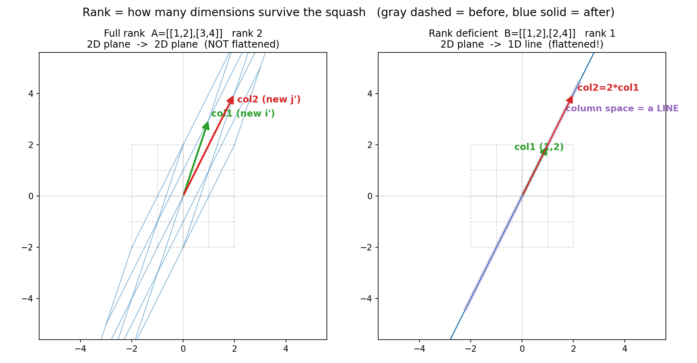
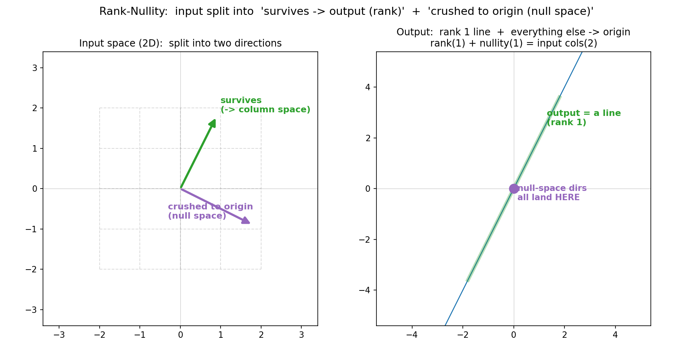

# 第 10 章 · 秩:还剩几维

> **核心问题**:第 9 章我们说,行列式 = 0 意味着空间被揉捏"压扁了"。可"压扁"是句粗话——**压扁成了几维?** 一个 2×2 矩阵把整个二维平面揉成一条线,和一个 3×3 矩阵把整个三维空间揉成一个平面,这两种"压扁"显然不一样。我们需要一把比行列式更细的尺子:不只会说"压没压扁",还能精确说出**揉捏之后,空间还剩几维**。
>
> 这把尺子,就叫**秩(rank)**。
>
> **读完本章你会明白**:
> - 秩到底是什么:**矩阵各列张成的空间(列空间)的维数 = 揉捏后输出空间还剩几维**。它是把第 4 章"维数"这把尺子,直接架到"揉捏后的输出"上。
> - **满秩(full rank) vs 降秩(rank deficient)**:满秩 = 没压扁 = 可逆;降秩 = 压扁了 = 不可逆(把第 9 章 det=0 的判据量化成"剩几维")。
> - 为什么**列秩 = 行秩**:一个矩阵只有一个秩,行方向和列方向"压扁的程度"完全一样。
> - 为什么秩是矩阵最关键的"体检指标":它一句话告诉你这次变换**有没有丢信息**——满秩不丢(可逆),降秩丢(不可逆)。
> - (选读深度)秩-零度定理(rank-nullity):输入空间被拆成"被揉到输出的部分(秩)"+"被揉到原点的部分(零空间)",两者维数加起来 = 输入总维数。

---

## 章首·一句话点破

第 9 章结尾我们留了一句话:**det 告诉你"压没压扁",秩告诉你"压扁后还剩几维"。** 当时只是交接,这一章把它彻底拆开。

一句话点破:

> **秩,是这次揉捏后空间"还剩几维"的读数:你盯住矩阵的各列(它们是揉捏后的新基),看它们到底能撑起几维的空间——撑起几维,秩就是几。两列共线,只撑得起一条线,秩 = 1;两列不共线,撑得起整个面,秩 = 2。满秩(秩 = 维数)就是"没压扁、没丢维",降秩(秩 < 维数)就是"被压扁了、丢了维"。**

这句话是**结论**。我们倒过来拆:先把第 4 章的"维数"这把尺子重新拿出来,架到"揉捏后的输出"上,看"秩"怎么自然冒出来;再追问"满秩意味着什么";然后拆一个反直觉的事实——"列秩等于行秩";最后落到秩-零度定理,看清输入空间是怎么被这次揉捏"分赃"的。

> **如果一读觉得太难**:先只记住三件事——
> ① **秩 = 揉捏后输出空间还剩几维**(= 矩阵各列张成的空间的维数);
> ② **满秩 = 没压扁 = 可逆;降秩 = 压扁了 = 不可逆**(这是 det=0 判据的精确版);
> ③ **一个矩阵只有一个秩**(列秩 = 行秩,行方向和列方向压扁得一样狠)。
> 这三件记住,本章的精华你已带走大半。

---

## 一、把"维数"这把尺子,架到"揉捏后的输出"上

回忆第 4 章我们手里那把最稳的尺子:**维数 = 一个空间里最多能挑出几根线性无关的向量**。二维平面维数 2,一条直线维数 1,一个点维数 0。这把尺子换基也不变,是空间最硬的"身份证"。

第 1 章又说:矩阵的**各列**,就是这次揉捏把基向量揉去了哪——每一列是一根"新的基"。那么一个自然到不能再自然的问题来了:

> **矩阵的各列(那些新的基向量),它们张成的空间,是几维的?**

这个维数,就是**秩**。

### 秩的几何定义

> **秩(rank)**:矩阵 `A` 的各列作为向量,它们张成的空间(叫**列空间,column space**)的维数,记作 `rank(A)`。
>
> 几何上:**揉捏之后,输出空间还剩几维。**

把第 4 章"维数 = 骨架根数"直接搬过来:看矩阵的各列里,**真正不冗余(线性无关)的有几根**,秩就是几。冗余的列(能被别的列凑出来的)不带来新维数,白搭。

> **不这样看会怎样**:教材会直接给"秩 = 最高阶非零子式的阶数"这种代数定义。你背下来了,却完全不知道它在说什么。可一旦你把秩看成"揉捏后输出剩几维",它立刻有了血肉:**秩,是这次揉捏有没有把空间揉瘪、揉瘪到几维的精确读数。** 子式那套算法,只是你手算这个读数时的捷径,不是它的本质。

### 三种情形,一眼看穿

盯 2×2 矩阵(两列),分三种情况:

**① 两列不共线 ⟹ 秩 = 2(满秩)**。两根方向不同的箭头,撑得起整个二维平面。揉捏把整个 2D 平面,揉成了**整个 2D 平面**(只是被拉歪、转了一下)——维数没掉。

**② 两列共线 ⟹ 秩 = 1(降秩)**。第二列是第一列的某个倍数,完全冗余。两根共线的箭头,撑不起面,只撑得起**一条线**。揉捏把整个 2D 平面,**塞进了一条 1D 直线**——维数从 2 掉到 1。

**③ 两列都是零 ⟹ 秩 = 0**。两根基向量都被揉到了原点。整个平面被揉成**原点一个点**——维数从 2 掉到 0。

> 下图把"满秩"和"降秩"画在一起:左边满秩矩阵 `[[1,2],[3,4]]`,两列不共线,揉捏后蓝实线网格仍是一片 2D 平面(rank 2);右边降秩矩阵 `[[1,2],[2,4]]`,两列共线(第二列恰好是第一列的 2 倍),揉捏后整个 2D 平面被压成**一条线**(那条紫色粗线就是它的列空间),rank 1。**盯着右图那条紫线——那就是"整个平面被塞进去"的地方。**



> **钉死这件事**:**秩 = 矩阵各列张成的空间的维数 = 揉捏后输出空间还剩几维。** 它是第 4 章"维数"这把尺子,架在"揉捏后的输出"上的读数。冗余的列不算数(共线的两根只算一根维),所以秩量的永远是"去掉冗余后,真正撑得起几维"。

---

## 二、满秩 vs 降秩:有没有丢维

有了秩,我们就能给"压扁"一个精确的分级。

### 满秩:没压扁,可逆

对一个 `n` 维空间上的方阵(比如 2×2、3×3),**满秩(full rank)** 的意思是:秩 = 维数 `n`。

> **比喻**:满秩,就是这次揉捏**一个维都没丢**——2D 揉完还是 2D,3D 揉完还是 3D。膜被拉、被转、被推歪都行,但**没有塌掉任何一维**。

满秩的几何后果,正是第 9 章那条多米诺骨牌的起点:

```
   满秩(rank = n)
      ⟺  各列线性无关(没有冗余列)
      ⟺  det ≠ 0  (第 9 章:平行四边形/平行六面体没塌成 0)
      ⟺  没压扁,信息没丢
      ⟺  可逆(有撤销键,第 7 章)
```

满秩 = 没压扁 = 可逆。**这三个词,说的是同一件事。** 第 9 章我们用 det≠0 判它,这一章我们用"秩 = 维数"判它——两把尺子,同一个结论。对 2×2 矩阵,rank=2 等价于 det≠0;rank=1 或 0 等价于 det=0。

### 降秩:压扁了,不可逆

反过来,**降秩(rank deficient)** 的意思是:秩 < 维数 `n`。

> **比喻**:降秩,就是这次揉捏**丢了维**——2D 被揉成 1D(秩 1),或揉成 0D(秩 0);3D 被揉成 2D、1D 或 0D。膜塌掉了至少一维。

降秩的几何后果:

```
   降秩(rank < n)
      ⟺  各列线性相关(有冗余列)
      ⟺  det = 0  (压扁了)
      ⟺  信息丢了(很多原来的点挤到同一位置)
      ⟺  不可逆(没有撤销键)
```

降秩 = 压扁了 = 不可逆。**这三件事,也是一回事。**

### 降维的"几档"

秩最妙的地方,是它不只说"压没压扁"(那是 det 的活),还说"**压扁到了几维**":

- 2×2 矩阵:rank 2 = 没压(满秩);rank 1 = 压成一条线;rank 0 = 压成一个点。
- 3×3 矩阵:rank 3 = 没压;rank 2 = 压成一个平面;rank 1 = 压成一条线;rank 0 = 压成一个点。

> **不这样看会怎样**:如果你只知道 det=0(压扁了),那 2×2 秩1 和 3×3 秩2,在你眼里都是"压扁了",你分不出区别。可它们的"压扁程度"完全不同:前者把二维揉成一维,后者把三维揉成二维。**秩,就是给"压扁"装上的精细刻度——它告诉你,揉捏之后,空间究竟还剩几维撑得住。**

> **钉死**:**满秩(秩=维数)= 没压扁 = 可逆;降秩(秩<维数)= 压扁了 = 不可逆。秩的数值,就是"压扁后还剩几维"的精确读数。** 第 9 章的 det=0 判据,被秩量化成了"剩几维"。

---

## 三、列秩 = 行秩:一个矩阵只有一个秩

到这里,有个反直觉的事实,必须讲透。

矩阵有**列**,秩可以按"各列张成的空间的维数"来量——这叫**列秩(column rank)**。可矩阵也有**行**,为什么不按"各行张成的空间的维数"来量,叫**行秩(row rank)**?

让人拍案的是:**列秩 = 行秩,永远相等。** 所以一个矩阵**只有一个秩**,不分行列。

> **钉死这件事**:**对任何矩阵,列秩 = 行秩。一个矩阵只有一个秩。**

### 为什么会相等:用橡皮膜看

这是线代里最深、也最美的结论之一。我们不证(证明留给你将来的教材),只给一个**几何上能看懂**的解释。

矩阵 `A` 把空间从"输入"揉到"输出"。我们分两个方向看这次揉捏:

- 按列看(`A` 自己):各列张成的空间 = 输出空间(列空间),它的维数 = 列秩 = `rank(A)`。
- 按行看(`A` 的转置 `Aᵀ`):`Aᵀ` 的各列,就是 `A` 的各行。`Aᵀ` 是另一个方向的揉捏(它把输出空间的相关结构,反映回输入方向)。

关键直觉:**`A` 和 `Aᵀ` 揉捏后"剩几维",是同一个数。** 想象 `A` 把输入空间压扁成 `r` 维的输出;那么从输出方向"反过来看"(`Aᵀ`),它也把"对应的空间"压扁成 `r` 维——压扁的维度,前后一致。**信息丢多少,行方向和列方向,丢得一样多。**

> **比喻**:一张橡皮膜,你从正面揉它(`A`)和从背面揉它(`Aᵀ`,相当于把膜翻个面再看揉捏),**揉瘪的程度一样**。膜不会因为你换个观察方向,就突然多撑起一维或塌掉一维——压扁的维度,是个客观事实,跟你看它的角度无关。

### 一个直接的推论:秩受"长宽"夹住

既然列秩 = 行秩 = `r`,而列秩最多是列数、行秩最多是行数,两头一夹:

```
   rank(A)  ≤  min(行数, 列数)
```

一个 2×3 矩阵(2 行 3 列),秩最多是 `min(2, 3) = 2`——它把 3D 输入揉成最多 2D 输出(因为输出空间只有 2 个坐标)。一个 3×2 矩阵,秩最多也是 2。**秩永远不超过"行数和列数的较小者"。** 这个上界,就是后面"满秩"在非方阵情形下的定义:秩 = min(行数, 列数),就是满秩。

> **不这样理解会怎样**:你会觉得"列秩"和"行秩"是两个不同的东西,要分别记。可一旦你信了"一个矩阵只有一个秩",事情就简单了:**不管你从列看还是从行看,这个矩阵揉捏后剩几维,只有一个答案。** 这也是为什么 `np.linalg.matrix_rank` 只给你一个数——因为本来就只有一个。

---

## 四、秩是矩阵的"体检指标"

到这里,你能看清秩真正的地位了。

> **秩,是矩阵最重要的一个"体检指标":它一句话告诉你,这次变换有没有丢信息。**

体检报告只有两类:

- **满秩**:没丢维,信息完整,**可逆**(能撤销)。这种矩阵是好矩阵——方程 `Ax = b` 有唯一解(第 15 章),数据没有冗余,变换能原路退回。
- **降秩**:丢了维,信息残缺,**不可逆**(撤销不了)。这种矩阵是"有病"的——方程 `Ax = b` 要么无解要么无穷多解,数据有冗余,变换揉不回去。

> **比喻**:秩像一次变换的"健康证"。满秩 = 健康(信息完整,可逆);降秩 = 带病(信息残缺,不可逆)。拿到一个矩阵,第一件事就是给它量个体温——算它的秩。**秩,是矩阵世界的体温计。**

这件事在第 15 章(解方程 `Ax = b`)会变成主角:`b` 在不在 `A` 的列空间里(决定有没有解)、零空间有没有货(决定解唯不唯一),根子都在秩上。本章先把"秩 = 丢没丢维"这把体温计装好。

---

## 五、(选读)秩-零度定理:输入空间怎么被"分赃"

前面我们一直在盯"输出剩几维"(秩)。可一次揉捏还有另一面:**输入空间里,有哪些方向被揉到了原点?** 这些"阵亡"的方向,组成**零空间(null space)**——它是第 11 章四个子空间的主角之一,这里先种个种子。

秩和零空间,把输入空间**干净地拆成两半**,这就是著名的**秩-零度定理**:

> **秩-零度定理(rank-nullity)**:
> ```
>    rank(A) + dim(null space of A) = 输入的列数
> ```
> 几何上:**输入空间被这次揉捏拆成两半——"被揉到输出的部分"(维数 = 秩)+"被揉到原点的部分"(维数 = 零空间维数,叫零度 nullity),两者维数加起来 = 输入的总维数。**

### 拿 `[[1,2],[2,4]]` 看一遍

这个 rank 1 的矩阵,输入是整个 2D 平面(2 列,输入维数 2)。定理说:`rank(1) + nullity(?) = 2`,所以 nullity = 1——有一条方向被揉到了原点。

是哪条?我们用 numpy 验过:`B @ (2, −1) = (0, 0)`。方向 `(2, −1)` 这条线上的所有向量,被揉捏后**全部塌到原点**——这就是零空间,维数 1。

而另一条"存活"的方向,是列空间的方向 `(1, 2)`:`B @ (1, 2) = (5, 10)`,还活着,落在了输出那条线上。

> 下图把这个"分赃"画出来。左:输入是整个 2D 平面,被拆成两条方向——绿色"存活"(会被揉到输出,沿列空间),紫色"阵亡"(会被揉到原点,是零空间)。右:揉捏后,存活方向被沿到一条 1D 线上(rank 1),阵亡方向全堆到原点一个点。**1(秩)+ 1(零度)= 2(输入维数),严丝合缝。**



### 几何直觉:输入的"两半命运"

这个定理的几何,极其干净:

- **秩那半**:输入空间里"有幸"被揉到输出的部分,它的维数 = 输出剩几维 = 秩。
- **零度那半**:输入空间里"倒霉"被揉到原点的部分,它的维数 = 零空间维数 = 零度。
- **两者拼起来**:恰好是整个输入空间,所以维数相加 = 输入总维数(列数)。

> **比喻**:一次揉捏,像个无情的分拣机。它把输入的所有向量分到两个出口:一个出口通向"输出"(还活着,这部分撑起秩),另一个出口全通向"原点"(被压扁了,这部分构成零空间)。**没有向量能逃出这两个出口,所以两边的维数加起来,等于输入的总维数。**

再举一个 3D 的例子。3×3 矩阵 `[[1,2,3],[2,4,6],[1,1,1]]`(numpy 验过 rank 2)。输入是 3D 空间(3 列),定理说:`rank(2) + nullity(?) = 3`,nullity = 1——3D 输入里,有一条方向被揉到了原点,另外两维撑起了输出的一个 2D 平面。**3D 被揉成 2D,丢的那 1 维去了原点(零空间)。**

> **钉死**:秩量"输入里有几维活着到达输出",零度量"输入里有几维被揉到原点",两者维数相加 = 输入总维数。**这就是秩-零度定理——它把输入空间的命运,分成"活"和"死"两半,数得清清楚楚。** 零空间这个"死"的那半,正是第 11 章四个子空间里的主角之一。

---

## 计算佐证:拿纸笔和 numpy,亲手量"还剩几维"

这一节,我们拿几个矩阵,**先靠几何判断秩,再用 `np.linalg.matrix_rank` 核对**,确认"秩 = 揉捏后剩几维"这个直觉和算法是一回事。

### 1. 满秩 `[[1,2],[3,4]]`:两列不共线,rank 2

几何判断:第一列 `(1,3)`、第二列 `(2,4)`,方向不同、不共线,撑得起整个 2D 平面。秩应该是 2(满秩)。

det 验证(第 9 章):`1·4 − 2·3 = 4 − 6 = −2 ≠ 0`,确实没压扁。**满秩 ⟺ det≠0,两条判据吻合。**

numpy:`np.linalg.matrix_rank([[1,2],[3,4]])` = **2**。✓

### 2. 降秩 `[[1,2],[2,4]]`:两列共线,rank 1

几何判断:第一列 `(1,2)`、第二列 `(2,4) = 2·(1,2)`,完全共线,只撑得起一条线。秩应该是 1。

det 验证:`1·4 − 2·2 = 0`,压扁了。**降秩 ⟺ det=0,吻合。**

numpy:`np.linalg.matrix_rank([[1,2],[2,4]])` = **1**。✓

### 3. 全零 `[[0,0],[0,0]]`:两列都是零,rank 0

几何判断:两根基向量都被揉到原点,整个平面塌成一个点。秩应该是 0。

numpy:`np.linalg.matrix_rank(np.zeros((2,2)))` = **0**。✓

### 4. 非方阵 2×3 `[[1,2,3],[2,4,6]]`:3D 揉成 1D,rank 1

几何判断:三列 `(1,2)`、`(2,4)`、`(3,6)` 全都共线(都是 `(1,2)` 的倍数),三根冗余箭头只撑得起一条线。秩应该是 1,而且 ≤ min(2, 3) = 2(第三节那个上界)。

numpy:`np.linalg.matrix_rank([[1,2,3],[2,4,6]])` = **1**。✓ **3D 输入,被这个 2×3 矩阵揉成了一条 1D 线。**

### 5. numpy 一把核对全部

```python
import numpy as np

mats = {
    "Full     [[1,2],[3,4]]":        np.array([[1., 2.], [3., 4.]]),
    "Rank1    [[1,2],[2,4]]":        np.array([[1., 2.], [2., 4.]]),
    "Zero     [[0,0],[0,0]]":        np.array([[0., 0.], [0., 0.]]),
    "Proj     [[1,1],[1,1]]":        np.array([[1., 1.], [1., 1.]]),
    "2x3      [[1,2,3],[2,4,6]]":    np.array([[1., 2., 3.], [2., 4., 6.]]),
    "3x3 rank2 [[1,2,3],[2,4,6],[1,1,1]]":
                                     np.array([[1., 2., 3.], [2., 4., 6.], [1., 1., 1.]]),
}
for name, M in mats.items():
    r = np.linalg.matrix_rank(M)
    nrows, ncols = M.shape
    full = "full" if r == min(nrows, ncols) else "deficient"
    print(f"{name}:  rank = {r}   ({nrows}x{ncols}, {full})")

# 秩-零度定理验证: rank + nullity = 输入列数
B = np.array([[1., 2.], [2., 4.]])           # rank 1
print()
print("Rank-nullity for B=[[1,2],[2,4]]:")
print("  rank   =", np.linalg.matrix_rank(B), " (survives to output)")
# 零空间: 解 B x = 0. 用 scipy 或手算 -> 沿 (2,-1) 方向, 维数 1
v_null = np.array([2., -1.])
print("  B @ (2,-1) =", B @ v_null, " -> this is the null space (crushed to origin)")
print("  nullity = 1,  rank(1) + nullity(1) = 2 = cols(2)  ✓")
```

预期输出:

```
Full     [[1,2],[3,4]]:  rank = 2   (2x2, full)
Rank1    [[1,2],[2,4]]:  rank = 1   (2x2, deficient)
Zero     [[0,0],[0,0]]:  rank = 0   (2x2, deficient)
Proj     [[1,1],[1,1]]:  rank = 1   (2x2, deficient)
2x3      [[1,2,3],[2,4,6]]:  rank = 1   (2x3, deficient)
3x3 rank2 [[1,2,3],[2,4,6],[1,1,1]]:  rank = 2   (3x3, deficient)

Rank-nullity for B=[[1,2],[2,4]]:
  rank   = 1  (survives to output)
  B @ (2,-1) = [0. 0.]  -> this is the null space (crushed to origin)
  nullity = 1,  rank(1) + nullity(1) = 2 = cols(2)  ✓
```

**几何判断、numpy、秩-零度定理,三者完全吻合。** 满秩 rank 2、降秩 rank 1、全零 rank 0、3D 揉成 1D——每一个数,都和你脑子里"揉捏后还剩几维"一一对应。**这就是"会算"到"真懂"的闭环。**

> **一个小提醒(浮点)**:`matrix_rank` 内部用奇异值分解(SVD,第 19 章)判断"哪些方向算 0",有个容差阈值。所以遇到 `1e-16` 这种本该是 0 的奇异值,它也会判成 0——这正是为什么工程上算秩,要靠这个阈值,而不是数"非零列"。

---

## 章末小结

### 用"橡皮膜 / 还剩几维"比喻回顾本章

这一章,我们给"揉捏"装上了一把比行列式更细的尺子——**维数刻度**:

1. **秩 = 矩阵各列张成的空间的维数 = 揉捏后输出空间还剩几维。** 它是第 4 章"维数"这把尺子,架在"揉捏后的输出"上的读数。冗余的列不算数(共线的两根只算一维),所以秩量的永远是"去掉冗余后真正撑得起几维"。
2. **满秩 vs 降秩**:满秩(秩=维数)= 没压扁 = 可逆;降秩(秩<维数)= 压扁了 = 不可逆。**这是第 9 章 det=0 判据的精确版**——det 只说"压没压扁",秩说"压扁后还剩几维"。
3. **列秩 = 行秩**:一个矩阵只有一个秩。行方向和列方向"压扁的程度"完全一样——膜不会因为换观察方向就改变压扁的维度。
4. **秩是矩阵的体温计**:满秩 = 健康(信息完整,可逆);降秩 = 带病(信息残缺,不可逆)。拿到矩阵先量体温(算秩)。
5. **秩-零度定理**:`rank + nullity = 输入列数`。输入空间被拆成"存活到输出的部分(秩)"+"被揉到原点的部分(零空间)",两者维数相加 = 输入总维数。

### 本章在全书主线中的位置

记住本书的主线:**一切线代概念,都是"空间被揉捏"这件事的某个侧面。**

这一章,我们量的是揉捏的**维度**这个侧面——给揉捏装上一把维数刻度,回答"它把空间压扁了没有、压扁到几维"。这是第 3 篇《揉捏的度量》的第二刀:

- **行列式(第 9 章)**:揉捏把面积/体积胀缩了几倍(det=0 = 压扁)。
- **秩(本章)**:揉捏之后,空间**还剩几维**(压扁到几维)。
- **四个子空间(第 11 章)**:给一次揉捏画完整的画像(列空间=输出剩几维,零空间=哪些方向被揉到原点,行空间、左零空间=另两个方向)。

你看,det、秩、子空间,全是"度量揉捏"的不同刻度。而**秩是连接它们的枢纽**:det=0 的"压扁",被秩量化成"剩几维";秩-零度定理里的"零空间",正是第 11 章四个子空间的主角之一。下一章,我们就把列空间、零空间、行空间、左零空间凑齐,给一次揉捏画一幅完整的几何画像。

### 五个"为什么"清单

如果你只能记五件事,记这五件:

1. **秩到底是什么**:**矩阵各列张成的空间的维数 = 揉捏后输出空间还剩几维。** 它是第 4 章"维数"这把尺子架在"揉捏后的输出"上的读数。冗余列不算数。
2. **满秩 vs 降秩意味着什么**:**满秩(秩=维数)= 没压扁 = 可逆;降秩(秩<维数)= 压扁了 = 不可逆。** 这是 det=0 判据的精确版——det 说"压没压扁",秩说"压扁到几维"。
3. **为什么列秩 = 行秩**:**一个矩阵只有一个秩。** 行方向和列方向压扁得一样狠(膜换观察方向不改变压扁的维度)。由此秩 ≤ min(行数, 列数)。
4. **为什么秩是矩阵的体温计**:它一句话告诉你这次变换有没有丢信息——满秩不丢(可逆),降秩丢(不可逆)。方程有没有唯一解、数据有没有冗余,根子都在秩上。
5. **秩-零度定理说什么**:`rank + nullity = 输入列数`。输入空间被拆成"存活到输出的部分(秩)"+"被揉到原点的部分(零空间)",两者维数相加 = 输入总维数。零空间是第 11 章的主角之一。

### 想继续深入,该往哪钻

- **亲眼"看见"压扁**:强烈推荐 3Blue1Brown《线性代数的本质》的**"矩阵的秩"一集**(以及紧邻的"列空间与零空间"一集)。它用动画把"满秩矩阵把平面揉成平面、降秩矩阵把平面压成线"画得清清楚楚——本章所有文字比喻,在它的动画里都会变成你能亲眼数的维度。**秩 1 把 2D 压成 1D 那个镜头,看一眼就刻进脑子了。**
- **亲手玩维数刻度**:上面的 numpy 代码,自己造几个矩阵,先靠几何判断秩,再 `np.linalg.matrix_rank` 核对。特别注意造一个 3×3 秩 2 的(比如 `[[1,2,3],[2,4,6],[1,1,1]]`),亲手看见"3D 被揉成 2D"。再造一个非方阵 2×3 的,体会"秩不超过 min(行数,列数)"。
- **尝一口零空间**:用 numpy 解 `B x = 0`(对 `B=[[1,2],[2,4]]`),你会得到零空间方向 `(2,−1)`——这条线上的所有向量,都被揉到了原点。**亲手算一次零空间,你就为第 11 章的四个子空间打好了地基。**
- **函数空间尝鲜(选读)**:如果把一个矩阵看成"把一组函数(列)映射到另一组函数"的操作,那"秩"在函数空间里就是"映射后还剩几个线性无关的函数"。比如微分算子 `D: f ↦ f'` 把所有常数函数(1 维)映射到 0(它们的"零空间"是 1 维的常数),而把多项式空间压低一维——秩-零度定理在无穷维函数空间里照样成立,这是泛函分析的开胃菜。这条线埋着,后面有机会再收。

---

> 维数刻度装好了:秩量揉捏后还剩几维,满秩没压、降秩压扁。可"压扁"这件事的完整画像,远不止"剩几维"这一个数——这次揉捏,到底**哪些方向**被揉到了输出(列空间)、**哪些方向**被揉到了原点(零空间)、行那边又发生了什么?这就是下一章的主角。秩打开了门,**四个基本子空间**走进来,给一次揉捏画一幅完整的几何画像。翻开 **第 11 章 · 四个基本子空间:揉捏的完整画像**。
