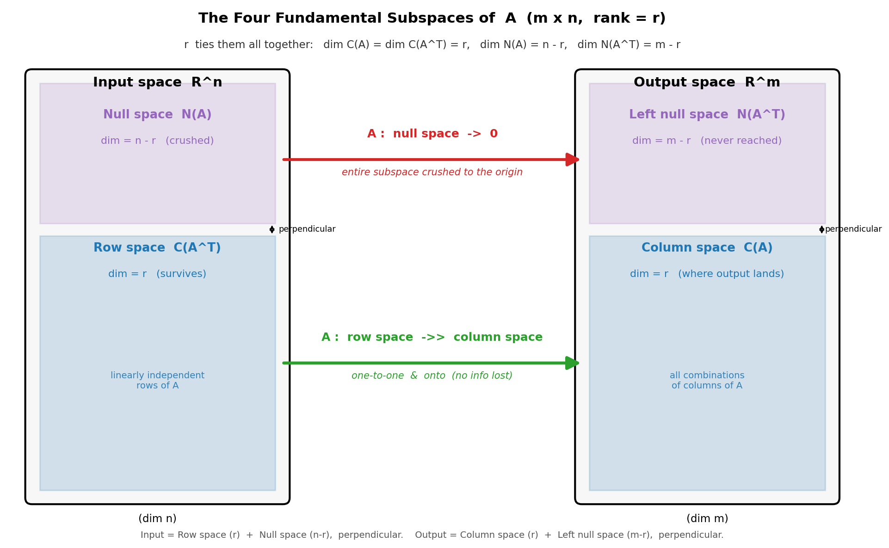
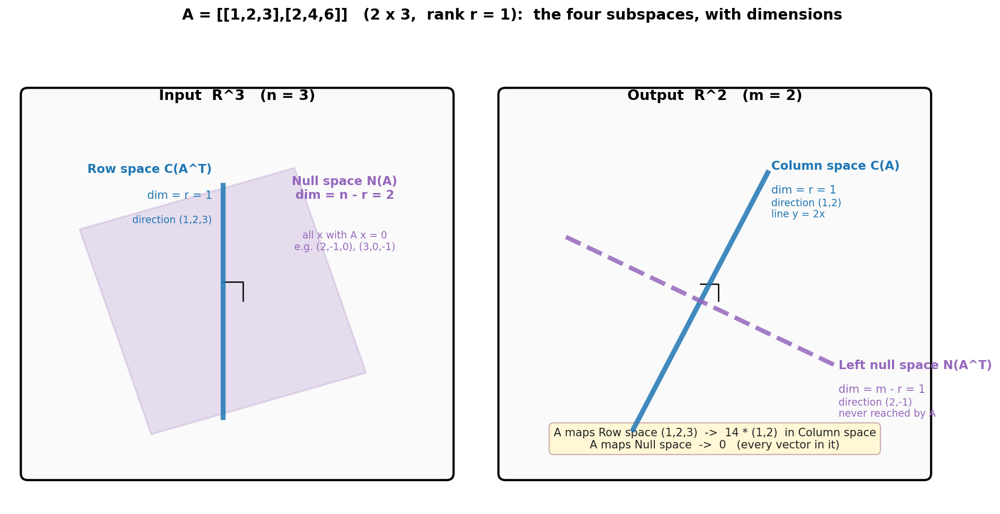

# 第 11 章 · 四个基本子空间:揉捏的完整画像

> **核心问题**:第 9 章我们用行列式量"胀缩了几倍",第 10 章用秩量"还剩几维"。可这两个数,还只是在揉捏的**外面**看——只读了两个仪表盘。这一章,我们要把整套仪表盘拆开,**钻到一次揉捏的内部**,给它拍一张完整的 X 光片:
>
> 一个 `m×n` 的矩阵 `A`,把输入空间揉到输出空间。这次揉捏到底在输入端留下什么、压扁什么?又在输出端铺到哪里、够不到哪里?**有四个子空间,正好把这件事的四面全照出来**——列空间 `C(A)`、零空间 `N(A)`、行空间 `C(Aᵀ)`、左零空间 `N(Aᵀ)`。它们彼此正交、维数由秩串起来,合在一起,就是一次揉捏的**完整几何画像**。
>
> **读完本章你会明白**:
> - 为什么是**这四个**子空间、而不是三个或五个:输入端两片(行空间、零空间)、输出端两片(列空间、左零空间),不多不少,正好把一次揉捏"从哪来、到哪去、丢了什么、够不到什么"全说清。
> - **两大正交关系**(本章灵魂):输入空间里,行空间 ⊥ 零空间,且合起来正好是整个输入空间;输出空间里,列空间 ⊥ 左零空间,合起来正好是整个输出空间。**正交不是巧合,它是"互补"的几何签名。**
> - **维数关系**:列空间和行空间都是 `r` 维(列秩=行秩,回扣第 10 章);零空间 `n−r` 维;左零空间 `m−r` 维。**秩 `r` 像一根线,把四个子空间的大小全拴住了。**
> - **行空间被一比一地映到列空间**(不丢信息),零空间整个被映到原点。**这一句话,就是 `Ax=b` 解结构的完整几何背景。**

---

> **如果一读觉得太难**:先只记住三件事——
> ① **四个子空间,两两配对**:输入端"行空间(存活)+ 零空间(阵亡)",输出端"列空间(能到)+ 左零空间(到不了)";
> ② **行空间 ⊥ 零空间,列空间 ⊥ 左零空间**——每一对里,两个子空间互相垂直,且合起来正好是整个空间;
> ③ **维数全由秩 `r` 决定**:列空间、行空间都是 `r` 维;零空间 `n−r` 维;左零空间 `m−r` 维。
> 这三件记住,本章的几何图景你已抓在手里。

---

## 章首·一句话点破

第 10 章结尾我们留了句话:**"秩打开了门,四个基本子空间走进来,给一次揉捏画一幅完整的画像。"** 这一章,把这句话兑现。

一句话点破:

> **任何一个 `m×n` 矩阵 `A`,都自带四个子空间。输入空间被它干净地拆成两片——行空间(被一比一映到输出)和零空间(整个被映到原点);输出空间也被它干净地拆成两片——列空间(真正能到达的地方)和左零空间(永远够不着的地方)。这四片,两两正交、维数由秩 `r` 一根线串起。一张图,就是一次揉捏的完整 X 光。**

这句话是**结论**。我们倒过来拆:先看为什么是"这四个"(不是凭空凑数,是输入和输出各自被切两刀的自然结果);再讲最让人拍案的正交关系;然后用秩把维数全钉住;最后给第 15 章铺好背景——原来"`b` 在不在列空间"、"零空间有没有货"那两条判据,正是这张 X 光片上的两个斑点。

> **本章的定位**:这一章是"四个子空间"的主场——我们把列空间、零空间,连同两位新面孔**行空间**、**左零空间**,一起凑齐、各给一句话的定义,再画清它们的关系。(列空间、零空间这两位,第 15 章解 `Ax=b` 时会正式派上用场——"`b` 在不在 `C(A)` 决定有没有解"、"零空间有没有货决定解唯一不唯一"。本章先把它们作为四子空间的成员介绍清楚,解方程的细节留给第 15 章。)本章真正的新货,是**行空间**和**左零空间**,以及四者之间的**正交**与**维数**关系。

---

## 一、为什么是这四个:输入和输出,各被切两刀

要看清"为什么是四个",最稳的办法,是盯住一次揉捏的两头——**输入**和**输出**——分别问一句话。

矩阵 `A` 是 `m×n` 的,意思是:**它吃一个 `n` 维的输入箭头 `x`,吐一个 `m` 维的输出箭头 `Ax`**。输入住在 `ℝⁿ`,输出住在 `ℝᵐ`。一次揉捏,把 `ℝⁿ` 里的箭头搬进 `ℝᵐ`。

### 输入端的两片:哪些活着出去,哪些死在门口

输入空间 `ℝⁿ` 里的箭头,被 `A` 揉完,只有两种命运:

- **要么活着到达输出**:`Ax ≠ 0`,这根箭头在输出里留下了痕迹。
- **要么被压扁到原点**:`Ax = 0`,这根箭头被整根吞掉,输出里看不到它。

这两种命运,各自对应一个子空间:

> **零空间 `N(A)`**:`Ax = 0` 的全体 `x`,即被揉到原点的输入。它的维数叫**零度 nullity** = `n − r`(第 10 章秩-零度定理)。**【一句话点破:零空间有货,解就不唯一——第 15 章解 `Ax=b` 时正是用它判唯一性。】**
>
> **行空间 `C(Aᵀ)`**:`A` 的各行张成的空间,住在输入 `ℝⁿ` 里。它是"真正存活、能映到非零输出的输入部分"。本章新讲。

为什么"行空间 = 存活的部分"?这里有个干净到让人舒服的事实(本章第二节会从正交给证明):**行空间里的每一根非零箭头,都不会被 `A` 揉到原点**。换句话说,输入空间里"能活着出去"的,正好就是行空间;而被吞掉的,正好就是零空间。两者**互补**,合起来正好是整个 `ℝⁿ`。

> **比喻**:把输入空间 `ℝⁿ` 想象成一座大厦。矩阵 `A` 是个门禁——进去的人(箭头),要么被放行(映到非零输出),要么被拦在门口压成纸片(映到原点)。**行空间是"被放行"的那一层楼,零空间是"被拦下"的那一层楼,两层加起来正好是整座大厦,谁也没漏。**

### 输出端的两片:能到的和够不着的

输出空间 `ℝᵐ` 里的箭头,也分两片:

> **列空间 `C(A)`**:`A` 的各列张成的空间,住在输出 `ℝᵐ` 里。它是"所有能被 `A` 揉出来的箭头"的集合——也就是 `Ax` 能到达的全部位置。维数 = `r`。**【一句话点破:`b` 在不在 `C(A)`,决定 `Ax=b` 有没有解——第 15 章会正式用它。】**
>
> **左零空间 `N(Aᵀ)`**:满足 `Aᵀy = 0` 的全体 `y`,住在输出 `ℝᵐ` 里。它是"输出里 `A` 永远够不到的方向"。本章新讲。

为什么叫"左零空间"?因为 `Aᵀy = 0` 等价于 `yᵀA = 0`——`y` 从**左边**乘 `A` 得零。它是 `Aᵀ` 的零空间,所以叫"`A` 的左零空间"。它的维数 = `m − r`。

列空间和左零空间同样**互补**:合起来正好是整个输出 `ℝᵐ`。列空间是"`A` 能揉到的地方",左零空间是"`A` 怎么揉都够不到的地方"。

> **钉死这件事**:**四个子空间,不是凑数,是一次揉捏的四面 X 光——输入端两片(行空间、零空间),输出端两片(列空间、左零空间)。** 行空间+零空间 = 输入 `ℝⁿ`;列空间+左零空间 = 输出 `ℝᵐ`。各占一头,各被切两刀。

---

## 二、两大正交关系:本章的灵魂

四个子空间为什么不是随便切的?因为它们之间,藏着两条**正交**关系。这两条关系,是本章最美的部分,也是后面(投影、最小二乘、SVD)反复要用到的地基。

### 关系 ①:在输入 `ℝⁿ` 里,行空间 ⊥ 零空间

先说结论,再讲为什么。

> **行空间 `C(Aᵀ)` 和零空间 `N(A)`,在输入空间 `ℝⁿ` 里互相垂直(perpendicular)。** 而且合起来,正好是整个 `ℝⁿ`(行空间 ⊕ 零空间 = `ℝⁿ`)。

为什么"垂直"?这有个一行就能写完的证明,但它背后的几何,极干净。

任取行空间里的一根箭头 `u`,和零空间里的一根箭头 `v`。我们要说明 `u · v = 0`(点积为零 ⟺ 垂直)。

- `u` 在行空间里,意思是 `u` 能写成 `A` 各行的线性组合:`u = Aᵀw`(某个 `w`)。换句话说,`uᵀ = wᵀA`。
- `v` 在零空间里,意思是 `Av = 0`。

于是 `uᵀv = (wᵀA)v = wᵀ(Av) = wᵀ·0 = 0`。**点积为零,垂直。**

> **比喻(橡皮膜)**:这次揉捏在输入端画了一条无形的缝。缝的一边是行空间(存活),缝的另一边是零空间(阵亡)。**这条缝不是斜的,是直角**——存活的箭头和阵亡的箭头,方向永远互相垂直。第 10 章那张图里我们画过"存活方向(绿)和阵亡方向(紫)互相垂直",这里把它升级成一条铁律:**整个行空间和整个零空间,作为两个子空间,互相垂直。**

"合起来 = 整个 `ℝⁿ`"怎么理解?维数上:行空间 `r` 维 + 零空间 `n−r` 维 = `n` 维 = 输入总维数;再加上正交(没有重叠的方向),两者拼起来正好铺满整个 `ℝⁿ`。这件事有个名字,叫 `ℝⁿ = C(Aᵀ) ⊕ N(A)`(直和分解)。

> **钉死**:输入 `ℝⁿ` = 行空间 ⊕ 零空间,两片互相垂直、维数相加 = `n`。**这就是为什么"行空间是存活的部分、零空间是阵亡的部分"——它们干净地把输入切成正交的两半,谁也不占谁的维。**

### 关系 ②:在输出 `ℝᵐ` 里,列空间 ⊥ 左零空间

把上一节的论证原封不动搬过来,把 `A` 换成 `Aᵀ`,把 `n` 换成 `m`,就得到输出端的版本:

> **列空间 `C(A)` 和左零空间 `N(Aᵀ)`,在输出空间 `ℝᵐ` 里互相垂直。** 且合起来正好是整个 `ℝᵐ`(列空间 ⊕ 左零空间 = `ℝᵐ`)。

证明也是一行:任取 `p ∈ C(A)`(故 `p = Av`,某个 `v`)和 `q ∈ N(Aᵀ)`(故 `Aᵀq = 0`,即 `qᵀA = 0`)。于是 `pᵀq = (Av)ᵀq = vᵀAᵀq = vᵀ·0 = 0`。**垂直。**

> **不这样看会怎样**:如果你只把列空间和零空间当成两个"独立的"子空间(像第 15 章那样分开用),你会错过一个关键事实——**列空间和左零空间是一对,行空间和零空间是一对,每一对都正交、都互补**。这个"配对"的结构,正是后面投影(第 16 章)的地基:`b` 不在列空间时,我们把它**投影**到列空间上,而"投影"几何上就是把 `b` 沿着**垂直于列空间**的方向(也就是左零空间方向)拉过去。**没有"列空间 ⊥ 左零空间"这条正交关系,就没有投影这件事。**

> **钉死**:输出 `ℝᵐ` = 列空间 ⊕ 左零空间,两片互相垂直、维数相加 = `m`。输入端的"行空间⊥零空间"和输出端的"列空间⊥左零空间",是本章最该刻进脑子的两条几何铁律。

---

## 三、维数关系:秩 `r` 把四个子空间全拴住

四个子空间的维数,不是四个独立的数——**它们全由一个数决定,那就是秩 `r`**。这一节,我们把四个维数摆出来,看清 `r` 怎么像一根线,把它们全拴住。

### 四个维数一览

对一个 `m×n`、秩为 `r` 的矩阵 `A`:

| 子空间 | 住在哪 | 维数 | 橡皮膜含义 |
|--------|--------|------|-----------|
| 行空间 `C(Aᵀ)` | 输入 `ℝⁿ` | **r** | 输入里"存活、能映到非零输出"的部分 |
| 零空间 `N(A)` | 输入 `ℝⁿ` | **n − r** | 输入里"被揉到原点"的部分 |
| 列空间 `C(A)` | 输出 `ℝᵐ` | **r** | 输出里"`A` 能到达"的部分 |
| 左零空间 `N(Aᵀ)` | 输出 `ℝᵐ` | **m − r** | 输出里"`A` 永远够不到"的部分 |

四个数:`r`, `n−r`, `r`, `m−r`。**每一个都是 `r` 加点东西、减点东西。**

### 为什么行空间和列空间都是 `r` 维

列空间维数 = `r`,这是第 10 章秩的定义本身——**秩 = 列空间维数**。没什么新东西。

行空间维数 = `r`,则是第 10 章那条"列秩 = 行秩"的铁律:**行空间维数(行秩)= 列空间维数(列秩)= `r`**。这是线代最深也最美的结论之一,我们当时用橡皮膜这样解释过:膜从正面揉(`A`)和从背面揉(`Aᵀ`),压扁的程度一样。所以**行空间和列空间,维数永远是同一个 `r`**——它们是一对"同呼吸"的子空间。

### 零空间和左零空间的维数:被 `n−r` 和 `m−r` 卡死

零空间维数 = `n−r`:这是第 10 章的秩-零度定理(`rank + nullity = n`)。没什么新东西,一句话回扣。

左零空间维数 = `m−r`:把秩-零度定理套到 `Aᵀ` 上(`Aᵀ` 是 `n×m`,秩还是 `r`),得 `rank(Aᵀ) + nullity(Aᵀ) = m`,即 `r + dim N(Aᵀ) = m`,所以 `dim N(Aᵀ) = m − r`。**左零空间的维数,就是输出总维数 `m` 减去秩 `r`。**

> **钉死这件事**:**四个子空间的维数,全由秩 `r` 决定**——行空间、列空间都是 `r`;零空间 `n−r`;左零空间 `m−r`。拿到一个矩阵,先算秩 `r`,四个子空间有多大,你就全知道了。**秩,是这张 X 光片的总刻度。**

### 一个一致性检查(顺手验证正交关系的"维数对得上")

回头看第二节那两条正交关系:

- 输入 `ℝⁿ` = 行空间(`r` 维) ⊕ 零空间(`n−r` 维)。维数相加:`r + (n−r) = n` ✓。
- 输出 `ℝᵐ` = 列空间(`r` 维) ⊕ 左零空间(`m−r` 维)。维数相加:`r + (m−r) = m` ✓。

**维数对得上,这是正交分解必须满足的算术。** 如果某天你算出"行空间 `r` 维 + 零空间 `n−r+1` 维",那一定是你算错了——因为两个互相垂直的子空间,维数加起来不可能超过所在空间的总维数。这条算术,反过来也是一张自检的网。

---

## 四、完整画像:行空间一比一映到列空间,零空间映到原点

把前三节拼起来,我们终于能画出"一次揉捏的完整 X 光片"。下面这张图,是本章的主图,也是 Gilbert Strang 在他的线性代数教材里反复用的那张经典图。



盯着这张图,读三句话:

1. **左框 = 输入 `ℝⁿ`**,被切成两片:**行空间(`r` 维,蓝)+ 零空间(`n−r` 维,紫)**,两片互相垂直(图里的"⊥"标记)。
2. **右框 = 输出 `ℝᵐ`**,被切成两片:**列空间(`r` 维,蓝)+ 左零空间(`m−r` 维,紫)**,两片也互相垂直。
3. **中间两根箭头**,就是 `A` 干的两件事:
   - **绿箭头:行空间 → 列空间**,一比一、且满映到(one-to-one and onto)。输入里存活的那 `r` 维,**一点不丢地**映成输出里那 `r` 维列空间。
   - **红箭头:零空间 → 原点**。输入里那 `n−r` 维被吞掉的方向,**整片压成输出里的一个点(原点)**。

### 为什么"行空间到列空间"是一比一

这是本章最该想通的一句结论,我们慢慢拆。

**"一比一"是什么意思**?是说:**行空间里两根不同的箭头,映到列空间里,一定还是两根不同的箭头(不会重合)**。换句话说,`A` 限制在行空间上这个映射,是**单射**(injective)——不同的输入,产出不同的输出。

**"满映到"是什么意思**?是说:**列空间里的每一根箭头,都正好是行空间里某一根箭头的像**。即 `A`(行空间)= 列空间,不多不少。

两件事合起来:行空间和列空间,通过 `A` 建立**一一对应**,像两面镜子互相照。这件事有个名字,叫**行空间与列空间同构**,维数都是 `r`。

**为什么成立**?这里给一个干净的论证:

- 假设行空间里有两根箭头 `u₁`、`u₂`,映到同一个输出:`Au₁ = Au₂`。那么 `A(u₁ − u₂) = 0`,即 `u₁ − u₂` 落在零空间里。可 `u₁ − u₂` 又在行空间里(行空间是子空间,差还在里面)。**一个向量同时在行空间又在零空间——而它俩正交,只有零向量能同时待在两个正交的子空间里。** 所以 `u₁ − u₂ = 0`,即 `u₁ = u₂`。矛盾。**所以一比一。**
- "满映到"更简单:`A` 的输出永远在列空间里(定义),而行空间以外的输入(零空间那部分)全映到原点,所以**列空间里的非零输出,全靠行空间那部分撑起来**。行空间映过来,正好铺满整个列空间。

> **比喻(橡皮膜)**:把这次揉捏想成一台分拣机。输入大厦里,存活层(行空间)的每一件包裹,都被精确地搬到输出仓库的存活货架(列空间)上,**一件对一格,没有挤兑、没有丢失**;而阵亡层(零空间)的所有包裹,全被丢进同一个销毁口(原点)。**存活的部分,信息完整无损;阵亡的部分,全军覆没。** 这就是为什么满秩(可逆)的矩阵珍贵——它没有阵亡层,所有信息都活着来回。

### 零空间为什么"整片映到原点"

零空间的**定义**就是 `Ax = 0`。所以零空间里的每一根箭头,映出来都是原点。这不是什么新结论,但放在这张完整画像里,它的位置清楚了:**零空间是输入大厦里被销毁的那一层,它整片塌成原点一个点。** 维数 `n−r` 告诉你这层有多大;正交关系告诉你它和存活层垂直;秩-零度定理告诉你它的维数和行空间的维数加起来正好是 `n`。

> **钉死这件事**:**一次揉捏,把输入(= 行空间 ⊕ 零空间)映到输出(= 列空间 ⊕ 左零空间)。行空间一比一映到列空间(不丢信息),零空间整片映到原点。这就是 `Ax = b` 解结构的完整几何背景**——`b` 在列空间才有解(绿箭头够得到);零空间非零解就不唯一(因为零空间里随便一根 `n`,都让 `x + n` 也是解)。将来第 15 章解 `Ax=b` 的两条判据,在这张 X 光片上一目了然。

---

## 五、为第 15 章铺路:解方程的判据,有了完整背景

第 15 章将用列空间和零空间,给出解 `Ax = b` 的两条判据。现在,把这张完整的四子空间画像铺开,那两条判据的位置一下子清楚了。

- **"有没有解" ⟺ `b` 在不在列空间 `C(A)`**:本章给了它完整背景——列空间是 `A` 真正能到达的输出部分(绿箭头的终点),维数 `r`;**它外面是左零空间(`m−r` 维),`A` 怎么揉都够不到**。所以 `b` 落在列空间里有解,落在左零空间那片里就无解。
- **"解唯一不唯一" ⟺ 零空间 `N(A)` 有没有货**:本章也给了它完整背景——零空间是输入里被整片映到原点的那 `n−r` 维(红箭头)。它有非零向量(`n−r > 0`,即降秩),解就能叠加无穷多个;它只有零向量(`n−r = 0`,即列满秩),解才唯一。

> **所以**:**第 15 章那张"`b` 在不在列空间、零空间有没有货"的判据表,背后是完整的四子空间正交分解。** 那时我们只用到了两个子空间(列空间、零空间),是因为解方程只问"有没有解、唯一不唯一"两个问题。可一旦你想问得更深——"`b` 离列空间有多远"、"能不能找一个离 `b` 最近的近似解"(第 17 章最小二乘)——你就**必须**把左零空间请出来,因为"`b` 离列空间的距离"正是沿着**垂直于列空间**的方向(也就是左零空间方向)量的。**四子空间,是解方程这套理论的完整坐标系。**

---

## 计算佐证:拿一个 `2×3` 矩阵,亲手把四个子空间全摸一遍

这一节,我们挑一个具体的 `m×n` 矩阵,用纸笔和 numpy,**把四个子空间的基、维数、正交关系,一一坐实**。

选 `A = [[1,2,3],[2,4,6]]`,一个 `2×3` 矩阵(`m=2`, `n=3`)。肉眼能看出:第二行是第一行的 2 倍,所以秩 `r = 1`。

### 1. 先定四个维数

秩 `r = 1`(两行共线,只撑得起一条线)。于是:

| 子空间 | 维数公式 | 这个例子的值 |
|--------|---------|------------|
| 行空间 `C(Aᵀ)` | `r` | **1** |
| 零空间 `N(A)` | `n − r = 3 − 1` | **2** |
| 列空间 `C(A)` | `r` | **1** |
| 左零空间 `N(Aᵀ)` | `m − r = 2 − 1` | **1** |

维数对得上:`1 + 2 = 3 = n`(输入),`1 + 1 = 2 = m`(输出)。✓

### 2. 把四个子空间的基找出来(纸笔)

**行空间 `C(Aᵀ)`(1 维,住 `ℝ³`)**:`A` 的两行是 `(1,2,3)` 和 `(2,4,6)=2·(1,2,3)`,共线。所以行空间基 = `{(1,2,3)}`。

**零空间 `N(A)`(2 维,住 `ℝ³`)**:解 `Ax = 0`,即 `x₁+2x₂+3x₃ = 0`(两条方程实际是同一条)。两个自由变量,取 `(x₂,x₃) = (1,0)` 得 `x₁=−2` → `(−2,1,0)`;取 `(0,1)` 得 `x₁=−3` → `(−3,0,1)`。**为了数字干净,用 `(2,−1,0)` 和 `(3,0,−1)`**(它们是上面两个的倍数,验算 `A·(2,−1,0) = (1·2+2·(−1)+3·0, 2·2+4·(−1)+6·0) = (0,0)` ✓;同理 `A·(3,0,−1) = (0,0)` ✓)。所以零空间基 = `{(2,−1,0), (3,0,−1)}`。

**列空间 `C(A)`(1 维,住 `ℝ²`)**:`A` 的三列 `(1,2)`、`(2,4)`、`(3,6)` 都是 `(1,2)` 的倍数,共线。所以列空间基 = `{(1,2)}`,也就是直线 `y = 2x`。

**左零空间 `N(Aᵀ)`(1 维,住 `ℝ²`)**:解 `Aᵀy = 0`,`Aᵀ = [[1,2],[2,4],[3,6]]`,即三条方程 `y₁+2y₂=0`(实际同一条)。取 `y₂=1` 得 `y₁=−2` → `(−2,1)`,或干净的 `(2,−1)`。验算 `Aᵀ·(2,−1) = (1·2+2·(−1), 2·2+4·(−1), 3·2+6·(−1)) = (0,0,0)` ✓。所以左零空间基 = `{(2,−1)}`,也就是直线 `y = −x/2`。

### 3. 验证两条正交关系(纸笔)

**输入端:行空间 ⊥ 零空间**。行空间基 `(1,2,3)` 点乘零空间基:
- `(1,2,3) · (2,−1,0) = 2 − 2 + 0 = 0` ✓
- `(1,2,3) · (3,0,−1) = 3 + 0 − 3 = 0` ✓

**输出端:列空间 ⊥ 左零空间**。列空间基 `(1,2)` 点乘左零空间基:
- `(1,2) · (2,−1) = 2 − 2 = 0` ✓

**两条正交关系,纸笔全过。** 注意 `(1,2)` 和 `(2,−1)` 在 `ℝ²` 里正好是互相垂直的两个方向——这就是为什么列空间(沿 `(1,2)`)和左零空间(沿 `(2,−1)`)把整个 `ℝ²` 切成正交的两片。

### 4. 验证"行空间一比一映到列空间"

行空间基 `(1,2,3)` 被 `A` 映到:`A·(1,2,3) = (1·1+2·2+3·3, 2·1+4·2+6·3) = (14, 28) = 14·(1,2)`。**正好落在列空间(沿 `(1,2)`)上** ✓。而且是一比一:行空间里任意两根不同的箭头(都是 `(1,2,3)` 的不同倍数),映到列空间里是 `(1,2)` 的不同倍数,**不会重合**。

零空间的两根基 `(2,−1,0)` 和 `(3,0,−1)`,映出来都是 `(0,0)`——**整片映到原点** ✓。

下图把这个例子的四个子空间画出来。**左:输入 `ℝ³`**,蓝色行空间(1 维,沿 `(1,2,3)`)垂直地戳穿紫色零空间平面(2 维);**右:输出 `ℝ²`**,蓝色列空间(直线 `y=2x`)垂直于紫色左零空间(虚线,沿 `(2,−1)`)。`A` 把行空间那根线一比一映到列空间那根线,把零空间那个平面整片压成原点。



### 5. numpy 一把核对全部

```python
import numpy as np

A = np.array([[1., 2., 3.],
              [2., 4., 6.]])
m, n = A.shape
r = np.linalg.matrix_rank(A)
print(f"A is {m}x{n},  rank r = {r}")
print(f"  dim Row space     C(A^T) = r       = {r}")
print(f"  dim Null space    N(A)   = n - r   = {n - r}")
print(f"  dim Column space  C(A)   = r       = {r}")
print(f"  dim Left null     N(A^T) = m - r   = {m - r}")

# Bases we found by hand:
row_basis   = np.array([1., 2., 3.])            # in R^3
null_basis  = np.array([[2., -1., 0.],          # in R^3, 2 vectors
                        [3.,  0., -1.]])
col_basis   = np.array([1., 2.])                # in R^2
lnull_basis = np.array([2., -1.])               # in R^2

# 1) Verify null space:  A @ null_vec == 0
print("\nA @ null space vectors (should be 0):")
for v in null_basis:
    print("  A @", v, "=", A @ v)

# 2) Verify left null space:  A^T @ y == 0
print("\nA^T @ left-null vector (should be 0):", A.T @ lnull_basis)

# 3) Orthogonality in input  R^3: row . null == 0
print("\nRow space . Null space (input orthogonality):")
for v in null_basis:
    print("  ", row_basis.dot(v))

# 4) Orthogonality in output R^2: col . left-null == 0
print("\nColumn space . Left null space (output orthogonality):",
      col_basis.dot(lnull_basis))

# 5) A maps row space one-to-one onto column space:
print("\nA @ row_basis (1,2,3) =", A @ row_basis, " = 14 * (1,2)  -> lands in C(A)")
```

预期输出:

```
A is 2x3,  rank r = 1
  dim Row space     C(A^T) = r       = 1
  dim Null space    N(A)   = n - r   = 2
  dim Column space  C(A)   = r       = 1
  dim Left null     N(A^T) = m - r   = 1

A @ null space vectors (should be 0):
  A @ [ 2. -1.  0.] = [0. 0.]
  A @ [ 3.  0. -1.] = [0. 0.]

A^T @ left-null vector (should be 0): [0. 0. 0.]

Row space . Null space (input orthogonality):
   0.0
   0.0

Column space . Left null space (output orthogonality): 0.0

A @ row_basis (1,2,3) = [14. 28.]  = 14 * (1,2)  -> lands in C(A)
```

**纸笔、numpy、几何图,三者严丝合缝。** 四个子空间的维数 `1, 2, 1, 1` 全对;两条正交关系(输入端、输出端)点积全零;行空间一比一映到列空间(落在 `(1,2)` 方向上)。**这就是"会算"到"真懂"的闭环——你不仅算出了四个数,还看见了它们背后那张完整的揉捏 X 光片。**

> **一个小提醒(浮点)**:numpy 算点积时,你可能看到 `2.22e-16` 这种本该是 0 的数。那是浮点误差(第 10 章说过),几何上就是 0.真正用 `scipy.linalg.null_space` 或 SVD 求零空间时,基向量是单位化的(比如 `(0.894, −0.447, 0)` 这种),不是干净的整数;但它们张成的空间,和我们手算的 `{(2,−1,0),(3,0,−1)}` 是同一个。

---

## 章末小结

### 用"橡皮膜"比喻回顾本章

回到那张画满方格的橡皮膜。这一章,我们终于给一次揉捏拍了一张完整的 X 光片——不再只读"胀缩几倍"(行列式)、"剩几维"(秩)两个仪表盘,而是钻进揉捏的内部,看清它**在输入端、输出端各切出哪两片**。

答案分四层:

1. **四个子空间,两两配对**。输入 `ℝⁿ` 被切成**行空间 `C(Aᵀ)`(存活)+ 零空间 `N(A)`(阵亡)**;输出 `ℝᵐ` 被切成**列空间 `C(A)`(能到)+ 左零空间 `N(Aᵀ)`(到不了)**。行空间和左零空间,是本章的两个新面孔。
2. **两大正交关系(本章灵魂)**:行空间 ⊥ 零空间(在输入端),列空间 ⊥ 左零空间(在输出端)。**每一对里,两个子空间互相垂直、合起来正好是整个空间。** 这是后面投影、最小二乘、SVD 的地基。
3. **维数全由秩 `r` 拴住**:行空间、列空间都是 `r` 维(列秩=行秩);零空间 `n−r` 维;左零空间 `m−r` 维。**秩是这张 X 光片的总刻度。**
4. **完整画像**:行空间被 `A` 一比一映到列空间(不丢信息),零空间整片映到原点。**这一句话,就是 `Ax=b` 解结构的完整几何背景**——`b` 在列空间才有解(绿箭头够得到),零空间非零解就不唯一。

### 本章在全书主线中的位置

本书的主线是:**一切线代概念,都是"空间被揉捏"这件事的某个侧面。** 那么,本章的概念——四个基本子空间——是揉捏的**哪个侧面**?

> **本章刻画的是"揉捏的完整几何图景":不再只读两个仪表盘(行列式、秩),而是钻进揉捏内部,给它拍一张全景 X 光——输入从哪两片来、输出到哪两片去、哪片存活、哪片阵亡、哪片够得到、哪片够不着。**

这一章,是第 3 篇《揉捏的度量》的收束之刀:

- **行列式(第 9 章)**:揉捏把面积/体积胀缩几倍(det=0 = 压扁)。
- **秩(第 10 章)**:揉捏之后,空间还剩几维。
- **四个子空间(本章)**:把"剩几维"升级成"哪几维存活、哪几维阵亡、输出哪几维够得到"——给一次揉捏画完整的画像。

你看,这三章是一条递进的线:**det 告诉你"压没压扁",rank 告诉你"压扁到几维",四个子空间告诉你"被压扁的到底是哪些方向、输出里到底够不到哪些方向"。** 秩是连接它们的枢纽——四个子空间的维数全由 `r` 决定。第 3 篇到此收束,下一章我们离开"度量揉捏",进入一片新天地。

### 五个"为什么"清单

如果你只能记五件事,记这五件:

1. **为什么是这四个子空间**:输入 `ℝⁿ` 被切成行空间(存活)+ 零空间(阵亡);输出 `ℝᵐ` 被切成列空间(能到)+ 左零空间(到不了)。**各占一头,各被切两刀,不多不少。**
2. **两大正交关系是什么**:行空间 ⊥ 零空间(输入端);列空间 ⊥ 左零空间(输出端)。每一对里,两个子空间互相垂直、合起来正好是整个空间。**正交不是巧合,是"互补"的几何签名。**
3. **四个维数怎么算**:行空间、列空间都是 `r`;零空间 `n−r`;左零空间 `m−r`。**全由秩 `r` 决定。** 维数相加验证:`r + (n−r) = n`,`r + (m−r) = m`。
4. **行空间和列空间是什么关系**:**通过 `A` 一比一、满映到地对应**——行空间里不同的箭头映到列空间里还是不同(单射,因为正交让"同时在行空间和零空间"的只有零向量),且行空间映过来正好铺满列空间(满射)。两者维数都是 `r`,是一对"同呼吸"的子空间。
5. **零空间为什么整片映到原点**:零空间定义就是 `Ax = 0`,所以零空间里每一根箭头都映到原点。它和行空间正交,维数 `n−r`,是输入里"被销毁"的那一层。

### 想继续深入,该往哪钻

- **看动画**:3Blue1Brown《线性代数的本质》的**"列空间与零空间"一集**,以及紧邻的几集。它用动画把"`A` 把输入空间切成行空间和零空间、映到输出的列空间"画了出来,本章的文字比喻在那里会变成你能亲眼数维的画面。**尤其推荐看"`A` 把行空间一比一映到列空间"那个镜头——它让"信息不丢"这件事有了视觉。**
- **Gilbert Strang 的"四子空间图"**:这张图是 Strang 在他的《线性代数导论》里反复用的招牌图(就是本章图 11.1 的原型)。Strang 把它称为"线性代数里最重要的一张图"。如果你能找到他的讲座视频(MIT 18.06 第 10 讲前后),他会亲手在黑板上画一遍,边画边讲四片之间的正交和维数关系——那是看这张图最痛快的方式。
- **亲手玩四个子空间**:把上面的 numpy 代码拿去,自己造几个矩阵(`2×3`、`3×2`、`3×3` 秩 2 的),对每个算 `r`、写出四个维数,再用 SVD 或手算找出四个子空间的基,验证两条正交关系。改一晚上,你对"一次揉捏的完整画像"的直觉会脱胎换骨。**特别推荐造一个 `3×3` 秩 2 的矩阵,体会"3D 输入被切成 2 维行空间 + 1 维零空间"。**
- **尝一口左零空间的味道(选读)**:左零空间看似冷门,其实它是第 17 章最小二乘的主角。当 `b` 不在列空间(无精确解)时,我们要把 `b` **投影**到列空间上,找最近的近似解;而"投影"几何上就是沿着**垂直于列空间**的方向(也就是左零空间方向)把 `b` 拉过去。**没有左零空间,就没有"投影"这件事。** 这条线埋着,第 16 章正交与投影、第 17 章最小二乘会把它收回来。
- **函数空间尝鲜(选读)**:四个子空间这套结构,在无穷维函数空间里照样成立。比如微分算子 `D: f ↦ f'`(把可微函数映到它的导数),它的"零空间"是所有常数函数(导数为 0,1 维),"列空间"是所有函数(因为任何连续函数都能被积分回去,`D` 满"射")。秩-零度定理在函数空间里叫**弗雷德霍姆定理(Fredholm alternative)**,是泛函分析和微分方程理论的支柱。这条线埋着,后面有机会再收。

---

> 第 3 篇收束了。行列式量胀缩,秩量剩几维,四个子空间画出完整画像——"度量揉捏"的整套工具箱,到这里齐备。可这套工具,一直在盯**这一次**揉捏的整体。线性代数还有一片更精妙的天地:**在一整片复杂的揉捏里,抓住那几根"不转头、只被拉长"的轴**。抓住它们,再复杂的揉捏瞬间变简单。翻开 **第 4 篇 · 第 12 章 · 特征值与特征向量:揉捏中不转头的轴**——你会看见,一根轴被拉伸的倍数,如何浓缩了一次揉捏的全部信息。
