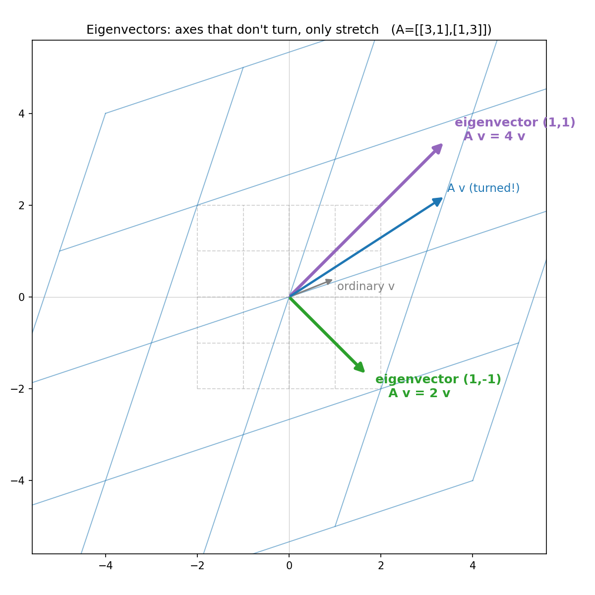
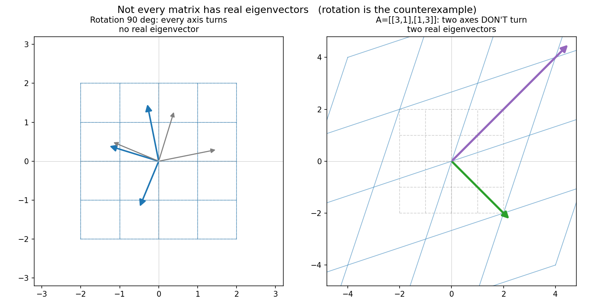

# 第 12 章 · 特征值与特征向量:揉捏中不转头的轴

> **核心问题**:一整片复杂的揉捏里,绝大多数箭头都被拽得歪七扭八、转了方向。可神奇的是——总有那么几根**特殊的轴,被揉完之后,方向竟然没变**(只是被拉长或压短了)。这几根"不转头的轴",凭什么特殊?它们被拉伸的倍数,又藏着什么秘密?
>
> 这一章,我们盯住一次揉捏里最反直觉、也最精华的一个侧面:**不变方向 + 拉伸倍数**。你会发现,`Ax = λx` 这副让你在考卷上算到头秃的代数面孔,翻译成几何,不过是一句话——**"这根箭头被揉完,只沿原来的方向被拉伸了 λ 倍,没转"。**
>
> **读完本章你会明白**:
> - 一个变换把空间揉歪,绝大多数箭头偏转了方向,但有几根**被揉完方向不变(或反向)、只被拉长/压短**的特殊轴——这根轴叫**特征向量(eigenvector)**,它被拉伸的倍数叫**特征值(eigenvalue)** λ。
> - `Ax = λx` 这个等式的几何真身:不是字母游戏,而是"x 被 A 揉完,等于把 x 沿原方向拉伸 λ 倍"。
> - 那个吓人的特征方程 `det(A − λI) = 0`,不是天上掉下来的公式,而是**几何逼出来的**:想要"一根非零箭头被揉回原方向",变换 `A − λI` 必须把空间**压扁**——压扁的判据,就是行列式等于零。
> - 以及一个会让你世界观一震的反例:**纯旋转矩阵没有实特征向量**——因为旋转中没有任何一根轴"不转头"。这个反例,会为第 14 章"对称矩阵必有实特征值"埋下对比的伏笔。

> **如果一读觉得太难**:先只记住三件事——
> ① **特征向量 = 揉捏中不转头的轴**;**特征值 λ = 这根轴被拉长/压短的倍数**。
> ② **`Ax = λx`** 就是"x 被揉完,只沿原方向被拉伸 λ 倍"这句话的代数写法。
> ③ 解特征值用的是 `det(A − λI) = 0`,它问的是:**λ 取多少时,`A − λI` 会把空间压扁**(因为只有压扁,才能让一根非零箭头被送到原点,也就是"只拉伸不转头")。

---

## 章首·一句话点破

前面十一本书(编者注:前 11 章),我们一路把"揉捏"看得很清楚:矩阵是揉捏的说明书,行列式量它揉胀了多少倍,秩量它揉完还剩几维。可这一章要问的,是揉捏里**最刁钻**的一个侧面:

> **一整片乱七八糟的揉捏里,有没有那么几根箭头,命运特别"安稳"——被揉完之后,方向纹丝不动,只是被拉长或压短了?**

答案是:**绝大多数时候,有。而且抓住这几根特殊的轴,整片复杂的揉捏瞬间变得极其简单。**

一句话点破:

> **特征向量,就是揉捏中那几根"不转头、只被拉伸"的轴;特征值,就是每根轴被拉伸的倍数。一个矩阵的"性格",全藏在这几根轴和几个倍数里。**

这句话是**结论**,不是理由。本章倒过来拆:先在几何上看清"不转头"是什么意思,再让 `Ax = λx` 这个代数等式从几何里**长出来**,最后逼出那个著名的特征方程 `det(A − λI) = 0`——你会看到,这个让无数人算到怀疑人生的公式,完全是几何逼出来的,一点不神秘。

---

## 一、几何:揉捏中,绝大多数箭头都偏了,只有几根"不转头"

我们从最直观的画面开始。想象你伸手去揉那张画满方格的橡皮膜——比如用一个矩阵 `A = [[3,1],[1,3]]` 去揉它(第一列 `(3,1)` 是 i 被搬去的新家,第二列 `(1,3)` 是 j 被搬去的新家)。整个平面被拉伸、被推歪,绝大多数箭头都被拽得偏转了方向。

可就在这一片混乱里,有**两根箭头的命运完全不同**:

- 一根沿**右上 45° 方向** `(1,1)`。它被揉完,正好沿着自己原来的方向**拉长了 4 倍**——方向一点没转。
- 一根沿**右下 45° 方向** `(1,−1)`。它被揉完,也沿着自己原来的方向**拉长了 2 倍**——方向还是没转。

> 下图就是这件事。灰虚线 = 揉之前的方格,蓝实线 = 揉之后的方格。**盯着那根灰色"普通向量 v"看——它被揉成了蓝色的 `Av`,方向明显转了**(斜率从 0.4 变到 0.65)。再看两根粗箭头:紫色的 `(1,1)` 方向被原封不动拉长 4 倍,绿色的 `(1,−1)` 方向被原封不动拉长 2 倍——**它们纹丝不转,只是变长了。这两根,就是特征向量。**



> **比喻**:想象揉一张橡皮膜,绝大多数箭头就像被搅动的水草——东倒西歪。但总有那么几根**像被焊死的旗杆**,不管你怎么揉,它们始终指向同一个方向,只是被拉长或压短。这几根"焊死的旗杆",就是特征向量。

> **不这样看会怎样**:如果你只盯着数字,你会以为"特征向量"是某个为了解题而硬造出来的概念。可一旦你看见那几根"焊死的旗杆",你就会明白——它描述的是揉捏里一个**极其特殊的几何事实**:再乱的揉捏,也有几根轴方向不变。**抓住它们,乱糟糟的揉捏立刻有了"主轴",事情变简单。** 这就是为什么特征值是"线代最精华的部分"。

---

## 二、`Ax = λx`:把"不转头只拉伸"写成算式

上一节我们用嘴说清了"特征向量是揉捏中不转头的轴"。现在,把这个几何事实**翻译成算式**——这个算式,就是那个让你在考卷上背到滚瓜烂熟的 `Ax = λx`。

### 怎么翻译

设 `x` 是那根"不转头的旗杆"(特征向量),`A` 是这次揉捏。它的几何含义是:

> **`x` 被 `A` 揉完,等于把 `x` 沿原来的方向拉伸(或压缩、或反向)了 λ 倍。**

把这句话写成算式,就是:

```
   A · x  =  λ · x
```

> **钉死这件事**:`Ax = λx` 不是字母游戏,不是"为了凑出一个等式"。它的几何真身只有一句话——**"x 被揉完,只沿原方向被拉伸 λ 倍,没转"**。左边 `Ax` 是"x 被 A 揉后的新位置";右边 `λx` 是"x 沿原方向拉长 λ 倍"。两者相等,就是在说"揉完 = 拉伸,方向没变"。

### λ 的几种长相,对应几种几何动作

`λ` 这个拉伸倍数,取不同的值,几何上对应完全不同的动作。把这些长相记牢,你以后看到一个特征值,脑子里立刻能"放映"出它在干什么:

- **λ > 1**:`x` 被沿原方向**拉长**(比如上面 λ=4、λ=2)。
- **0 < λ < 1**:`x` 被沿原方向**压短**(比如 λ=0.5,这根旗杆被揉短了一半,但方向没变)。
- **λ < 0**:沿原方向**反向拉伸**(比如 λ=−2,旗杆被揉到反方向,长度翻倍)。**负号 = 翻了个面**,方向"看起来"反了,但仍在同一根直线上,所以仍算"方向不变"(精确说是"在同一条轴上")。
- **λ = 0**:`x` 被直接**压扁到原点**(`Ax = 0·x = 0`)。这意味着 `A` 把整个空间压扁了(降维),`x` 恰好落在被压扁的那条"缝"里。这时行列式 `det(A)=0`(第 9 章讲过,行列式=0 就是压扁)。

> **一个小验证**(拿脑子里的图对照):上面的 `A=[[3,1],[1,3]]`,λ=4 沿 `(1,1)`、λ=2 沿 `(1,−1)`。手算一下:`A·(1,1) = (3+1, 1+3) = (4,4) = 4·(1,1)` ✓;`A·(1,−1) = (3−1, 1−3) = (2,−2) = 2·(1,−1)` ✓。**算式和几何严丝合缝。**

> **不这样看会怎样**:如果你把 `Ax = λx` 当成"两个东西乘起来等于另一个东西"的纯代数等式,你就永远看不出它在问什么。可一旦你把它读成"**这根箭头被揉完,只拉伸没转**",整个特征值理论就活了——你甚至能猜出一个变换大概有几根特征向量、它们大概指向哪。

---

## 三、逼出特征方程 `det(A − λI) = 0`:几何让公式长出来

现在到了本章最难、也最有"啊哈"的一步。教材通常在这里**直接甩出** `det(A − λI) = 0` 这个公式,让你套着解 λ。可它从哪来?为什么要这么算?**我们不让它从天上掉下来——我们从几何把它逼出来。**

### 第一步:把 `Ax = λx` 挪一挪

我们已经知道,特征向量满足 `Ax = λx`。把这个等式两边都减去 `λx`:

```
   Ax − λx = 0
```

把左边的 `x` 提出来(矩阵乘法对加法的分配律,第 1 章讲过):

```
   (A − λI) · x = 0
```

这里 `I` 是单位矩阵(对角线是 1,其余是 0),所以 `λI` 就是"对角线上全是 λ"的那个矩阵。`A − λI`,就是把 A 对角线上的每个数**都减去 λ**得到的新矩阵。

### 第二步:这句算式在几何上是什么意思

`(A − λI)·x = 0` 说的是:**有一个新变换 `A − λI`,它把箭头 `x` 揉到了原点(零向量)。**

可我们有个前提——**`x` 不能是零向量**(零向量谁都能送到原点,没意义;我们要的是"一根真正的箭头被揉回原方向")。

> **不这样会怎样**:如果 `x = 0`,那 `Ax = λx` 永远成立(0=0),这就成了废话。所以特征向量**必须非零**。这个"x 非零"的硬要求,是整个特征方程的命根子。

### 第三步:什么样的变换能把非零箭头送到原点

这是**整个推导的命门**。请盯紧这一步:

> 一个变换,要想把一根**非零**箭头送到原点,它**必须把空间压扁**。

为什么?因为"线性变换"有一条铁律——**原点不动**(第 1 章讲过,这是线性变换的两条规矩之一)。所以零向量永远被送到零。但如果变换是"满秩的"(没把空间压扁,空间还是原来那么满),那它是**一一对应**的:**只有零向量会被送到零,任何非零箭头都会被送到一个非零的新位置**。

反过来:**只有当变换把空间压扁了(从二维面压成一条线、或压成一个点),才会出现"一根非零箭头被送到原点"这种事**——因为压扁意味着"很多不同的箭头被揉到了同一条线/同一个点上",其中就包括被揉到原点的那些。第 10 章讲过,这些"被压扁到原点的箭头"组成的集合,叫**零空间(null space)**。

> **钉死这件事(本章最关键的一步)**:**要找特征向量,就是要找"一根非零箭头被 `A − λI` 揉到原点"**。而能把非零箭头揉到原点的变换,**只有一种——把空间压扁的变换**。所以,λ 必须取得让 `A − λI` **是个压扁的变换**。

### 第四步:压扁的判据是什么——行列式等于零

那么,"一个矩阵是不是压扁的变换",怎么判定?这正是第 9 章(行列式)的拿手好戏:

> **行列式 = 0 ⟺ 这个变换把空间压扁了(面积/体积变成 0)。**

所以,把上面三步接起来:

```
   要 x 非零,且 (A − λI)·x = 0
   → A − λI 必须把空间压扁
   → det(A − λI) = 0
```

这就是著名的**特征方程(characteristic equation)**:

```
   det(A − λI) = 0
```

> **所以这样看**:`det(A − λI) = 0` 不是天上掉下来的公式,不是数学家拍脑袋的规定。它是**三步几何推理**逼出来的结论:① 要找非零的特征向量;② 非零箭头能被送到原点,要求变换压扁空间;③ 压扁的判据是行列式为零。**公式,是这条因果链的最后一个环节,是理解的副产品。** 你只要记住了这条链,这个公式你自己就能推出来,根本不用背。

### 拿我们的例子走一遍

`A = [[3,1],[1,3]]`。算 `A − λI`:

```
   A − λI = [[3−λ, 1],
              [1, 3−λ]]
```

算它的行列式(第 9 章讲过,二阶行列式 = 主对角乘积 − 副对角乘积):

```
   det(A − λI) = (3−λ)(3−λ) − 1·1
               = (3−λ)² − 1
               = λ² − 6λ + 9 − 1
               = λ² − 6λ + 8
               = (λ − 4)(λ − 2)
```

令它等于 0:`(λ−4)(λ−2) = 0`,解出 **λ = 4 或 λ = 2**。这和我们一开始几何上看出来的两个拉伸倍数**一模一样**。

> **你看**,特征方程解出来的 λ,不是抽象的数字,而是**那两根"不转头的轴"被拉伸的倍数**。把 λ=4 代回 `(A − λI)·x = 0`,就能解出对应的特征向量方向 `(1,1)`;λ=2 对应 `(1,−1)`。**算式的每一步,都对应几何上一个看得见的动作。**

---

## 四、反例:旋转矩阵没有实特征向量(本章最有教育意义的一节)

讲到这里,你可能以为"每个矩阵都有特征向量"。**错。** 这一节给你看一个会让你世界观一震的反例,它点透了"特征向量"这件事的本质,也为第 14 章埋下伏笔。

### 纯旋转:没有任何一根轴"不转头"

看这个矩阵:

```
   R = [[0, −1],
        [1,  0]]
```

第 1 章我们见过它——**逆时针旋转 90°**。i 被搬到了"朝上" `(0,1)`,j 被搬到了"朝左" `(−1,0)`,整个平面转了 90°。

现在问:这个旋转里,有没有"不转头的轴"?

**好好想一下**——旋转,就是**把每一根箭头都转 90°**。那么,有没有一根箭头,被转了 90° 之后,还指着原来的方向?

> **没有。** 任何一根非零箭头,被转 90°,都一定会**指到和原来垂直的新方向**。没有任何一根能"转完还指原方向"。**所以,旋转 90° 这个变换,在实数范围内,没有特征向量。**

### 那它的特征方程是什么

不信的话,我们套特征方程算一遍:

```
   det(R − λI) = det([[−λ, −1],
                      [1,  −λ]])
              = (−λ)(−λ) − (−1)(1)
              = λ² + 1
```

令 `λ² + 1 = 0`,解出 **λ = ±i**(i 是虚数单位,`i² = −1`)。

**特征值是虚数 ±i!** 这意味着:在**实数**的几何世界里,这根"不转头的轴"**根本不存在**——你必须跑到复数空间里,才能找到它(复特征向量对应的是一个"旋转+缩放"的复合动作,这是更进阶的话题)。

> 下图把这个对比画出来。左边是旋转 90°:**每一根灰色箭头都被转到了蓝色的垂直方向,没有谁不转头**——实数域无特征向量。右边是我们的老朋友 `A=[[3,1],[1,3]]`:**有两根粗箭头(紫、绿)纹丝不转**,只是被拉长——有两根实特征向量。



### 这个反例为什么极其重要

> **钉死这件事**:**"有没有实特征向量",取决于这个变换里有没有"不转头的轴"。** 旋转里一根都没有,所以它没有实特征值。这不是数学的失败,而是几何的真相——特征向量描述的是"方向不变",而旋转的本质恰恰是"改变方向",两者天然冲突。

这个反例的教育意义有三层:

1. **它点破了特征向量的本质**:"不转头"不是每次揉捏都有的福利,它是**特殊的几何事件**。有就是有,没有就是没有——比如旋转,就没。
2. **它让你对第 14 章有期待**:那么,什么样的矩阵**保证**有实特征向量呢?答案是**对称矩阵**(`Aᵀ = A`,第 8 章提过)。对称矩阵不仅一定有实特征值,它的特征向量还**两两正交**——这是线代最优雅的定理之一。**旋转矩阵没有,对称矩阵一定有,这个对比,是第 14 章的主线。**
3. **它解释了复特征值的几何**:当特征值是虚数(像这里的 ±i),它对应的不是"拉伸",而是"旋转"。复数天然能描述旋转,这是更深的天地(本书不深挖,但你要知道这个暗门)。

---

## 五、特征向量一般不正交(别被对称矩阵惯坏了)

顺便戳破一个常见的误解。看完 λ=4 沿 `(1,1)`、λ=2 沿 `(1,−1)` 这个例子,你可能以为"特征向量总是互相垂直的"。

**`(1,1)` 和 `(1,−1)` 确实垂直**(点积 = 1−1 = 0)。但这是**巧合**——因为这个矩阵 `[[3,1],[1,3]]` 恰好是**对称矩阵**(第 14 章会讲)。一般矩阵的特征向量,**并不正交**。

看一个反例,剪切矩阵 `S = [[1,1],[0,1]]`(第 1 章的老朋友,把空间横向推歪)。它的特征值是 **λ=1(重根)**,特征向量沿 **`(1,0)` 方向**(就是横轴)。因为只有一个特征值,它只有一根特征轴——横轴。剪切里,横轴上的箭头被推完还在横轴上(只是位置没变,因为 λ=1 表示"不拉也不压");但其它方向的箭头全被推歪了。

> **钉死**:**"特征向量两两正交"是第 14 章对称矩阵的特权,不是一般矩阵的待遇。** 一般矩阵的特征向量,可以指向任意方向,彼此斜着交叉。别把这个例子里的垂直当成普遍规律——那会让你在第 14 章之前就产生错误的直觉。

---

## 六、彩蛋:求导算子 D 的特征函数(本章最深,也最颠覆)

第 2 章我们埋过一个彩蛋:**函数也是向量**。那么,"特征向量"这套语言,在函数世界里成立吗?**不仅成立,它还恰好是解微分方程的核心招式。**

### 求导,是一个"线性变换"

把"求导" `D = d/dx` 看成一个变换——它吃一个函数,吐出它的导函数:

```
   D(x²)    = 2x
   D(sin x) = cos x
   D(e^x)   = e^x        ← 注意这一行!
```

为什么求导是"线性的"?因为它守第 2 章那两条规矩——可加性(`D(f+g) = Df + Dg`)和数乘性(`D(cf) = c·Df`)。**所以求导算子 D,就是一个作用在"函数空间"上的线性变换(矩阵)。**

### `e^(λx)` 是 D 的特征函数

现在,盯着这一行:

```
   D(e^(λx)) = λ · e^(λx)
```

**这,不就是 `Ax = λx` 吗!** 把 A 换成 D(求导算子),把 x 换成 `e^(λx)`(一个函数),等式说的是:**"函数 `e^(λx)` 被 D 作用后,等于它自己乘以 λ"**——也就是说,`e^(λx)` 这个函数**没被求导"改变形状",只是被乘了个常数 λ**。

> **钉死这件事(本章最颠覆的一刻)**:**`e^(λx)` 是求导算子 D 的特征函数,λ 是对应的特征值。** 求导这个"无穷维的线性变换",也有自己的"不转头"对象——那就是指数函数 `e^(λx)`。**几何里的"不转头的箭头",在函数世界里,长成了"求完导还保持原样的指数函数"。** 同一个概念,两个化身。

### 这件事的威力:解微分方程 = 找特征函数

为什么这件事重要?因为**解微分方程,本质上就是"在函数空间里找特征函数"**。

看一个最简单的微分方程 `df/dx = λf`(描述指数增长/衰减)。它的意思是:**找一个函数 f,使得 f 的导数 = λ 倍的 f**。翻译一下——**找一个函数,它是求导算子 D 的、特征值为 λ 的特征函数**。

答案就是 `f(x) = e^(λx)`(因为 `D(e^(λx)) = λ·e^(λx)`)。**整个解微分方程的套路,都是在函数空间里玩特征值这套把戏**——只不过函数空间是无穷维的,特征函数可能是一大族(像 `e^(λx)`、`sin(λx)`、`cos(λx)` 各对应不同的 λ)。

> **浅出这个震撼**:你以为"特征值"只活在几何箭头和数表里。其实它活在**任何线性结构**里——几何里有(不转头的轴),函数里有(求完导还保持原样的指数函数),量子力学里也有(薛定谔方程的本征态,就是某个算子的特征函数)。**`Ax = λx` 这五个字符,是横跨几何、代数、分析、物理的通用密码。** 这就是为什么线代被叫做"通用语言"——它的概念,在任何线性结构上都成立。

---

## 计算佐证:拿纸笔,亲手把特征值算一遍

这一节用具体数字,把上面讲的几何(`Ax=λx`、特征方程、复特征值)全摸一遍。**每一步你都能在纸上复现。**

### 1. 纸笔:解 `A=[[3,1],[1,3]]` 的特征值

`A − λI = [[3−λ, 1],[1, 3−λ]]`,行列式 = `(3−λ)² − 1 = λ² − 6λ + 8 = (λ−4)(λ−2)`。

令其为 0 → **λ₁=4,λ₂=2**。

**找特征向量**:把 λ=4 代回 `(A − λI)·x = 0`:

```
   (A − 4I)·x = [[3−4, 1],[1, 3−4]]·(x₁,x₂) = [[−1, 1],[1, −1]]·(x₁,x₂) = (0,0)
   →  −x₁ + x₂ = 0  →  x₁ = x₂
   →  特征向量沿 (1,1) 方向 ✓
```

把 λ=2 代回:

```
   (A − 2I)·x = [[1, 1],[1, 1]]·(x₁,x₂) = (0,0)
   →  x₁ + x₂ = 0  →  x₁ = −x₂
   →  特征向量沿 (1,−1) 方向 ✓
```

**纸笔算出来的两根轴,和我们一开始几何上看出来的(45°、−45°)完全一致。**

### 2. 纸笔:旋转矩阵 R=[[0,−1],[1,0]] 的特征值是虚数

`det(R − λI) = det([[−λ, −1],[1, −λ]]) = λ² + 1`。令其为 0 → **λ = ±i**(虚数)。

**实数域无解,意味着没有实特征向量。** 这正是第四节那个反例的算式印证——旋转 90° 没有一根"不转头的实数轴"。

### 3. numpy:一行把特征值和特征向量吐出来

```python
import numpy as np

A = np.array([[3., 1.],
              [1., 3.]])
vals, vecs = np.linalg.eig(A)
print("eigvals:", vals)         # [4. 2.]
print("eigvecs (columns):", vecs)
# 验证 A·v = λ·v
for i in range(2):
    v = vecs[:, i]
    print(f"A @ v{i} =", A @ v, f"  {vals[i]} * v{i} =", vals[i] * v)
```

输出(特征向量被 numpy 归一化了,但方向一致):

```
   eigvals: [4. 2.]
   eigvecs: [[ 0.707 -0.707]
             [ 0.707  0.707]]
   A @ v0 = [2.828 2.828]   4.0 * v0 = [2.828 2.828]   ✓
   A @ v1 = [1.414 -1.414]  2.0 * v1 = [1.414 -1.414]  ✓
```

`np.linalg.eig` 返回的特征向量是**归一化**的(长度为 1),所以 `v0 ≈ (0.707, 0.707)`,方向上还是 `(1,1)`(因为 `0.707 ≈ 1/√2`)。**方向和纸笔算的完全一致,只是刻度被标准化了。**

再验证旋转矩阵:

```python
R = np.array([[0., -1.],
              [1.,  0.]])
print(np.linalg.eig(R))   # eigvals = [0.+1.j 0.-1.j],  复数!
```

输出复特征值 `±i`,印证"旋转无实特征向量"。

---

## 章末小结

### 用"橡皮膜"比喻回顾本章

回到那张画满方格的橡皮膜。这一章我们盯住的,是揉捏里**最精华也最特殊**的一个侧面:

> **一整片乱七八糟的揉捏里,总有那么几根"焊死的旗杆"——被揉完方向不变(或反向),只是被拉长/压短。这几根不转头的轴,叫特征向量;它们被拉伸的倍数,叫特征值。**

本章拆成了四层,一层比一层深:

1. **几何**:`Ax = λx` 的真身,是"x 被揉完,只沿原方向被拉伸 λ 倍,没转"。绝大多数箭头被转了方向,但特征向量方向不变。
2. **λ 的长相**:λ>1 拉伸、0<λ<1 压缩、λ<0 反向拉伸(翻面)、λ=0 压扁到原点。
3. **特征方程的来源**:要找非零特征向量 → `(A−λI)·x=0` → `A−λI` 必须把空间压扁(才能把非零 x 送到原点)→ **压扁判据 `det(A−λI)=0`**。这个公式是三步几何推理**逼出来的**,不是天上掉下来的。
4. **反例与彩蛋**:旋转矩阵没有实特征向量(没有不转头的轴),复特征值 ±i 对应"旋转";在函数空间里,`e^(λx)` 是求导算子 D 的特征函数——**解微分方程 = 找特征函数**。

### 本章在全书主线中的位置

记住本书的主线:**一切线代概念,都是"空间被揉捏"这件事的某个侧面。** 这一章,我们盯住的是揉捏的**"不变方向 + 拉伸倍数"**这个侧面——

- 之前,我们用**行列式**量"揉胀了多少倍"(整体面积缩放)、用**秩**量"揉完还剩几维"(整体维度变化)。这些都是**整体性**的度量。
- **特征值,是局部的、定向的度量**:它不问"整片空间缩了多少",而是问"**沿这几根特殊的轴,各自缩了多少倍**"。它是揉捏的"局部体检报告",精确到每一根主轴。
- 抓住特征向量(那几根不转头的轴),一个歪七扭八的变换就**有了主轴**。下一章你会看到,沿着这几根主轴看,变换会**变得极其简单**——这就是对角化。

### 五个"为什么"清单

如果你只能记五件事,记这五件:

1. **特征向量、特征值是什么**:特征向量 = 揉捏中"不转头只被拉伸"的轴;特征值 λ = 这根轴被拉长/压短的倍数。**抓住它们,乱揉捏有了主轴。**
2. **`Ax = λx` 在说什么**:"x 被 A 揉完,等于沿原方向拉伸 λ 倍"——方向没变。左边是揉后位置,右边是拉伸结果,两者相等。**这不是字母游戏,是几何事实的代数写法。**
3. **λ 的四种长相**:λ>1 拉伸、0<λ<1 压缩、λ<0 反向拉伸(翻面)、λ=0 压扁到原点(此时 det(A)=0,空间降维)。
4. **`det(A−λI)=0` 从哪来**:三步逼出来——① 要非零特征向量;② 非零箭头能被送到原点,要求变换压扁空间;③ 压扁判据是行列式为零。**公式是因果链的终点,不是起点。**
5. **不是所有矩阵都有实特征向量**:旋转矩阵 `[[0,−1],[1,0]]` 的特征值是 ±i(虚数),因为旋转里没有一根"不转头的轴"。**这个反例点破了特征向量的本质,也为第 14 章对称矩阵"必有实特征值"埋下对比。**

### 想继续深入,该往哪钻

- **亲眼"看见"不转头的轴**:强烈推荐 3Blue1Brown《线性代数的本质》系列第 14 集"特征向量与特征值"。它会用动画把"一片混乱的揉捏里,几根轴纹丝不转"的画面放给你看——本章文字没接住的,动画一定接得住。
- **亲手玩特征值**:上面的 numpy 代码,随便造几个 2×2 矩阵,用 `np.linalg.eig` 看它们的特征值和特征向量。**重点试这三个**:对称矩阵 `[[3,1],[1,3]]`(两个实特征值)、剪切 `[[1,1],[0,1]]`(重根 λ=1)、旋转 `[[0,−1],[1,0]]`(复特征值)。改一晚上,你对"哪些矩阵有实特征向量、哪些没有"会有直觉。
- **尝一口函数空间**:算一下 `D(e^(2x))`——你会得到 `2·e^(2x)`。这就是"`e^(2x)` 是求导算子 D 的、特征值为 2 的特征函数"。再想一下 `D(sin x) = cos x`(不是 λ 倍的 sin x,所以 sin x 单独不是特征函数,但 `{sin, cos}` 这对组合藏着复特征值 ±i)。**函数世界的特征值,和几何里一模一样。**

---

> 抓住了"不转头的轴"和"拉伸的倍数",一个歪七扭八的变换就有了主轴。可还有个更狠的问题:**能不能换一副眼镜——把坐标轴正好对齐这几根特征向量——让这个变换在新坐标下变成纯粹的拉伸,数字全落在一条对角线上?** 这就是下一章的**对角化**:把任何(可对角化的)揉捏,简化成"沿几根主轴各自拉伸"。翻开 **第 13 章 · 对角化:换一副好基准,让揉捏变简单**。
