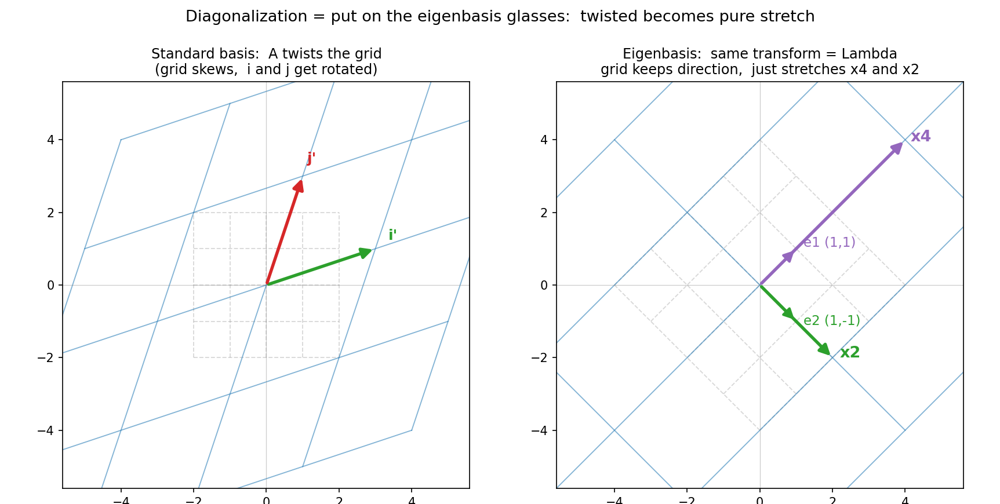

# 第 13 章 · 对角化:换副好基准让揉捏变简单

> **核心问题**:第 12 章我们抓到了揉捏里那几根"不转头、只被拉伸"的特殊轴——特征向量。可手里还攥着个乱糟糟的矩阵 `A`。现在问一句更狠的:**既然这几根特征轴在揉捏里这么"安稳",能不能干脆把它们当成新的坐标轴?** 答案是——能,而且一旦换了这副"特征基"的眼镜,原本又转又拉又剪、看起来一团乱麻的变换,瞬间露馅成**纯粹的沿轴拉伸**,矩阵只剩一条对角线。
>
> 这一章,我们把第 12 章(特征向量 = 不转头的轴)和第 18 章(换基 = 给同一个变换换副眼镜)这两条线索**接上**:用特征向量当新基,让任何**可对角化**的揉捏变成"纯拉伸"。并且你会看到,这件"换眼镜"的小动作,有一个极其实在的大用处——**算矩阵的高次幂,从此不费吹灰之力。**
>
> **读完本章你会明白**:
> - 为什么"换到特征基这组新坐标"之后,一个歪七扭八的变换 `A` 会变成**对角阵 `Λ`**——只有对角线上排着几个特征值,其余全 0,意思是"每个特征方向只被对应的 λ 拉伸,彼此互不干扰"。
> - `A = PΛP⁻¹` 这副吓人的公式,翻译成几何就是**三步走**:`P⁻¹`(换到特征基)→ `Λ`(纯拉伸)→ `P`(换回标准基)。它是第 18 章相似矩阵 `A' = P⁻¹AP` 的一个特例——把 `A` 相似到一个最简单的对角阵。
> - 为什么这件事**极其有用**:因为对角阵的幂太好算了(每个对角元 `λ` 自己乘 `n` 次),于是 `Aⁿ = PΛⁿP⁻¹`——马尔可夫链、递推数列、微分方程,全都靠这招续命。
> - 以及一个**必须知道**的限制:不是所有矩阵都能对角化。要有"足够多"线性无关的特征向量凑成一组基。剪切矩阵 `[[1,1],[0,1]]` 就是反例——它只有一个独立的特征方向,这为第 19 章 SVD(任何矩阵都行)埋下伏笔。

> **如果一读觉得太难**:先只记住三件事——
> ① **对角化 = 拿特征向量当新坐标轴,让歪七扭八的变换,在新基下变成沿轴的纯拉伸(对角阵 Λ)。**
> ② **`A = PΛP⁻¹`**:`P` 的列是特征向量,`Λ` 的对角线是特征值。读法是三步:`P⁻¹`(换到特征基)→ `Λ`(拉伸)→ `P`(换回)。
> ③ **`Aⁿ = PΛⁿP⁻¹`**:对角阵的幂一行就算,所以 `A` 的高次幂迎刃而解。但要凑得齐一组特征基才行,不是每个矩阵都办得到(剪切就不行)。

---

## 章首·一句话点破

第 12 章的结尾,我们留了半句伏笔:

> 抓住了"不转头的轴"和"拉伸的倍数",一个歪七扭八的变换就有了主轴。可还有个更狠的问题:**能不能换一副眼镜——把坐标轴正好对齐这几根特征向量——让这个变换在新坐标下变成纯粹的拉伸,数字全落在一条对角线上?**

这一章,就来兑现这半句。一句话点破:

> **对角化,就是挑"特征向量"这组基当新坐标轴。在这副眼镜下,任何可对角化的揉捏,都简化成沿几根互相独立的轴各自拉伸——矩阵从一个乱七八糟的数表,塌缩成一条干净的对角线 `Λ`。**

这句话是**结论**,不是理由。本章倒过来拆:先在几何上看清"为什么换到特征基,变换就变成对角阵",再让 `A = PΛP⁻¹` 从这个几何里**长出来**,然后落到它最实在的应用——算高次幂,最后戳破"不是所有矩阵都能这么干"的真相。

---

## 一、把线索接上:从"不转头的轴"到"换个坐标轴"

第 12 章我们看清了一件事:一个变换 `A` 把空间揉得乱七八糟,但总有几根"焊死的旗杆"——被揉完方向不变,只是被拉长/压短了。这几根旗杆叫**特征向量**,拉伸的倍数叫**特征值**。

第 18 章我们又看清了另一件事:同一个变换,在不同基(坐标轴)下,记它的矩阵是**不同的**——换副眼镜,数字就变,但底下的揉捏动作没变。所以,我们**有权挑一副最顺眼的眼镜**,让矩阵的数字长得极简单。

> **比喻**:想象你是个钟表匠,面对一台齿轮错综复杂的表。从正面看,齿轮咬得乱七八糟;可如果你绕到侧面看,主轴清清楚楚地排成一列。**对角化,就是"绕到侧面看"——把你的视线对齐那几根主轴(特征向量),于是错综复杂的动作,一眼看穿成"沿这几根轴各自伸缩"。**

这两条线索接上,本章核心问题就自然冒出来了:

> **既然"不转头的轴"在揉捏里方向不变(只被拉伸),那如果我**干脆把这几根特征向量当成新的坐标轴**,这个变换在新坐标系下,长什么样?**

答案我们在脑子里先猜:既然每根特征轴只被对应的 λ 拉伸、方向不变,那在新坐标系下,这个变换一定是"**沿第一根轴拉 λ₁ 倍、沿第二根轴拉 λ₂ 倍……彼此互不干扰**"——而这,正是**对角阵**该干的事。

> **不这样看会怎样**:如果你不把"特征向量"和"换基"这两件事接起来,你会觉得对角化是个孤立的、为考试而硬造的技巧。可一旦你看见它就是这两条已经学过的线索的**自然交汇**——一边是"不转头的轴",一边是"挑副好眼镜"——整件事就一点不神秘了:**拿特征轴当新坐标轴,歪的变换自然变直。**

---

## 二、核心思想:换到特征基,变换就变成纯拉伸

现在正面看这件事。我们把第 12 章的老朋友 `A = [[3,1],[1,3]]` 拿过来当主角。

### 在标准基下:`A` 把方格揉歪了

标准基 `{i, j}` 是两根互相垂直的单位箭头:`i = (1,0)`、`j = (0,1)`。`A` 把 `i` 揉到了 `(3,1)`(就是 `A` 的第一列)、把 `j` 揉到了 `(1,3)`(第二列)。整个方格被拉伸、被推歪——`i'` 和 `j'` 不再垂直,网格线斜得乱七八糟。**从标准基这副眼镜看,`A` 是又转又拉又剪,一团乱麻。**

### 第 12 章告诉我们:这团乱麻里有两根"不转头的轴"

`A` 有两个特征向量:

- 沿 `(1,1)` 方向(右上 45°),被拉长 **λ₁ = 4** 倍,方向不动。
- 沿 `(1,−1)` 方向(右下 45°),被拉长 **λ₂ = 2** 倍,方向不动。

### 关键一步:把这两根特征向量,当成新的坐标轴

现在,我们**扔掉标准基 `{i, j}`,改用特征基 `{e1, e2} = {(1,1), (1,−1)}` 当新的坐标轴**。也就是说,从现在起,我用"几份 e1、几份 e2"来描述任何一根箭头,而不是"几份 i、几份 j"。

在这副新眼镜下,这个变换 `A` 长什么样?我们就一根一根新基向量去问——"新基的第一根 `e1`,被 `A` 揉完,落在哪?"

- `A` 把 `e1 = (1,1)` 揉成了 `4·(1,1)`,也就是 **`4 份 e1 + 0 份 e2`**。在新基坐标里,这就是 `(4, 0)`。
- `A` 把 `e2 = (1,−1)` 揉成了 `2·(1,−1)`,也就是 **`0 份 e1 + 2 份 e2`**。在新基坐标里,这是 `(0, 2)`。

把这两个落点写成矩阵的两列:

```
        ┌       ┐
   Λ =  │ 4   0 │
        │ 0   2 │
        └       ┘
```

**对角阵!** 只有对角线上是 `4`、`2`(就是那两个特征值),其余全是 0。

> **钉死这件事(本章的灵魂句)**:**把特征向量当新基,变换就变成对角阵 Λ。** 对角阵的意思是:`e1` 方向的箭头只被 `λ₁=4` 拉伸、`e2` 方向只被 `λ₂=2` 拉伸,**两个方向互不干扰、不掺一点"转"或"剪"**。原本 `A` 看起来又转又拉又剪的乱象,纯粹是标准基没对齐主轴的错觉;换上特征基这副眼镜,真面目露了出来——**就是沿两根轴各自拉伸。**

> 下图把这件事一左一右摆出来。左:标准基 `{i,j}` 下,`A=[[3,1],[1,3]]` 把方格揉歪(蓝色实线网格斜了,`i'`、`j'` 不再垂直)。右:**特征基 `{(1,1),(1,-1)}` 下,同一个变换 = `Λ`**——网格(蓝实线)的方向和特征基方格(灰虚线)**完全平行**,只是沿 `e1` 方向被拉长 4 倍、沿 `e2` 方向被拉长 2 倍。**同一个揉捏,换个眼镜,歪的变直的。**



> **不这样看会怎样**:如果你只盯着左图那团斜网格,你会以为这个变换"本质上就是歪的、复杂的"。可一旦换上右图这副眼镜,你就会发现——**复杂的是眼镜(标准基没对齐主轴),不是变换本身**。变换的真面目,简单到只有两个数字:沿 `e1` 拉 4 倍,沿 `e2` 拉 2 倍。**对角化,就是把变换从"被歪眼镜看歪了"的状态里救出来,让它露出本来的、极简单的样子。**

---

## 三、`A = PΛP⁻¹`:从几何长出来的公式

上一节我们用嘴说清了"换到特征基,`A` 变成 `Λ`"。现在,把这个几何事实**翻译成算式**——这个算式,就是那个让你背到滚瓜烂熟的 `A = PΛP⁻¹`。我们不甩公式,从第 18 章的相似矩阵自己推。

### `P` 是什么:把特征向量作列排起来

第 18 章讲过:换一组新基,新旧坐标的换算器叫**基变换矩阵 `P`**——把新基的向量**作为列**排成一个矩阵。这里新基就是特征基 `{e1=(1,1), e2=(1,−1)}`,所以:

```
        ┌        ┐       (列 1 = e1 = (1,1),  对应 λ1 = 4)
   P =  │ 1    1 │
        │ 1   -1 │       (列 2 = e2 = (1,-1), 对应 λ2 = 2)
        └        ┘
```

`P` 可逆吗?可逆——因为它的两列(两根特征向量)**线性无关**(第 3 章讲过,不共线就线性无关;`det P = 1·(−1) − 1·1 = −2 ≠ 0`)。**"两根特征向量线性无关"是 `P` 能当基的硬条件,也是整个对角化的命根子**——这一点第 6 节会反过来说。

### `Λ` 是什么:特征值排成的对角阵

把特征值**按 `P` 的列顺序**排成对角阵:第一列 `e1` 对应 `λ₁=4`,第二列 `e2` 对应 `λ₂=2`,所以:

```
        ┌       ┐
   Λ =  │ 4   0 │
        │ 0   2 │
        └       ┘
```

> **钉死一个易错点**:`Λ` 对角线上特征值的**顺序,必须和 `P` 的列顺序一一对应**。把 `e1` 放第一列,`λ₁` 就得放 `(1,1)` 位置。顺序对错了,`PΛP⁻¹` 就不是 `A` 了——这是初学最常翻车的地方,亲手算两遍就记牢。

### 把第 18 章的相似公式套进来

第 18 章给了一个公式:同一个变换,在标准基下是 `A`,在新基(基变换矩阵 `P`)下是 **`A' = P⁻¹AP`**。

现在,我们特意挑了**特征基**当这个新基。上一节我们用几何已经证明了:**在特征基下,这个变换就是 `Λ`**。所以 `A'` 就是 `Λ`!把它代进第 18 章的公式:

```
   P⁻¹ A P = Λ
```

两边左乘 `P`、右乘 `P⁻¹`(`P`、`P⁻¹` 互为逆,可以消掉),就得到:

```
   A = P Λ P⁻¹
```

> **所以这样看**:`A = PΛP⁻¹` 不是天上掉下来的怪公式。它是第 18 章"同一个变换换副眼镜"(相似矩阵 `P⁻¹AP`)的一个**特例**——新基特意挑成了特征基,于是换基后的矩阵 `A'` 简化到了极致,变成了对角阵 `Λ`。**对角化 = 相似到对角阵。** 看见 `A = PΛP⁻¹`,你心里放映的应该是第 18 章那个三步接龙,只不过这次新基挑得妙,`A'` 干净到只剩一条对角线。

### 三步读法:把公式读成几何动作

`A = PΛP⁻¹` 这串字母,从右往左作用到一个向量 `x` 上,就是**三步**:

1. **`P⁻¹`**:把 `x` 从标准坐标,翻译成"特征基下的读数"(第 18 章讲过,`P⁻¹` 是从标准坐标翻到新坐标)。
2. **`Λ`**:在特征基下,变换就是纯拉伸——`e1` 方向拉 `λ₁` 倍、`e2` 方向拉 `λ₂` 倍。对角阵乘一个向量,就是"每个分量各乘各的 λ",干净利落。
3. **`P`**:把拉伸后的结果,从特征基读数翻回标准坐标(`P` 是从新坐标翻回标准坐标)。

合起来:**先换到特征基,在那里拉伸,再换回标准基**——这三步接龙,等价于直接用 `A` 揉一下。`A` 看起来复杂,是因为它把这三步**打包**成了一个矩阵;`PΛP⁻¹` 则是把它**拆开**,让你看清每一步。

> **钉死方向**:看到 `P`,心里念"把特征基读数翻成标准坐标";看到 `P⁻¹`,心里念"把标准坐标翻成特征基读数"。中间夹一个 `Λ`,就是"在特征基下拉伸"。**这个方向感,是从第 18 章直接继承的,本章一点没新增。**

### 拿数字验证:`PΛP⁻¹` 真的等于 `A`

`P = [[1,1],[1,−1]]`,`Λ = [[4,0],[0,2]]`。先算 `P⁻¹`(`det P = −2`,二阶矩阵的逆 = `(1/det)·[[d,−b],[−c,a]]`):

```
   P⁻¹ = (1/(-2))·[[-1, -1], [-1, 1]] = [[1/2, 1/2], [1/2, -1/2]]
```

算 `Λ·P⁻¹`:

```
   Λ·P⁻¹ = [[4,0],[0,2]]·[[1/2,1/2],[1/2,-1/2]]
          = [[4·1/2 + 0·1/2, 4·1/2 + 0·(-1/2)],
             [0·1/2 + 2·1/2, 0·1/2 + 2·(-1/2)]]
          = [[2, 2],
             [1, -1]]
```

再算 `P·(ΛP⁻¹)`:

```
   P·(ΛP⁻¹) = [[1,1],[1,-1]]·[[2,2],[1,-1]]
             = [[1·2+1·1, 1·2+1·(-1)],
                [1·2+(-1)·1, 1·2+(-1)·(-1)]]
             = [[3, 1],
                [1, 3]]
             =  A   ✓
```

**纸笔一步步乘下来,`PΛP⁻¹` 严丝合缝等于 `A`。** 算式的每一步,都对应几何上一个看得见的动作。

---

## 四、为什么这件事极其有用:算高次幂

讲到这里,你可能嘀咕:把 `A` 拆成 `PΛP⁻¹`,折腾一通,图什么?原来一个矩阵,现在变成三个矩阵相乘,看起来更麻烦了。

**关键来了**——这一节,是对角化最实在的应用,也是它"为什么这么重要"的真正答案:**算矩阵的高次幂。**

### 直接算 `Aⁿ`,累死人

假如你想算 `A³`。直接乘:

```
   A² = A·A = [[3,1],[1,3]]·[[3,1],[1,3]]
            = [[3·3+1·1, 3·1+1·3], [1·3+3·1, 1·1+3·3]]
            = [[10, 6], [6, 10]]

   A³ = A²·A = [[10,6],[6,10]]·[[3,1],[1,3]]
            = [[10·3+6·1, 10·1+6·3], [6·3+10·1, 6·1+10·3]]
            = [[36, 28], [28, 36]]
```

算 `A³` 已经要算 8 次乘法、4 次加法。算 `A¹⁰`?算 `A¹⁰⁰`?**指数一上去,直接乘就废了**——次数太大,手算不可能,连计算机都觉得吃力。

### 对角化之后:`Aⁿ = PΛⁿP⁻¹`,而 `Λⁿ` 一行就算

现在用对角化。把 `A = PΛP⁻¹` 自乘 `n` 次:

```
   A² = (PΛP⁻¹)·(PΛP⁻¹) = PΛ·(P⁻¹P)·ΛP⁻¹ = PΛ²P⁻¹        (中间 P⁻¹P = I, 消掉了!)
   A³ = A²·A = (PΛ²P⁻¹)·(PΛP⁻¹) = PΛ³P⁻¹
   ……
   Aⁿ = P Λⁿ P⁻¹
```

> **钉死这件事(对角化的命门)**:`Aⁿ = PΛⁿP⁻¹`。中间那一串 `P⁻¹P` 全是单位阵 `I`,**两两相消**,最后只剩 `P` 在最左、`P⁻¹` 在最右、中间一个 `Λⁿ`。**这就是为什么对角化能算高次幂——"特征基"让乘法里的混乱项 `P⁻¹P` 全部对消,只剩最简单的 `Λⁿ`。**

而 `Λⁿ` 好算到什么程度?对角阵的 `n` 次幂,就是**每个对角元各自 `n` 次方**:

```
        ┌       ┐ⁿ      ┌       ┐
   Λ =  │ 4   0 │   =   │ 4ⁿ  0 │
        │ 0   2 │       │ 0   2ⁿ│
        └       ┘       └       ┘
```

**一个对角阵的 `n` 次幂,只需算两次乘方**(`4ⁿ` 和 `2ⁿ`)。

### 拿我们的例子走一遍 `A³`

`Λ³ = [[4³,0],[0,2³]] = [[64,0],[0,8]]`。然后 `A³ = PΛ³P⁻¹`:

```
   P⁻¹ = [[1/2,1/2],[1/2,-1/2]]

   Λ³·P⁻¹ = [[64,0],[0,8]]·[[1/2,1/2],[1/2,-1/2]]
           = [[32, 32],
              [4,  -4]]

   P·(Λ³P⁻¹) = [[1,1],[1,-1]]·[[32,32],[4,-4]]
             = [[32+4, 32+(-4)],
                [32-4, 32-(-4)]]
             = [[36, 28],
                [28, 36]]
             =  和直接算 A³ 完全一致!  ✓
```

**两条路线殊途同归,都得 `[[36,28],[28,36]]`。** 但你注意区别——直接算 `A³` 要算 `A²` 再乘 `A`,两次矩阵乘法、8 次标量乘法;对角化算 `A³`,核心只要算 `4³`、`2³` 两次乘方(剩下的是把答案换回标准基的固定开销)。**指数 `n` 越大,这个优势越悬殊**——算 `A¹⁰⁰`,直接乘要做 99 次矩阵乘法;对角化只要算 `4¹⁰⁰`、`2¹⁰⁰` 两次乘方,一次 `P·(·)·P⁻¹` 的换基。

> **比喻**:直接算 `Aⁿ`,像让你把"先穿袜再穿鞋"这个动作重复 `n` 遍,每遍都从头来、越来越乱。对角化,像先把动作**翻译成最简形式**(纯拉伸),在最简形式下重复 `n` 遍(就是两个数各乘 `n` 次方),再翻译回去。**翻译有固定开销,但重复的部分简单到极致——`n` 越大,翻译的代价越划算。**

> **钉死这件事**:对角化最大的实战价值,不是"让矩阵好看",而是**让幂运算从"指数级爆炸"变成"几次乘方"**。这件事的回报极其丰厚——下面这些现实问题,全是靠 `Aⁿ = PΛⁿP⁻¹` 续命的:
> - **马尔可夫链**:`n` 步后的状态分布 = 转移矩阵的 `n` 次幂乘初始状态。算 `n` 很大时的分布,必须靠对角化。
> - **递推数列**(如斐波那契):写成矩阵形式后,第 `n` 项 = 矩阵的 `n` 次幂。对角化能把"算第 `n` 个斐波那契数"从 `O(n)` 次加法,降到 `O(log n)` 次乘方(甚至闭式解)。
> - **微分方程 `dx/dt = Ax`**:解是 `x(t) = e^(At)·x(0)`,而 `e^(At) = P·e^(Λt)·P⁻¹`。矩阵指数只有在 `Λ` 是对角阵时才好算——对角化是解线性微分方程的核心招式。

---

## 五、不是所有矩阵都能对角化:剪切矩阵的反例

到这一步,你大概觉得"每个矩阵都能这么干"。**错。** 这一节给你看一个**会打醒你**的反例,它戳破对角化的边界,也为第 19 章 SVD 埋下伏笔。

### 要对角化,得凑得齐一组"特征基"

回头看对角化的硬条件:`A = PΛP⁻¹`,要求 `P` 的列(也就是特征向量)**线性无关**、能凑成一组基(第 3、4 章讲过,几根向量要能当基,先得线性无关)。

> **钉死这件事**:**一个矩阵能对角化,当且仅当它有"足够多"线性无关的特征向量,能凑成空间的一组基。** 二维空间要 2 根、三维要 3 根、`n` 维要 `n` 根。凑不齐,就没法对角化。这种"凑不齐"的矩阵,有个专门的名字——**亏缺(defective)**。

### 反例:剪切矩阵 `S = [[1,1],[0,1]]`

剪切矩阵 `S`(第 1、18 章的老朋友,把空间横向推歪)就是个**亏缺矩阵**。第 12 章我们算过它的特征值:

- 解 `det(S − λI) = (1−λ)² = 0`,得 **λ = 1(重根)**。
- 把 λ=1 代回 `(S − λI)·x = 0`,得 `[[0,1],[0,0]]·(x₁,x₂) = (0,0)`,也就是 `x₂ = 0`。
- 所以特征向量沿 **`(1,0)` 方向**——横轴。

**只有一根独立的特征方向!** 二维空间要凑齐一组基,得要 2 根线性无关的特征向量。剪切只有 1 根,差一根。numpy 里 `np.linalg.eig` 给剪切返回的两个"特征向量",数值上几乎平行(都接近横轴方向),其实秩亏——这就是"只有一个独立特征方向"的数字长相。

> **不这样会怎样**:你可能会犯嘀咕——"λ=1 是重根,难道不能从它身上再榨一根特征向量出来?" 试一下:重根的几何意义是"同一个特征值对应可能的多个特征向量",但能榨出几个,取决于 `S − λI` 的零空间有几维(第 11 章四个子空间)。剪切这里 `S − I = [[0,1],[0,0]]`,秩 1,零空间只有 1 维——所以**这个重根只能配 1 根特征向量,榨不出第二根**。代数重数(2)> 几何重数(1),这正是"亏缺"的精确含义。本章不深挖这条线,你只要记住结论:**重根不一定能凑出足够的特征向量。**

### 凑不齐基,意味着什么

意味着**剪切不可对角化**。无论你怎么挑基,`S` 在新基下的矩阵 `P⁻¹SP`,都不可能变成对角阵。因为对角阵的几何意义是"沿两根独立轴各自拉伸",而剪切**只有一根不转头的轴**,凑不出第二根——它的揉捏动作里,固有"剪"这一下,这一下没法用纯拉伸伪装。

> **钉死这件事**:**不是所有矩阵都能对角化。** 能对角化的"好矩阵",得有足够多线性无关的特征向量凑成基;凑不齐的"亏缺矩阵"(如剪切),换什么基都露不出对角线的样子。

### 这颗种子,到 SVD 开花

剪切不可对角化,听着像个失败。可正是这个"失败",逼出了线代最巅峰的招式——**SVD(第 19 章)**。

对角化只能搞定"有足够多特征向量"的矩阵;而 SVD 更进一步:**任何**矩阵(哪怕亏缺如剪切、哪怕根本不是方阵),都能挑两组最妙的基,拆成"旋转 → 沿轴拉伸 → 再旋转"三步。剪切在 SVD 这副眼镜下,也会露出清爽的真面目。

> **钉死这条暗线**:**对角化是"挑一副好基"这个招式的第一招,但它有边界(要凑得齐特征基)。SVD 是这个招式的终极版——它绕开"特征基够不够"这道坎,任何矩阵都吃得下。** 第 13 章的边界,正是第 19 章的开场。

---

## 六、几何直觉小结:对角化到底干了什么

把前几节串成一句话,这是本章最该带走的几何直觉:

> **对角化 = 找到那组"不转头的轴"(特征向量),把它们当新坐标。在这副眼镜下,歪七扭八的揉捏,一眼看穿成"沿几根独立方向的拉伸"——每个方向只被对应的 λ 拉伸,互不干扰。复杂的是眼镜(标准基没对齐主轴),不是变换本身。**

这句话有三层含义,层层对应本章的三节:

1. **几何层**(第二节):换到特征基,变换变成对角阵 `Λ`,意思是"沿各特征轴独立拉伸"。
2. **代数层**(第三节):`A = PΛP⁻¹`,`P` 的列是特征向量、`Λ` 的对角线是特征值;它是第 18 章相似矩阵的特例(相似到对角阵)。
3. **应用层**(第四节):`Aⁿ = PΛⁿP⁻¹`,对角阵的幂一行就算,高次幂迎刃而解。
4. **边界层**(第五节):要凑得齐特征基才能对角化,亏缺矩阵(如剪切)不行——SVD 来兜底。

---

## 计算佐证:拿纸笔和 numpy,亲手把对角化走一遍

### 1. 纸笔:对 `A = [[3,1],[1,3]]` 完整对角化

**第一步,求特征值**(第 12 章):`det(A−λI) = (3−λ)² − 1 = λ² − 6λ + 8 = (λ−4)(λ−2)`,得 **λ₁=4、λ₂=2**。

**第二步,求特征向量**:
- λ=4:`(A−4I)·x = [[−1,1],[1,−1]]·x = 0` → `x₁=x₂` → 沿 `(1,1)`。
- λ=2:`(A−2I)·x = [[1,1],[1,1]]·x = 0` → `x₁=−x₂` → 沿 `(1,−1)`。

**第三步,拼 `P` 和 `Λ`**(注意列与对角元对应):`P = [[1,1],[1,−1]]`,`Λ = [[4,0],[0,2]]`。

**第四步,验 `A = PΛP⁻¹`**(第三节已算):`P⁻¹ = [[1/2,1/2],[1/2,−1/2]]`,`PΛP⁻¹ = [[3,1],[1,3]] = A` ✓。

### 2. 纸笔:用对角化算 `A³`,对比直接算

- **直接算**:`A² = [[10,6],[6,10]]`,`A³ = [[36,28],[28,36]]`。
- **对角化算**:`Λ³ = [[64,0],[0,8]]`,`PΛ³P⁻¹ = [[36,28],[28,36]]` ✓。

两条路殊途同归。

### 3. 纸笔:验证剪切 `S = [[1,1],[0,1]]` 不可对角化

`det(S−λI) = (1−λ)² = 0` → λ=1(重根)。`(S−I)·x = [[0,1],[0,0]]·x = 0` → `x₂=0` → 特征向量只在 `(1,0)` 方向。**只有一根独立特征向量,凑不齐二维的基 → 亏缺,不可对角化。**

### 4. numpy:一行把 `P`、`Λ` 吐出来,并验证 `Aⁿ`

```python
import numpy as np

A = np.array([[3., 1.],
              [1., 3.]])
vals, vecs = np.linalg.eig(A)
print("eigvals :", vals)                 # [4. 2.]
print("eigvecs (归一化, 作列) :\n", vecs)

# numpy 返回的特征向量是归一化的; P 的列 = 特征向量, Lambda = diag(vals)
P   = vecs
Lam = np.diag(vals)
print("P @ Lambda @ inv(P) =\n", P @ Lam @ np.linalg.inv(P))   # 应得 A

# 算 A^3, 两条路线对比
print("A @ A @ A            =\n", A @ A @ A)                   # 直接
print("P @ Lambda^3 @ inv(P)=\n",
      P @ np.linalg.matrix_power(Lam, 3) @ np.linalg.inv(P))   # 对角化, 应一致

# 剪切矩阵: 看它亏缺
S = np.array([[1., 1.],
              [0., 1.]])
sv, svv = np.linalg.eig(S)
print("shear eigvals :", sv)             # [1. 1.]  重根
print("shear eigvecs:\n", svv)           # 两列几乎平行 -> 只有一个独立方向, 亏缺
```

输出(`A` 部分的两行 `A³` 完全一致,印证 `Aⁿ = PΛⁿP⁻¹`):

```
   eigvals : [4. 2.]
   eigvecs (归一化, 作列) :
    [[ 0.7071 -0.7071]
     [ 0.7071  0.7071]]
   P @ Lambda @ inv(P) =
    [[3. 1.]
     [1. 3.]]
   A @ A @ A            =
    [[36. 28.]
     [28. 36.]]
   P @ Lambda^3 @ inv(P)=
    [[36. 28.]
     [28. 36.]]
   shear eigvals : [1. 1.]
   shear eigvecs:
    [[ 1. -1.]
     [0.  0.]]              # 第二列本质是 (1,0) 的扰动 -> 只有一个独立方向
```

注意 numpy 返回的 `P` 是**归一化**的(列长度为 1),所以列向量是 `(0.707,0.707)`、`(−0.707,0.707)`——方向上仍是 `(1,1)`、`(1,−1)`,只是刻度标准化了。**用归一化的 `P` 算 `PΛP⁻¹`,结果和用未归一化的 `P` 完全一样**(`P` 的刻度被 `P⁻¹` 抵消了),放心用。

---

## 章末小结

### 用"橡皮膜"比喻回顾本章

回到那张画满方格的橡皮膜。这一章我们做的,是把第 12 章(不转头的轴)和第 18 章(换副眼镜)接上:

> **既然揉捏里有几根"不转头的轴"(特征向量),那就干脆把这几根轴当成新的坐标。在这副特征基的眼镜下,歪七扭八的揉捏,露出了它的真面目——沿几根独立方向的纯拉伸,矩阵塌缩成一条对角线 `Λ`。**

本章拆成四层,一层比一层深:

1. **几何**:换到特征基,变换变成对角阵 `Λ`——每个特征方向只被对应的 λ 拉伸,互不干扰。
2. **代数**:`A = PΛP⁻¹`,`P` 的列是特征向量、`Λ` 的对角线是特征值。它是第 18 章相似矩阵 `P⁻¹AP` 的特例:把 `A` 相似到一个最简单的对角阵。三步读法:`P⁻¹`(换到特征基)→ `Λ`(拉伸)→ `P`(换回)。
3. **应用**:`Aⁿ = PΛⁿP⁻¹`,中间的 `P⁻¹P` 全部相消,只剩 `Λⁿ`(对角元各乘 `n` 次方)。**高次幂从指数级爆炸,降到几次乘方**——马尔可夫链、递推数列、微分方程全靠它。
4. **边界**:不是所有矩阵都能对角化。要凑得齐"足够多"线性无关的特征向量(凑成一组基);凑不齐的亏缺矩阵(如剪切 `[[1,1],[0,1]]`,只有一个独立特征方向)不可对角化。**这颗种子,到第 19 章 SVD 开花——SVD 兜得住任何矩阵。**

### 本章在全书主线中的位置

记住本书的主线:**一切线代概念,都是"空间被揉捏"这件事的某个侧面。** 这一章,我们盯住的是揉捏的**"化简为纯拉伸"**这个侧面——

- 之前,我们用**行列式**量"揉胀了多少倍"、**秩**量"揉完还剩几维"、**特征值**量"沿这几根轴各自缩了多少"。这些是**度量**。
- 第 18 章,我们学会**换副眼镜看同一个变换**(相似矩阵)。
- **这一章,把这两条接上**:既然能换基,那就挑特征基——这一挑,变换被**化简**到了极致,从一团乱麻变成一条对角线。**对角化不是新概念,是"度量 + 换基"这两件事交汇后,自然结出的果实。**

而它的回报(算高次幂)极其丰厚——这是"理解"第一次直接兑现成"强大的算力"。

### 五个"为什么"清单

如果你只能记五件事,记这五件:

1. **对角化在干什么**:把"不转头的轴"(特征向量)当新坐标,让歪七扭八的变换,在新基下变成沿轴的纯拉伸(对角阵 `Λ`)。**复杂的是眼镜,不是变换。**
2. **`A = PΛP⁻¹` 是什么**:`P` 的列是特征向量,`Λ` 的对角线是特征值(顺序对应列)。它是第 18 章相似矩阵 `P⁻¹AP` 的特例——相似到最简单的对角阵。三步读法:`P⁻¹`(换到特征基)→ `Λ`(拉伸)→ `P`(换回)。
3. **为什么极其有用**:`Aⁿ = PΛⁿP⁻¹`,中间 `P⁻¹P` 全部相消,只剩 `Λⁿ`(对角元各乘 `n` 次方)。**高次幂从指数级爆炸,降到几次乘方**——马尔可夫链、递推、微分方程全靠它。
4. **不是所有矩阵都能对角化**:要有"足够多"线性无关的特征向量凑成基。亏缺矩阵(如剪切 `[[1,1],[0,1]]`,只有一个独立特征方向)不可对角化。**这条边界,是第 19 章 SVD 的开场。**
5. **本章和前两章的关系**:第 12 章抓"不转头的轴",第 18 章讲"换副眼镜",本章把这两条接上——挑特征基当新眼镜,变换塌缩成对角线。**对角化 = 度量(特征值)+ 换基,两件事的交汇。**

### 想继续深入,该往哪钻

- **亲眼"看见"歪的变直的**:强烈推荐 3Blue1Brown《线性代数的本质》系列。本章对应的画面,散见第 14 集(特征向量)和第 20 集(对角化与高次幂)——动画会把"换上特征基眼镜,乱网格瞬间对齐成纯拉伸"这件事放给你看,文字接不住的,动画一定接得住。
- **亲手玩对角化**:上面的 numpy 代码,造几个 2×2 矩阵,用 `np.linalg.eig` 得 `P`、`Λ`,验 `PΛP⁻¹ = A`。**重点试这三个**:`[[3,1],[1,3]]`(可对角化,两根垂直特征轴)、`[[3,1],[0,2]]`(可对角化,两根斜的特征轴)、`[[1,1],[0,1]]`(亏缺,算不出可逆的 `P`)。改一晚上,你对"哪些矩阵能对角化"会有直觉。
- **尝高次幂的甜头**:用对角化算 `[[3,1],[1,3]]¹⁰`。直接 `A@A@...@A`(乘 9 次)和对角化(`P·[[4¹⁰,0],[0,2¹⁰]]·P⁻¹`,几次乘方)对比,你会切身感受到"指数级爆炸"变成"几次乘方"的爽快。再想想斐波那契数列 `F(n)` 怎么写成矩阵幂(提示:转移矩阵 `[[1,1],[1,0]]`),用对角化算第 100 项——这是对角化最经典的实战之一。
- **尝函数空间的彩蛋**(接第 12 章):求导算子 `D` 的"特征基"是 `{e^(λx)}`(第 12 章彩蛋),`D` 在这组基下是对角的(`D(e^(λx)) = λ·e^(λx)`,即每个基函数只被乘个 λ,互不干扰)。**解微分方程 `dx/dt = Ax`,本质就是把 `x` 拆成 `e^(λx)` 这组"特征基"的线性组合——这就是"对角化解微分方程"的函数版真相。** 几何里的"挑特征基",在分析里长成了"把解展成指数函数的和"。

---

> 挑一副"特征基"的眼镜,歪七扭八的揉捏瞬间塌缩成沿轴的纯拉伸——这就是对角化。可这副眼镜有个苛刻的前提:**得凑得齐一组互相垂直(至少线性无关)的特征向量**。并不是每个矩阵都这么配合——剪切矩阵就死活凑不齐。那么,**有没有一类矩阵,天生就保证"特征向量既够数、又两两正交"**?有,而且是线代最优雅的一类——**对称矩阵**。下一章我们就钻进去:为什么 `Aᵀ = A` 这个看起来平淡的条件,能换来"实特征值 + 正交特征基"这份厚礼。翻开 **第 14 章 · 对称矩阵的优美**。
