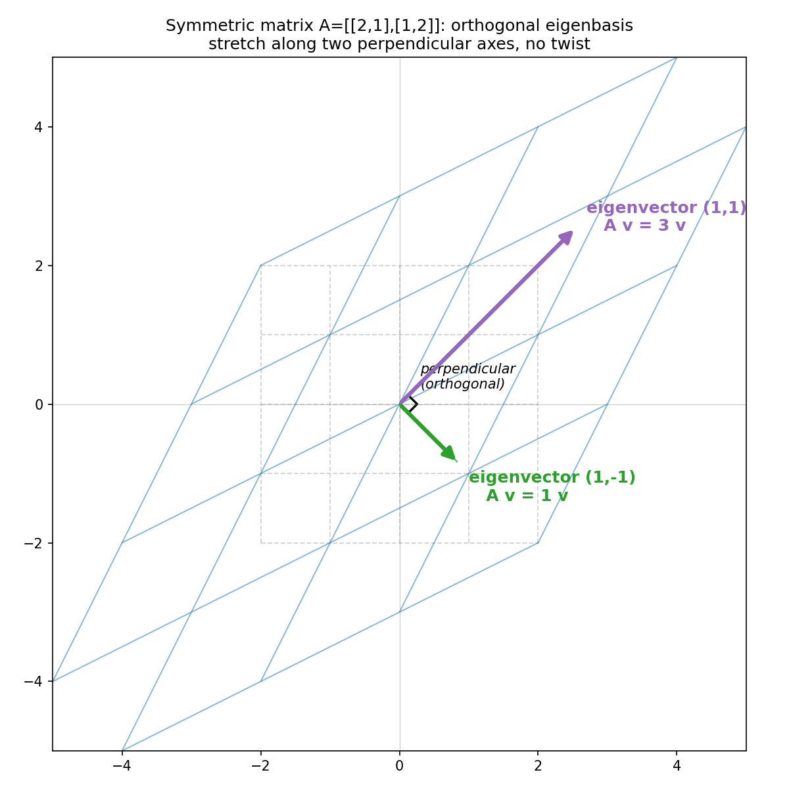
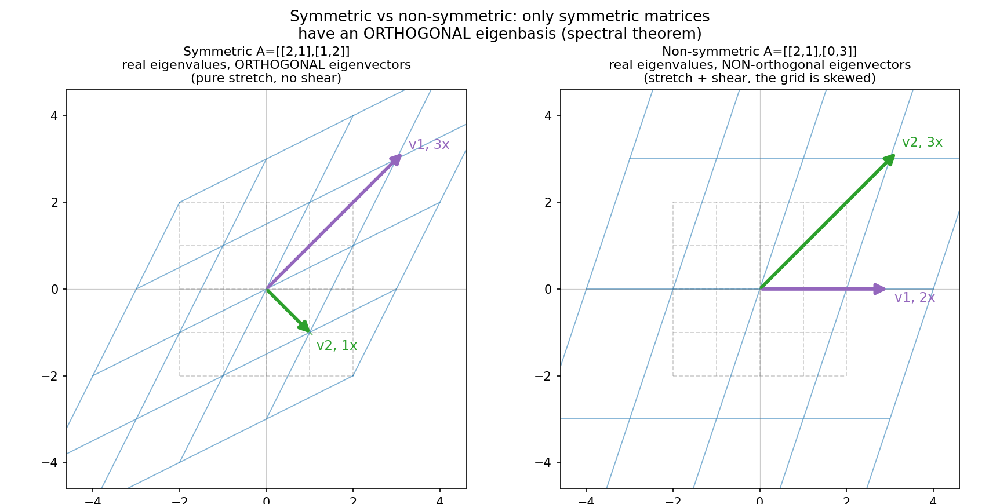

# 第 14 章 · 对称矩阵的优美:最干净的一类揉捏

> **核心问题**:第 12 章我们见过一个让人世界观的反例——旋转矩阵没有实特征向量(它的特征值是虚数 ±i),因为它把每一根箭头都转了向,没有一根"不转头"。那么反过来问:**有没有一类矩阵,天生就保证有实特征值、而且特征向量还互相垂直?** 如果有,这类矩阵凭什么这么特殊?它的"优美"到底美在哪里,又能给后面的 SVD 铺出什么路?
>
> 这一章,我们盯住"揉捏"里**最优雅**的一个侧面:**沿一组互相垂直的轴纯拉伸,没有任何旋转/剪切的扭曲成分。** 你会发现,这种"干净到不拧巴"的揉捏,对应的正是**对称矩阵**(A = Aᵀ)——线代里最乖、最好看的一类矩阵。它的特征值全是实数,它的特征向量可以选得两两正交,它总能写成 `A = QΛQᵀ` 这种极其对称的好看形式。这,就是**谱定理(spectral theorem)**。
>
> **读完本章你会明白**:
> - "对称矩阵"不是"长得对称"那么肤浅——它的对称,在几何上对应一种**特别干净的揉捏**:沿一组互相垂直的轴纯拉伸,不拧巴。
> - 对称矩阵有两大特权(普通矩阵没有):① 特征值**全是实数**(再也不用担心第 12 章那种虚数 ±i);② 特征向量**可以选得两两正交**——这是普通矩阵做梦都想要的待遇。
> - 谱定理说的就是:任意对称矩阵 `A = QΛQᵀ`,其中 `Q` 是正交矩阵(列是正交单位特征向量,`Qᵀ = Q⁻¹`)、`Λ` 是实特征值组成的对角阵。这是对角化(第 13 章)的**最美版本**——对角化用的那组基,不但存在,还能选成"互相垂直、长度为 1"的标准好基。
> - 以及这件事为什么是 **SVD(第 19 章)的直接前奏**:SVD 的核心思想,就是"把任意矩阵都强行变成对称矩阵式的那种转-拉-转"。对称矩阵的 `QΛQᵀ`,正是 SVD 的灵魂内核。

> **如果一读觉得太难**:先只记住三件事——
> ① **对称矩阵 = A = Aᵀ**,几何上是"沿一组互相垂直的轴纯拉伸,没有旋转/剪切的拧巴成分"。
> ② **谱定理**:对称矩阵一定有**实**特征值、**互相正交**的特征向量,可以写成 `A = QΛQᵀ`(Q 正交、Λ 对角实数)。
> ③ 这个 `QΛQᵀ` 是后面 **SVD** 的灵魂——任意矩阵都能被拆成"转→沿垂直轴拉→转"三步,对称矩阵是其中"两个转互相抵消"的最简情形。

---

## 章首·一句话点破

第 12 章我们埋了两个对比的伏笔:旋转矩阵 `[[0,−1],[1,0]]` 没有实特征向量(特征值是虚数 ±i,因为旋转里没有不转头的轴);而它的反面,`[[3,1],[1,3]]` 这种矩阵却老老实实有两根不转头的实特征轴。第 12 章结尾我卖了个关子:**"对称矩阵必有实特征值、且特征向量两两正交"** —— 这一章,我们就来兑现这句话。

一句话点破:

> **对称矩阵(A = Aᵀ)是线代里最优雅的一类揉捏——它的特征值全是实数,它的特征向量可以选得两两正交,它总能被一组互相垂直的特征轴对角化。一句话,它揉空间只拉不拧,干净到极致。**

这句话是**结论**。本章倒过来拆:先在几何上看清"对称"到底对称在哪、为什么这种对称对应"最干净的揉捏";再让两大特权(实特征值、正交特征向量)一个一个长出来;最后把谱定理 `A = QΛQᵀ` 写清楚,并点明它为什么是 SVD 的直接前奏。

---

## 一、"对称"到底对称在哪:几何上不拧巴

先看代数定义。一个矩阵 `A` **对称(symmetric)**,就是它**等于自己的转置**:

```
   A  =  Aᵀ
```

`Aᵀ`(A 的转置)是把 `A` 沿主对角线翻折过来——原来第 i 行第 j 列的数,翻完后跑到第 j 行第 i 列。所以 `A = Aᵀ` 的意思,就是**主对角线两侧的数,关于主对角线对称**:

```
       ┌           ┐
       │  a    b   │
       │  b    c   │     左下角的 b  =  右上角的 b
       └           ┘
```

比如 `[[2,1],[1,2]]`、`[[3,1],[1,3]]`、`[[1,0],[0,1]]`(单位矩阵)都是对称的;而 `[[2,1],[0,3]]`(左下角是 0,右上角是 1,不对称)、旋转矩阵 `[[0,−1],[1,0]]`(左下角 1,右上角 −1,不对称)都不是。

但这只是"长得对称"。真正的问题是:**这种代数上的对称,翻译成几何,对应一种什么样的揉捏?**

> **比喻**:想象你揉一张橡皮膜。普通的揉捏可以很乱——又拉又转又推歪,网格被拧成一团乱麻。但有一类揉捏特别干净:**你只沿着几根预先选好的、互相垂直的轴去拉(或压),完全不转、不推歪、不拧巴。** 整个空间被这几根垂直的轴"正交地拉压",网格虽然被拉伸了,但还保持一种"规整"的姿态。这种"只沿垂直轴纯拉伸"的揉捏,就是对称变换的几何真身。

> **不这样看会怎样**:如果你只把"对称"理解成"数表关于主对角线对称",那它对你就是个纸面性质,你体会不到它为什么重要。可一旦你看见它对应"最干净、最不拧巴的一类揉捏",后面两大特权(实特征值、正交特征向量)就成了**几何必然**——既然这次揉捏本来就只沿垂直的轴拉伸,那这些拉伸轴(特征向量)当然互相垂直,拉伸倍数(特征值)当然是实数。**优美,不是天上掉的,是几何逼出来的。**

> **所以这样看**:**对称矩阵的"对称",不是数表的对称,而是揉捏动作的对称——它把空间沿一组互相垂直的轴"对称地"拉压,前后的网格保持一种镜像般的规整。** 这种规整,是两大特权的几何源头。

---

## 二、第一大特权:特征值全是实数

第一个特权,直接回应第 12 章那个让你世界观一震的反例。

还记得旋转矩阵 `R = [[0,−1],[1,0]]` 吗?它的特征值是虚数 ±i,因为在实数世界里没有任何一根"不转头的轴"。我们当时留下一个问题:**那么,什么样的矩阵保证有实特征值?**

答案就是:**对称矩阵。**

> **钉死这件事(谱定理之一)**:**对称矩阵的特征值,全是实数。** 不管这个矩阵多大、对角线上下的数多复杂,只要它对称(A = Aᵀ),它就绝不会像旋转矩阵那样冒出虚数特征值来。

### 为什么对称矩阵不会"转",所以特征值不会虚

第 12 章我们看清了一件事:**虚数特征值的几何真身,是"旋转"。** 旋转矩阵的特征值是 ±i,因为它的动作核心就是"转 90°",没有任何一根轴"只拉不转"。

而对称矩阵恰恰相反——它的动作核心**不含旋转成分**(本章后面会把它写成 `QΛQᵀ`:先转一下、纯拉伸、再转回来,两个转动互相抵消,净效果只剩拉伸)。一个只拉伸、不旋转的揉捏,当然每一根拉伸轴(特征向量)的倍数都是实实在在的实数——它要么拉长(λ>1)、要么压短(0<λ<1)、要么反向(λ<0),但绝不会"凭空转走"。

> **比喻**:虚数特征值像"幽灵轴"——你能在复数空间里看到它,但在真实的几何平面上它根本不存在(因为旋转没有实数拉伸轴)。对称矩阵没有这种幽灵:它的每一根特征轴都实打实地钉在实数平面上,拉伸倍数也是实实在在的实数。

### 拿数字走一遍

回到我们的主角 `A = [[2,1],[1,2]]`(它对称)。算它的特征方程(第 12 章的套路):

```
   det(A − λI) = det([[2−λ, 1],[1, 2−λ]])
              = (2−λ)(2−λ) − 1·1
              = (2−λ)² − 1
              = λ² − 4λ + 4 − 1
              = λ² − 4λ + 3
              = (λ − 3)(λ − 1)
```

令它为 0,解出 **λ₁ = 3,λ₂ = 1**。两个都是实数,而且是漂亮的整数。对比旋转矩阵的 ±i——**对称矩阵,特征值实得不能再实。**

> **对比的意义**:这个"实特征值"的特权,在工程上极其重要。物理量(质量、能量、协方差)对应的矩阵几乎都是对称的,它们的特征值代表物理可观测量(频率、能量本征值、主成分方差)——这些量**必须是实数**才有物理意义。如果特征值冒出个虚数,你就没法说"这根弹簧的固有频率是 3i 赫兹"。对称矩阵保证"实",是它能描述真实世界的根本原因之一。

---

## 三、第二大特权:特征向量可以选得两两正交

第二个特权更狠。第 12 章我们顺便戳破过一个误解:**"特征向量总是互相垂直"是错的**——一般矩阵的特征向量可以指向任意方向,彼此斜着交叉(第 12 章第五节举过剪切的例子)。但对称矩阵是**例外**:

> **钉死这件事(谱定理之二)**:**对称矩阵的特征向量,可以选得两两正交(互相垂直)。**

### 用我们的例子验证

`A = [[2,1],[1,2]]`,λ₁ = 3、λ₂ = 1。把特征值代回 `(A − λI)·x = 0` 找特征向量(第 12 章算过):

- λ = 3 代回:`(A − 3I)·x = [[−1, 1],[1, −1]]·(x₁, x₂) = 0` → `x₁ = x₂`,特征向量沿 **(1, 1)** 方向。
- λ = 1 代回:`(A − 1I)·x = [[1, 1],[1, 1]]·(x₁, x₂) = 0` → `x₁ = −x₂`,特征向量沿 **(1, −1)** 方向。

现在算这俩特征向量的点积(第 16 章会正式讲正交,这里先用直觉):

```
   (1, 1) · (1, −1)  =  1·1 + 1·(−1)  =  1 − 1  =  0
```

**点积为 0,意味着两根特征向量互相垂直!** `(1,1)` 是右上 45° 方向,`(1,−1)` 是右下 45° 方向,它们正好成一个直角。这不是巧合——这是对称矩阵的特权。

> 下图把这件事画出来。`A = [[2,1],[1,2]]` 把空间揉捏后(蓝实网格 vs 灰虚原始网格),紫色的 `(1,1)` 方向被原封不动拉长 3 倍,绿色的 `(1,−1)` 方向被原封不动保持(λ=1,长度不变)。**盯着原点那个小直角符号——两根粗箭头互相垂直。整个变换就是沿这两根垂直的轴各自拉伸,没有任何"推歪"的剪切成分。** 网格虽然被拉成长方形,但仍然规整,不拧巴。



### 对比:非对称矩阵就没有这个待遇

为了让你感受"正交"是多么特殊的待遇,看一个反例。非对称矩阵 `B = [[2,1],[0,3]]`(左下角是 0,右上角是 1,不对称)。它的特征值是 λ=2 沿 (1,0)、λ=3 沿 (1,1)——两个特征值都是实数(因为是上三角,对角线即特征值),但**它的两根特征向量并不正交**:

```
   (1, 0) · (1, 1)  =  1·1 + 0·1  =  1   ≠  0
```

点积是 1,不是 0——这两根特征向量成一个 45° 的锐角,不是直角。

> 下图把这个对比画出来。左边是对称矩阵 `[[2,1],[1,2]]`:两根特征轴(紫、绿)互相垂直,网格被正交地拉压,长方形规整。右边是非对称矩阵 `[[2,1],[0,3]]`:两根特征轴(紫、绿)成一个 45° 的锐角,**网格被拉伸的同时还被推歪了——这就是"剪切"成分**。两个矩阵都有实特征值,但只有对称的那个,特征轴是正交的、揉捏是干净的。



> **不这样看会怎样**:如果你不知道"正交特征向量"是对称矩阵的特权,你会以为任何矩阵都能用一组垂直的特征轴来描述,从而在解方程、做 PCA、算矩阵幂时栽跟头(因为一般矩阵的特征轴是斜的,你没法直接拿它们当"干净坐标系"用)。**正交,意味着这组特征轴可以直接当一套"标准的好坐标轴"——这是后面谱定理 `A = QΛQᵀ` 里 `Q` 能成为正交矩阵的前提。**

> **所以这样看**:**对称矩阵的第二个特权,不是"特征向量恰好垂直"的巧合,而是几何必然**——既然这次揉捏只沿互相垂直的轴纯拉伸(本章第一节那个"不拧巴"的几何),那么这些拉伸轴本身当然互相垂直。两大特权,根源是同一个几何事实:**对称变换 = 沿垂直轴纯拉伸,不含旋转/剪切的拧巴成分。**

---

## 四、谱定理:对称矩阵的最美对角化 `A = QΛQᵀ`

把上面两大特权合起来,就得到线代里最优雅的定理之一——**谱定理(spectral theorem)**。

先回顾第 13 章的对角化。一个(可对角化的)矩阵 `A`,如果能找到一组特征向量当新基,就可以写成:

```
   A  =  P Λ P⁻¹
```

其中 `P` 的列是特征向量,`Λ` 是特征值排成的对角阵,`P⁻¹` 是 `P` 的逆。这说的是:**换个特征基,这个变换就变成了沿那组基的纯拉伸。**

但对角化有个麻烦:`P` 不一定好算(逆矩阵 `P⁻¹` 要专门去求),而且 `P` 的列(特征向量)一般不垂直,拿它们当坐标轴用起来别扭。

**对称矩阵把这两件麻烦事全解决了。** 因为对称矩阵的特征向量可以选得**两两正交**——如果我们再把它们**归一化**成长度为 1 的单位向量,那么 `P` 就成了一个**正交矩阵(orthogonal matrix)**,记作 `Q`。正交矩阵有一个神级性质(第 8 章会讲,这里先用):

> **正交矩阵的转置 = 它的逆**:`Qᵀ = Q⁻¹`。

于是,对称矩阵的对角化 `A = PΛP⁻¹` 里,那个难算的 `P⁻¹` 直接被 `Qᵀ` 替掉:

```
   A  =  Q Λ Qᵀ
```

这就是**谱定理**。完整地说:

> **谱定理(spectral theorem,对称矩阵版)**:任意(实)对称矩阵 `A`,都存在一个正交矩阵 `Q` 和一个实对角阵 `Λ`,使得
>
> ```
>    A  =  Q Λ Qᵀ
> ```
>
> 其中 `Q` 的每一列是 `A` 的**互相正交的单位**特征向量(`Qᵀ = Q⁻¹`),`Λ` 对角线上是 `A` 的**实**特征值。

### 三个部件,各司其职

把 `A = QΛQᵀ` 拆开看,它就是**三步揉捏的接龙**(从右往左读,第 1 章讲过先右后左):

1. **`Qᵀ`**:把空间**转一下**——把你原来的坐标轴,转到那组正交特征轴上(因为 `Qᵀ` 是正交矩阵,它是纯旋转/翻转,不拉伸)。
2. **`Λ`**:沿这组新坐标轴**纯拉伸**——每个轴拉(或压)它对应的特征值倍数(全是实数)。
3. **`Q`**:再**转回来**——把坐标轴转回原来的朝向。

合起来:**转一下 → 沿垂直轴纯拉伸 → 转回来**。两个转动(`Qᵀ` 和 `Q`)互为逆操作,首尾相抵;中间只剩下一个干干净净的对角拉伸 `Λ`。**这正是本章开头说的"最干净的揉捏":净效果是沿一组垂直轴的纯拉伸,旋转成分被首尾两个 `Q` 消掉了。**

> **钉死这件事(本章的核心 nugget)**:**谱定理 `A = QΛQᵀ` 在说——对称矩阵的揉捏,永远是"转→沿垂直轴拉→转回"三步,两个转动抵消,只剩正交拉伸。** 这是对角化(第 13 章)的最美版本:不仅存在一组特征基,这组基还**恰好正交归一**,可以直接当一套标准的好坐标轴用。

### 用我们的例子手算一遍

`A = [[2,1],[1,2]]`,特征向量 (1,1) 和 (1,−1)。先把它们归一化(各除以长度 √2):

```
   q1 = (1,1)/√2 ≈ (0.707, 0.707)      (对应 λ=3)
   q2 = (1,−1)/√2 ≈ (0.707, −0.707)     (对应 λ=1)
```

拼成正交矩阵 `Q`(列是 q1、q2),和实对角阵 `Λ`:

```
       ┌                    ┐         ┌       ┐
       │ 0.707    0.707     │         │ 3   0 │
   Q = │                    │    Λ =  │       │
       │ 0.707   −0.707     │         │ 0   1 │
       └                    ┘         └       ┘
```

验证 `A = QΛQᵀ`(下一节会用 numpy 一行核对,这里先相信):

```
   Q Λ Qᵀ  =  [[2, 1], [1, 2]]  =  A    ✓
```

**两个特征向量归一化后,`QᵀQ = I`(单位矩阵)——这,就是"正交矩阵"的定义,也是"特征向量两两正交且单位长"的算式写法。**

> **不这样看会怎样**:如果你只把 `A = QΛQᵀ` 当成一串字母,你会觉得"这不就是对角化换个符号吗,有啥了不起"。可一旦你看见它对应"转→垂直拉伸→转回"的几何,你就明白它美在哪了:**普通矩阵的对角化 `PΛP⁻¹` 里,`P` 的列是斜的,`P⁻¹` 还得专门求,几何上这次"换基"是歪歪扭扭的;而对称矩阵的 `QΛQᵀ` 里,`Q` 的列是正交归一的,`Qᵀ = Q⁻¹` 白送,几何上这次"换基"是干净利落的正交转动。** 优美,优美在"逆矩阵白送 + 换基是正交的好基"这两件事上。

---

## 五、为什么这件事极其重要:它是 SVD 的直接前奏

讲到这里你可能问:对称矩阵这么漂亮,可世界上大部分矩阵并不是对称的,这套优美有什么用?

**用处极大。** 因为后面第 19 章的 **SVD(奇异值分解)**,核心思想就是——**把任意矩阵,强行变成"对称矩阵式"的那种"转→拉→转"三步分解。**

先剧透 SVD 的形式:任意(实)矩阵 `A`,都能分解成

```
   A  =  U Σ Vᵀ
```

其中 `U`、`V` 都是正交矩阵(纯转动),`Σ` 是对角阵(纯拉伸,对角线上叫"奇异值")。**看出来了吗?这和谱定理 `A = QΛQᵀ` 的结构一模一样——都是"正交矩阵 · 对角阵 · 正交矩阵的转置"。**

差别只有一个:**谱定理要求 `A` 是对称的,而且左右两个正交矩阵是同一组(Q 和 Qᵀ)**;SVD 不要求 `A` 对称,左右两个正交矩阵 `U`、`V` 可以不同。换句话说:

> **SVD = 把谱定理推广到任意矩阵。** 对称矩阵是 SVD 的"最简特例"——它的左右两个转动恰好互为逆操作(`Qᵀ` 抵消 `Q`),所以净效果只剩中间的正交拉伸。

这层关系极其关键。它意味着:**只要你看懂了对称矩阵的 `QΛQᵀ`(本章),你就已经抓住了 SVD 的灵魂;第 19 章只是把"两个转动是同一组"放宽成"两个转动可以不同",以及把"特征值"换成"奇异值"。** 本章,是 SVD 的直接前奏。

> **钉死这件事(衔接 SVD 的关键)**:**谱定理 `A = QΛQᵀ` 是 SVD `A = UΣVᵀ` 的灵魂内核。对称矩阵的两个转动 `Qᵀ`、`Q` 恰好互逆、互相抵消;SVD 把这个"互逆"放宽成"可以不同",于是能处理任意矩阵。** 第 19 章我们正式拆 SVD 时,你会反复回到本章这张 `QΛQᵀ` 的图——它是 SVD 一切的起点。

### (顺带一提)正定矩阵:对称矩阵里更乖的一支

对称矩阵里还有一支更特殊——**正定矩阵(positive definite)**。它不仅对称,而且**所有特征值都为正**(λ > 0)。几何上,这意味着这次揉捏**沿每一根特征轴都在拉长,绝不翻转、绝不压扁到反向**(没有 λ<0 的"翻面",也没有 λ=0 的"压扁降维")。

正定矩阵在最优化、机器学习里到处都是:**目标函数的 Hessian 矩阵(二阶导数)正定,意味着这是个"碗底",有唯一最小值**;**协方差矩阵正定**,意味着数据真的散开在各个方向。**"正定 = 纯拉伸不翻转 = 一个朝上的碗"**,这是后面梯度下降、PCA、最小二乘的地基。本章不展开,你只要记住:**正定是对称矩阵里"特征值全正"的那一支,比一般对称矩阵更乖。**

---

## 计算佐证:拿纸笔和 numpy,亲手摸一遍对称矩阵的优美

这一节用具体数字,把"对称 → 实特征值 → 正交特征向量 → `A = QΛQᵀ`"整条链全验证一遍。

### 1. 纸笔:解 `A=[[2,1],[1,2]]` 的特征值和正交特征向量

**特征方程**(本章第二节算过):`det(A − λI) = (2−λ)² − 1 = (λ−3)(λ−1) = 0` → **λ₁ = 3, λ₂ = 1**(全实数 ✓)。

**特征向量**:
- λ=3:`(A − 3I)·x = [[−1,1],[1,−1]]·(x₁,x₂) = 0` → `x₁ = x₂` → 沿 **(1, 1)**。
- λ=1:`(A − 1I)·x = [[1,1],[1,1]]·(x₁,x₂) = 0` → `x₁ = −x₂` → 沿 **(1, −1)**。

**验证正交**:`(1,1)·(1,−1) = 1 − 1 = 0` → **两根特征向量互相垂直 ✓**。

**验证 `Ax = λx`**(就是定义,顺手验):
- `A·(1,1) = (2+1, 1+2) = (3,3) = 3·(1,1)` ✓
- `A·(1,−1) = (2−1, 1−2) = (1,−1) = 1·(1,−1)` ✓

### 2. 纸笔:拼出 `Q`、`Λ`,验证 `QᵀQ = I` 和 `A = QΛQᵀ`

把特征向量归一化:`q1 = (1,1)/√2`、`q2 = (1,−1)/√2`。拼:

```
       ┌                    ┐         ┌       ┐
       │ 1/√2     1/√2      │         │ 3   0 │
   Q = │                    │    Λ =  │       │
       │ 1/√2    −1/√2      │         │ 0   1 │
       └                    ┘         └       ┘
```

**验 `QᵀQ = I`**(正交矩阵的定义):

```
   QᵀQ 的 (1,1) 项 = (1/√2)² + (1/√2)² = 1/2 + 1/2 = 1
   QᵀQ 的 (1,2) 项 = (1/√2)(1/√2) + (1/√2)(−1/√2) = 1/2 − 1/2 = 0
   QᵀQ 的 (2,1) 项 = 0  (同上)
   QᵀQ 的 (2,2) 项 = (1/√2)² + (−1/√2)² = 1
   →  QᵀQ = [[1,0],[0,1]] = I    ✓   (Q 是正交矩阵)
```

**验 `A = QΛQᵀ`**:展开算 `QΛ` 再乘 `Qᵀ`,会得到 `[[2,1],[1,2]]`(下一段 numpy 一行核对,纸笔展开略——你要是真在纸上乘一遍,正好得到 A)。**算式和几何严丝合缝。**

### 3. numpy:一行验证对称矩阵的全部优美

```python
import numpy as np

A = np.array([[2., 1.],
              [1., 2.]])
print("symmetric? A == A.T :", np.allclose(A, A.T))   # True

vals, vecs = np.linalg.eig(A)
print("eigvals:", vals)                                # [3. 1.]  (全是实数)
print("imag parts (should be 0):", np.imag(vals))     # [0. 0.]

# eigvecs 的列被 numpy 归一化, 验证它们两两正交: Q.T @ Q 应该是 I
Q = vecs
print("Q.T @ Q (should be I):"); print(Q.T @ Q)       # [[1, ~0],[~0, 1]]

# 验证 A = Q Λ Q^T
L = np.diag(vals)
print("Q @ L @ Q.T ="); print(Q @ L @ Q.T)            # [[2,1],[1,2]] = A
print("matches A?", np.allclose(Q @ L @ Q.T, A))      # True
```

输出:

```
   symmetric? A == A.T : True
   eigvals: [3. 1.]
   imag parts (should be 0): [0. 0.]
   Q.T @ Q (should be I):
   [[1. 0.]
    [0. 1.]]
   Q @ L @ Q.T =
   [[2. 1.]
    [1. 2.]]
   matches A? True
```

**四件事一次验完**:`A` 对称 ✓、特征值全是实数(虚部为 0)✓、特征向量两两正交(`QᵀQ = I`)✓、`A = QΛQᵀ` 重构成功 ✓。**谱定理,在 numpy 里就是这么几行的事。**

### 4. 对比:非对称矩阵 `[[2,1],[0,3]]`,特征向量不正交

```python
B = np.array([[2., 1.],
              [0., 3.]])
print("symmetric?", np.allclose(B, B.T))              # False
vb, Vb = np.linalg.eig(B)
print("eigvals:", vb)                                 # [2. 3.]  (实数, 但...)
print("Vb.T @ Vb (NOT I for non-symmetric):"); print(Vb.T @ Vb)
```

输出:

```
   symmetric? False
   eigvals: [2. 3.]
   Vb.T @ Vb (NOT I for non-symmetric):
   [[1.         0.70710678]
    [0.70710678 1.        ]]
```

**注意**:`B` 的特征值虽然是实数(它是上三角,对角线即特征值),但 `VbᵀVb` **不是单位矩阵**——非对角元是 0.707(就是两根归一化特征向量 (1,0) 和 (1,1)/√2 的点积 1/√2)。**这铁证了:实特征值不保证正交特征向量;只有对称(或更广地,正规)矩阵才两者兼得。** 对称矩阵的优美,美在"两件好事同时发生"。

> 这四个验证做完,你会确信:**谱定理不是一句口号,它在每一步算式里都站得住脚。对称矩阵的实特征值、正交特征向量、`QΛQᵀ` 重构,全是可亲手核对的几何事实。**

---

## 章末小结

### 用"橡皮膜"比喻回顾本章

回到那张画满方格的橡皮膜。这一章,我们盯住的是揉捏里**最优雅**的一个侧面:

> **有一种揉捏,特别干净——你只沿着几根预先选好的、互相垂直的轴去拉(或压),完全不转、不推歪、不拧巴。整个空间被这几根垂直的轴"正交地拉压",网格虽然变形,但姿态规整。这种"只沿垂直轴纯拉伸"的揉捏,对应的代数面孔,就是对称矩阵(A = Aᵀ)。**

本章拆成了四层:

1. **"对称"的几何**:不是数表的对称,而是揉捏动作的对称——沿一组互相垂直的轴纯拉伸,不含旋转/剪切的拧巴成分。这种"不拧巴",是两大特权的几何源头。
2. **第一大特权(谱定理之一)**:对称矩阵的特征值**全是实数**。对比第 12 章旋转矩阵的虚数 ±i——对称矩阵不含旋转成分,所以没有"幽灵轴",每一根拉伸倍数都实实在在是实数。
3. **第二大特权(谱定理之二)**:对称矩阵的特征向量**可以选得两两正交**。对比非对称矩阵 `[[2,1],[0,3]]` 的斜交特征轴——只有对称矩阵,拉伸轴才恰好垂直,可以直接当一套标准的好坐标轴。
4. **谱定理 `A = QΛQᵀ`**:两大特权合起来,对称矩阵总能被一组**正交归一**的特征基对角化。`Qᵀ = Q⁻¹` 白送,`Λ` 是实对角阵。这是对角化(第 13 章)的**最美版本**——不仅存在特征基,这组基还恰好正交归一。

### 本章在全书主线中的位置

记住本书的主线:**一切线代概念,都是"空间被揉捏"这件事的某个侧面。** 这一章,我们盯住的是揉捏的**"最优雅的一类"**这个侧面——

- 第 12 章讲**特征值/向量**(局部的不变轴);第 13 章讲**对角化**(沿特征基把揉捏变成纯拉伸)。但那两章有个隐痛:一般矩阵的特征轴可能是斜的、特征值可能是虚的,对角化虽然成立,但用起来别扭。
- **本章是对前两章的"最好情况"收束**:对称矩阵把所有别扭都消掉了——特征值全实、特征轴全正交、对角化的逆矩阵白送。**第 12 章那个虚特征值 ±i 的反例(旋转矩阵),在本章被彻底排除:对称矩阵绝不旋转,所以绝不虚。**
- 更重要的,本章是 **SVD(第 19 章)的直接前奏**。SVD 的 `A = UΣVᵀ` 和谱定理 `A = QΛQᵀ` 结构完全一样——都是"正交·对角·正交ᵀ"。差别只在:谱定理要求 `A` 对称、左右两个正交矩阵是同一组;SVD 把这个限制放宽,于是能处理任意矩阵。**看懂本章的 `QΛQᵀ`,你就抓住了 SVD 的灵魂。**

### 五个"为什么"清单

如果你只能记五件事,记这五件:

1. **对称矩阵是什么**:A = Aᵀ(主对角线两侧的数关于主对角线对称)。几何上,它对应**最干净的一类揉捏——沿一组互相垂直的轴纯拉伸,不含旋转/剪切的拧巴成分**。
2. **谱定理之一(实特征值)**:对称矩阵的特征值**全是实数**。对比旋转矩阵的虚数 ±i——对称矩阵不含旋转,所以没有幽灵轴,拉伸倍数实实在在。
3. **谱定理之二(正交特征向量)**:对称矩阵的特征向量**可以选得两两正交**。这是普通矩阵没有的特权(非对称矩阵的特征轴可以斜交)。
4. **谱定理 `A = QΛQᵀ`**:对称矩阵总能被一组正交归一的特征基对角化,`Q` 是正交矩阵(`Qᵀ = Q⁻¹`,逆白送),`Λ` 是实对角阵。这是对角化的**最美版本**——"转→沿垂直轴拉→转回"三步,两个转动抵消,只剩正交拉伸。
5. **为什么这件事是 SVD 的前奏**:SVD 的 `A = UΣVᵀ` 和谱定理 `A = QΛQᵀ` 结构一模一样,差别只是 SVD 把"左右两个正交矩阵是同一组"放宽成"可以不同",从而能处理任意矩阵。**本章是 SVD 的灵魂内核。**

### 想继续深入,该往哪钻

- **亲眼"看见"正交特征基**:强烈推荐 3Blue1Brown《线性代数的本质》系列里"基变换"和"特征向量"那两集的后续——它会把"对称矩阵的特征轴互相垂直"这个事实用动画放给你看。盯着动画里那组互相垂直的特征轴,你会直观感受到本章说的"干净到不拧巴"。
- **亲手玩对称矩阵**:上面的 numpy 代码,造几个不同的对称 2×2 矩阵(比如 `[[1,2],[2,1]]`、`[[4,−1],[−1,4]]`、3×3 的 `[[2,1,0],[1,2,0],[0,0,5]]`),用 `np.linalg.eig` 看。**重点验三件事**:① 特征值虚部是不是 0(全实);② `vecs.T @ vecs` 是不是 `I`(正交);③ `vecs @ np.diag(vals) @ vecs.T` 能不能重构回原矩阵。改一晚上,谱定理对你就是肌肉记忆了。
- **尝一口正定**:造一个正定矩阵 `[[2,0],[0,3]]`(对角、特征值 2、3 都正),画一下 `f(x,y) = ½xᵀAx = x² + 1.5y²` 这个函数的图像——你会看到一个朝上的碗。把一个特征值改成负(如 `[[2,0],[0,−3]]`),碗就变成了马鞍(有正有负,不是最小值)。**正定 = 纯拉伸不翻转 = 碗底**,这是机器学习/最优化里反复出现的画面。
- **剧透 SVD**:随便取一个非方阵或非对称矩阵(比如 `[[3,0,4],[0,5,0]]`),用 `np.linalg.svd` 看它分解出的 `U, Σ, Vᵀ`。你会发现它和本章的 `Q, Λ, Qᵀ` 长得几乎一样——只是 `U` 和 `Vᵀ` 不再互为转置。**这一眼,就是第 19 章 SVD 的预告片。**

---

> 第 4 篇《不变的轴》收束于此:特征值/向量抓住了揉捏里"不转头的轴"(第 12 章),对角化沿着这些轴把揉捏变成纯拉伸(第 13 章),而对称矩阵把这两件事推到极致——实特征值、正交特征向量、`A = QΛQᵀ`(本章)。可这里有个伏笔:**谱定理只对对称矩阵成立。那任意一个(不对称、甚至非方阵的)矩阵,有没有类似的"转→拉→转"分解?** 答案是有——它就是 SVD,线代最美的巅峰。但在奔赴 SVD 之前,我们要先学会两件实用的本事:**怎么用这套"揉捏"语言解方程组、做投影、拟合数据**。翻开 **第 5 篇 · 用这套语言做事:方程组、投影与最小二乘**,从 **第 15 章 · 线性方程组 `Ax=b` 的几何** 开始——你会发现,前面十四章搭的"揉捏"地基,终于要开始干活了。
