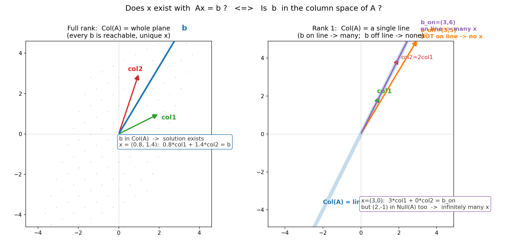
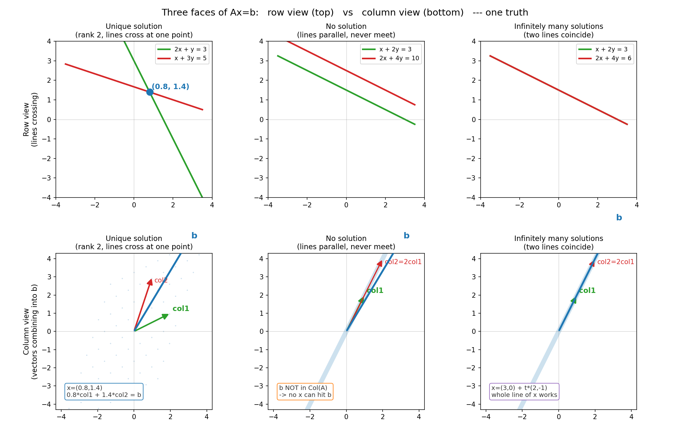

# 第 15 章 · 线性方程组 `Ax=b` 的几何:找个箭头,揉完正好落到 b

> **核心问题**:前面四篇,我们一直在"理解"——理解向量是箭头、矩阵是揉捏、行列式量胀缩、秩量剩几维、特征值找不转头的轴。可这套语言,到底能**解决**什么真实问题?
>
> 这一章,是全书从"看懂"跨到"用"的第一步。我们就盯住一个你从中学算到大学、却从没真正"看见"过它的东西:**线性方程组 `Ax=b`**。只问一件事——**把它翻译成橡皮膜的语言,它在说什么?解一个方程组,几何上到底是在干什么?**
>
> **读完本章你会明白**:
> - `Ax=b` 翻译成大白话,就是一句话:**找一根输入箭头 `x`,让它被 `A` 揉完,正好落在 `b` 上**。"解方程"从"消元算数",被还原成"几何找箭头"。
> - 解**存不存在**,只取决于一件事:`b` 在不在 `A` 各列张成的那片空间(列空间)里。在,有解;不在,无解。这跟第 3 章的"张成"无缝衔接。
> - 解**唯不唯一**,只取决于另一件事:`A` 的零空间里有没有非零的箭头。有,解就能叠加无穷多个;没有,解才唯一。这回扣第 10 章的"秩"、第 11 章的"零空间"。
> - 还有,同一个 `Ax=b`,可以是①一堆等式、②一个矩阵方程、③一组向量的线性组合——**三副面孔,一个本质**。本书咬住第③副(列视角),因为它才能让你"看见"解的结构。

---

> **如果一读觉得太难**:先只记住三件事——① `Ax=b` 就是"找根箭头 `x`,被 `A` 揉完正好落 `b`";② 有没有解,看 `b` 在不在 `A` 的列空间;③ 解唯一不唯一,看 `A` 的零空间是不是只有零向量。这三句撑起全章,其余都是给它们配的证据。

---

## 章首·一句话点破

从第 1 篇到第 4 篇,我们攒了一整套"看见空间"的词汇:箭头、张成、基、维数、矩阵、秩、零空间、特征值。这些词在脑子里转了这么久,你可能隐隐有个问题:

> **攒了这么多词,到底能拿来干嘛?**

这一章,就是这套语言第一次"真刀真枪地干活"。它要解决的任务,朴素到你觉得不值一提——**解一个方程组**。可一旦你用橡皮膜的眼睛重新看它,会发现一件让你意外的事:

> **"解方程组 `Ax=b`",翻译成大白话就是——找一根输入箭头 `x`,让它被矩阵 `A` 揉捏之后,正好落到目标箭头 `b` 上。**

这句话是**结论**。这一章我们倒过来拆:先看清这个"翻译"是怎么对上的,再追问两个最关键的问题——**什么样的 `b` 配得上一个解(存在性)?什么样的 `A` 只给一个解(唯一性)?** 把这两个问题用橡皮膜讲透,你就彻底"看见"了方程组。

---

## 一、先把 `Ax=b` 从一排等式,翻译成"找一根箭头"

绝大多数人脑子里的"线性方程组",长这样:

```
   2x +  y = 3
    x + 3y = 5
```

两个未知数 `x`、`y`,两条等式,目标是把它们解出来。中学老师教你**消元**:第一条减去第二条的某个倍数,消掉一个未知数,再回代。你算得贼溜,可心里始终没底:**这两条等式底下,到底在描述一件什么事?为什么要"消元"?**

我们把这套"等式视角"连根拔起,换成橡皮膜的视角。

### 翻译的关键:把未知数包成一个箭头

上面那个方程组,把未知数 `x`、`y` 包成一个箭头 `x = (x, y)`,把右边的常数包成一个箭头 `b = (3, 5)`,再把左边那堆系数按"每一列是一根基向量新去向"的规矩排成矩阵 `A`:

```
   ┌        ┐   ┌   ┐     ┌   ┐
   │ 2   1  │   │ x │     │ 3 │
   │        │ · │   │  =  │   │
   │ 1   3  │   │ y │     │ 5 │
   └        ┘   └   ┘     └   ┘
        A         x          b
```

这一步纯粹是"换种写法",没有任何新东西。但写法的改变,带来视角的飞跃——**这两个等式,现在变成了一个矩阵方程 `Ax = b`**。而 `Ax` 是什么?第 1 章早就讲透过:

> **`Ax` = 让箭头 `x` 被 `A` 揉一下。** 算出来,是 `x` 这根箭头被揉捏后的新位置。

所以 `Ax = b` 的意思,白纸黑字翻译过来就是:

> **找一个输入箭头 `x`,让它被 `A` 揉完之后,正好落在 `b` 上。**

### 不这样看会怎样

如果你只把方程组看成"两条等式 + 消元",那你会:

- 永远在"算数"里打转,解出来就完事,却**看不见解的结构**——什么时候有解、什么时候无解、什么时候解无穷多,对你是一堆需要分情况记的规则。可一旦你看见"解方程 = 找一根被揉完落 b 的箭头",这三件事全变成"空间里的几何关系",一目了然。
- 后面遇到"超定方程组"(方程比未知数多,矛盾)、"欠定方程组"(未知数比方程多,自由)、"最小二乘"(没有精确解时怎么办),你会觉得是一堆新名词。可在列视角下,它们不过是"`b` 离列空间有距离"或"零空间有货"的不同长相。

> **钉死这件事**:`Ax = b` 不是两条等式,是一个几何问题——**求一根输入箭头,使它被 `A` 揉到 `b`**。会算的人解等式,真懂的人找箭头。这一章从头到尾,就在做这个翻译。

---

## 二、列视角:`Ax` 就是把 `A` 的各列按 `x` 的分量调配出来(本书核心)

光说"找根箭头揉完落 b",还嫌抽象。这一节我们把"`A` 揉 `x`"这件事彻底掰开,看清它的真身——而这,正是本章的灵魂。

第 1 章我们钉死过一个结论:**矩阵乘向量 `M·v`,等于"a 份第一列 + b 份第二列"(v 的分量当系数,去调配矩阵的各列)**。把它套到 `Ax = b` 上:

```
   A · x  =  x1·(A的第1列) + x2·(A的第2列) + … + xn·(A的第n列)  =  b
```

这一行字,是全章最该"啊哈"的地方。它把"`Ax = b`"重新翻译成了第三句话:

> **解 `Ax = b`,就是在问:`b` 这根目标箭头,能不能被 `A` 的各列**线性组合**出来?如果能,那组组合系数 `(x1, x2, …, xn)`,就是解 `x`。**

> **比喻**:想象 `A` 的每一列是一管颜料(col1、col2、…),`b` 是你想调出来的目标色。解方程,就是问"能不能用这几管颜料,按某个比例挤出来,正好调出目标色 `b`"?能,那组比例就是解 `x`;调不出,就没解。

这个"列视角",和第 3 章的"张成"是同一件事的两次现身:

- 第 3 章问:**给几根向量,它们所有线性组合能铺出多大一片?**(张成 = 列空间)
- 这一章问:**目标 `b`,在不在 `A` 各列铺出的那片空间里?**(在,才有解)

你看,**第 3 章埋的种子,这里发芽了**。"张成"那个看似抽象的概念,在这里变成了"方程组有没有解"的判据。这就是为什么我们当初那么用力地讲它。

> **钉死**:解 `Ax = b` = 把 `b` 表示成 `A` 各列的线性组合;解 `x` 就是那组组合系数。**`b` 在不在 `A` 的列空间,直接决定有没有解。**

---

## 三、解的存在:`b` 在不在列空间

现在,正面回答第一个大问题——**什么时候方程组有解?**

把上一节的结论再往前推一步。`A` 的各列,张成一片空间,这片空间有个名字,叫 `A` 的**列空间(column space)**,记作 `Col(A)`。它是"所有能被 `A` 揉出来的箭头"的集合——也就是所有形如 `A·(某个 x)` 的输出,能到达的全部位置。

而 `Ax = b` 要有解,意思就是"存在某个 `x`,使得 `A·x = b`",翻译过来:

> **`Ax = b` 有解 ⟺ `b` 落在 `A` 的列空间里。**

就这么干脆。`b` 在 `Col(A)` 这片地里,就找得到一根 `x` 把它揉出来;`b` 在外面,你怎么揉都揉不到,无解。

### 看两个长相差很多的 `A`

为什么有的方程组永远有解、有的却常常无解?全看 `A` 的列空间"铺多大"。我们看两种极端:

**① `A` 满秩(列空间 = 整个平面)。** 比如 `A = [[2,1],[1,3]]`,它的两列 `(2,1)`、`(1,3)` 不共线,张成整个二维平面(第 3 章的"两根不共线铺满平面")。于是**不管你给什么 `b`,它都落在(铺满整个平面的)列空间里**——方程组永远有解。这种 `A` 叫列满秩,是最"靠谱"的一类矩阵。

**② `A` 降秩(列空间被压成一条线)。** 比如 `A = [[1,2],[2,4]]`,它的第二列 `(2,4)` 恰好是第一列 `(1,2)` 的 2 倍——两列共线。于是它的列空间只是 `y = 2x` 这一条直线(第 3 章的"共线只张成一条线")。这时 `b` 就**不是永远在列空间里**了:`b` 恰好落在这条线上,才有解;`b` 落在线外,无解。

> 下图把这两种情形画在一起对照。**左图**:满秩 `A`,列空间铺满整个平面(那片淡蓝点阵),随便一根 `b` 都在里面 → 有解,而且待会儿会看到,解还唯一。**右图**:降秩 `A`,列空间被压成一条线 `y=2x`;橙色 `b_off=(3,5)` 不在线上(无解),紫色 `b_on=(3,6)` 在线上(有解)。**有没有解,一眼看 `b` 在不在那片蓝里。**



### 不这样理解会怎样

如果你只记得"方程数等于未知数就有唯一解、多了无解、少了多解"这种口诀,你会被坑——那是消元的经验法则,不是本质。真相是:**有没有解,跟方程数、未知数数都没直接关系,只跟"`b` 在不在列空间"有关。** 一个 2×3 的矩阵(两方程三未知数),照样可能无解(只要 `b` 跑出它那两列张成的范围);一个 3×2 的矩阵(三方程两未知数),也照样可能有唯一解(只要 `b` 恰好落在那两列张成的平面里)。

> **钉死**:解的存在性 ⟺ `b ∈ Col(A)`。这是列视角送我们的第一份礼物——**把"有没有解"从一道算术题,变成一个肉眼可判的几何关系**。

---

## 四、解的唯一:零空间里有没有货

`b` 在列空间,保证有解。可有了解,它**唯不唯一**?这是第二个大问题,它的答案藏在另一个空间里——`A` 的**零空间(null space)**。

> **零空间**(`Null(A)`):所有被 `A` 揉完**正好落到原点**的箭头,即满足 `A·n = 0` 的全体 `n`。它是第 11 章的"四个基本子空间"之一,在橡皮膜语言里,就是"被这次揉捏压扁到原点的那批箭头"。

现在,把零空间和解的唯一性挂上钩。假设 `Ax = b` 已经有一个解 `x0`(即 `A·x0 = b`)。我们问:还有没有别的 `x'` 也满足 `A·x' = b`?

把两个解相减:`A·x0 − A·x' = b − b = 0`,即 `A·(x0 − x') = 0`。这说明 **`x0 − x'` 落在零空间里**。反过来也成立:零空间里随便挑一根 `n`,那 `x0 + n` 也是解(因为 `A·(x0 + n) = A·x0 + A·n = b + 0 = b`)。

> **钉死这件事**:解的全部长相,是
>
> ```
>    通解  =  某一个特解 x0   +   零空间里的任意向量 n
> ```
>
> 于是:**零空间只有零向量(里面没货)→ 解唯一;零空间里有非零向量(有货)→ 解无穷多**。

### 零空间什么时候"有货"

零空间有没有非零向量,正好由 `A` 的列是不是线性无关决定。回忆第 3 章那个判据:一组向量线性无关 ⟺ 凑回零向量只有"系数全 0"一种办法。把判据放到 `A` 的各列上:

- `A` 各列**线性无关**(列满秩):想让 `x1·列1 + … + xn·列n = 0`,只能 `x` 全 0.于是零空间只有零向量,**解唯一**。
- `A` 各列**线性相关**(有冗余列,降秩):存在不全 0 的 `x` 让线性组合为零,零空间有非零向量,**解不唯一**。

到这里,第 3 章的"线性无关"、第 10 章的"秩",全在本章会师了:

> **`Ax = b` 解唯一 ⟺ `A` 列满秩 ⟺ 零空间只有零向量。** 这三个说法是同一件事。

> **钉死**:有解之后,解唯一不唯一,看零空间有没有货。零空间空(只有零)→ 唯一;零空间有非零向量 → 一个特解 + 零空间里随便叠,无穷多解。

---

## 五、三副面孔:等式、矩阵、向量,一个本质

讲到这里,你可能发现一个让人踏实的事实:**同一个 `Ax = b`,可以戴三顶帽子,底下却是同一张脸。**

- **第①副面孔:线性方程组(几行等式)。** 这是中学的样子——`2x+y=3, x+3y=5`。每行一条等式,消元求解。**行视角**:每行等式在平面上是一条直线,解就是这些直线的交点。
- **第②副面孔:矩阵方程。** 把等式收成 `A·x = b` 一个式子。**变换视角**:`x` 被揉捏到 `b`。
- **第③副面孔:向量方程(列的线性组合)。** `x1·列1 + x2·列2 = b`。**列视角**:`b` 由各列调配出来。

三副面孔,描述的是**同一个事实**,只是看你从哪面切进去。

> 下图把三种情况(唯一解 / 无解 / 多解)的**行视角(上排)**和**列视角(下排)**并排画出来对照。**盯着每一列上下看**:上排是两条直线相交/平行/重合(行视角),下排是列向量能不能凑出 `b`(列视角)。**两种画法,同一个结论。**



### 行视角 vs 列视角:为什么本书咬住列视角

行视角(直线交点)是中学画法,亲切,但有个致命的局限——**它只能看见"解是什么",看不见"解的结构"**。三条直线在三维空间里相交?五条直线在十维空间里?行视角的图根本画不出来,你只能靠代数规则硬算。

列视角(向量凑 `b`)不一样:**它对任何维度都成立**。2 维、3 维、1000 维,`Ax = b` 的本质永远是"`b` 在不在列空间"、"零空间有没有货"。高维空间你画不出直线,但"`b` 落在没落在那片蓝里"这个几何关系,照样成立、照样能判。这就是为什么本书——以及所有把线代"用到深处"的领域(机器学习、量子、信号)——都咬住列视角不放。

> **钉死**:行视角管"算",列视角管"懂"。会做题,行视角够用;要真懂、要把线代用到高维和真实问题,**必须切换到列视角**。本章教你的,就是这个切换。

---

## 计算佐证:拿纸笔和 numpy,亲手判三种情况

这一节用三个具体的 `2×2` 例子,把全章的结论一一坐实。**每个例子先几何判断,再算式核对,最后 numpy 验证。** 三种情况,正好对应"唯一 / 无 / 多"。

### 例子 1 · 唯一解(满秩,`b` 在列空间)

`A = [[2,1],[1,3]]`,`b = (3, 5)`。

- **几何判断**:`A` 两列 `(2,1)`、`(1,3)` 不共线 → 列空间铺满整个平面 → 任何 `b` 都在列空间 → **有解**;且列满秩(两列线性无关)→ 零空间只有零向量 → **唯一解**。
- **手算**(`2x+y=3, x+3y=5`):
  ```
     从第二条 x = 5 - 3y,代入第一条:  2(5-3y) + y = 3  ->  10 - 5y = 3  ->  y = 7/5 = 1.4
     回代  x = 5 - 3*1.4 = 5 - 4.2 = 0.8
     解  x = (0.8, 1.4)
  ```
- **列视角核对**:`0.8·(2,1) + 1.4·(1,3) = (1.6,0.8) + (1.4,4.2) = (3.0, 5.0) = b` ✓

### 例子 2 · 无解(列空间是一条线,`b` 不在线上)

`A = [[1,2],[2,4]]`,`b = (3, 5)`。

- **几何判断**:`A` 第二列 `(2,4)` = 2 × 第一列 `(1,2)`,两列共线 → 列空间被压成 `y = 2x` 这一条线。`b = (3,5)` 满不满足 `y = 2x`?`5 ≠ 2×3` → `b` 不在这条线上 → **无解**。
- **行视角**:`x+2y=3` 和 `2x+4y=10`,第二条是第一条乘 2,但右边 `3×2=6 ≠ 10` ——两条直线**平行且不重合**,永不相交。无解。
- **秩判据**:`rank(A) = 1`(列共线),但增广矩阵 `[A | b]` 的秩 `= 2`(`b` 带来了新方向)。**`rank(A) < rank([A|b])` ⟺ 无解**。

### 例子 3 · 多解(`b` 在列空间,但零空间有货)

`A = [[1,2],[2,4]]`(同例 2 的 `A`),`b = (3, 6)`。

- **几何判断**:列空间还是 `y = 2x` 这条线。`b = (3,6)` 满足 `6 = 2×3` → `b` 在线上 → **有解**。但 `A` 降秩,零空间有非零向量 → **解不唯一**。
- **找一个特解**:`x0 = (3, 0)`,验算 `A·(3,0) = 3·(1,2) + 0·(2,4) = (3,6) = b` ✓。
- **找零空间向量**:`n = (2, -1)`,验算 `A·(2,-1) = 2·(1,2) − 1·(2,4) = (2,4) − (2,4) = (0,0)` ✓。所以 `(2,-1)` 在零空间里。
- **通解**:`x = (3,0) + t·(2,-1)`,`t` 取任何数都对。比如 `t=1`:`x=(5,-1)`,验算 `A·(5,-1) = 5·(1,2) − 1·(2,4) = (5,10)−(2,4) = (3,6) = b` ✓。无穷多个解。
- **秩判据**:`rank(A) = 1 = rank([A|b])`(有解),但 `rank(A) = 1 < 2`(未知数个数)→ **自由度 = 2 − 1 = 1**,解是一条直线(无穷多)。

### numpy:一行判三种情况

```python
import numpy as np

def diagnose(A, b):
    A = np.array(A, float); b = np.array(b, float)
    r_A  = np.linalg.matrix_rank(A)
    r_Ab = np.linalg.matrix_rank(np.c_[A, b])
    print(f"rank(A)={r_A}, rank([A|b])={r_Ab}, cols={A.shape[1]}")
    if r_A < r_Ab:
        print("  -> NO solution  (b outside Col(A))")
    elif r_A == A.shape[1]:
        x = np.linalg.solve(A, b)
        print(f"  -> UNIQUE solution x = {x}")
    else:
        # 多解: 给一个特解(最小二乘恰好落在列空间的解)
        x0, *_ = np.linalg.lstsq(A, b, rcond=None)
        print(f"  -> INFINITELY many; one particular x = {x0.round(3)}")

# 例子 1: 唯一解
diagnose([[2.,1.],[1.,3.]], [3.,5.])      # rank(A)=2=rank([A|b])=cols -> unique (0.8,1.4)
# 例子 2: 无解
diagnose([[1.,2.],[2.,4.]], [3.,5.])      # rank(A)=1 < rank([A|b])=2 -> no solution
# 例子 3: 多解
diagnose([[1.,2.],[2.,4.]], [3.,6.])      # rank(A)=1=rank([A|b]) < 2 -> infinitely many
```

跑一遍,输出会和上面的手算判断一字不差。**注意例子 2**:直接 `np.linalg.solve(A, b)` 会抛 `LinAlgError: Singular matrix`(因为 `A` 不可逆),这正是 numpy 在告诉你"这矩阵压扁了,解不了"。判无解,靠的是 `rank(A) < rank([A|b])` 这把尺子。

> **一个易混点**:有人以为"`solve` 报错 = 无解"。**不对**。`solve` 报错只说明 `A` 奇异(降秩、不可逆),此时可能**无解**(例 2),也可能**多解**(例 3)——全看 `b` 在不在列空间。区分这两者,正是 `rank(A)` vs `rank([A|b])` 的活儿。降秩不等于无解,这是初学者最爱踩的坑。

---

## 章末小结

### 用"橡皮膜"比喻回顾本章

回到那张画满方格的橡皮膜。这一章,我们把前面攒的所有词,**第一次拧成一股绳去干活**——解方程组。

答案分四层:

1. **`Ax = b` 是个几何问题**:找一根输入箭头 `x`,被 `A` 揉完正好落 `b`。会算的人消元,真懂的人找箭头。
2. **列视角是钥匙**:`Ax = x1·列1 + … + xn·列n = b`。解 `Ax = b` = 把 `b` 表示成 `A` 各列的线性组合,解就是那组系数。这把第 1 章("矩阵乘向量 = 列的线性组合")和第 3 章("张成")的线,接到了"解方程"上。
3. **有没有解 ⟺ `b` 在不在 `Col(A)`**。满秩 `A` 的列空间铺满整个平面,任何 `b` 都有解;降秩 `A` 把列空间压成更小的子空间,`b` 落在外面就无解。
4. **唯不唯一 ⟺ 零空间有没有货**。零空间只有零向量(列满秩)→ 唯一;零空间有非零向量(降秩)→ 一个特解 + 零空间随便叠,无穷多解。

### 本章在全书主线中的位置

本书的主线是:**一切线代概念,都是"空间被揉捏"这件事的某个侧面。** 那么,本章的概念——`Ax = b` 的解——是揉捏的**哪个侧面**?

> **本章刻画的是"解的几何存在性":把"解方程"翻译成"找一根箭头,被揉完正好落 `b`"。** 解存不存在,问的是"`b` 在不在这次揉捏能到达的范围(列空间)里";解唯一不唯一,问的是"被揉到同一个 `b` 的输入箭头,只有一根还是一片(零空间)"。

你看,**列空间回答"能揉到哪",零空间回答"哪些输入揉到同一个地方"——这两个子空间,正好把方程组的解完全说清**。而这,正是第 11 章"四个基本子空间"埋的那条主脉第一次开花结果。到第 17 章最小二乘,当 `b` 跑出列空间、没有精确解时,我们还会回到这里,问"那退而求其次,揉到离 `b` 最近的那个点"——那次的答案,叫"投影"。

### 五个"为什么"清单

如果你只能记五件事,记这五件:

1. **`Ax = b` 翻译成大白话是什么**:找一根输入箭头 `x`,被 `A` 揉完正好落 `b`。**这是把方程组从算术还原成几何的第一步。**
2. **列视角下解方程是什么**:`Ax = x1·列1 + … + xn·列n = b`,解 `x` 就是把 `b` 表示成各列线性组合的那组系数。**和第 3 章的"张成"无缝衔接。**
3. **解什么时候存在**:⟺ `b` 落在 `A` 的列空间 `Col(A)` 里。判据:`rank(A) = rank([A|b])`。
4. **解什么时候唯一**:⟺ `A` 列满秩 ⟺ 零空间只有零向量。否则(降秩)一个特解 + 零空间任意向量,无穷多解。
5. **为什么本书咬住列视角**:行视角(直线交点)只看见"解是什么",且高维画不出;列视角("`b` 在不在列空间")对任何维度都成立,是线代用到深处的通用眼光。

### 想继续深入,该往哪钻

- **看动画**:3Blue1Brown《线性代数的本质》第 9~11 集("线性方程组""非方阵""四个基本子空间"),和本章同源,把"`b` 在不在列空间"画成了动画,本章的文字比喻在那里会变成肉眼可见的画面。
- **亲手玩判据**:把上面的 `diagnose` 函数拿去,自己造一堆 `A`、`b`(满秩的、降秩的、`b` 在线上的、`b` 在线外的),看 `rank(A)` vs `rank([A|b])` 怎么把三种情况一刀切开。改一晚上,你对"解的结构"的直觉会脱胎换骨。
- **尝高维的味道**:把 `A` 换成一个 `3×2` 矩阵(三方程两未知数,超定)、再换成一个 `2×3` 矩阵(两方程三未知数,欠定)。用列视角判断:前者的列空间是三维空间里的一个平面,`b` 大概率不在里面(无精确解);后者的列空间至少能铺满二维平面,`b` 基本都在(但零空间有货,多解)。**这两种情形,正是第 17 章最小二乘的地基。**

---

> 第 5 篇开工:`Ax = b` 的几何立住了——解方程就是找一根被揉完落 `b` 的箭头,有没有解看列空间,唯一不唯一看零空间。可如果 `b` 偏偏落在列空间**外面**(无精确解),我们最该问的下一句话是——**那能不能找一个"离 `b` 最近"的点,当作最好的近似?** 这个"最近的点",几何上就是 `b` 在列空间上的**影子**。翻开 **第 16 章 · 正交与投影:一根箭头的影子**——你会看见,投影不是别的,正是"在列空间里找离 `b` 最近的那一点",它把本章"无解"的尴尬,优雅地化解成"找一个最佳近似"。
