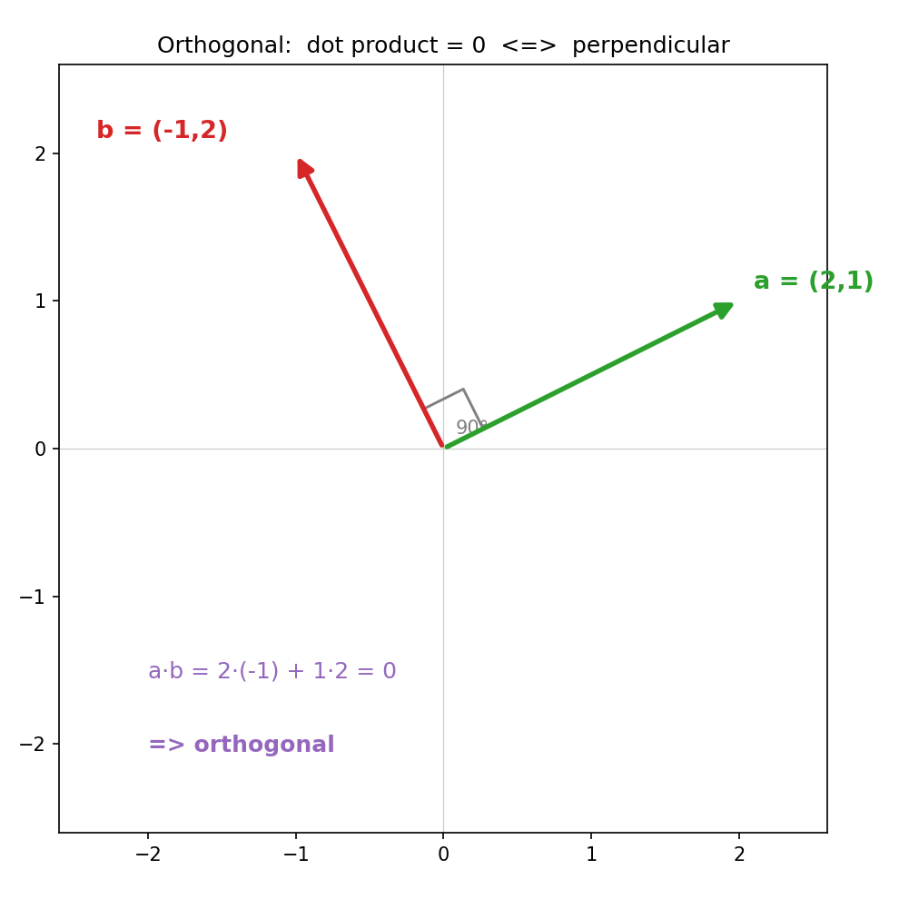
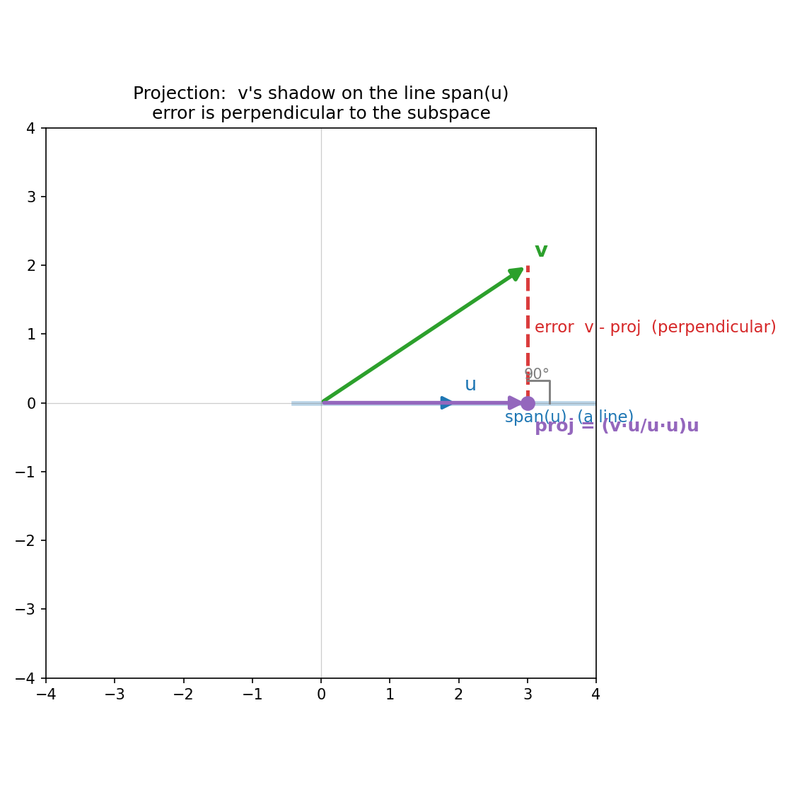
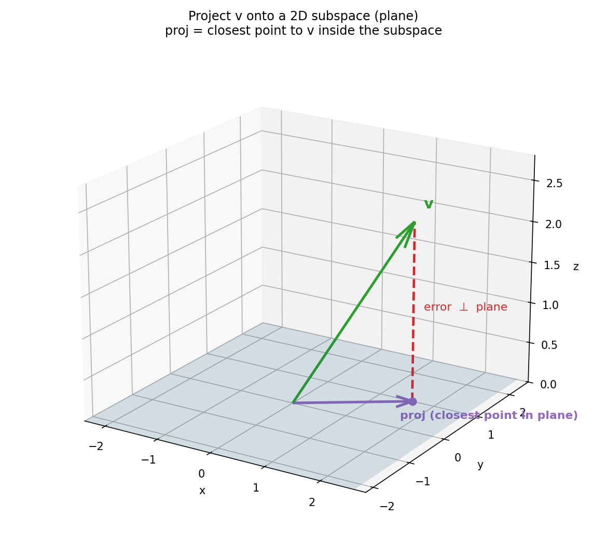

# 第 16 章 · 正交与投影:一根箭头的影子

> **核心问题**:第 15 章结尾留下一个尴尬——如果目标箭头 `b` 跑到了 `A` 的列空间外面,`Ax = b` 就**没有精确解**,你怎么揉都揉不到 `b`。那能不能退一步,在列空间里找一个"**离 `b` 最近**"的点,当作最好的近似?
>
> 这一章,我们就回答这个"最近"到底怎么找。只问一件事——**一根箭头,在另一方向(或一个子空间)上的"影子",为什么就是那个"最近的点"?**
>
> **读完本章你会明白**:
> - **点积(dot product)的几何**:点积 = 长度·长度·cos(夹角)。所以点积 = 0,等价于两根箭头**垂直(正交)**——正交不是新规矩,是点积的一个特殊取值。
> - **投影(projection)的几何**:一根箭头 `v` 在另一根 `u` 方向上的"影子",垂足就是投影点。投影公式 `(v·u / u·u)·u` 不是要你背的东西,而是"垂线必须垂直"这个几何条件,推出来的唯一答案。
> - **投影 = 子空间里离 `v` 最近的点**(本章灵魂):在一条线、一个平面、或任何子空间上,离 `v` 最近的那个点,正是 `v` 的投影;误差 `v − 投影` 必然垂直于该子空间。这是"最近点"定理,它直接接上第 17 章的最小二乘。
> - 投影把 `v` 一刀拆成两半——**投影**(在子空间里)+ **垂直残差**(在子空间的"正交补"里),`v = 投影 + 残差`。以及向多维子空间投影时,那个 `AᵀA` 是怎么冒出来的。

---

> **如果一读觉得太难**:先只记住三件事——① 点积 = 0 ⟺ 两根箭头垂直(正交);② 投影就是箭头在某个方向上的"影子",垂足那个点;③ **影子 = 子空间里离原箭头最近的点,误差永远垂直于子空间**。这三句撑起全章,后面所有的公式都是给它们配的证据。

---

## 章首·一句话点破

第 15 章我们盯住 `Ax = b`,看清了"解方程 = 找一根被揉完落 `b` 的箭头",也看清了"`b` 在列空间里才有解"。可结尾甩出来一个硬骨头:**`b` 要是不在列空间里呢?**

> **`b` 在列空间外面,意味着你用 `A` 的各列再怎么调配,都调不出 `b` 这根箭头。** 那最聪明的办法,不是认输,而是退而求其次——**在列空间(那些能调配出的箭头组成的那片空间)里,挑一个离 `b` 最近的,当作 `b` 的替身**。

这个"最近的替身",长什么样?一句话点破:

> **它就是 `b` 在列空间上的"影子"——几何上叫投影(projection)。影子到 `b` 的那根连线,必然垂直地戳进列空间。**

这句话是**结论**。这一章我们倒过来拆:先看清"垂直(正交)"到底是怎么用数字量出来的(点积),再让一根箭头在一根线、一个平面上投出影子,最后证明——**这个影子,就是子空间里离原箭头最近的那一点**。把这件事钉死,第 17 章的最小二乘就只剩一步之遥。

---

## 一、点积的几何:它量的不是"数字的乘积之和",而是"夹角"

讲投影之前,得先讲清"垂直"——因为投影的灵魂就是"误差垂直"。可"垂直"怎么用数字判定?这就要回到一个你算过千百遍、却从没真正看懂的东西:**点积**。

绝大多数人脑子里的点积,长这样:

```
   (a₁, a₂) · (b₁, b₂)  =  a₁·b₁ + a₂·b₂
```

两列数,逐项相乘,再加起来。你算得贼溜,可它**为什么长这样**、在几何上到底量的是什么,你答不上来。

### 不这样看会怎样

如果你只把点积当成"逐项乘加的一套算法",那:
- "两根向量垂直"对你就是"画出来看着成 90°"这种视觉判据,高维空间你根本画不出来,就没法判了。
- 后面"投影""正交补""最小二乘"全靠"点积 = 0 表示垂直"这一条吃饭,你不知道这条,投影公式就成了无源之水。

所以这一节,我们把点积从"逐项乘加"还原成它真正的几何含义。

### 所以这样看:点积 = 长度·长度·cos(夹角)

点积的几何真身,是这个式子:

> ```
>    a · b  =  |a| · |b| · cos(θ)      (θ 是 a、b 之间的夹角)
> ```
>
> 翻译成大白话:**点积,等于 a 的长度、乘 b 的长度、再乘它们夹角的余弦。**

> **比喻**:点积像在量"两根箭头**朝同一方向有多少重合**"。两根箭头同向(θ=0°,cos=1),点积最大,等于长度之积——完全重合;夹角越大,重合越少,点积越小;**夹角到 90°(cos=0),重合为零,点积归零**;反向(θ=180°,cos=-1),点积是最负的数(完全对着干)。

这个"重合度"的视角,解释了点积几乎所有性质:为什么同向时最大、为什么有一正一负、为什么垂直时为零。而其中最关键的一句,正是下面这条。

### 推论:点积 = 0 ⟺ 正交(垂直)

把 `cos(90°) = 0` 这件事塞进点积公式,立刻得到全书最常用的一把尺子:

> **两根向量 `a`、`b` 点积为零(`a·b = 0`),等价于它们互相垂直(正交)。**

注意是"等价"——双向的。垂直,点积必为零;点积为零,必垂直。这个双向等价,是后面一切的地基:**用数字判垂直,不必画图**。二维、三维、一千维,只要点积为零,几何上就是垂直。

> **钉死这件事**:`a·b = 0` ⟺ `a ⊥ b`。点积 = 0,是"垂直"的代数面孔;垂直,是"点积 = 0"的几何面孔。判垂直不用量角器,用点积。

> 下图把这件事画出来。绿色 `a = (2,1)`、红色 `b = (-1,2)`,算一下:`a·b = 2·(-1) + 1·2 = -2 + 2 = 0`。点积为零,所以它们**必然垂直**——图上那个直角,就是点积为零的几何真身。



### 一个收尾的小问题:那"逐项乘加"从哪来

你可能还在嘀咕:几何上点积是 `|a||b|cosθ`,可我手算时明明是 `a₁b₁ + a₂b₂`,这俩怎么对得上?

答案藏在第 1 章的"标准基"里。在标准基 `i, j` 下,`a = (2,1) = 2i + 1j`。而 `i·i = 1`(长度1×1×cos0°=1)、`j·j = 1`、`i·j = 0`(它们垂直)。所以:

```
   a·b = (2i + 1j)·(-1i + 2j) = 2·(-1)·(i·i) + 2·2·(i·j) + 1·(-1)·(j·i) + 1·2·(j·j)
                               = -2·1 + 0 + 0 + 2·1  =  0
```

"逐项乘加",本质是"**把两个向量拆成标准基的线性组合,基向量两两正交(交叉项为零)、自身的点积为 1**,所以最后只剩下同一下标的乘积之和"。它是"长度·长度·cos"在标准基下的**速记算式**——算式是几何的副产品,这一点第 1 章早就立过了。

> **一句话**:点积的**定义**是 `|a||b|cosθ`(几何);在标准基下,它**算起来**正好是 `a₁b₁ + a₂b₂`(代数)。垂直 ⟺ 点积为零,这把尺子两条路都通。

---

## 二、投影:一根箭头在另一方向上的"影子"

有了"点积 = 0 ⟺ 垂直"这把尺子,我们可以谈投影了。

> **投影(projection)**:给两根向量 `v` 和 `u`。把 `v` 的箭尖,沿着**垂直于 `u`** 的方向,落到 `u` 所在的那条直线上——那个落点,就是 `v` 在 `u` 方向上的投影,记作 `proj_u(v)`。

> **比喻**:想象一束光从正上方照下来,`v` 这根斜着的箭头,在 `u` 所在的地平线上,投出一道影子。影子从原点延伸出去,终点就是投影点;光线的方向,就是 `v` 到影子的那条垂线。**投影 = 影子,垂线 = 光线。**

### 不这样看会怎样

如果你只把投影当成"套公式 `(v·u/u·u)u` 算出一个向量",那:
- 你永远不知道这个公式**为什么长这样**,它对你是一串要背的符号。
- 你不会知道投影是"**子空间里离 `v` 最近的点**"——而这正是投影最有用的地方(下一节讲)。
- 第 17 章最小二乘"用投影找最佳拟合",对你就是黑魔法。

所以这一节,我们要从"垂线必须垂直"这个**几何条件**,把投影公式**推**出来,而不是甩给你。

### 所以这样看:投影公式是"垂线垂直"推出来的唯一答案

设 `v` 在 `u` 方向上的投影是某个向量 `p`,它一定沿着 `u` 走,所以 `p = c·u`(`c` 是个待定的数)。现在的问题是:**`c` 是多少?**

关键的几何条件来了:**`v` 到 `p` 的连线(误差 `v − p`),必须垂直于 `u`**——因为投影的定义,就是"垂直地落下去"。把"垂直"翻译成点积,就是:

```
   (v − p) · u  =  0          (误差垂直于 u,所以点积为零)
```

把 `p = c·u` 代进去:

```
   (v − c·u) · u  =  0
   v·u − c·(u·u)  =  0
   v·u  =  c·(u·u)
   c    =  (v·u) / (u·u)
```

于是 `p = c·u = [(v·u)/(u·u)]·u`。**这就是投影公式。** 它不是天上掉下来的,是"误差必须垂直"这一条几何要求,逼出来的唯一答案。

> **钉死这件事**:投影公式 `proj_u(v) = (v·u / u·u)·u`,不是要背的符号串,而是"**垂线垂直于 u ⟺ 误差与 u 点积为零**"这个几何条件,解出来的那个唯一的 `c`。你只要记住"误差垂直",公式自己就能推。

### 看一眼图,把这件事钉进脑子

> 下图把 `v` 投到 `u` 所在那条线上的全过程画出来了。绿色是 `v`,蓝色那条粗线是子空间(这里是 `u` 张成的一条直线),紫色是投影 `proj`(垂足),红色虚线是误差 `v − proj`——它**垂直地戳进**那条线,图上那个 90° 直角标记就是铁证。



### 一个小算例,把公式走一遍

`v = (3, 2)`,`u = (2, 0)`(指向 x 轴正方向)。算投影:

```
   v·u = 3·2 + 2·0 = 6
   u·u = 2·2 + 0·0 = 4
   c   = 6 / 4     = 1.5
   proj = 1.5·(2,0) = (3, 0)
```

投影落在 `(3, 0)`,正好是 x 轴上、`v` 的正下方——物理直觉(光从上照下来,影子在 x 轴上)和公式完全吻合。误差 `v − proj = (3,2) − (3,0) = (0, 2)`,验一下它垂直于 `u`:`(0,2)·(2,0) = 0 + 0 = 0` ✓。**误差确实垂直于 `u`。**

---

## 三、投影 = 子空间里离 `v` 最近的点(本章灵魂)

上一节讲了"投影怎么算"。可投影为什么这么重要?这一节,我们揭开它真正的身份——**投影,是子空间里离 `v` 最近的那个点**。这一句话,是本章的灵魂,也是第 17 章最小二乘的全部地基。

### 提一个问题,逼出"最近点"

假设你站在 `v` 这根箭头的箭尖上,脚下是一条线(或一个平面,总之是某个子空间)。你问自己:**这片子空间里,哪个点离我最近?**

> **不这样看会怎样**:如果你以为"最近点"是另一个问题、和投影无关,那你就把第 17 章的最小二乘(找最佳拟合直线)看成了玄学。实际上,**最小二乘做的,就是一次投影**——找离目标最近的那个点,而那个点正是投影。

### 所以这样看:最近点,就是投影;误差必然垂直

现在证明这件事。设子空间是一条线(由 `u` 张成),`v` 是箭尖。我们要在这条线上,找一个点 `p*`,使 `v` 到 `p*` 的距离 `|v − p*|` **最小**。

> **比喻**:想象你站在子空间外面(站在 `v` 上),想跳到子空间(那条线/那个面)上。**最短的跳法,是垂直地跳下去**——斜着跳,路只会更长。那个"垂直跳下去"的落点,正是投影。

把这件事用几何严格说清。假设你已经找到了投影 `p = proj_u(v)`(它满足误差 `v − p` 垂直于 `u`)。现在,这条线上**任意**另取一个点 `q = c·u`。我们要证明 `v` 到 `q` 的距离,比 `v` 到 `p` 的距离**长**。

把 `v − q` 拆开:

```
   v − q  =  (v − p) + (p − q)
```

这两部分里,`v − p`(误差)垂直于这条线,而 `p − q` 沿着这条线——**它们俩互相垂直**!于是,勾股定理登场:

```
   |v − q|²  =  |v − p|²  +  |p − q|²
```

只要 `q ≠ p`,`|p − q|² > 0`,所以 `|v − q|² > |v − p|²`,即 `|v − q| > |v − p|`。**线上任何别的点,都比投影离 `v` 更远**。

> **钉死这件事(最近点定理)**:在一条直线、一个平面、或任何子空间上,**离 `v` 最近的那个点,正是 `v` 的投影**;而且误差 `v − 投影` 必然**垂直**于该子空间。这是投影最有用的身份——它把"找一个最近点"这个看似困难的优化问题,变成了"画一条垂线"这个几何动作。

### 这个定理,救了第 15 章的尴尬

把这条定理,直接接回第 15 章结尾的难题。那时我们说:`b` 跑到 `A` 的列空间外面,`Ax = b` 无精确解。现在,用"最近点定理"看:

> **列空间是一个子空间(几根列向量张成的)。`b` 不在里面。那"离 `b` 最近的、又在列空间里的点",正是 `b` 在列空间上的投影。**

而这个投影,正是 `A` 揉某个 `x̂` 之后,能到达的、离 `b` 最近的那个箭头 `Ax̂`。这个 `x̂`,就叫 `Ax = b` 的**最小二乘解**——它是"虽然揉不到 `b`,但揉到的点离 `b` 最近"的那个最佳输入。

> **钉死**:第 15 章的"`b` 不在列空间 = 无解",被本章的"**那就在列空间里找离 `b` 最近的点**"优雅化解。这个最近的点 = 投影,找它的输入 = 最小二乘解。第 17 章就是把这个故事讲完。

---

## 四、投影把 `v` 拆成两半:投影 + 垂直残差

最近点定理还顺手给了我们一个副产品,它对理解"子空间的结构"极其重要。

### 拆分:`v = 投影 + 残差`,两部分互相垂直

既然误差 `v − 投影` 垂直于子空间,那原向量 `v` 就被一刀拆成了两半:

```
   v  =  投影(在子空间里)   +   残差 v − 投影(垂直于子空间)
```

而且这两半**互相垂直**(投影在子空间里,残差垂直于子空间,所以它俩的夹角是 90°)。

> **比喻**:这像把一根斜着的箭头,拆成"贴着地面的影子"(投影)和"立起来的光柱"(残差)。影子躺在地面上(子空间里),光柱垂直立起(正交补里),它俩一横一竖,合起来就是原来的 `v`。

### 正交补:残差住的那片空间

残差 `v − 投影` 垂直于子空间。而**所有垂直于这个子空间的向量,组成一片新的空间**,叫它的**正交补(orthogonal complement)**。于是:

> **任何一根向量 `v`,都可以唯一地拆成:一个在子空间 `V` 里的分量(投影),加上一个在 `V` 的正交补 `V⊥` 里的分量(残差)。这两个分量互相垂直。**

这件事在第 11 章"四个基本子空间"里已经埋过伏笔:列空间和左零空间互为正交补,行空间和零空间互为正交补。投影,就是把一个向量拆进这两个互相垂直的"半边天"的工具。

> **钉死**:`v = proj + residual`,投影在子空间里,残差在正交补里,两者垂直。投影不是凭空多出来的向量,它和残差合起来,正好还原成原来的 `v`。

---

## 五、向多维子空间投影:`AᵀA` 是怎么冒出来的(本章深度)

前面几节,投影的对象都是"一条线"(由一根 `u` 张成的一维子空间)。但第 17 章最小二乘要面对的,是"`A` 的列空间"——它可能是个平面、甚至更高维的子空间。这一节,我们把投影推广到多维子空间,看看那个神秘的 `AᵀA` 从哪儿来。

### 从"一条线"到"一个子空间"

一条线,是"一根向量 `u` 张成的一维子空间"。一个一般子空间,是"几根向量 `A` 的各列张成的"。所以,从"投到 `u` 上"推广到"投到 `Col(A)` 上",就是把"一根向量"换成"一组向量"。

> 下图把这个推广画出来。三维空间里,有一个二维平面(子空间,蓝色),绿色 `v` 在平面之外。它的投影(紫色)落在平面上,红色虚线是误差——**误差垂直地戳进平面**(不只是垂直于某根向量,而是垂直于平面里的**每一根**向量)。



### 投影矩阵:`P = A(AᵀA)⁻¹Aᵀ`

现在,我们要找一个**投影矩阵** `P`,使得对任何向量 `v`,`P·v` 就是 `v` 在 `Col(A)` 上的投影。这个矩阵长什么样?

回到第三节那个把投影公式逼出来的几何条件——**误差必须垂直于子空间**。在一维情形,它是"误差垂直于 `u`",即 `(v − p)·u = 0`。在多维情形,"子空间"是 `A` 的各列张成的,所以"误差垂直于子空间",就是**误差垂直于 `A` 的每一列**:

```
   Aᵀ · (v − p)  =  0        (A 的每一列与误差的点积都为零,堆起来就是 Aᵀ 乘误差)
```

而 `p` 在列空间里,所以 `p = A·x̂`(它是 `A` 的各列按某个系数 `x̂` 调配出来的)。代进去:

```
   Aᵀ · (v − A·x̂)  =  0
   Aᵀ·v  −  Aᵀ·A·x̂  =  0
   Aᵀ·A·x̂  =  Aᵀ·v            ← 这就是著名的"正规方程"!
```

于是 `x̂ = (AᵀA)⁻¹·Aᵀ·v`,而投影 `p = A·x̂ = A·(AᵀA)⁻¹·Aᵀ·v`。所以:

> ```
>    投影矩阵   P  =  A · (AᵀA)⁻¹ · Aᵀ
> ```
>
> 对任何 `v`,`P·v` 就是 `v` 在 `A` 的列空间上的投影。

### `AᵀA` 在这里干什么

你看,`AᵀA` 这个东西,在投影矩阵里非出现不可。它在几何上是什么?

> **`AᵀA` 是"把 `A` 的各列两两点积"得到的方阵。** 它的第 `(i,j)` 个元素,正是 `A` 的第 `i` 列与第 `j` 列的点积。回忆第一节——点积量的是"重合度",所以 `AᵀA` 这整个矩阵,量的是"`A` 的各列之间互相有多重合"。**求 `AᵀA` 的逆,就是在"扣除这种互相重合",从而算出干净的投影。**

> **比喻**:如果 `A` 的各列互相垂直(正交基,下一节讲),它们两两点积都为零(除了自己和自己点积为长度的平方),`AᵀA` 就是个对角阵,逆特别好算。如果各列斜来斜去、互相重合严重,`AᵀA` 就"纠缠"在一起,投影要费劲把它解开。这就是为什么正交基让投影变简单。

### 小算例:`b = (3, 5)` 投到 `A = [[1],[2]]` 的列空间

还记得第 15 章例 2 那个"`b` 不在列空间、无解"的情形吗?`A = [[1],[2]]`(一列,列空间就是直线 `y = 2x`),`b = (3, 5)` 不在 `y = 2x` 上(`5 ≠ 6`)。现在我们不再说"无解",而是求"`b` 在这条线上的投影"。

```
   AᵀA = [1, 2]·[[1],[2]] = 1·1 + 2·2 = 5            (一个 1×1 的"矩阵",就是标量 5)
   Aᵀb = [1, 2]·(3, 5)   = 3 + 10 = 13
   x̂   = (AᵀA)⁻¹·Aᵀb    = 13/5 = 2.6
   p    = A·x̂            = 2.6·(1, 2) = (2.6, 5.2)
```

投影落在 `(2.6, 5.2)`——它确实在直线 `y = 2x` 上(`5.2 = 2×2.6`)。误差 `b − p = (3,5) − (2.6,5.2) = (0.4, −0.2)`,验它垂直于列空间:`(0.4,−0.2)·(1,2) = 0.4 − 0.4 = 0` ✓。

**这个 `x̂ = 2.6`,就是 `Ax = b` 的最小二乘解**——虽然没有任何 `x` 能让 `Ax` 精确等于 `b`,但 `x̂ = 2.6` 让 `Ax̂ = (2.6, 5.2)` 离 `b` 最近。第 17 章会把这件事做完整。

> **钉死**:`P = A(AᵀA)⁻¹Aᵀ` 是投影矩阵,它的来历是"误差垂直于 `A` 的每一列 ⟺ `Aᵀ·误差 = 0`"这个几何条件。`AᵀA` 量的是"`A` 各列之间的互相重合",求它的逆就是在解开这种纠缠。**这一节,是通向第 17 章最小二乘的桥。**

---

## 六、正交基的好处:让投影好算到爆(回扣第 8 章)

最后,看一个让投影变得极其简单的特殊情形——它回扣第 8 章的正交矩阵。

### 如果子空间的基是"正交基"

投影公式 `proj_u(v) = (v·u / u·u)·u` 里,分母 `u·u` 是 `u` 的长度平方。如果 `u` 是单位向量(`u·u = 1`),公式简化成 `proj = (v·u)·u`——分母没了。

现在更进一步:如果子空间由**一组互相正交的单位向量** `q₁, q₂, …` 张成(这叫**标准正交基**, orthonormal basis),那 `v` 在这个子空间上的投影,是:

```
   proj  =  (v·q₁)·q₁  +  (v·q₂)·q₂  +  …
```

**每一项独立算出来,加起来就行,没有 `AᵀA` 的求逆**。因为各 `q` 互相正交,它们之间的"重合"为零,投影不会被纠缠——干净利落。

### 回扣:正交矩阵 = 纯旋转,所以投影对它特别友好

第 8 章讲过,**正交矩阵 `Q`(各列是标准正交基)是"纯旋转、不拉伸"的揉捏**。它的一个直接好处:`QᵀQ = I`(单位矩阵),于是投影矩阵 `P = Q(QᵀQ)⁻¹Qᵀ = Q·I·Qᵀ = QQᵀ`——**简单到极致**。

> **钉死**:正交基(标准正交基)下,投影变成"各项系数独立相加",`AᵀA` 退化成 `I`,投影矩阵就是 `QQᵀ`。这是为什么第 14 章(对称矩阵的正交特征基)、第 19 章(SVD 的正交分解)都那么看重正交——**它把纠缠解开,让投影(以及一切相关计算)变得干净**。

---

## 计算佐证:拿纸笔和 numpy,亲手投一次

这一节用三个例子,把全章的结论一一坐实。**每个例子先几何判断,再手算,最后 numpy 核对,并验误差垂直。**

### 例子 1 · 投到 x 轴(最直观的影子)

`v = (3, 2)`,`u = (2, 0)`(x 轴方向)。投影应该是 `(3, 0)`——因为光从上照下来,影子在 x 轴上,横坐标不变。

- **几何判断**:`u` 沿 x 轴,`v` 的影子在 x 轴上,横坐标就是 `v` 的横坐标 3,所以投影 = `(3, 0)`。
- **手算**:`v·u = 6`,`u·u = 4`,`c = 6/4 = 1.5`,`proj = 1.5·(2,0) = (3, 0)` ✓。
- **验垂直**:误差 = `v − proj = (3,2) − (3,0) = (0, 2)`,`误差·u = (0,2)·(2,0) = 0` ✓。

### 例子 2 · 投到对角线(夹角不再特殊)

`v = (3, 2)`,`u = (1, 1)`(45° 对角线方向)。这次没有"光从上照下来"那么直观,得靠公式。

- **几何判断**:`v` 在对角线上的影子,是个介于 `v` 和对角线之间的点。
- **手算**:`v·u = 3·1 + 2·1 = 5`,`u·u = 1+1 = 2`,`c = 5/2 = 2.5`,`proj = 2.5·(1,1) = (2.5, 2.5)` ✓。
- **验垂直**:误差 = `(3,2) − (2.5,2.5) = (0.5, −0.5)`,`误差·u = 0.5 − 0.5 = 0` ✓。**误差 `(0.5,−0.5)` 正好沿 `−45°` 方向,与对角线垂直**——几何和算式严丝合缝。

### 例子 3 · 投到子空间(接回第 15 章的无解情形)

`A = [[1],[2]]`,`b = (3, 5)`。这是第 15 章例 2"`b` 不在列空间、无解"的情形。现在求投影。

- **几何判断**:`A` 的列空间是直线 `y = 2x`。`b = (3,5)` 不在线上。投影是线上离 `b` 最近的点。
- **手算**(见第五节):`AᵀA = 5`,`Aᵀb = 13`,`x̂ = 13/5 = 2.6`,`p = 2.6·(1,2) = (2.6, 5.2)`。
- **验垂直**:误差 = `(3,5) − (2.6,5.2) = (0.4, −0.2)`,`误差·(1,2) = 0.4 − 0.4 = 0` ✓。**误差垂直于列空间,印证最近点定理。**

### numpy:一行投,再一行验垂直

```python
import numpy as np

def project(v, u):
    """把 v 投到 u 方向(一条线)上."""
    v = np.array(v, float); u = np.array(u, float)
    return (v @ u) / (u @ u) * u

# 例子 1
v, u = [3., 2.], [2., 0.]
p = project(v, u)
print("Ex1 proj:", p, " err:", np.array(v) - p, " err.u:", (np.array(v) - p) @ u)   # (3,0); err.u = 0

# 例子 2
v, u = [3., 2.], [1., 1.]
p = project(v, u)
print("Ex2 proj:", p, " err:", np.array(v) - p, " err.u:", (np.array(v) - p) @ u)   # (2.5,2.5); err.u = 0

# 例子 3: 投到列空间, 用投影矩阵
A = np.array([[1.], [2.]]); b = np.array([3., 5.])
P = A @ np.linalg.inv(A.T @ A) @ A.T      # 投影矩阵
p = P @ b
print("Ex3 proj:", p, " err:", b - p, " err.Acol:", (b - p) @ A[:, 0])              # (2.6,5.2); 垂直

# 正交判据: 两向量点积为零 => 垂直
a, c = np.array([2., 1.]), np.array([-1., 2.])
print("dot a.c =", a @ c, " (0 => orthogonal)")                                    # 0
```

跑一遍,三个投影的误差与子空间的点积,统统打印出 `0`(或浮点意义的 `0`)。**"误差垂直"这件事,不是嘴上说说,是你亲手按出来的铁律。**

> **一个易混点**:有人以为"投影就是直接去掉某些坐标"(比如 `v=(3,2)` 投到 x 轴得到 `(3,0)`,看起来就是"把 y 坐标清零")。**这只对"投到坐标轴"成立**。投到一条斜线、一个斜面,投影会改变**所有**坐标(如例 2 的 `(2.5, 2.5)` 两个坐标都变了)。投影的本质是"沿垂直方向落到子空间",不是"删坐标"。

---

## 章末小结

### 用"橡皮膜"比喻回顾本章

回到那张画满方格的橡皮膜。这一章,我们给第 15 章那个"`b` 不在列空间、无解"的尴尬,找到了解法——**退一步,找最近的**。答案分四层:

1. **点积量的是"重合度",垂直 ⟺ 点积为零**。点积 = `长度·长度·cosθ`,它量两根箭头朝同一方向有多少重合。夹角 90° 时重合为零,点积为零——这就是"正交"的代数面孔。**判垂直不用量角器,用点积。**
2. **投影 = 箭头在另一方向上的"影子",垂足即投影点**。投影公式 `(v·u/u·u)u` 不是要背的,是"误差必须垂直于 `u`"这个几何条件解出来的唯一答案。
3. **投影 = 子空间里离 `v` 最近的点**(本章灵魂)。误差 `v − 投影` 垂直于子空间,由勾股定理保证它是最短的。这一条,把第 15 章的"无解"化解成"找最佳近似"。
4. **投影把 `v` 拆成两半**:投影(在子空间里)+ 残差(在正交补里),两者垂直。向多维子空间投影时,投影矩阵 `P = A(AᵀA)⁻¹Aᵀ`,`AᵀA` 量的是各列间的"互相重合"。**正交基下,投影简化到极致。**

### 本章在全书主线中的位置

本书的主线是:**一切线代概念,都是"空间被揉捏"这件事的某个侧面。** 那么,本章的正交与投影,是揉捏的**哪个侧面**?

> **本章刻画的是揉捏的"最近点"侧面**:当一根箭头(或一个目标 `b`)落不到某次揉捏能到达的范围(列空间)里时,我们在那个范围(子空间)里找**离它最近的点**——这个点,就是投影。投影把"够不着"的尴尬,变成"找一个最近替身"的优雅解。**

你看,**第 15 章的"列空间回答能揉到哪",在本章长出了一个新的能力:"够不着时,找离它最近的"**。而这个"最近",恰好由"垂直"来定义——点积为零 ⟺ 垂直 ⟺ 误差最短。代数(点积、投影矩阵)和几何(影子、垂线、最近点)在这一章完美咬合,这就是"算式是几何的速记"的又一次现身。

### 五个"为什么"清单

如果你只能记五件事,记这五件:

1. **点积的几何是什么**:`a·b = |a||b|cosθ`,量的是"两根箭头朝同一方向的重合度"。垂直时重合为零,点积为零。**`a·b = 0` ⟺ `a ⊥ b`——判垂直的尺子。**
2. **投影是什么**:`v` 在 `u` 方向(或子空间)上的"影子",垂足即投影点。投影公式 `(v·u/u·u)u` 是"误差垂直于 u"解出来的,不是要背的。
3. **投影为什么是最近点**:误差 `v − 投影` 垂直于子空间,由勾股定理,线上任何别的点离 `v` 更远。**这是投影最有用的身份,也是最小二乘的地基。**
4. **投影怎么拆 `v`**:`v = 投影(在子空间里) + 残差(在正交补里)`,两半互相垂直。
5. **多维子空间的投影矩阵是什么**:`P = A(AᵀA)⁻¹Aᵀ`,`AᵀA` 量的是 `A` 各列间的互相重合;正交基下 `AᵀA = I`,投影简化成 `QQᵀ`。

### 想继续深入,该往哪钻

- **看动画**:3Blue1Brown《线性代数的本质》"点积与对偶性""克拉姆法则、几何解释"附近的几集,把"点积 = 重合度""投影 = 最近点"画成了动画,本章的文字比喻在那里会变成肉眼可见的画面。
- **亲手玩投影**:把上面的 `project` 函数和投影矩阵 `P = A(AᵀA)⁻¹Aᵀ` 拿去,自己造各种 `v`、`u`、`A`,看投影落在哪、误差是否垂直。**改一晚上,你对"最近点"的直觉会脱胎换骨。**
- **尝高维的味道**:把 `A` 换成一个 `3×2` 矩阵(列空间是三维里的一个平面),造一个不在平面上的 `b`,算投影 `P·b`,验误差垂直于平面的两列。**这就是第 17 章最小二乘在三维里的模样——你已经在做了。**
- **尝函数空间的彩蛋**:"投影"在函数空间里同样成立:把一个函数 `f(x)` 投到"{1, cos x, sin x}"张成的子空间上,投影就是它的傅里叶级数的前几项;误差 `f − 投影` 垂直于这些基函数(积分意义下的"点积为零")。**第 2 章埋的"函数也是向量",在这里又一次开花结果。**

---

> 投影立住了:一根箭头的影子,就是子空间里离它最近的那一点,误差永远垂直。下一章,我们把这个"最近点"用到极致——**当 `Ax = b` 没有精确解(数据矛盾、方程太多),最小二乘法做的,就是找让 `Ax̂` 离 `b` 最近的那个 `x̂`**。而这个 `x̂`,正是 `b` 在 `A` 的列空间上投影所对应的输入。翻开 **第 17 章 · 最小二乘:没有精确解时,退而求其次**——你会看见,直线拟合、数据降噪这些看似互不相干的任务,底下统统是本章这一次投影。
