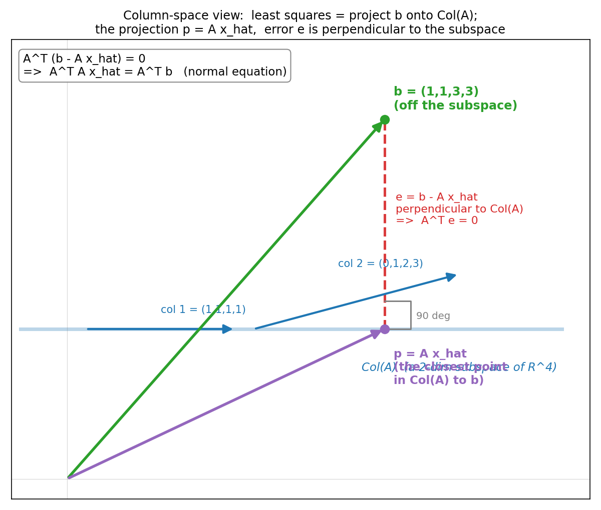
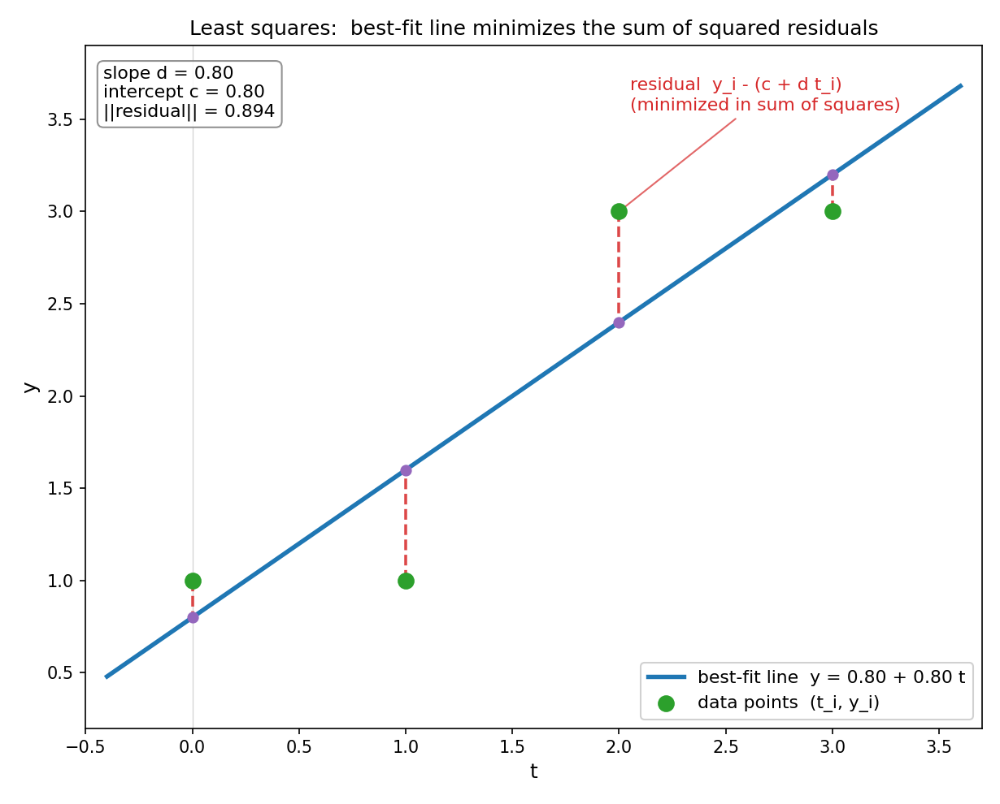

# 第 17 章 · 最小二乘:没精确解时,退而求其次

> **核心问题**:第 15 章我们盯住 `Ax = b`,看清了"`b` 在列空间里才有解";第 16 章我们给"`b` 不在列空间"这个尴尬,找到了"找离 `b` 最近的点"的出路——投影。可这套"找最近点"的本事,到底能**干什么实事**?
>
> 这一章,我们就把它用到极致。只问一件事——**当 `Ax = b` 没有精确解(现实中几乎总是这样,因为数据总带噪声),我们怎么退而求其次,找一个让 `Ax̂` "最接近" `b` 的 `x̂`?而那个让无数中学生头大的"最小二乘法",它的真身到底是什么?**
>
> **读完本章你会明白**:
> - **最小二乘(least squares)就是一次投影**:当 `Ax = b` 无解时,把 `b` 投到 `A` 的列空间上,那个投影点 `p = Ax̂` 所对应的 `x̂`,就是"让 `Ax̂` 离 `b` 最近"的最佳近似解。
> - **正规方程(normal equation)`AᵀA x̂ = Aᵀb` 不是要背的公式**:它是"误差 `b − Ax̂` 必须垂直于列空间"这个几何条件,推出来的唯一答案——"误差垂直"逼出了它,不是数学家拍脑袋。
> - **直线拟合是最小二乘的经典化身**:给一堆散点拟合一条直线,本质上就是把"数据 `b`"投到"所有可能的直线张成的子空间"上,投影点对应的那条线就是最佳拟合。中学/统计里的"最小二乘法",线代看穿了它。
> - 最小二乘把"解方程"推广成"数据拟合",是线代最实用的工具之一——机器学习的**线性回归(linear regression)**,根就在这一章。

---

> **如果一读觉得太难**:先只记住三件事——① `Ax = b` 没解时,把 `b` 投到列空间,投影点 `p = Ax̂` 对应的 `x̂` 就是"最接近"的解;② 那个 `x̂` 满足 `AᵀA x̂ = Aᵀb`(正规方程),它的来历是"误差必须垂直于列空间";③ 拟合直线 `y = c + dt`,就是把数据写成 `Ax = b`(`A` 的两列是全 1 和 `tᵢ`,`b` 是 `yᵢ`),然后求最小二乘解。这三句撑起全章,其余都是给它们配的证据。

---

## 章首·一句话点破

第 16 章结尾,我们留了一句话:当 `b` 跑到 `A` 的列空间外面,`Ax = b` 无精确解时,"**那就在列空间里找离 `b` 最近的点**"。这个最近的点 = 投影,找它的输入 = 最小二乘解。这句话,本章要把它做完。

> **最小二乘做的事,用一句话点破——它把"无解"翻译成"找最近的近似解",而那个近似解,几何上就是一次投影。**

这句话是**结论**。这一章我们倒过来拆:先看清"现实中为什么几乎总是无解"(数据有噪声),再把"找最近的"这件事从几何推到公式(正规方程),最后用一个最经典的例子——**给散点拟合一条直线**——让你亲眼看见,中学里那个让你算到头大的"最小二乘法",线代看穿了它的本质:它不过是一次投影。

---

## 一、现实里,`Ax = b` 几乎总是无解的

第 15 章讲 `Ax = b` 的几何时,我们分了三种情况:唯一解、无解、多解。讲"无解"时,我用的例子是 `A = [[1,2],[2,4]]`(列共线,列空间被压成一条线),`b = (3,5)` 不在线上。你当时可能觉得:"无解"是个特例,得 `A` 降秩、`b` 还得恰好落在外面才会发生。

这一节,我们要打破这个错觉:**在真实的数据世界里,"无解"不是特例,而是常态。**

### 数据拟合:一个方程组,方程比未知数多

来看一个最朴素的场景。你做了 4 次实验,测得 4 组数据 `(t, y)`:

```
   t = 0,    1,    2,    3
   y = 1,    1,    3,    3
```

你猜想 `y` 和 `t` 大致是**线性关系**:`y = c + d·t`(`c` 是截距,`d` 是斜率)。于是,你希望找到两个数 `c`、`d`,使得对每一个 `tᵢ` 都满足 `c + d·tᵢ = yᵢ`。把 4 个数据点全写出来:

```
   c + d·0 = 1        (第 1 个点)
   c + d·1 = 1        (第 2 个点)
   c + d·2 = 3        (第 3 个点)
   c + d·3 = 3        (第 4 个点)
```

**4 个方程,2 个未知数。** 把它收成矩阵方程 `Ax = b`(`x = (c, d)`):

```
   ┌         ┐   ┐     ┐     ┐
   │ 1   0   │   │ c │     │ 1 │
   │ 1   1   │   │   │     │ 1 │
   │ 1   2   │ · │ d │  =  │ 3 │
   │ 1   3   │   │   │     │ 3 │
   └         ┘   ┘     ┘     ┘
        A         x        b
```

`A` 是个 `4×2` 的矩阵——**4 个方程,2 个未知数**。这种"方程比未知数多"的方程组,叫**超定方程组(overdetermined system)**。

> **比喻**:4 个人(4 个方程)投票决定 2 件事(2 个未知数 `c`、`d`)。如果 4 个人意见完全一致(数据恰好共线),投票能出结果;可现实中 4 个人的意见总有分歧,4 个方程互相矛盾,谁也满足不了全部——**这就是"无解"在数据世界的化身**。

### 为什么超定几乎必然无解

回到第 15 章的判据:`Ax = b` 有解 ⟺ `b` 在 `A` 的列空间里。这里 `A` 的列空间是 4 维空间里、由两根向量(全 1 列 `(1,1,1,1)` 和 `t` 列 `(0,1,2,3)`)张成的一个**二维平面**。而 `b = (1,1,3,3)` 是 4 维空间里**随便一个点**——它落在这个二维平面上的概率,等于零(一个 2 维平面在 4 维空间里"薄得没有厚度")。

> **不这样看会怎样**:如果你还以为"解方程"等于"算出一个精确的 `x` 让所有等式成立",那面对这 4 个散点你就会崩溃——4 个点不在一条直线上(你自己画一下就知道了),没有任何直线能同时穿过它们。你会觉得"线性代数在这里失效了"。其实失效的不是线代,是你对"解"的执念:**凭什么所有等式都得精确成立?数据本来就有噪声,本来就不可能完美。**

所以正确的问法,不是"找 `x` 让 `Ax = b` 精确成立"(做不到),而是退一步:

> **找一个 `x̂`,让 `Ax̂` 尽可能接近 `b`——即让误差 `‖Ax − b‖` 尽可能小。**

这个 `x̂`,就叫 `Ax = b` 的**最小二乘解(least squares solution)**。它不要求所有等式精确成立,只要求"总的误差"最小。"二乘"是古汉语对"平方"的叫法——最小化的是**误差的平方和**。

> **钉死这件事**:现实里数据几乎总带噪声,方程组几乎总超定、几乎总无精确解。最小二乘做的事,就是**承认"无精确解",退而求其次,找一个让总误差最小的 `x̂`**。这一步"退而求其次",把线代从"理论玩具"变成了"处理真实数据的利器"。

---

## 二、几何解 = 投影:`Ax̂` 就是 `b` 在列空间上的影子

上一节说"找 `x̂` 让 `‖Ax − b‖` 最小"。可这个"最小"到底怎么找?这一节,我们把它翻译成几何,答案会自动浮出来——而且你会一眼认出它:**第 16 章的投影**。

### 把"最小化误差"翻译成"找最近点"

先看 `Ax` 是什么。按第 1 章钉死的结论,`Ax = x1·(列1) + x2·(列2)`——它是 `A` 的各列按 `x` 的分量调配出来的一个向量。当 `x` 取遍所有可能,`Ax` 就取遍了 `A` 的整个列空间 `Col(A)`(那个二维平面)。

所以"最小化 `‖Ax − b‖`",翻译成几何,就是:

> **在列空间 `Col(A)` 这片子里,找一个点 `p = Ax̂`,使它离 `b` 最近。**

而这件事,第 16 章已经替我们回答了——**子空间里离 `b` 最近的点,正是 `b` 在这个子空间上的投影**。误差 `b − p` 必然垂直于该子空间。

> **所以这样看**:最小二乘解对应的那个 `Ax̂`,不是别的,正是 `b` 在 `A` 的列空间上的**投影** `p`。找最小二乘解,就是找这个投影;投影找到了,它所对应的输入 `x̂` 就是答案。

> **比喻**:想象你站在列空间外面(站在 `b` 上),列空间是一张悬在 4 维空间里的二维平面(所有"能被 `A` 揉出来"的点铺成的)。你想跳到这张平面上,问"哪个点离我最近?"——答案,是**垂直地跳下去**,落在垂足 `p` 上。这个 `p` 就是投影,而 `p` 必然能写成 `A·x̂`(它在列空间里嘛)。那个 `x̂`,就是最小二乘解。

> 下图把这件事画出来。因为 4 维画不出,我用一张示意图:那条水平的蓝线代表列空间(其实在 R⁴ 里是个二维平面),绿色 `b` 在它之外,紫色 `p = Ax̂` 是投影(垂足),红色虚线 `e = b − Ax̂` **垂直地戳进**列空间。**这个"垂直",就是下一节逼出正规方程的几何条件。**



### 误差垂直,这件事钉死了 `Ax̂`

这里有一个第 16 章已经证明、本章全部依赖的事实,我再用一句话回扣(不重讲):

> **投影 = 子空间里离原箭头最近的点;误差 `e = b − p` 必然垂直于子空间。**

把它套到最小二乘上:最小二乘解 `x̂` 对应的 `p = Ax̂`,是 `b` 在 `Col(A)` 上的投影;所以误差 `e = b − Ax̂` **必然垂直于 `Col(A)`**。"垂直于列空间",意思是垂直于列空间里的**每一根**向量,尤其要垂直于 `A` 的每一根列(因为列空间的每根向量都是 `A` 各列的线性组合,垂直于 `A` 的所有列,就垂直于整个列空间)。

> **钉死**:最小二乘解 `x̂` 让 `Ax̂` 正好是 `b` 的投影,于是误差 `b − Ax̂` 垂直于 `A` 的所有列。这一条"误差垂直",是下一节推出正规方程的全部根据。

---

## 三、正规方程 `AᵀA x̂ = Aᵀb`:从"误差垂直"推出来

这一节是全章的技术核心,但请放心——**我们不甩公式,我们从几何把它推出来**。你会亲眼看见,那个吓人的 `AᵀA x̂ = Aᵀb`,不过是"误差必须垂直于 `A` 的列"这一句话,翻译成算式后的唯一样子。

### "垂直于 A 的所有列",翻译成算式就是 `Aᵀe = 0`

上一节钉死了:误差 `e = b − Ax̂` 必须垂直于 `A` 的所有列。回忆第 16 章第一节——**两根向量垂直 ⟺ 它们的点积为零**。所以"误差垂直于 `A` 的第 1 列",就是:

```
   e · (A 的第 1 列) = 0
```

"垂直于第 2 列",就是:

```
   e · (A 的第 2 列) = 0
```

……以此类推。把"误差垂直于 `A` 的每一列"这件事,一次性打包成一个矩阵算式——把 `A` 的每一列挨个和 `e` 做点积,堆成一列——正好就是 `A` 的**转置** `Aᵀ` 乘以 `e`:

> ```
>    Aᵀ · e  =  0          (误差垂直于 A 的所有列)
> ```

为什么是 `Aᵀ`?因为 `Aᵀ` 的每一**行**,正好是 `A` 的某一**列**。拿 `Aᵀ` 乘 `e`,就是拿 `A` 的每一列挨个去和 `e` 点积,结果是一列零。所以"`Aᵀe = 0`"和"误差垂直于 `A` 的所有列"是同一件事的两副面孔。

> **钉死**:`Aᵀe = 0` 是"误差垂直于列空间"的代数面孔;"误差垂直于列空间"是 `Aᵀe = 0` 的几何面孔。这一步翻译,是正规方程的命门。

### 把 `e = b − Ax̂` 代进去,正规方程就冒出来了

现在把 `e = b − Ax̂` 塞进 `Aᵀe = 0`:

```
   Aᵀ · (b − Ax̂)  =  0
   Aᵀb  −  AᵀA x̂  =  0
   AᵀA x̂          =  Aᵀb            ← 这就是正规方程!
```

> ```
>    AᵀA · x̂  =  Aᵀb        (normal equation, 正规方程)
> ```

**看清楚了吗——正规方程不是天上掉下来的公式,是"误差必须垂直于 `A` 的列"这一条几何要求,翻译成 `Aᵀe = 0`,再代个数的必然结果。** 你只要记住"误差垂直",正规方程自己就推出来了,根本不用背。

> **不这样看会怎样**:如果你把正规方程当成一条要背的公式,那 `AᵀA` 这个看似突兀的东西(为什么是 `A` 的转置乘 `A`?)对你永远是黑魔法。你会算,但不知道它**凭什么**长这样。可一旦你看见"误差垂直 ⟺ `Aᵀe = 0` ⟺ `AᵀA x̂ = Aᵀb`"这条推导链,`AᵀA` 的来历一目了然——它是"把 `A` 的各列两两点积"得到的方阵(第 16 章第五节讲过),求它的逆,就是在解开各列之间的"互相重合",算出干净的投影系数。

### `AᵀA` 为什么(通常)可逆

正规方程 `AᵀA x̂ = Aᵀb` 要解出 `x̂`,得 `AᵀA` 可逆。这要求什么?

> **钉死**:只要 `A` 的各列**线性无关**(列满秩),`AᵀA` 就可逆。这是因为 `AᵀA x = 0` 意味着 `xᵀAᵀA x = 0`,即 `(Ax)ᵀ(Ax) = ‖Ax‖² = 0`,所以 `Ax = 0`;而 `A` 列满秩时 `Ax = 0` 只有 `x = 0`——于是 `AᵀA x = 0` 只有零解,`AᵀA` 满秩可逆。

本章的直线拟合例子里,`A` 的两列(全 1 列和 `t` 列)不共线(`t` 列不是全 1 列的倍数),所以列满秩,`AᵀA` 可逆,正规方程有唯一解 `x̂`。如果 `A` 的各列线性相关(有冗余),`AᵀA` 就奇异,最小二乘解不唯一——这是另一回事,本章先不展开。

> **钉死**:正规方程 `AᵀA x̂ = Aᵀb`,来历是"误差垂直于列空间 ⟺ `Aᵀ(b − Ax̂) = 0`"。**它是"误差垂直"逼出来的,不是死记的。** `A` 列满秩时,`AᵀA` 可逆,`x̂ = (AᵀA)⁻¹Aᵀb` 唯一存在——这个 `x̂`,就是最小二乘解。

---

## 四、直线拟合:最小二乘的经典化身

现在,把这套理论用到一个最经典、最直观的场景——**给散点拟合一条直线**。你会亲眼看见,中学/统计里那个让你算到头大的"最小二乘法",在列空间视角下,就是一次投影。

### 把"拟合直线"写成 `Ax = b`

回到第一节的 4 个散点 `(0,1), (1,1), (2,3), (3,3)`。你要找一条直线 `y = c + d·t` 去"最好地"穿过它们。把这条直线的方程,对每个数据点写一遍:

```
   c + d·t₁ = y₁
   c + d·t₂ = y₂
   c + d·t₃ = y₃
   c + d·t₄ = y₄
```

收成矩阵 `Ax = b`:

```
   ┌         ┐   ┌   ┐     ┌   ┐
   │ 1   t₁  │   │ c │     │ y₁│
   │ 1   t₂  │   │   │     │ y₂│
   │ 1   t₃  │ · │ d │  =  │ y₃│
   │ 1   t₄  │   │   │     │ y₄│
   └         ┘   └   ┘     └   ┘
        A          x        b
```

`A` 的**第一列全是 1**(因为 `c` 的系数永远是 1),**第二列是 `tᵢ`**(因为 `d` 的系数是 `tᵢ`)。`b` 是测得的 `yᵢ`。这正是一个超定方程组——4 个方程,2 个未知数,数据点又不在一条直线上,所以**无精确解**。

> **比喻**:`A` 的列空间,是"所有形如 `c·(1,1,1,1) + d·(0,1,2,3)` 的向量"张成的二维平面。这个平面里的每一根向量,对应**某一条直线**在 4 个 `tᵢ` 处的取值。而 `b = (1,1,3,3)` 是你测得的真实数据——它不在这个平面里(4 个点不共线),所以没有任何一条直线能精确穿过所有点。**最小二乘做的,就是在"所有直线"这片子空间里,找一条离数据 `b` 最近的——把 `b` 投影到列空间,投影点对应的那条直线,就是最佳拟合直线。**

### 用正规方程解出来

代入具体数字(`t = (0,1,2,3)`,`b = (1,1,3,3)`):

```
   A = ┌         ┐       AᵀA = ┌        ┐        Aᵀb = ┌    ┐
       │ 1   0   │             │ 4   6  │              │ 8  │
       │ 1   1   │             │ 6  14  │              │ 16 │
       │ 1   2   │             └        ┘              └    ┘
       │ 1   3   │
       └         ┘
```

正规方程 `AᵀA x̂ = Aᵀb`,即:

```
   ┌        ┐   ┌   ┐     ┐    ┐
   │ 4   6  │   │ c │     │ 8  │
   │        │ · │   │  =  │    │
   │ 6  14  │   │ d │     │ 16 │
   └        ┘   └   ┘     └    ┘
```

这是个 `2×2` 的方程组,纸笔就能解。用**克莱默法则(Cramer)**最直观:

```
   行列式  det = 4·14 − 6·6 = 56 − 36 = 20

   c  =  det([[8,6],[16,14]]) / det  =  (8·14 − 6·16) / 20  =  (112 − 96) / 20  =  16/20  =  0.8
   d  =  det([[4,8],[6,16]]) / det   =  (4·16 − 8·6) / 20   =  (64 − 48) / 20   =  16/20  =  0.8
```

所以最佳拟合直线是 **`y = 0.8 + 0.8·t`**。

> **钉死**:这 4 个点拟合出的直线是 `y = 0.8 + 0.8t`。它不穿过任何一个点(你自己验:`t=0` 时直线值 0.8 ≠ 实测 1;`t=2` 时 2.4 ≠ 3),但它让"总误差的平方和"最小。**"不穿过任何点"恰恰是它"最佳"的证据——因为它在所有直线里,把每个点的误差"均匀地"压到了最小,而不是精确穿过某几个点、放任别的点误差巨大。**

> 下图把这 4 个散点和最佳拟合直线画在一起,每根红色虚线是一个数据点到拟合直线的残差 `yᵢ − (c + d·tᵢ)`。**最小二乘最小化的,正是这些残差的平方和**——这就是"二乘"(平方)的名字由来。你看,4 个点虽然不在一条线上,但这条 `y = 0.8 + 0.8t` 把它们的误差"摊得最平"。



### 为什么是"平方和"而不是别的

你可能会问:为什么最小化的是误差的**平方和** `‖e‖² = Σ(yᵢ − c − d·tᵢ)²`,而不是绝对值之和 `Σ|yᵢ − c − d·tᵢ|`?

答案有两条,一条几何,一条实用:

> **几何上**:最小化 `‖e‖²` 就是**最小化误差向量的长度** `‖b − Ax‖`,这正好是"`b` 到列空间的距离"。而"找距离最小的点",几何上就是找投影——投影是**垂足**,有干净的几何意义(误差垂直)。最小化绝对值之和,没有这么干净的几何对应(它对应的是"中位数"之类的概念,不是投影)。

> **实用上**:平方函数处处光滑可导,正规方程是**线性方程**(`AᵀA x̂ = Aᵀb`),好解;绝对值函数在零点不可导,对应的优化问题难解得多。所以"最小二乘"在数学和计算上都最干净,这也是它成为数据拟合标准方法的原因。

> **钉死**:最小二乘 = 最小化误差**平方和** = 最小化误差向量**长度** = 找列空间里离 `b` 最近的点 = 投影。**"平方"和"投影"是同一件事的两副面孔**——平方是代数面孔,投影是几何面孔。

---

## 五、回扣全书:最小二乘 = 把"解方程"推广到"数据拟合"

这一节,我们站远一点,看最小二乘在全书的位置。

第 15 章讲 `Ax = b`,核心是"**解方程**"——找一个精确的 `x` 让 `Ax = b` 严格成立。可现实中数据有噪声,`b` 几乎总在列空间外,精确解不存在。本章把"解方程"**推广**成了"数据拟合":

- **精确解**(第 15 章):`b` 在列空间里,存在 `x` 使 `Ax = b` 严格成立。
- **最小二乘解**(本章):`b` 在列空间外,不存在精确 `x`,但存在 `x̂` 让 `Ax̂` 是 `b` 在列空间上的投影——`Ax̂` 离 `b` 最近。

> **钉死**:最小二乘,是"解方程"在"无精确解"时的自然推广。它不抛弃 `Ax = b` 这个框架,而是把"精确成立"放宽成"误差最小"。**而"误差最小"这件事,几何上由投影保证(最近点定理),代数上由正规方程实现(`AᵀA x̂ = Aᵀb`)。** 这就是为什么第 16 章的投影,是本章的地基——没有"最近点定理",就没有最小二乘。

这个推广的威力极大。机器学习里的**线性回归(linear regression)**——给你一堆特征和标签,学一个线性模型去预测——数学上就是最小二乘:把特征排成 `A`,标签是 `b`,求 `AᵀA x̂ = Aᵀb`,得到的 `x̂` 就是模型的参数。**最小二乘,是线性回归的根,也是无数数据科学算法的祖师爷。** 当你以后听说"梯度下降""岭回归""逻辑回归",它们的起点,都是本章这一次投影。

> **比喻**:如果第 15 章的"精确解"是"命中靶心",那本章的"最小二乘解"就是"离靶心最近的落点"。现实里我们几乎永远命不中靶心(数据有噪声),但"离靶心最近"已经足够好用——而投影,精确地告诉了我们这个"最近落点"在哪。

---

## 计算佐证:拿纸笔和 numpy,亲手拟合一次

这一节,我们把第一节的 4 个散点从头到尾算一遍——**纸笔算正规方程,numpy 用 `lstsq` 核对,再验误差垂直**。这一套走完,你会彻底相信"最小二乘 = 投影"。

### 例子 · 4 个散点拟合直线(手算 + numpy 双核对)

散点 `(0,1), (1,1), (2,3), (3,3)`,求最佳拟合直线 `y = c + d·t`。

**第 1 步 · 写出 `A` 和 `b`**

```
   A = ┌         ┐        b = ┌   ┐
       │ 1   0   │            │ 1 │
       │ 1   1   │            │ 1 │
       │ 1   2   │            │ 3 │
       │ 1   3   │            │ 3 │
       └         ┘            └   ┘
```

**第 2 步 · 算 `AᵀA` 和 `Aᵀb`**

`AᵀA` 是 `2×2`:`AᵀA = [[4, 6], [6, 14]]`。
- `(1,1)` 元 = 4 个 1 平方之和 = 1+1+1+1 = 4.
- `(1,2)` 元 = `Σ tᵢ` = 0+1+2+3 = 6.
- `(2,2)` 元 = `Σ tᵢ²` = 0+1+4+9 = 14.

`Aᵀb`:`Aᵀb = [8, 16]`。
- 第 1 元 = `Σ yᵢ` = 1+1+3+3 = 8.
- 第 2 元 = `Σ tᵢ·yᵢ` = 0·1 + 1·1 + 2·3 + 3·3 = 0+1+6+9 = 16.

**第 3 步 · 解正规方程 `AᵀA x̂ = Aᵀb`(克莱默法则)**

```
   det(AᵀA) = 4·14 − 6·6 = 56 − 36 = 20

   c = (8·14 − 6·16) / 20 = (112 − 96) / 20 = 16/20 = 0.8
   d = (4·16 − 8·6) / 20  = (64 − 48) / 20  = 16/20 = 0.8
```

最佳拟合直线:**`y = 0.8 + 0.8·t`**。

**第 4 步 · 算投影 `p = Ax̂` 和误差 `e = b − p`**

```
   p = Ax̂ = (0.8+0.8·0, 0.8+0.8·1, 0.8+0.8·2, 0.8+0.8·3)
          = (0.8, 1.6, 2.4, 3.2)

   e = b − p = (1−0.8, 1−1.6, 3−2.4, 3−3.2)
             = (0.2, −0.6, 0.6, −0.2)
```

**第 5 步 · 验误差垂直于列空间(`Aᵀe ≈ 0`)**

```
   Aᵀ · e  =  [[1,1,1,1],[0,1,2,3]] · (0.2, −0.6, 0.6, −0.2)

   第 1 行 (全 1 列):  0.2 − 0.6 + 0.6 − 0.2  =  0    ✓
   第 2 行 (t 列):     0·0.2 + 1·(−0.6) + 2·0.6 + 3·(−0.2)
                      = 0 − 0.6 + 1.2 − 0.6  =  0    ✓
```

**误差确实垂直于 `A` 的所有列**——这正是"最小二乘 = 投影"的铁证。

### numpy:一行 `lstsq`,再验误差垂直

```python
import numpy as np

# 散点
t = np.array([0., 1., 2., 3.])
b = np.array([1., 1., 3., 3.])

# 造 A: 第1列全1, 第2列是 t_i
A = np.vstack([np.ones_like(t), t]).T
print("A =\n", A)
print("b =", b)

# 方法一: 解正规方程 A^T A x = A^T b
xhat_normal = np.linalg.solve(A.T @ A, A.T @ b)
print("via normal eqn  x_hat =", xhat_normal)        # (0.8, 0.8)

# 方法二: np.linalg.lstsq (内部用 SVD, 数值更稳, 第19章讲)
xhat_lstsq, residuals, rank, sv = np.linalg.lstsq(A, b, rcond=None)
print("via lstsq        x_hat =", xhat_lstsq)        # (0.8, 0.8)

# 投影 p = A x_hat, 误差 e = b - p
p = A @ xhat_lstsq
e = b - p
print("projection  p =", p)                          # (0.8, 1.6, 2.4, 3.2)
print("residual    e =", e)                          # (0.2, -0.6, 0.6, -0.2)

# 验误差垂直于列空间: A^T @ e 应该约为 0
print("A^T @ e (should be ~0) =", A.T @ e)           # [~0, ~0]

# 误差的平方和 (最小二乘最小化的目标)
print("||e||^2 =", np.dot(e, e))                     # 0.8
print("||e||   =", np.linalg.norm(e))                # ~0.894
```

跑一遍,正规方程和 `lstsq` 两条路殊途同归,都给出 `x̂ = (0.8, 0.8)`;`Aᵀ @ e` 打印出 `[~0, ~0]`(浮点意义的零),**误差垂直**这件事,是你亲手按出来的铁律。两条路算出同一个解,因为它们本来就在解同一个几何问题——"找列空间里离 `b` 最近的点"。

> **一个易混点**:有人以为"最小二乘"和"最小化绝对值误差"是一回事。**不是**。最小二乘最小化的是**平方和** `‖e‖²`(对应投影,几何干净,正规方程线性好解);最小化绝对值之和 `Σ|eᵢ|` 是另一个问题(L1 回归/稳健回归),对应的是"中位数"思想,没有投影的几何对应,求解也难得多。本章的最小二乘特指前者——它和投影是一回事,这是它能被线代漂亮解决的根因。

> **另一个彩蛋(函数空间预告)**:把 `tᵢ` 换成更一般的"基函数",`A` 的列就不只是 `1` 和 `t`,还可以是 `t²`、`t³`(拟合多项式)、`cos t`、`sin t`(拟合三角级数/傅里叶)。**最小二乘一次,就能拟合任意一组基函数的线性组合**——多项式拟合、傅里叶分析、泰勒展开,底下全是同一次投影。第 2 章埋的"函数也是向量",在这里又一次开花结果。

---

## 章末小结

### 用"橡皮膜"比喻回顾本章

回到那张画满方格的橡皮膜。这一章,我们把第 15 章"`Ax = b` 的几何"和第 16 章"投影"两件兵器,合在一处使出——**最小二乘**。答案分四层:

1. **现实中 `Ax = b` 几乎总无精确解**。数据有噪声,方程组超定,`b` 几乎总落在列空间外。这时不追求"精确成立",而退一步:**找 `x̂` 让 `Ax̂` 尽可能接近 `b`**,即最小化误差 `‖Ax − b‖`。这个 `x̂` 就是最小二乘解。
2. **几何上,最小二乘解 = 投影**。`Ax̂` 是 `b` 在 `A` 列空间上的投影 `p`(第 16 章最近点定理),误差 `e = b − p` 必然垂直于列空间。**找最小二乘解,就是找这个投影。**
3. **代数上,投影逼出正规方程 `AᵀA x̂ = Aᵀb`**。它的来历是"误差垂直于 `A` 的所有列 ⟺ `Aᵀ(b − Ax̂) = 0`",不是要背的公式。`A` 列满秩时 `AᵀA` 可逆,`x̂ = (AᵀA)⁻¹Aᵀb` 唯一。
4. **直线拟合是最小二乘的经典化身**:散点 `(tᵢ, yᵢ)` 拟合 `y = c + d·t`,就是解超定方程组 `Ax = b`(`A` 的列是全 1 和 `tᵢ`,`b` 是 `yᵢ`),正规方程给出最佳拟合直线。中学/统计里的"最小二乘法",线代看穿了它——**一次投影**。

### 本章在全书主线中的位置

本书的主线是:**一切线代概念,都是"空间被揉捏"这件事的某个侧面。** 那么,本章的最小二乘,是揉捏的**哪个侧面**?

> **本章刻画的是揉捏的"数据拟合"侧面**:当目标 `b` 落不到某次揉捏(矩阵 `A`)能到达的范围(列空间)里时,我们不认输,而是**退而求其次,找一个让揉捏结果 `Ax̂` 离 `b` 最近的输入 `x̂`**。这个"最近",由投影(误差垂直)精确地定义,由正规方程(`AᵀA x̂ = Aᵀb`)精确地实现。最小二乘,把第 15 章的"解方程"推广成"数据拟合",让线代第一次真正"干活"——处理带噪声的真实数据。

你看,**第 15 章"列空间回答能揉到哪"、第 16 章"投影回答够不着时找最近的"、本章"最小二乘把二者合起来做数据拟合"——三章一条线,从"精确解"走到"最佳近似解",线代最实用的一面在这里展开**。而这一切的几何骨架,从头到尾只有一句话:**误差垂直于列空间**。代数(正规方程)和几何(投影垂线)在本章完美咬合,这是"算式是几何的速记"的又一次现身,也是最有力的一次。

### 五个"为什么"清单

如果你只能记五件事,记这五件:

1. **最小二乘在解决什么问题**:`Ax = b` 无精确解(数据有噪声、方程超定)时,退而求其次,找 `x̂` 让 `Ax̂` 尽可能接近 `b`——即最小化 `‖Ax − b‖`。**这是线代处理真实数据的看家本领。**
2. **最小二乘解的几何身份**:它对应的 `Ax̂`,是 `b` 在 `A` 列空间上的投影 `p`。找最小二乘解 = 找投影(第 16 章最近点定理)。**误差 `b − Ax̂` 垂直于列空间,这是一切的根。**
3. **正规方程从哪来**:从"误差垂直于 `A` 的所有列 ⟺ `Aᵀ(b − Ax̂) = 0`"推出来,即 `AᵀA x̂ = Aᵀb`。**它是"误差垂直"逼出来的,不是死记的。** `A` 列满秩时 `x̂ = (AᵀA)⁻¹Aᵀb` 唯一。
4. **直线拟合怎么变成最小二乘**:散点 `(tᵢ, yᵢ)` 拟合 `y = c + d·t`,写成 `Ax = b`(`A` 列 = 全 1 和 `tᵢ`,`b` = `yᵢ`),解正规方程得 `c, d`。**中学的"最小二乘法" = 线代的一次投影。**
5. **为什么最小化"平方和"**:平方和 = 误差向量长度的平方 = `b` 到列空间的距离,对应投影(几何干净、正规方程线性好解)。绝对值之和没有这么干净的对应。**"平方"和"投影"是同一件事的两副面孔。**

### 想继续深入,该往哪钻

- **看动画**:3Blue1Brown《线性代数的本质》第 11 集"向量空间""第 12 集附近"讲四个基本子空间和最小二乘的几何,把"`b` 投到列空间"画成了动画。本章"误差垂直于列空间"的文字比喻,在它的画面里会变成肉眼可见的垂线。
- **亲手玩拟合**:把上面的 numpy 代码拿去,自己造一堆散点(多加噪声),改 `A` 的列(试试加 `t²` 列做二次拟合),看 `x̂` 怎么变、`Aᵀe` 是不是始终为零。**改一晚上,你对"数据拟合 = 投影"的直觉会脱胎换骨。**
- **尝 `lstsq` vs 正规方程**:同样一批数据,既用 `np.linalg.solve(AᵀA, Aᵀb)` 解正规方程,又用 `np.linalg.lstsq(A, b)` 对比。你会发现 `lstsq` 数值更稳(它内部用 SVD,第 19 章会讲为什么 SVD 比直接解 `AᵀA` 更靠谱——因为 `AᵀA` 会放大误差)。
- **尝函数空间的彩蛋**:把 `A` 的列从 `[1, t]` 换成 `[1, t, t²]`,就能拟合二次曲线;换成 `[1, cos t, sin t]`,就能拟合三角级数(傅里叶级数的前几项)。**最小二乘一次,拟合任意基函数的线性组合——多项式、三角、小波,底下全是同一次投影。**

---

> 第 5 篇收束了:从第 15 章"解方程 = 找一根被揉完落 `b` 的箭头",到第 16 章"够不着时投影找最近的点",再到本章"最小二乘把投影用到数据拟合"——我们用这套"揉捏"的语言,**第一次真刀真枪地解决了一个现实问题**。线代不再是纸上的算式,它能拟合数据、能预测趋势、能撑起机器学习的半壁江山。可故事还没完:前面五章,我们一直在**同一套基准(标准基 `i, j`)**下看揉捏。如果**换一副眼镜、换一套基准箭头**,同一个揉捏会显出什么新面貌?这条更深的线索,通向本书最后的巅峰——**基变换与 SVD**。翻开 **第 6 篇 · 第 18 章 · 基变换:换个视角**——你会看见,相似矩阵不过是"同一个揉捏换了一副眼镜",而 SVD 会把任何揉捏拆成最美的"转→拉→转"三步,让本书的"还原之旅"在最优雅的地方收束。
