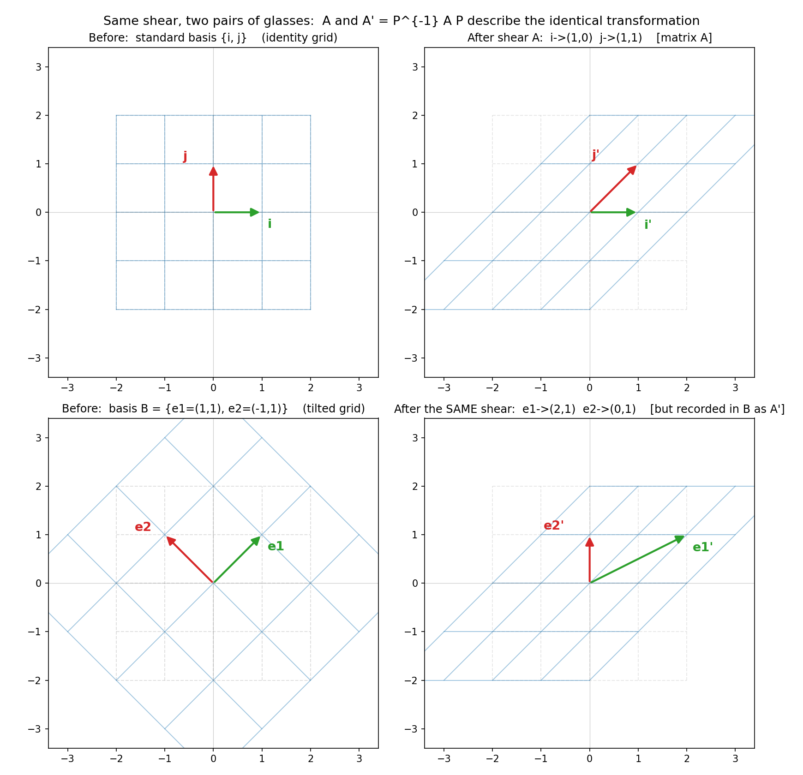

# 第 18 章 · 基变换:换个视角

> **核心问题**:第 4 章我们说"同一根箭头,换一套基,坐标就从 `(1,3)` 变成 `(2,1)`"——箭头没变,数字变了。现在把这件事往上推一格:**同一个揉捏(变换),换一套基,记录它的那张矩阵,数字会不会也变?**
>
> 这一章是第 6 篇《压轴:基变换与 SVD》的开篇。我们会看清一个贯穿线代后半程的真相:**相似矩阵 `A' = P⁻¹AP`,压根不是"另一个变换",而是同一个变换换了一副眼镜。** 而这件"换眼镜"的事,正是对角化(第 13 章)、SVD(第 19 章)这两个巅峰内容的共同招式。
>
> **读完本章你会明白**:
> - 为什么"换基"这件事,不止让**向量**的坐标变,还会让**变换**的矩阵变——把第 4 章的结论从"箭头"推广到"揉捏"。
> - 基变换矩阵 `P` 到底是什么:把新基的向量作为列排起来,新旧坐标就能用它来回换算。
> - 相似矩阵 `A' = P⁻¹AP` 的灵魂:**`A` 和 `A'` 是同一个揉捏,只是换了副眼镜。**
> - 为什么这件事极其有用——既然换基不改变换,我们就能**挑一组好基**,让任何矩阵的数字长得极简单(这正是对角化和 SVD 的核心思想)。
> - 以及一个漂亮的副产品:相似矩阵有相同的特征值、相同的迹、相同的行列式——因为这些是"变换本身"的性质,不随看它的眼镜变。

> **如果一读觉得太难**:先只记住三件事——① 同一个变换,在不同基下是**不同**的矩阵;② 把新基向量排成列得到 `P`,则新矩阵 = `P⁻¹AP`;③ 这意味着我们可以**挑好基**让矩阵变简单——对角化、SVD 都是这个招。`P⁻¹AP` 公式不用死背,它只是"换副眼镜看同一个揉捏"这件事的数字写法。

---

## 章首·一句话点破

第 4 章,我们做了一件纯粹的事:把"坐标"从"箭头的本质"这个误解里救出来——同一根箭头,换套基,数字就变。最后还埋了句伏笔:

> "既然同一根箭头、同一个变换,在不同基下有不同的数字长相,那我们就可以**挑一组最顺眼的基**,让数字变得极简单。"

这一章,就来兑现这半句——**同一个变换,在不同基下有不同的数字长相**。一句话点破:

> **同一个线性变换 `T`,在标准基下是矩阵 `A`,换一组基 `B` 后,它变成了另一个矩阵 `A'`。`A` 和 `A'` 是同一个揉捏,只是换了副眼镜。这件事的数学写法叫"相似":`A' = P⁻¹AP`。**

这句话是**结论**,不是**理由**。我们倒过来拆:先把"向量换基坐标变"这件事推广到"变换换基矩阵变",再看那个 `P⁻¹AP` 长得别扭的公式,为什么是唯一的样子。

---

## 一、从"箭头换基"到"变换换基":把第 4 章推一格

回忆第 4 章最该"啊哈"的那一刻:同一根物理箭头 `v`,箭尖落在"往右 1、往上 3"。

- 在标准基 `{i, j}` 这把正尺子下,读数是 **(1, 3)**。
- 在斜基 `B = {e1=(1,1), e2=(-1,1)}` 这把歪尺子下,读数变成了 **(2, 1)**。

箭头一动没动,数字却变了。这是"箭头"层面的换基。

> **比喻(承接第 4 章的尺子)**:基是你手里那把量地的尺子。换把尺子,同一根箭头量出来的读数就变。换英尺还是换厘米,人没变,数变了。

现在往上推一格。第 1 章我们说:**矩阵,是记录"这次揉捏把空间的基向量揉去了哪"的说明书**。矩阵的每一列,是一根基向量被搬去的新坐标。

那自然地冒出一个问题:

> **如果"坐标随基变",那"矩阵里那些坐标"——也就是"基向量被揉去哪"——会不会也随基变?**

会。而且变得很彻底。因为矩阵记的是"`i` 被揉去哪、`j` 被揉去哪",而"`i`、`j`"这俩符号本身,就是"在标准基下的读数"。一旦你换一套基,你的"基准箭头"就从 `{i, j}` 变成了 `{e1, e2}`,那"基准箭头被揉去哪"自然也变了。

### 不这样看会怎样

如果你脑子里只认"矩阵 `A` 就是这个变换",那你遇到"同一个变换怎么会有两个矩阵 `A` 和 `A'`"会彻底懵——你以为矩阵 = 变换本身,而变换只有一个。

可一旦你看见:**矩阵 = "在某套基下"记的说明书**,整件事豁然开朗:

- 矩阵不是变换的本质,**那个空间揉捏动作才是**。
- 同一个动作,换套基(换副眼镜)去记,数字当然变。
- 后面"相似矩阵""对角化"那些吓人的词,全是"同一个动作、换套基、数字怎么变"的变体。

> **钉死这件事**:第 4 章告诉你"箭头换基,坐标变";这一章告诉你"变换换基,矩阵变"。两件事是**同一个道理**——数字(坐标也好、矩阵也好)永远依附于某套基,换基就变。**真正的本质是那根箭头、那个揉捏动作,数字只是某副眼镜下的读数。**

---

## 二、基变换矩阵 `P`:新旧坐标的换算器

要谈"变换换基矩阵怎么变",先得有个工具,能把新旧坐标来回换算。这个工具,就是**基变换矩阵 `P`**。

> **基变换矩阵 `P`**:把新基 `B = {e1, e2}` 的两根向量,**作为列**排成一个矩阵:
>
> ```
>    P = [e1  e2]   (e1 是第一列, e2 是第二列)
> ```
>
> 它的作用:**旧坐标 = `P` · 新坐标**(把"在新基下的坐标"翻译回"在标准基下的坐标")。

为什么?因为"新坐标 `(a, b)`"的意思是"`a` 份 e1 + `b` 份 e2",而 e1、e2 本身在标准基下是有真实坐标的(它们是 P 的列)。所以:

```
   旧坐标 = a·e1 + b·e2 = a·(P 的第一列) + b·(P 的第二列) = P · (a, b)
```

反过来要算"新坐标",自然就是 **新坐标 = `P⁻¹` · 旧坐标**(`P` 可逆,因为它两列线性无关,这正是"基"的硬条件)。

> **不这样看会怎样**:如果你把 `P` 当成一个"普通矩阵、不知道在干嘛",那 `P⁻¹AP` 这个公式对你就永远是一堆字母的排列组合,死记也记不住。可一旦你看见 `P` 的每一列就是一根新基向量的"真实住址",`P⁻¹` 就是"把真实住址翻译回新基读数"的翻译器——后面所有公式你都能自己推。

### 用第 4 章的例子,把 `P` 走一遍

新基 `B = {e1=(1,1), e2=(-1,1)}`,所以:

```
       ┌        ┐
   P = │ 1   -1 │     (第一列 e1, 第二列 e2)
       │ 1    1 │
       └        ┘

         ┌              ┐
   P⁻¹ = │  1/2    1/2  │     (det P = 2, 所以 P⁻¹ = (1/2)·[[1,1],[-1,1]])
         │ -1/2    1/2  │
         └              ┘
```

物理箭头 `v`,标准基下是 `(1, 3)`,那它在基 `B` 下的新坐标是:

```
   新坐标 = P⁻¹ · 旧坐标 = P⁻¹ · (1, 3)
                  ┌              ┐   ┌   ┐
          =       │  1/2    1/2  │ · │ 1 │
                  │ -1/2    1/2  │   │ 3 │
                  └              ┘   └   ┘
          =  (1/2·1 + 1/2·3,  -1/2·1 + 1/2·3)
          =  (2, 1)
```

正好对上第 4 章的结果。**`P⁻¹` 这个翻译器,把"标准坐标 `(1,3)`"翻成了"新基读数 `(2,1)`"。** 第 4 章我们是手动解方程得到的 `(2,1)`,现在用 `P⁻¹` 一乘就出来——同一件事,换了个更利索的工具。

> **钉死方向**:看到 `P`,心里念"它把新基读数翻成标准坐标";看到 `P⁻¹`,心里念"它把标准坐标翻成新基读数"。**这个方向感,是下面 `P⁻¹AP` 公式不绕晕的关键。**

---

## 三、高潮:`A' = P⁻¹AP` —— 同一个变换换副眼镜

工具齐了,现在正面回答章首的核心问题:**同一个变换 `T`,在标准基下是 `A`,换基 `B` 后,它的矩阵 `A'` 是什么?**

我们不背公式,从"矩阵的每一列 = 一根基向量的新去向"这个第 1 章的钥匙,自己推。

### 推导:在新基下,这个变换长什么样

回忆矩阵是怎么来的:矩阵的第 `k` 列,是"第 `k` 根基向量被变换揉去哪"。在**标准基**下,这套基是 `{i, j}`,所以 `A` 的列是 `T(i)`、`T(j)` 的标准坐标。

现在换**基 `B`**。新矩阵 `A'` 的第一列,应该是"基 `B` 的第一根 `e1` 被变换揉去哪"——但**这个"去哪",要用基 `B` 自己的坐标来记**(就像 `A` 的列用标准坐标记一样)。

分三步把这件事算出来:

1. **先看 `e1` 在标准坐标下是啥**:就是 `P` 的第一列,`e1 = (1,1)`。
2. **变换 `T` 把它揉去哪**:用标准基下的矩阵 `A` 乘它,`A · e1 = T(e1)`。这是"揉完之后,箭尖在标准坐标下落在哪"。
3. **把这个落点,翻译回基 `B` 的读数**:乘 `P⁻¹`。`P⁻¹ · (A · e1)` = "`e1` 被揉去的位置,在基 `B` 下的坐标"。

这三步接龙,正好是 **`P⁻¹ · A · P`** 作用在 `(1,0)` 上(因为 `P · (1,0) = e1`)。所以:

> **`A'` 的第 `k` 列 = `P⁻¹ A P` 的第 `k` 列**,也就是说:

```
                  A' = P⁻¹ A P
```

> **所以这样看**:`P⁻¹AP` 不是天上掉下来的怪公式,它是"`e1`、`e2` 被变换揉去哪,再用新基 `B` 的坐标记下来"这件事的紧凑写法。**三步接龙**(翻成标准坐标 → 揉一下 → 翻回新基),合成一个矩阵,就是 `A'`。看到这个公式,你心里该放映出这三步,而不是一串字母。

### 拿数字走一遍,你就信了

取剪切变换 `A = [[1,1],[0,1]]`(第 1 章那个"把空间横向推歪"的家伙),新基 `B = {e1=(1,1), e2=(-1,1)}`,即 `P = [[1,-1],[1,1]]`。

**先算 `P⁻¹`**:`det P = 1·1 - (-1)·1 = 2`,所以:

```
   P⁻¹ = (1/2)·[[1, 1], [-1, 1]] = [[1/2, 1/2], [-1/2, 1/2]]
```

**算 `A · P`**(把新基的两根,先用 `A` 揉一下):

```
       ┌        ┐   ┌        ┐     ┌        ┐
   A = │ 1   1  │ · │ 1   -1 │  =  │ 2    0 │
       │ 0   1  │   │ 1    1 │     │ 1    1 │
       └        ┘   └        ┘     └        ┘
```

- 第一列 `(2,1)`:`A · e1 = A · (1,1) = (1·1+1·1, 0·1+1·1) = (2,1)`。**这就是 `e1` 被剪切揉去的位置。**
- 第二列 `(0,1)`:`A · e2 = A · (-1,1) = (1·(-1)+1·1, 0·(-1)+1·1) = (0,1)`。**`e2` 被揉到了 `(0,1)`,正好就是标准基的 `j`。**

**再算 `P⁻¹ · (A·P)`**(把这些落点翻回基 `B` 的坐标):

```
        ┌             ┐   ┌        ┐     ┌          ┐
   P⁻¹= │ 1/2   1/2   │ · │ 2    0 │  =  │ 3/2  1/2 │
        │-1/2   1/2   │   │ 1    1 │     │-1/2  1/2 │
        └             ┘   └        ┘     └          ┘
```

所以:

```
            ┌          ┐
   A'  =    │ 3/2  1/2 │
            │-1/2  1/2 │
            └          ┘
```

**`A` 和 `A'` 长得完全不一样,但它们是同一个剪切。** `A = [[1,1],[0,1]]` 看起来清清爽爽(就是"把 `j` 推歪到右上"),`A' = [[1.5,0.5],[-0.5,0.5]]` 看起来乱七八糟。可它们描述的,是同一个空间揉捏动作——只不过一个用正方格的眼镜看,一个用斜方格的眼镜看。

> **钉死这件事**:`A' = P⁻¹AP` 描述的,是**同一个**变换。换基不改变换,只改"用谁的坐标去记它"。`A` 和 `A'` 数字不同,但底下是同一个揉捏——这就是"相似矩阵"的本质。

### 看图:同一个剪切,两组基,两套数字

下图把这同一个剪切,在标准基和基 `B` 下分别画了出来。**上下两行,是同一个空间揉捏动作**(请盯住"右上角那根歪了的方格")。差别在于:顶行用标准方格 `{i,j}` 这副正眼镜去记录,矩阵是清爽的 `A = [[1,1],[0,1]]`;底行用斜方格 `{e1,e2}` 这副歪眼镜去记录,矩阵就变成了 `A' = [[1.5,0.5],[-0.5,0.5]]`。**动作一样(都是同一个剪切),记录的数字不同。**



请特别注意右下角那张图里,`e1` 被揉到了 `(2,1)`、`e2` 被揉到了 `(0,1)`——这两个落点,正是上一节 `A·e1`、`A·e2` 算出来的数。把它们翻译回基 `B` 的读数,就得到 `A'` 的两列 `(1.5,-0.5)` 和 `(0.5,0.5)`。**图里的几何,和算式里的数字,严丝合缝。**

---

## 四、相似矩阵:`P⁻¹AP` 这个家族

既然同一个变换,在不同基下有不同的数字长相,那这些"长着不同数字、却是同一个变换"的矩阵,该有个名字。

> **相似(similar)**:两个方阵 `A` 和 `A'`,如果存在可逆矩阵 `P`,使得 `A' = P⁻¹AP`,就说 `A` 和 `A'` **相似**。记作 `A ~ A'`。

> **比喻**:相似矩阵,是同一个变换的"不同身份证"。你的身份证(中文版)和你出国时用的护照(英文版),照片一样、人一样,只是上面的字不一样。`A` 和 `A'` 就是同一个变换的两张身份证——一张标准基发的,一张基 `B` 发的。

这件事反过来也成立:**任意两个相似的矩阵,一定是同一个线性变换,在两组不同的基下的两种写法。** 所以"相似"这个代数关系,几何上精确对应着"同一个变换、换副眼镜"。

> **钉死**:`A ~ A'`(代数上相似) ⟺ `A`、`A'` 是同一个变换在不同基下的两张脸(几何上)。**这是本章的灵魂句,也是后面所有"挑好基"招式的总开关。**

---

## 五、为何这件事极其有用:挑一副好眼镜(本章的灵魂)

讲到这里,你可能犯嘀咕:既然 `A` 和 `A'` 是同一个变换,那我换基、算 `P⁻¹AP`,图什么?把清爽的 `A = [[1,1],[0,1]]` 换成乱七八糟的 `A'`,不是吃饱了撑的?

**关键来了**——本章这一节,是后面整个第 4 篇(特征值、对角化)和第 19 章 SVD 的总开关。

> **既然换基不改变换(只是换张数字脸),那我们就可以反过来:挑一组最顺眼的基,让这个变换的矩阵,长得极简单。**

具体说:

- 现在我们手里有个矩阵 `A`,它在标准基下长得可能很乱。
- 但"乱"只是因为标准基不是为这个变换量身定做的。
- 如果我们能**挑一组特殊的基 `B`**,让 `A' = P⁻¹AP` 在这组基下变得干净(比如变成**对角矩阵**——除了对角线全是 0,即"纯拉伸,不掺杂别的动作"),那这个变换的本来面目,就一目了然了。

这正是**第 13 章对角化**干的事:**挑特征基(特征向量当基),让任何可对角化的变换,在新基下变成对角矩阵**——所有"揉"的动作,简化成沿几个互相垂直的轴,各自拉长或压短。原本 `A` 看起来是一团乱麻的数字,换上特征基这副眼镜,瞬间变成 `[[λ1, 0], [0, λ2]]`,只剩下两个拉伸倍数。

而**第 19 章 SVD** 更进一步:对于**任何**矩阵(哪怕不是方阵、哪怕不能对角化),都能挑两组最妙的基,让它变成 `Σ`(一个只在主对角线上有非零元素、其余全 0 的"纯拉伸")——这就是把任何揉捏,拆成"转 → 拉 → 转"三步。

> **钉死这件事**:换基不改变换,这件事的伟大之处,不在于"换个基玩玩",而在于"**换副好眼镜,让复杂的东西变简单**"。对角化、SVD、PCA、推荐系统里那些花里胡哨的"分解",骨子里全是这同一个招式。**本章给你打的,就是这个招式的地基。**

### 一个警示:不是每个变换都能挑到"最简单"的基

值得说一句,免得你期待过高:不是每个矩阵都能对角化。本章用的剪切 `A = [[1,1],[0,1]]` 就是个反例——它的两个特征值都是 1(它只有一个特征方向 `i`,被反复"拉伸 1 倍",即不动),根本凑不齐两根线性无关的特征向量当基。所以剪切**不能**对角化,不管你怎么挑基,`A'` 都不会变成 `[[1,0],[0,1]]`(那是不动变换,跟剪切不是一回事)。

这正是 SVD 比对角化更"通用"的原因——SVD 能搞定对角化搞不定的矩阵(包括剪切、包括非方阵)。第 19 章你会看到,剪切在 SVD 的那副特殊眼镜下,也会变成清爽的"转 → 拉 → 转"。**本章埋的这颗种子,到 SVD 开花。**

---

## 六、不变量:换眼镜也撼动不了的(本章的深度)

既然 `A` 和 `A'` 是同一个变换,那有些"属于变换本身"的性质,应该不随基变。这些"换基也不变"的量,叫**不变量(invariants)**——它们刻画的是"变换的真身",不是某副眼镜下的偶然长相。

最关键的三个:

> **相似矩阵有相同的:**
> 1. **特征值(eigenvalues)**——而且重数也相同。
> 2. **迹(trace,主对角线元素之和)**。
> 3. **行列式(determinant)**。

为什么?因为这三样,都是"变换本身"的几何性质,不是"在某套基下的偶然数字":

- **行列式** = 揉捏把面积/体积胀缩的倍数(第 9 章)。换副眼镜看,揉捏动作没变,胀缩的倍数当然不变。
- **迹** = 特征值之和(第 12 章)。特征值不变,迹自然不变。
- **特征值** = 揉捏中"方向不变、只被拉伸"的轴的拉伸倍数。换基不创造新轴、也不消灭旧轴,所以这些拉伸倍数不变——变的只是"这些轴在新基下的坐标长相"。

> **不这样看会怎样**:如果你把"迹 = 2""行列式 = 1""特征值 = 1, 1"当成"矩阵 `A` 这个数表的偶然性质",那你遇到相似的 `A'` 会纳闷——`A' = [[1.5,0.5],[-0.5,0.5]]` 的迹是 `1.5+0.5=2`、行列式是 `1.5·0.5 - 0.5·(-0.5) = 1`,跟 `A` 一模一样。这看似巧合,其实是必然:**它们刻画的是同一个变换,真身没变。** 懂了这一点,你就再也不会被"换了个写法,数字却保持不变"这件事吓到——不变的是本质,变的是眼镜。

### 用本章的数字验算

`A = [[1,1],[0,1]]`,`A' = [[1.5,0.5],[-0.5,0.5]]`。

| 量 | `A` | `A'` | 相同? |
|---|---|---|---|
| 迹 | `1 + 1 = 2` | `1.5 + 0.5 = 2` | ✓ |
| 行列式 | `1·1 - 1·0 = 1` | `1.5·0.5 - 0.5·(-0.5) = 0.75 + 0.25 = 1` | ✓ |
| 特征值 | 解 `(1-λ)² = 0` 得 `λ = 1, 1` | 解 `λ² - 2λ + 1 = 0` 得 `λ = 1, 1` | ✓ |

**三个不变量,全对上。** 铁证:`A` 和 `A'` 是同一个变换,只是两副眼镜。

> **钉死**:相似不变量,是"变换真身"的指纹。后面看到任何"这俩矩阵相似吗"的问题,先比特征值——特征值不同,铁定不相似;特征值相同(连同重数),至少有了相似的可能。**特征值,是变换最硬核的身份证明。**

---

## 计算佐证:拿纸笔和 numpy,亲手摸"换基换矩阵"

### 1. 手算 `P⁻¹AP`(本章核心,完整走一遍)

`A = [[1,1],[0,1]]`,`P = [[1,-1],[1,1]]`。

```
   第一步: P⁻¹ = (1/2)·[[1,1],[-1,1]] = [[1/2, 1/2],[-1/2, 1/2]]

   第二步: A·P = [[1,1],[0,1]]·[[1,-1],[1,1]]
                = [[1·1+1·1, 1·(-1)+1·1], [0·1+1·1, 0·(-1)+1·1]]
                = [[2, 0], [1, 1]]

   第三步: P⁻¹·(A·P) = [[1/2,1/2],[-1/2,1/2]]·[[2,0],[1,1]]
                     = [[1/2·2+1/2·1, 1/2·0+1/2·1], [-1/2·2+1/2·1, -1/2·0+1/2·1]]
                     = [[3/2, 1/2], [-1/2, 1/2]]

   所以  A' = P⁻¹AP = [[3/2, 1/2], [-1/2, 1/2]]
```

**验算它真是同一个变换**:随便取个向量 `v = (2,1)`,在标准基下,`A·v = [[1,1],[0,1]]·(2,1) = (3,1)`。换个路线:先把 `v` 翻译到基 `B` 坐标(`P⁻¹·v = [[1/2,1/2],[-1/2,1/2]]·(2,1) = (3/2, -1/2)`),用 `A'` 揉一下(`A'·(3/2,-1/2) = (3/2·3/2+1/2·(-1/2), -1/2·3/2+1/2·(-1/2)) = (2,-1)`),再翻回标准坐标(`P·(2,-1) = (2·1+(-1)·(-1), 2·1+(-1)·1) = (3,1)`)。**殊途同归,都得 `(3,1)`——`A` 和 `A'` 确实是同一个变换。**

### 2. 验证三个不变量(用 `A` 和 `A'`)

```
   迹:    A:  1 + 1 = 2            A':  3/2 + 1/2 = 2         ✓
   行列式: A:  1·1 - 1·0 = 1       A':  3/2·1/2 - 1/2·(-1/2) = 3/4 + 1/4 = 1   ✓
   特征值: A:  (1-λ)² = 0  -> λ=1,1
           A':  λ² - (迹)λ + (行列式) = λ² - 2λ + 1 = 0  -> λ=1,1     ✓
```

三个不变量完全一致。**这两个长得完全不同的矩阵,是同一个变换。**

### 3. numpy:换基、算 `A'`、查特征值

```python
import numpy as np
A  = np.array([[1., 1.], [0., 1.]])           # 标准基下的剪切
P  = np.array([[1., -1.], [1., 1.]])          # 新基 e1=(1,1), e2=(-1,1) 作列
Pinv = np.linalg.inv(P)
Ap = Pinv @ A @ P                              # 相似矩阵 A' = P^{-1} A P
print("A  =\n", A)
print("A' =\n", Ap)                            # 应得 [[1.5,0.5],[-0.5,0.5]]

# 三个不变量
print("trace   A =", np.trace(A),  "  A' =", np.trace(Ap))      # 2.0  2.0
print("det     A =", np.linalg.det(A), "  A' =", np.linalg.det(Ap))  # 1.0  1.0
print("eigvals A =", np.linalg.eig(A)[0])
print("eigvals A'=", np.linalg.eig(Ap)[0])     # 都是 [1, 1]

# 验证"殊途同归": v=(2,1), 两条路线都得 (3,1)
v = np.array([2., 1.])
print("A @ v           =", A @ v)              # (3, 1)
vB = Pinv @ v                                  # v 在基 B 下的坐标 (1.5, -0.5)
print("P @ (Ap @ vB)   =", P @ (Ap @ vB))      # 也得 (3, 1)
```

跑一遍,你会看到 `A` 和 `A'` 数字不同,但迹、行列式、特征值完全一样;`v` 走两条路线(直接 `A`、或换基 `A'` 再换回),落点都是 `(3,1)`。**亲手揉一次,`P⁻¹AP` 就再也不是一串字母了——它是"同一个揉捏、换副眼镜"这件事的数字身世。**

---

## 章末小结

### 用"橡皮膜"比喻回顾本章

回到那张画满方格的橡皮膜。这一章我们做了一件纯粹的事:**把第 4 章"箭头换基坐标变"的道理,推广到了"变换换基矩阵变"。**

答案分四层,一层比一层深:

1. **同一个变换,在不同基下,是不同的矩阵。** 因为矩阵记的是"基向量被揉去哪",而基换了,这套记录的数字当然变。第 4 章说箭头的坐标随基变,这一章说变换的矩阵也随基变——**同一个道理,往上推一格。**
2. **基变换矩阵 `P`**:把新基的向量作为列排成 `P`。它是个翻译器——`旧坐标 = P·新坐标`,`新坐标 = P⁻¹·旧坐标`。看到 `P` 想到"新基的真实住址",看到 `P⁻¹` 想到"翻回新基读数"。
3. **相似矩阵 `A' = P⁻¹AP`**:`A` 和 `A'` 是**同一个揉捏,换了副眼镜**。`P⁻¹AP` 不是怪公式,是"`e1`、`e2` 被揉去哪、再用新基坐标记下来"的三步接龙的紧凑写法。
4. **相似不变量**:特征值、迹、行列式,这些是"变换真身"的指纹,换基也不变。看到两个矩阵这三个量相同,就有理由怀疑它们是同一个变换。

而这一切,直接引出线代后半程最大的招式:

> **既然换基不改变换,那我们就能挑一副好眼镜,让复杂的矩阵变简单。** 对角化(第 13 章)挑特征基让矩阵变对角;SVD(第 19 章)挑两组最妙的基让任何矩阵变成"转→拉→转"。**本章是它们的直接前奏。**

### 本章在全书主线中的位置

记住本书的主线:**一切线代概念,都是"空间被揉捏"这件事的某个侧面。**

这一章的概念,是"揉捏"的这一个侧面——**换坐标描述同一个变换**。变换本身(那个空间揉捏动作)不变,变的是"我们用什么基去记录它"。就像同一个旋转,在不同坐标系下数字不同,但转的还是那一下。

这是第 6 篇《压轴:基变换与 SVD》的开篇。第 4 章我们立了"基"和"坐标"的地基,第 5~17 章讲了"揉捏"的各种度量(行列式、秩、特征值、投影)。现在,我们把所有这些收束起来:既然同一个变换在不同基下有不同的写法,那就**挑一副最好的眼镜,让线代里最吓人的矩阵,露出它最简单的真面目**。这正是下一章 SVD 要做的——它会挑两组最妙的基,让**任何**矩阵都变成"转 → 拉 → 转"三步。**全书收束于此。**

### 五个"为什么"清单

1. **为什么同一变换在不同基下有不同矩阵**:矩阵记的是"基向量被揉去哪"。基换了,记录的对象就变了,数字自然变。本质(揉捏动作)没变,变的是"用谁的坐标去记"。
2. **基变换矩阵 `P` 是什么**:把新基的向量作为列排成的矩阵。它翻译新旧坐标:`旧 = P·新`,`新 = P⁻¹·旧`。看到 `P` 想到"新基的真实住址"。
3. **`A' = P⁻¹AP` 在干什么**:三步接龙——`P` 把新基坐标翻成标准坐标,`A` 揉一下,`P⁻¹` 翻回新基坐标。合成一个矩阵 `A'`,就是"同一个变换在新基下的写法"。**`A` 和 `A'` 相似 = 同一个变换换副眼镜。**
4. **为什么这件事有用**:换基不改变换,所以可以挑一副好眼镜,让矩阵变简单。对角化挑特征基让矩阵变对角(纯拉伸),SVD 让任何矩阵变成"转→拉→转"。**这是线代后半程的核心招式。**
5. **相似不变量是什么**:特征值、迹、行列式——它们刻画"变换真身",换基也不变。看到两个矩阵这三个量相同,就有理由怀疑它们相似。**特征值,是变换最硬核的身份证明。**

### 想继续深入,该往哪钻

- **亲手揉"换基换矩阵"**:上面的 numpy 代码,自己造几组基(只要 `det P ≠ 0` 就合法),用 `P⁻¹AP` 算同一个 `A` 在它们下的 `A'`。换三组基,你会看到三个完全不同的 `A'`,但它们的迹、行列式、特征值永远一样——你会对"相似 = 同一个变换"彻底死心。
- **看动画**:3Blue1Brown《线性代数的本质》第 13 集"Change of basis"(基变换),把本章的"同一个变换、两组基、两套数字"画成了动画——文字没接住的,动画一定接得住。
- **尝对角化的味道**(为第 13 章预热):取 `A = [[3,1],[0,2]]`,用 `np.linalg.eig` 算它的特征向量,把它们作列排成 `P`,然后算 `P⁻¹AP`——你会看到它瞬间变成 `[[3,0],[0,2]]`(对角!)。**这就是"挑一副好眼镜,让矩阵露出真面目"的第一次实操。**
- **尝函数空间的换基**(接第 4 章彩蛋):同一个函数,在幂基 `{1, x, x²}` 下是泰勒系数,在三角基 `{1, cos x, sin x, ...}` 下是傅里叶系数——**同一根"函数向量",换副基,坐标(系数)全变**。函数空间的"基变换",和几何里的基变换,是同一套语法。

---

> 第 6 篇开篇:你学会了**换副眼镜看同一个揉捏**——相似矩阵 `A' = P⁻¹AP`,是同一个变换在不同基下的两张身份证;迹、行列式、特征值,是换基也撼动不了的"变换真身"。既然换基不改变换,那我们就可以挑一副最好的眼镜,让最吓人的矩阵露出最简单的真面目。下一章,我们就挑这副眼镜——而且不挑一组、挑**两组**,让**任何**矩阵(哪怕不能对角化、哪怕不是方阵)都变成"旋转 → 沿轴拉伸 → 再旋转"三步。这就是线代最美的巅峰:**SVD**。翻开 **第 19 章 · SVD:任何揉捏都是"转→拉→转"**。
