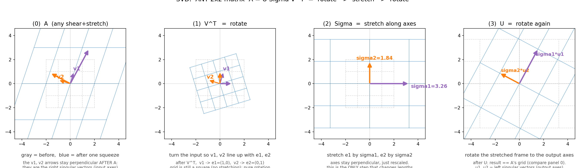
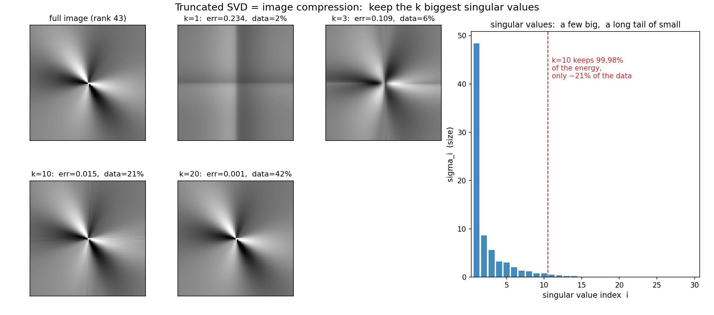

# 第 19 章 · SVD:任何揉捏都是"转→拉→转"

> **核心问题**:我们一路学到这儿,已经攒下了两把拆解矩阵的"好刀"——对角化(第 13 章)能把**方阵**拆成"换基→纯拉伸→换回",对称矩阵(第 14 章)甚至能用**正交基**拆。可它们都有门槛:对角化要求方阵、还要"足够多特征向量"(剪切矩阵就被拒之门外);对称矩阵要求 A=Aᵀ。
>
> 那么问题来了:**有没有一种分解,对任何矩阵都成立——不管它是方的还是扁的、对称的还是歪的、可逆的还是被压扁的?**
>
> 有。它就是 **SVD(奇异值分解,Singular Value Decomposition)**——线代最美的巅峰。它把**任意**一次揉捏,都拆成同一个干净的三步:**旋转 → 沿轴拉伸 → 再旋转**。
>
> **读完本章你会明白**:
> - **SVD 的承诺**:`A = U Σ Vᵀ`,对**任何**矩阵(任意 m×n)都成立。U、V 是正交矩阵(纯旋转),Σ 是对角矩阵(纯拉伸)。
> - **几何三步**:任何歪七扭八的揉捏,本质都是"先转一下、沿几根垂直的轴拉一下、再转一下"——前面那些又剪又扭的部分,全被吸收进了"转"里,真正改变形状的只有中间那一下"拉"。
> - **它为何是巅峰**:对角化、对称对角化,全是 SVD 的特例;而 SVD 不挑矩阵、还坚持用最稳的**正交基**。
> - **它为何极其有用**:奇异值从大到小排,前几个大、后面一长串小——**扔掉小的几乎不丢信息**。这就是图像压缩、PCA、推荐系统共同的地基。
> - 以及,本章是全书的**收束**:从第 1 章"矩阵=揉捏"出发,你会看清——一切线代概念,都是"空间被揉捏"的不同侧面,而 SVD,是给任意一次揉捏画出的最干净说明书。

---

> **如果一读觉得太难**:先只记住三件事——① 任何矩阵都能写成 `A = U Σ Vᵀ`,意思是"转→拉→转"三步;② U、V 是正交矩阵(纯旋转),Σ 对角线上是从大到小排的奇异值 σ(就是拉伸倍数);③ 奇异值大的重要、小的可扔——这就是压缩和降维的原理。这三句撑起全章,其余都是给它们配的细节。

---

## 章首·一句话点破

第 18 章,我们学会了"换一副眼镜(换一组基)看同一个揉捏",并埋下一句话:**挑一组好基,能让复杂的揉捏变简单**。

这一章,我们把这句话推到极致,得到全书最惊艳的一个结论:

> **给任意一次揉捏,总能找到一组最自然的正交基(垂直的、单位长度的轴),在这组基下,这次揉捏变成干干净净的"旋转 → 沿轴拉伸 → 再旋转"三步。任何矩阵,无一例外。**

这就是 SVD。它是一把**万能刀**:不挑矩阵形状、不挑是否对称、不挑有没有特征值——对谁都管用。所以它成了线代里出场率最高、也最实用的一个分解,从图像压缩到推荐系统,到处是它的影子。

这句话是**结论**。我们倒过来拆:先看 SVD 到底承诺了什么,再用一个具体的、又剪又扭的矩阵,亲眼把它拆成三步。

---

## 一、SVD 的承诺:对任何矩阵都成立

先回忆我们已有的两把刀,看它们各自卡在哪:

- **对角化** `A = P Λ P⁻¹`(第 13 章):能把揉捏拆成"换基→纯拉伸→换回"。但它有两条门槛——①得是**方阵**;②得有"足够多线性无关的特征向量"(剪切矩阵 `[[1,1],[0,1]]` 就因为特征向量不够,被拒之门外,叫"亏缺")。
- **对称对角化** `A = Q Λ Qᵀ`(第 14 章):更漂亮,用的是正交基 Q。但它要求 A 是**对称矩阵**(A=Aᵀ)。

两把刀都挑食。SVD 不挑:

> **SVD 的承诺**:对**任意**矩阵 A(它是 m×n 的,方阵也行、扁的也行;对称也行、歪的也行;满秩也行、被压扁也行),都存在分解
>
> ```
>    A  =  U · Σ · Vᵀ
> ```
>
> 其中:
> - **V** 是 n×n **正交矩阵**(它的列 v1, v2, … 叫**右奇异向量**,是输入空间里一组互相垂直的单位轴);
> - **Σ** 是 m×n 的"对角"矩阵,只在主对角线上有非负实数 **σ1 ≥ σ2 ≥ … ≥ 0**,叫**奇异值**,从大到小排;
> - **U** 是 m×m **正交矩阵**(它的列 u1, u2, … 叫**左奇异向量**,是输出空间里一组互相垂直的单位轴)。

> **不这样理解会怎样**:如果你只认得对角化,那遇到一个非方阵(比如 3×2、把三维压成二维的"投影式揉捏",第 5 章讲过),你直接傻眼——非方阵连"特征值"都没有(因为 `Ax=λx` 要求输入输出同维)。SVD 不在乎这些:它对**任何形状**的矩阵都给出一套统一的、几何干净的三步分解。**这就是它"万能"的价值。**

> **钉死这件事**:SVD 是把"挑一组好基让揉捏变简单"这个思想,推广到**任何矩阵**,并且坚持用**正交基**(最稳、最好算、最不跑偏的那类基)。前面的对角化、对称对角化,都是它的特例。

---

## 二、几何三步:转 → 拉 → 转(本章灵魂)

公式 `A = U Σ Vᵀ` 看着冷冰冰。我们把它翻译成动作。注意矩阵作用于向量是**从右往左**套的,所以 `A·x = U(Σ(Vᵀ·x))`,三步的顺序是:**先 Vᵀ、再 Σ、再 U**。

> **比喻**:想象一张画满方格的橡皮膜被揉了一下(就是矩阵 A)。SVD 说,这一下看似复杂的揉捏,可以拆成三个最简单的动作接龙:
>
> 1. **第一步 Vᵀ:转一下。** 把膜**整体旋转**(也可能带个翻转),转到一个特别顺手的朝向——让两根特定的、互相垂直的轴(右奇异向量 v1, v2)正好对齐到水平的 x 轴和竖直的 y 轴。这一步**只转、不拉**,网格还是正方形,大小形状没变。
> 2. **第二步 Σ:沿轴拉一下。** 这是**唯一改变形状**的一步。水平方向拉长 σ1 倍、竖直方向拉长 σ2 倍。正方形变成了长方形,但两个方向**仍然垂直**(只是各自被拉伸了)。
> 3. **第三步 U:再转一下。** 把拉好的长方形,**再整体旋转**到最终朝向。又只是转、不拉。
>
> 三步接龙:转 → 拉 → 转。**A 里那些又剪又扭的花活,全被吸收进了头尾两个"转"里;真正改变膜形状的,只有中间那一下"沿轴拉伸"。**

### 一个具体的、又剪又扭的例子

空谈不如实战。取一个**非对称**的矩阵(它又拉伸又剪切,最能体现"歪"):

```
   A = [[2, 1],
        [0, 3]]
```

它把 x 方向拉 2 倍、把 y 方向拉 3 倍、还顺手把 y 偏向 x(剪切)——典型的"歪揉捏"。我们用 SVD 把它拆开(numpy 会告诉我们):

```
   奇异值:  σ1 ≈ 3.26,   σ2 ≈ 1.84
   Vᵀ 是一个旋转 ≈ −73°
   U  是一个旋转 ≈ +62°
```

> 下图把这"转→拉→转"三步一字排开。最左是 A 直接揉捏的全貌(灰格→蓝格,又拉又剪);中间三张,依次是 Vᵀ(把输入转到顺手朝向,网格仍是正方形)、Σ(沿轴拉伸成 σ1×σ2 的长方形)、U(再转到最终朝向)。**盯着中间三张看:每一步都干净——前两步和后一步是纯旋转(网格不变形),只有中间 Σ 这一步真正拉伸。三步接起来,正好等于最左边 A 的那次歪揉捏。**



### 三步背后那个最深的洞察

上面三步里,藏着 SVD 最深刻的一句几何话:

> **在输入空间里,总存在一组互相垂直的方向(右奇异向量 v1, v2),它们被 A 揉完之后,仍然互相垂直**——只不过各自被拉伸了 σ1、σ2 倍,落到了输出空间里另一组互相垂直的方向(左奇异向量 u1, u2)上。

这听起来平平无奇,但细想很震撼:A 这个揉捏明明又剪又扭,把绝大多数方向的箭头都揉得歪七扭八、不再垂直。**可总有那么一两根"特殊的垂直轴",能穿过这次揉捏、保持垂直**——它们就是 SVD 找出来的右奇异向量。SVD 做的事,就是**把这两根"穿过揉捏仍垂直的轴"挑出来当新基**,于是揉捏在它们眼里,就退化成了最简单的"沿轴拉伸"。

用公式写出来,这句几何话长这样:

```
   A · v1  =  σ1 · u1
   A · v2  =  σ2 · u2
```

每根右奇异向量 vi,被 A 揉完,正好落在对应的左奇异向量 ui 上,只是被拉伸了 σi 倍。**还记得第 12 章的特征向量吗?那里是 `Ax = λx`(一根轴方向不变只拉伸)。这里更宽:方向不必不变,只要"揉完仍垂直"就行**——这就是 SVD 比特征值分解更通用、更强大的根本原因。

---

## 三、它和前面的分解什么关系(串起全书)

SVD 不是从天而降的,它正好把前面几把刀**统一起来**。我们把它们摆在一起比:

| 分解 | 公式 | 谁能用 | 用的基 |
|------|------|--------|--------|
| 对角化(第 13 章) | `A = P Λ P⁻¹` | 方阵 + 可对角化 | P 可逆(不必正交) |
| 对称对角化(第 14 章) | `A = Q Λ Qᵀ` | 对称矩阵(A=Aᵀ) | Q 正交 |
| **SVD(本章)** | `A = U Σ Vᵀ` | **任何矩阵** | **U, V 都正交** |

三个层次,一个比一个宽容、一个比一个稳:

1. **对称矩阵是 SVD 的特例**。当 A 对称时,它的左右奇异向量是**同一组**正交特征向量,奇异值就是特征值的绝对值。也就是说,对称矩阵的 `Q Λ Qᵀ`,正好是 SVD 的 `U Σ Vᵀ` 里 U=V=Q 的情形(转-拉-转里,前后两次转动用了同一副眼镜)。
2. **SVD 比对角化更通用**。对角化挑食(要方阵、要够多特征向量),剪切矩阵那种"亏缺"的就用不了;SVD 不挑,任何矩阵都给一套。而且 SVD 坚持用**正交基**(U、V 是正交矩阵),而正交基是最稳的——数值计算时不放大误差、不跑偏(正交矩阵的逆就是转置,太好算了)。

> **钉死**:从对角化到对称对角化再到 SVD,是一条"越来越宽容、越来越稳"的进化线。**SVD 是终点:对任何矩阵,都用正交基,拆成转-拉-转。** 它不挑食,还用最好的基——这就是它"巅峰"二字的全部含义。

---

## 四、奇异值的意义:大的重要,小的可扔

现在看 Σ 对角线上那一串从大到小排的奇异值 σ1 ≥ σ2 ≥ …。它们不只是几个数,而是这次揉捏的"重要性排名"。

> **比喻**:奇异值像揉捏的"主旋律"和"伴奏"。σ1 最大,对应这次揉捏里**拉伸最猛的主方向**;σ2 次之;……越往后越小,对应**几乎没怎么动、甚至被压扁**的方向。一首曲子,主旋律(大 σ)抓住了神韵,伴奏(小 σ)扔了也不太影响听感。

这里有个极其有用的度量,叫**能量**:所有奇异值的平方和 `σ1² + σ2² + …`,衡量了这次揉捏"总共使了多大劲"(数学上叫 Frobenius 范数的平方)。而**前 k 个大奇异值的平方和占的比重**,就是"保留了百分之多少的信息"。

惊人的事实是:在真实数据里,**前几个奇异值往往很大,后面跟着一长串很小的**。这意味着——

> **把后面那些小奇异值扔掉,几乎不损失信息。** 这就是压缩、降维、去噪的统一原理:抓住几个主方向,扔掉次要的。

---

## 五、SVD 能干什么:压缩、降维、推荐

抽象原理一旦落地,威力惊人。三个最经典的应用:

### 1. 图像压缩

一张灰度图,本质是一个矩阵(每个像素一个数)。给它做 SVD,然后**只保留前 k 大的奇异值**,其余置零,重构出一张近似图。k 越大越清晰,但存的数也越多。

> 下图就是一次实战。左边是一张原图(秩 43 的 96×96 图)和用 k=1, 3, 10, 20 个奇异值重构的版本;右边是奇异值从大到小的柱状图——**注意它"前几个很高、后面一长串很矮"的形状**,这就是"主旋律强、伴奏弱"。看数字:k=10 时,误差仅 1.5%,能量保留了 **99.98%**,却只存了原图 **21%** 的数据;k=20 几乎肉眼看不出差别,也才存 41%。**这就是压缩:扔掉小奇异值,拿极少的存储换几乎无损的画面。**



JPEG 这类压缩算法,精神与此同源:抓住信号里"最重要的几个方向",扔掉次要的。SVD 给了它最干净的线性表述。

### 2. PCA(主成分分析)/ 降维

你有一堆高维数据(比如每个样本几千个特征),想降到低维。做法:把数据排成矩阵,做 SVD,**前几个右奇异向量就是"主成分"**——它们是数据里方差最大(信息最丰富)的那几个方向。把数据投到这几个方向上,几千维压成几十维,还保住了主要信息。这就是机器学习里无处不在的降维。

### 3. 推荐系统

Netflix 当年悬赏百万美元优化推荐,冠军方案的核心就是 SVD。把"用户×电影"的评分矩阵做 SVD,它会自动挖出几个**潜在因子**(比如"喜欢动作片程度""喜欢文艺片程度")——大奇异值对应的,正是这些最能解释评分规律的方向。靠它们,系统能预测你还没看过的电影你会打几分。

> **浅出这三个应用**:图像压缩、PCA 降维、推荐系统,表面毫不相干,骨子里是**同一招**——做 SVD,留大奇异值、扔小奇异值,即"抓住最重要的几个方向,忽略次要的"。**SVD 是"找重要方向、扔掉次要"这件事的通用引擎。**

---

## 六、彩蛋:SVD 把全书串成了一句话(本章最深)

走到这里,回头看我们从第 1 章到这儿走过的整条路,你会发现 SVD 把它们**全部收编**了:

- **向量**(第 2 章)是膜上的箭头;**基**(第 4 章)是量地的尺子。
- **矩阵**(第 1 章)是一次揉捏;**线性变换**(第 5 章)是揉捏的全貌。
- **行列式**(第 9 章)量这次揉捏面积胀缩多少;**秩**(第 10 章)量揉完还剩几维。
- **特征值**(第 12 章)找揉捏中不转头的轴;**对角化**(第 13 章)挑特征基让揉捏变纯拉伸;**对称矩阵**(第 14 章)是最优雅的一类揉捏。
- **基变换**(第 18 章)是换副眼镜看同一个揉捏。

而 **SVD**,是把"挑一组好基(而且是最稳的正交基)、让任意揉捏变简单"这个思想,推到**最一般、最万能**的极致。它对任何矩阵都成立,它把任意揉捏拆成转-拉-转。**前面所有的分解,都是它的影子。**

> **钉死全书的灵魂**:线性代数从头到尾,只在做一件事——**把那些冰冷的算式,还原成"空间被揉捏"这件你能看见的事**。而 SVD 告诉你:不管这次揉捏多复杂,它骨子里都是"转一下、沿几根垂直的轴拉一下、再转一下"。**算式 `A = U Σ Vᵀ`,就是"任何揉捏都是转-拉-转"这句话,写成了数学。**

---

## 计算佐证:拿 numpy,亲手拆一次

### 1. 把 A=[[2,1],[0,3]] 拆成三步

```python
import numpy as np
A = np.array([[2., 1.],
              [0., 3.]])
U, s, Vt = np.linalg.svd(A)        # s 是一维奇异值(从大到小)
Sigma = np.diag(s)                  # 拼成对角阵
print(s)                            # [3.2566..., 1.8424...]
print(U @ Sigma @ Vt)               # 应当 == A(验证分解正确)
```

`U @ Sigma @ Vt` 算出来正好等于原来的 A——**铁证:SVD 把 A 完整地拆成了三块,又拼得回来。**

### 2. 验证"右奇异向量揉完仍垂直"

```python
V = Vt.T
print(A @ V[:, 0], s[0] * U[:, 0])  # 两者应当相等:Av1 = σ1·u1
print(A @ V[:, 1], s[1] * U[:, 1])  # Av2 = σ2·u2
```

`A·v1` 正好等于 `σ1·u1`——右奇异向量 v1 被 A 揉完,正好落在左奇异向量 u1 上,拉伸了 σ1 倍。**这就是"穿过揉捏仍保持垂直的那组轴",SVD 找的就是它们。**

### 3. 图像压缩:扔掉小奇异值

```python
# 对一张矩阵图做截断 SVD:只留前 k 个奇异值
def compress(M, k):
    U, s, Vt = np.linalg.svd(M, full_matrices=False)
    return U[:, :k] @ np.diag(s[:k]) @ Vt[:k]
# k=10 时,只用约 21% 的存储,保留了 99.98% 的能量,肉眼几乎无损
```

改改 k(1、3、10、20),看重构图的变化——你会亲眼看到"扔小奇异值,几乎不丢信息"。**这就是压缩的线代本质,亲手可验。**

---

## 章末小结

### 用"橡皮膜"比喻回顾本章

回到那张橡皮膜。这一章,我们给"任意一次揉捏"找到了最干净的说明书:

1. **SVD 的承诺**:任何矩阵 `A = U Σ Vᵀ`。U、V 正交(纯旋转),Σ 对角(纯拉伸)。**对任何形状、任何性质的矩阵都成立,无一例外。**
2. **几何三步**:转(Vᵀ)→ 拉(Σ)→ 转(U)。A 里又剪又扭的花活,全吸收进头尾两个"转";真正改变形状的,只有中间"沿轴拉伸"。**任何揉捏,骨子里都是转-拉-转。**
3. **最深的洞察**:输入空间里总有一组"穿过揉捏仍保持垂直"的轴(右奇异向量),它们被拉伸后落在另一组垂直轴(左奇异向量)上。SVD 就是把这组轴挑出来当新基。
4. **它是巅峰**:对角化、对称对角化都是它的特例;它不挑矩阵、还用最稳的正交基。
5. **它极有用**:奇异值从大到小排,大的重要、小的可扔——图像压缩、PCA、推荐系统,都是"留大扔小"这一招。

### 全书收束:一切皆是揉捏

这本书,从第 1 章那句"**矩阵,其实是在揉捏空间**"起笔。走到这里,你可以回头看清整条旅程了:

> **线性代数里的每一个概念,都是"空间被揉捏"这件事的一个侧面。行列式量它胀缩多少,秩量它还剩几维,特征值抓它不转头的轴,对角化给它换副好基,对称矩阵是最优雅的揉捏,而 SVD——给任意一次揉捏,画出最干净的三步说明书。**

而那条贯穿全书的最高原则,此刻你应该彻底信了:

> **算式,永远是几何的速记。** `A = U Σ Vᵀ` 这串符号,翻译过来就是"任何揉捏都是转-拉-转";`Ax=λx` 翻译过来就是"这根轴不转头只被拉伸";`det(A)` 翻译过来就是"面积胀缩了几倍"。**你背过的每一个公式,底下都藏着一个你能亲眼看见的动作。从"会算",到"真懂",差的从来不是智商,而是有没有人帮你掀开那副算式的面孔,让你看见底下的几何。**

这本书,就是来帮你掀开它的。

### 五个"为什么"清单

1. **SVD 是什么**:`A = U Σ Vᵀ`,把任意矩阵拆成两个正交矩阵(纯旋转)夹一个对角矩阵(纯拉伸)。对**任何**矩阵都成立。
2. **几何三步是什么**:转(Vᵀ)→ 拉伸(Σ,沿轴拉 σ 倍)→ 转(U)。复杂揉捏的歪斜全在两个"转"里,真正变形的只有中间"拉"。
3. **奇异值是什么**:Σ 对角线上从大到小排的数,是各方向的拉伸倍数。大的=主方向(重要),小的=次要方向(可扔)。
4. **它和特征值/对角化什么关系**:对角化、对称对角化都是 SVD 的特例。SVD 更通用(任何矩阵)更稳(正交基),是"挑好基让揉捏变简单"的终极版本。
5. **它有什么用**:图像压缩、PCA 降维、推荐系统,都是"做 SVD、留大奇异值、扔小的"——抓住最重要几个方向,忽略次要。

### 想继续深入,该往哪钻

- **看最直观的 SVD 动画**:3Blue1Brown 关于 SVD 的内容,以及搜 "SVD animation"——你会看到一张膜被"转→拉→转"的三步分解,变成动画。本章的文字比喻,在那里会变成肉眼可见的动作。
- **亲手压缩一张图**:用上面 `compress` 函数,对任意一张照片(用 `plt.imread` 读成灰度矩阵)做截断 SVD,改 k,存重构图对比大小和清晰度。**一个晚上的实验,你就理解了 JPEG 式压缩的根。**
- **钻进 PCA 与推荐系统**:找一份鸢尾花数据集,用 `sklearn.decomposition.PCA` 降维画图(底层就是 SVD);或读 Netflix 推荐大赛的故事,看 SVD 怎么从评分矩阵挖出"潜在因子"。
- **收束全书**:合上这本书,随便挑一个你曾经"只会算、不懂原理"的线代概念,问自己一句——**"它在描述揉捏的哪个侧面?"** 如果你能答上来,你就真的"懂"了。这本书的使命,到此完成。

---

> 全书完。从一根箭头(P0-01)、到一套字母表(P1)、到伸手揉捏空间(P2)、到给揉捏装上刻度(P3)、到抓住不变的轴(P4)、到用这套语言解方程拟合数据(P5)、再到给任意揉捏画出最干净的转-拉-转说明书(P6,SVD)——**你终于看见了一个会动的、立体的线性代数。** 此后每一个矩阵,在你脑子里都能"放映"出它揉捏空间的动作。这就是"从会算,到真懂"。
